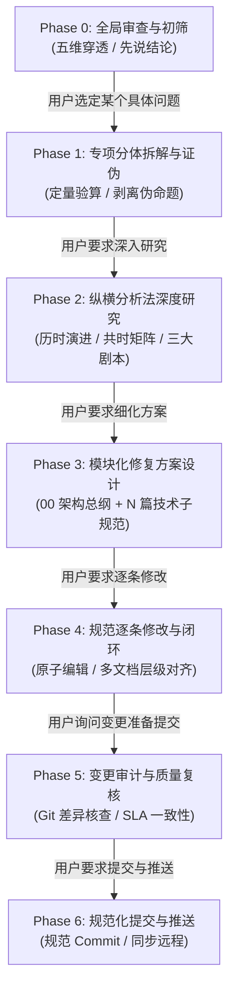

# 架构审视与工程闭环修复流程 (Review & Remediation Workflow)

> **定位**：本技能为**流程型技能（Process Skill）**，沉淀了一套严密的端到端人机协同工程交互协议与状态机。
> 无论面对何种技术栈或业务系统，当需要对技术文档、架构设计或分析报告进行“审查 $\to$ 研究 $\to$ 方案 $\to$ 修改 $\to$ 提交”时，严格按照本流程状态机推进。

---

## 一、流程总览与状态机 (Workflow State Machine)

整个流程由 7 个严格衔接的阶段构成，支持阶段化交互与断点推进：



---

## 二、阶段详细协议与交互规范 (Phase Protocols)

### Phase 0: 全局审查与初筛 (Global Review & Triage)

* **典型用户指令**：
  - *“你看看这个文档，列出来有哪些问题”*
  - *“评审一下这个方案 / 审查文档”*
* **执行方法（五维穿透法）**：
  对照代码库现有实现、现行 `docs/` 文档及项目约束，从五个维度筛查：
  1. **时效与事实脱节**：识别滞后指责、虚空立靶（代码中已解决或已变迁的问题）；
  2. **工程可行性漏洞**：方案是否违背基础底层约束、破坏状态机或引入崩溃风险；
  3. **横向对比客观性**：是否存在拿未实现的愿景对比竞品成熟功能、刻意褒贬；
  4. **产品优先级偏差**：是否在早期 Milestone 引入高成本边缘特性，脱离核心闭环；
  5. **修辞文风与规范**：是否存在无实际技术增量的空洞辞藻、信噪比低下的表述。
* **输出标准**：
  - **先说结论**，列出 3~5 项核心定性判断；
  - 按五维条目化列出问题点，指出具体章节并给出分析；
  - 给出推荐的处理优先级，**等待用户挑选切入点**。

---

### Phase 1: 专项分体拆解与证伪 (Deconstruct & Falsify)

* **典型用户指令**：
  - *“我们先来列出[审视项/问题X]的问题”*
  - *“深入拆解一下这个问题”*
* **执行方法（证伪过滤器）**：
  1. **概念偷换筛查**：审查论述是否混淆了不同层级概念（如逻辑免转换 vs 物理零拷贝）；
  2. **物理/数学定量验算**：通过工况数字（吞吐、延迟、内存带宽）验算是否夸大总线压力或人为制造瓶颈；
  3. **高危方案识别**：指出破坏底层抽象或引发系统崩溃的 Hack 方案；
  4. **终局技术代差**：识别过渡期妥协方案与行业原生终局方案的本质区别。
* **输出标准**：
  - 提炼出 3~5 个具备清晰物理/逻辑边界的技术分体；
  - 明确“哪些是伪命题”、“哪些是真实痛点”、“终局演进方向是什么”；
  - 等待用户指示下一步。

---

### Phase 2: 纵横分析法深度研究 (HV-Analysis Research)

* **典型用户指令**：
  - *“你把这个问题做一个研究，拆解分析问题，然后用纵横分析法研究，整理出研究报告”*
  - *“放在 .local 的单独文件夹里，文件夹就叫 [名称]”*
* **执行规范与目录约定**：
  - 在工作区根目录下创建隔离研究目录：`.local/<问题目录>/`；
  - 产出主报告：`现代<技术领域>的性能边界与选型破局_横纵分析报告.md`；
  - 必须包含四大板块：
    1. **一句话定义**：定性矛盾本质、错误主张与正统演进路径；
    2. **纵向历时分析**：追溯 20~30 年技术历史演进，阐明为什么会演进到当前状态；
    3. **横向共时全景**：覆盖 3~4 个典型阵营（如商用巨头、开源顶尖栈、同类型新锐、当前系统现状），附 6~8 维对比矩阵；
    4. **横纵交汇与三大剧本**：定量推演“危险剧本”、“基准剧本”与“卓越剧本”，给出明确裁决与落地清单。
* **输出标准**：生成独立报告文件，向用户汇报核心论点与研究结论，并提供文件链接。

---

### Phase 3: 模块化修复方案设计 (Modular Plan Design)

* **典型用户指令**：
  - *“做一份细致的修复方案，主文档加子文档结构，放在 .local\[目录] 内”*
  - *“仔细拆解问题，仔细分析研究”*
* **文档组织架构规范**：
  ```
  .local/<问题目录>/
  ├── 00_<系统>性能隐患修复方案_架构总纲.md       [主文档: 瓶颈拆解、红线表、数据拓扑、甘特图]
  ├── 01_<子技术点1>规范.md                       [子规范 1: 底层数据结构/内存分配]
  ├── 02_<子技术点2>规范.md                       [子规范 2: 核心算法/着色器/计算引擎]
  ├── 03_<子技术点3>规范.md                       [子规范 3: 流控/调度器/背压机制]
  ├── 04_<子技术点4>规范.md                       [子规范 4: 容灾/看门狗/状态机自愈]
  └── 05_<子技术点5>规范.md                       [子规范 5: 接口抽象/终局演进预研]
  ```
* **主子文档规范要求**：
  - **主文档总纲 (`00_...`)**：遵循 [master-plan-template.md](file:///d:/Work/Dev/ClipFlow/.agents/skills/review-remediation/references/master-plan-template.md)，包含物理痛点框图、性能红线表 (SLA)、子文档矩阵、Mermaid 流式拓扑、Sprint 甘特图及降级预案。
  - **子规范 (`01_...` 至 `0N_...`)**：遵循 [sub-spec-template.md](file:///d:/Work/Dev/ClipFlow/.agents/skills/review-remediation/references/sub-spec-template.md)，包含数学定量推导、生产级状态机代码（带内存对齐/生命周期约束）及自动化测试断言标准。
* **输出标准**：在 `.local/<目录>/` 批量生成全套方案文档，形成严密技术闭环。

---

### Phase 4: 规范逐条修改与闭环落地 (Step-by-Step Patching)

* **典型用户指令**：
  - *“你逐条修改，不要着急，仔细拆解。最后做一遍检查”*
  - *“把方案应用到项目中”*
* **执行原则**：
  1. **原子化分步推进**：严禁一次性并发大面积修改多个文件，每次集中改动一个受控文档；
  2. **严格修改顺序**：
     - ① **核心技术规范**（如媒体管线、存储引擎等详细规范）：增加数据结构、底层流控与状态机；
     - ② **系统架构文档**（如总体架构）：补充接口抽象 Trait、组件拓扑与容灾机制；
     - ③ **模块职责与路线图**（如 codebase & roadmap）：更新模块职责定义与阶段验收标准；
     - ④ **质量与测试基准**（如 qa & benchmarks）：同步性能 SLA 与严格测试指标；
     - ⑤ **原始分析/审视报告**：纠偏原报告中的错误结论，对齐最新技术裁决；
  3. **清理临时残留**：删除过渡性临时文件，保持目录规范。
* **输出标准**：每完成一个文档的修改，简要说明修改内容并提供点击链接，全部完成后做完整性通报。

---

### Phase 5: 变更审计与质量复核 (Change Audit & Verification)

* **典型用户指令**：
  - *“有哪些更改，我们要准备提交了”*
  - *“检查一下改动”*
* **执行动作**：
  1. 运行 `git status -s` 与 `git diff --stat` 获取确切变动清单；
  2. 结构化汇总各文件的核心改动点，突出架构升级与关键机制；
  3. 审查是否修改了非必要文件，确保工作区干净；
  4. 检查跨文档的 SLA 指标、接口签名是否 100% 保持一致。
* **输出标准**：清晰罗列修改文件清单与改动摘要，等待用户下达提交指令。

---

### Phase 6: 规范化提交与推送 (Standardized Commit & Push)

* **典型用户指令**：
  - *“提交”* $\to$ 执行 Git 提交
  - *“推送”* $\to$ 推送到远程仓库
* **提交信息格式规范**：
  严格遵循项目 `AGENTS.md` 规则：
  ```
  <一句话说明这次为什么改，统一简体中文，简明扼要>

  1. <文件路径1>: <具体改动点与技术规范细节>。
  2. <文件路径2>: <具体改动点与技术规范细节>。
  ...
  ```
* **执行动作**：
  - 暂存目标文件：`git add <files>`
  - 创建结构化提交：`git commit -m "..." -m "..."`
  - 推送远端分支：`git push origin <branch>`
* **输出标准**：展示提交 Commit Hash、改动统计以及远程分支同步状态。

---

## 三、流程运行守则 (Process Guardrails)

1. **不过度前跳**：用户说“列出问题”就停在问题列表；用户说“做方案”就停在方案；不要在用户仅要求分析时擅自去改主干代码或直接提交。
2. **隔离区原则**：任何研究报告与初版修复方案，统一放入 `.local/`，未经 Phase 4 授权不直接改写生产 `docs/` 或代码。
3. **闭环核对点**：每一阶段产出必须是下一阶段的明确输入，形成“审视 $\to$ 研究 $\to$ 方案 $\to$ 落地 $\to$ 提交”的无缝闭环链条。
