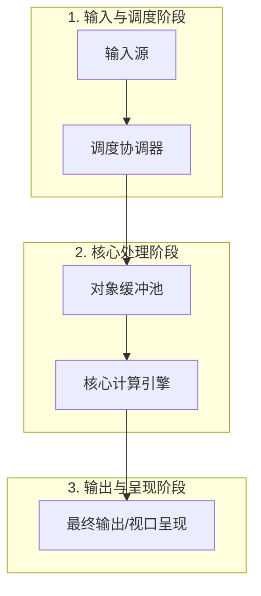
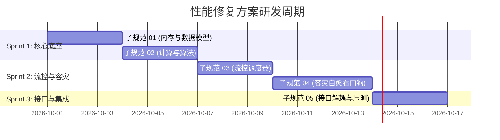

# [系统/模块名称]性能隐患修复方案：架构总纲

> **规范版本**：v1.0.0  
> **所属模块**：`[crate-1]` / `[crate-2]`  
> **目标运行时**：[如 Rust 1.98 (MSVC), wgpu 30.0, egui 0.36]  
> **实施阶段**：[如 Milestone 1]  
> **文档地位**：针对“[审视项名称]”所揭示的系统级性能与稳定性隐患，制定物理架构修复与工程落地技术标准。

---

## 1. 方案背景与问题解构

```
                ┌─────────────────────────────────────────────────────────┐
                │          [系统名称]性能隐患：5 大真实物理瓶颈拆解        │
                ├─────────────────────────────────────────────────────────┤
                │ 瓶颈 1: [物理瓶颈 1 简述]                               │
                │ 瓶颈 2: [物理瓶颈 2 简述]                               │
                │ 瓶颈 3: [物理瓶颈 3 简述]                               │
                │ 瓶颈 4: [物理瓶颈 4 简述]                               │
                │ 瓶颈 5: [物理瓶颈 5 简述]                               │
                └─────────────────────────────────────────────────────────┘
```

为了彻底解决以上问题，本修复方案采用**“主文档总纲 + 5 篇子规范”**的模块化文档架构进行全方位系统性覆盖。

---

## 2. 方案目标与物理性能红线

全套修复方案必须在目标硬件环境上死守以下**物理性能红线**：

| 性能指标 | 允许红线上限 | 目标基准值 | 测量方法与工况 |
| :--- | :--- | :--- | :--- |
| **[指标 1: 延迟/耗时]** | $\le X\text{ms}$ | **$\le Y\text{ms}$** | [测试工况与工具] |
| **[指标 2: 内存/显存]** | $\le X\text{MB}$ | **$\le Y\text{MB}$** | [测试工况与工具] |
| **[指标 3: CPU/帧率]** | $\ge X\text{ FPS}$ | **$\ge Y\text{ FPS}$** | [测试工况与工具] |
| **[指标 4: 容灾/恢复耗时]** | $\le X\text{ms}$ | **$\le Y\text{ms}$** | [测试工况与工具] |
| **[指标 5: 吞吐/抖动]** | $0\text{ 抖动}$ | **$0\text{MB}$ (零分配)** | [测试工况与工具] |

---

## 3. 子文档架构矩阵与职责分工

```
.local/[问题目录]/
├── 00_[问题]性能隐患修复方案_架构总纲.md       [主文档: 整体架构、性能红线、流式拓扑与甘特图]
├── 01_[子技术点1]规范.md                       [子规范 1: 底层内存/数据结构实现]
├── 02_[子技术点2]规范.md                       [子规范 2: 核心计算/算法实现]
├── 03_[子技术点3]规范.md                       [子规范 3: 流控/调度器/背压机制]
├── 04_[子技术点4]规范.md                       [子规范 4: 容灾/看门狗/状态机自愈]
└── 05_[子技术点5]规范.md                       [子规范 5: 接口抽象/终局演进预研]
```

### 子规范职责快速索引表

| 子规范文件 | 解决的核心物理隐患 | 核心交付技术产物 |
| :--- | :--- | :--- |
| **`01_...`** | [解决问题 1] | [结构体、内存模型、API] |
| **`02_...`** | [解决问题 2] | [计算引擎、着色器、算法] |
| **`03_...`** | [解决问题 3] | [调度器状态机、流控队列] |
| **`04_...`** | [解决问题 4] | [看门狗、平滑降级、自愈] |
| **`05_...`** | [解决问题 5] | [Trait 契约、多态解耦、预研] |

---

## 4. 全局数据拓扑与处理流水线



---

## 5. 里程碑落地与工程集成计划



---

## 6. 风险评估与防御性回退预案

| 潜在工程风险 | 触发场景 | 预防与防御性回退预案 |
| :--- | :--- | :--- |
| **[风险 1]** | [触发工况 1] | [回退降级策略 1] |
| **[风险 2]** | [触发工况 2] | [回退降级策略 2] |
| **[风险 3]** | [触发工况 3] | [回退降级策略 3] |
