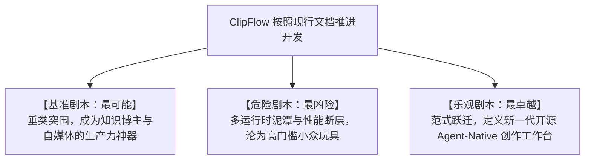

# 桌面视频剪辑的范式转移与架构重构：ClipFlow 开发文档横纵分析报告

> 研究时间：2026年9月 | 所属领域：智能音视频创作与系统级多媒体架构 | 研究对象类型：技术架构与产品开发规范 | 报告作者：Antigravity 系统架构研究组

---

## 一、 一句话定义

ClipFlow 是一套在 2026 年音视频创作工具从“黑盒全自动（AI Slop）”向“人机协同双轨制”范式转移背景下诞生的、以 **“导演级 Agent + 全局公用时间线 + Rust/wgpu 原生硬解渲染 + HyperFrames 代码化动效”** 为核心骨架的 Windows 智能桌面专业非线性编辑系统。

---

## 二、 纵向分析：从传统 NLE 到 Agent-Native 剪辑的技术演进全貌

视频剪辑工具的发展史，本质上是一部“底层硬件算力约束”、“人类叙事认知表达”与“人机交互中介载体”三者相互妥协与螺旋上升的演进史。

如果不理解过去四十年剪辑软件为什么会长成今天这个样子，就无法客观评价 ClipFlow 当前开发文档中那些看似激进的架构决策究竟是深思熟虑的破局之刃，还是一时兴起的过度设计。

### 1. 物理胶片与初代数字非编时代（1980s - 2000s）：机械剪刀的数字化映射与四区分屏的定型

在数字视频出现之前，剪辑是一门彻头彻尾的“物理手工劳动”。剪辑师坐在白炽灯烘烤的剪辑台前，戴着棉线白手套，手里拿着真正的剪刀和赛璐珞胶带，在刺鼻的冲洗药水味中将 35 毫米胶片一帧一帧地切断、比对、拼合。

这种物理操作给后来的软件开发者烙下了难以磨灭的认知钢印：
- **胶片是一维物理连续的**：你剪掉一寸，后面的胶片就必须物理性地向前拉紧接合——这就是后来所有非编软件中“波纹删除（Ripple Delete）”的物理原型；
- **素材是有限且昂贵的**：每一个镜头都必须先在专用的放大镜检片器（Viewer）中反复确认入点（Mark In）和出点（Mark Out），才能决定下剪子——这就是“源监视器（Source Monitor）”与“节目监视器（Program Monitor）”双视窗并立的起源。

1989 年，Avid Technology 推出了运行在 Macintosh II 上的 Avid Media Composer。它的革命性在于提出了“非线性编辑（Non-Linear Editing, NLE）”概念——素材被数字化存储在昂贵的外置 SCSI 硬盘阵列中，剪辑师不再需要像磁带对录机那样按线性顺序往后倒带拼接，而是可以像文字处理器操作字符一样，任意插入、挪动和替换素材片段。

随后，Adobe Premiere（1991）与苹果 Final Cut Pro（1999）相继问世，将这一套非编范式推向大众。

这一阶段确立了延续至今的**经典四区分屏工作台骨架**：
1. **项目素材面板（Project Bin）**：数字化的素材胶片箱；
2. **源监视器（Source Monitor）**：单素材出入点裁剪试看视窗；
3. **节目监视器（Program Monitor）**：多轨合成最终画面的主监视器；
4. **多轨时间轴（Multi-track Timeline）**：横轴代表时间（Timecode）、纵轴代表图层堆叠（V1/V2/V3, A1/A2/A3）的二维控制台。

为什么这个布局在过去三十多年里不可撼动？

因为在那个 CPU 只有几百兆赫兹、内存以兆字节计量的年代，计算机根本无法做到“全实时渲染”。剪辑师必须在源监视器里把入出点挑得极其精准，最后只把必要的那几秒拖进时间轴。时间轴上的每一层堆叠，都意味着导出时需要花费数小时去进行逐像素的离线计算（Offline Render）。

这一时期的底层技术约束，深刻地塑造了软件与人的关系：**软件是一个纯粹被动的数字工具箱，剪辑师是唯一的思考中枢与操作执行者**。

### 2. 互联网与短视频爆发期（2010s - 2020）：达芬奇的工作流革新与剪映的降门槛风暴

进入 2010 年代，两条截然不同的技术暗流开始交汇，并将视频编辑推向了两个完全不同的分水岭。

#### (1) 专业领域的纵深整合：DaVinci Resolve 的工作流分页革命
早期的 DaVinci 仅仅是一款昂贵的好莱坞级硬件调色台系统。Blackmagic Design 在 2009 年收购 DaVinci 后，进行了一场长达十年的自我重构。

传统的专业后期制作流程是极度割裂的：剪辑师在 Premiere 或 FCP 中完成“粗剪（Offline Cut）”，然后导出一份脆弱的 XML 或 EDL 交换工程；调色师在 DaVinci 中导入 XML 进行“套底（Conform）”，套底过程中经常因为转场不兼容、帧率微调而发生素材错位；调色完成后再导出一套 DPX 帧序列送入 Pro Tools 做音频终混，最后送入 Flame 做视觉特效。

一个十人的后期团队，往往要把 30% 以上的工时耗费在“跨软件工程文件转码与时间戳对齐”的泥潭里。

DaVinci Resolve 的破局点在于提出了**“底部 Dock 栏全流程分页模式”**：
从 `Media`（素材管理）、`Cut`（快速剪辑）、`Edit`（精细剪辑）、`Fusion`（节点特效）、`Color`（调色）、`Fairlight`（专业混音）到 `Deliver`（母带导出）。

更具颠覆性的是其底层架构——**“单工程单一数据源（Single Project SSOT）”**：
所有分页共用底层的同一个时间轴序列数据结构。剪辑师在 Edit 页切了一刀，切换到 Color 页调色节点立即同步，切换到 Fairlight 页音频分轨立即可见，完全不需要任何导入导出或中间渲染。

这种设计彻底终结了后期环节的数据孤岛，成为了工业界工作流协同的殿堂级范式。

#### (2) 移动互联网与消费级的极简革命：CapCut / 剪映的降维打击
与专业领域追求极高精度相反，2017 年后抖音、TikTok、Kwai 等短视频平台的指数级爆发，催生了数以亿计的“非专业创作者”。

普通博主根本看不懂 SMPTE 时间码，分不清 23.976 fps 与 24 fps 的区别，更不想知道什么是贝塞尔曲线。他们面对 Premiere 密密麻麻的参数面板和动辄报错的渲染队列感到窒息。

字节跳动推出的剪映（CapCut）敏锐地捕捉到了这一历史机遇，开启了激进的**“体验降维”**：
- **磁性时间轴（Magnetic Timeline）**：片段自动吸附对齐，禁止空白留缝，消除了多轨对齐心智；
- **预置化与一键化**：将传统 AE 中复杂的动效、转场、调色 LUT 打包成数以万计的云端模板，一键套用；
- **初版智能技术下放**：集成端侧语音识别（ASR），率先实现了一键生成字幕和智能文本断句。

剪映在商业上的巨大成功证明了一件事：**绝大多数创作者要的不是控制每一个像素的“自由度”，而是以最快速度把想法变成成品的“交付确定性”**。

但剪映在狂奔的同时，也种下了自身不可调和的原罪：它是一个为了快消短视频而生的“封闭黑盒”。它使用专有的二进制/加密 JSON 工程格式，拒绝与专业工业界（PR/达芬奇）互通；它的音频和色彩底座极其单薄，当创作者试图制作一条 30 分钟以上、包含复杂商业调色与声音设计的长视频时，剪映立刻暴露出了卡顿、崩溃、色彩断层与无法精修的致命短板。

### 3. 可编程化与文本驱动的先锋探索（2020 - 2023）：Remotion 的代码化与 Descript 的惊艳起步

当 GUI 界面在“专业繁复”与“傻瓜快消”两极分化之时，一股来自程序员群体的技术思潮开始叩击视频制作的大门：**视频能否像代码一样被编译？视频能否像 Word 文档一样被编辑？**

#### (1) 代码即视频（Video-as-Code）：MoviePy 到 Remotion 的探索
早期用 Python 的 `MoviePy` 或直接调用 `ffmpeg-python` 拼接视频，语法生硬，无法实现复杂动态交互，且排版渲染极其痛苦。

2020 年前后，**Remotion** 横空出世。它提出了一个天才的设想：**既然现代浏览器和 React 已经拥有了人类最强大的 UI 渲染与排版生态，为什么不用 React 组件来画视频？**

在 Remotion 中，视频的每一帧都被抽象为 React 组件在特定时间戳（`useCurrentFrame()`）下的快照。开发者可以用 CSS Flexbox 布局、SVG 路径、Canvas 甚至是 Three.js 来编排画面，然后通过 Puppeteer 驱动 Headless Chrome 逐帧截图，再用 FFmpeg 压制成视频。

Remotion 让程序化生成视频、动态数据图表视频（Data-driven Video）成为了现实。但 Remotion 也带来了严重的前端架构病症：
- 它深度绑定 React 生态，组件重渲染与虚拟 DOM Diff 在高分辨率下极为沉重；
- 它缺乏直观的非编时间轴 GUI，普通剪辑师和非技术创作者根本无法使用。

#### (2) 文本驱动剪辑（Text-Based Editing）：Descript 的颠覆与阵痛
几乎在同一时期，另一款划时代的产品 **Descript** 诞生了。

它的核心理念极其性感：**“像编辑 Google Docs 一样剪视频”**。
通过 Whisper 等 ASR 技术把口播音频高精度转为文本，用户在文本界面选中一句“废话”按下退格键（Backspace），对应时间轴上的音视频片段瞬间被剃刀切除并波纹闭合；识别出所有的“嗯、啊、这个”等口癖语气词，一键全选删除。

这一发明彻底击中了口播博主、播客创作者和知识类自媒体的核心痛点——在过去，找出一句说错的话需要在波形图上来回听数遍，而在 Descript 里只需要 Ctrl+F 搜索定位。

然而，Descript 在工程架构上做出了一个令其在后续数年饱受折磨的抉择：**它采用了纯 Web 前端与 Electron 桌面打包的技术路线**。

当工程从 3 分钟的短切片放大到 45 分钟的播客对谈、且挂载了双机位 4K 素材时，基于 Web DOM 与 V8 引擎的时间轴开始全面崩塌：
- 渲染海量词级 Token 与高精波形让内存轻松突破 8GB；
- 播放指针频繁丢帧，音画延迟飙升；
- 云端同步逻辑与本地缓存频繁冲突，工程回滚时发生灾难性的时间戳错位。

Descript 证明了“文本驱动剪辑”是未来的方向，但也用自身血淋淋的教训给行业敲响了警钟：**音视频非编是一项极度消耗底层硬件算力的工况，试图在臃肿的 Web/Electron 容器里构建高负荷时间轴，无异于在沙滩上建摩天大楼**。

### 4. 大模型爆发与 Agent-Native 觉醒（2024 - 2026 当前）：黑盒 AI 的反噬与双轨制回归

2024 年至 2026 年，大语言模型（LLM）与多模态模型迎来了爆发期。几乎所有的视频软件都在疯狂“贴 AI 标签”。

这个时期行业经历了一场教科书式的“幻灭与觉醒”：

#### (1) “一键全自动剪辑（AI Slop）”的大反噬
2023 年至 2024 年上半年，市场上充斥着“一键成片”、“AI 替你剪视频”的工具。用户只需要丢进去一段素材，AI 就会黑盒运行，自动吐出一条剪辑好的视频。

到了 2025 年，这种模式遭遇了全球创作者与受众的强烈审美疲劳与抵制：
- **致命的“吞字与窒息节奏”**：纯基于规则或简单大模型的算法，把演讲者为了强调情绪而留下的戏剧性呼吸、思考停顿全部当成“静音”一刀切除，剪出来的视频像机关枪扫射，充满令人不适的机械压迫感；
- **荒谬的语义误杀**：大模型经常把具有修辞递进逻辑的句子当成“重复口误”删掉，导致成片逻辑不通；
- **同质化视觉垃圾**：满屏弹跳的黄色描边字幕、不合时宜的沙雕表情包和千篇一律的库存空镜（B-Roll），被各大社交平台算法联合降权限流。

创作者开始清醒：**视频的本质是情绪的流动与叙事的张力，没有任何一个严肃创作者会把最终作品的决定权完全交给一个黑盒算法**。

#### (2) 务实回归：人机协同双轨制（Dual-Track NLE）
行业达成了前所未有的共识：
- **AI 必须做“副驾驶（Co-Pilot）”或“执行导演（Director Assistant）”**，负责扫清 80% 枯燥繁重的体力活（快速转写、声学初检、大纲整理、动效打底）；
- **人类必须掌握 100% 的终审权与微调权**。AI 给出的任何剪辑方案，必须能够毫无阻碍地呈现在一条专业级的时间轴上，允许人类使用精准至单帧的剃刀、滑移手柄、调色轮和音量包络线进行毫秒级接管。

#### (3) HeyGen HyperFrames 开源：动态包装的范式革命
2025 年，HeyGen 正式开源了其沉淀已久的 **HyperFrames**（Apache 2.0）。

HeyGen 深刻地洞察到：如果让 AI Agent 去剪辑视频，包装特效（Lower Thirds 角标、图表、标题卡）该如何生成？
- 传统的 AE 模板是专有二进制文件（`.aep`），大模型根本“写”不出来；
- Remotion 绑定 React，大模型生成 JSX 时频繁出现状态生命周期和组件编译报错；
- **而原生 Web 标准（HTML5 / CSS3 / ESNext / GSAP 3）是全人类互联网训练集中语料最丰富、大模型写得最准确的代码形式！**

HyperFrames 提出了基于 **“虚拟时间劫持（Virtual Time Injection）”** 的确定性渲染机制：
利用无头浏览器（Headless Chromium）的 CDP 协议，彻底冻结并接管浏览器内部的时钟系统。每一帧画面都不是靠屏幕录制，而是由虚拟时钟精准跳转到毫秒刻度，等待 DOM 和 Canvas 栅格化完毕后，原子化截取带透明 Alpha 通道的无损图像。

这彻底打通了大模型用原生代码生成广播级视频动效的任督二脉。

### 5. ClipFlow 架构决策的还原：它究竟在解决什么问题？

正是站在这样一个 2026 年的技术演进交叉路口上，ClipFlow 的开发文档应运而生。

当我们穿透文档的字里行间，会发现它的技术架构不是拍脑门拼凑的时髦词汇，而是一次**针对过去三十年音视频架构积弊与近年 AI 玩具缺陷的精准手术**：

```
传统非编痛点: 门槛极高 / 粗剪枯燥 / 动效依赖封闭AE       新兴AI工具痛点: Web/Electron极度卡顿 / 黑盒误杀 / 无法专业精修
                  \                                         /
                   \                                       /
                    ▼                                     ▼
                ┌─────────────────────────────────────────────┐
                │          ClipFlow 架构解决的核心矛盾         │
                ├─────────────────────────────────────────────┤
                │ 1. 达芬奇全流程 Dock 栏 + PR 经典剪辑台     │ --> 解决专业精修与学习成本
                │ 2. 全局贯穿式公用时间线 (SSOT)              │ --> 解决跨阶段数据割裂
                │ 3. Rust 1.98 + wgpu 30.0 + egui 0.36 原生核 │ --> 彻底碾碎 Electron 性能泥潭
                │ 4. 本地物理抢跑 + faster-whisper + LLM 分幕 │ --> 兼顾秒级响应与防幻觉吞字
                │ 5. 继承 HeyGen HyperFrames 代码化动效       │ --> 解放 Agent 包装生产力
                └─────────────────────────────────────────────┘
```

ClipFlow 的技术拓扑，本质上是在用系统级工程手段，搭建一座连接“人类专业工匠精神”与“AI 原生智能生产力”的立交桥。

---

## 三、 横向分析：2026 年视频创作工具图谱与技术维度对比

在当下的时间截面上，视频制作赛道呈现出高度内卷却又壁垒分明的生态格局。根据方法论，本研究属于**场景 C：竞品充分（存在 3 个及以上代表性阵营）**。

我们将从技术底层、产品哲学与商业现实，对四大核心阵营进行深度横向解剖。

### 1. 四大核心竞品阵营深度解剖

#### (1) 阵营一：CapCut / 剪映桌面版 —— 消费级快消短视频的封闭帝国
- **生态位**：全球短视频领域的统治级中枢，坐拥数亿 MAU。
- **底层架构**：自研跨平台 C++ 渲染引擎 + Web 前端混合，深度绑定字节跳动云端多媒体与 AI 微服务。
- **核心优势**：
  - 极其恐怖的素材生态与流行感知力：国内外的爆款贴纸、神曲 BGM、热门花字和滤镜几乎能在 24 小时内完成模板化上架；
  - 极致的端云协同：人脸检测、背景智能抠像、画质超分等复杂 AI 运算被静默卸载至云端或利用手机/PC NPU 混合计算；
  - 操作零门槛：任何完全没有剪辑基础的人都能在 10 分钟内拼凑出一支节奏明快的短视频。
- **致命软肋与创作者真实槽点**：
  - **数据封锁与霸权壁垒**：工程文件格式高度私有且频繁混淆，坚决不开放 FCPXML / EDL / AAF 导出，强迫创作者全流程留在其封闭生态内；
  - **色彩与音频的“玩具级”质感**：仅支持 8-bit SDR 空间渲染，导入 10-bit Log 素材直接截断为发灰的死色；音频缺乏分轨总线与高级压缩器，降噪算法在大动态人声下会产生刺耳的金属相位杂音；
  - **长视频崩溃与性能失控**：时间轴对 30 分钟以上素材的索引极其粗糙，缩略图和音频波形经常在缩放时重新卡顿生成；
  - **严重的 Paywall 侵蚀**：原本免费的导出规格、基础字体和智能粗剪功能被逐步移入 VIP 付费墙，引发创作者群体的强烈反弹。

#### (2) 阵营二：Descript / Underlord v2 —— 文本剪辑先驱的沉重转型
- **生态位**：欧美中长视频、播客（Podcasting）与知识访谈类博主的首选。
- **底层架构**：Electron 桌面壳 + React 前端 + WebAssembly + 云端 AI 推理集群。
- **核心优势**：
  - 文本剪辑的标杆体验：文档式视窗与波形时间轴的联动逻辑打磨得极其顺滑，支持像文字查找替换一样批量剔除口癖；
  - Agent 探索领先（Underlord）：支持自然语言多轮交互下发“AI Actions”，自动完成多机位根据人声发言切换；
  - 语音合成与声音克隆（Overdub）：允许用户直接输入文字，用自己的声音修补录制错误的单词。
- **致命软肋与创作者真实槽点**：
  - **Electron 的性能黑洞**：在 Reddit 社区中，“Laggy”、“Slow”、“Crashing”几乎成了 Descript 的固定前缀。4K 素材只要堆叠超过三层，内存占用直逼 10GB，拖拽播放指针有长达数百毫秒的黏滞感；
  - **昂贵的“AI 税（AI Tax）”**：Underlord 的核心能力依赖云端模型计算，按 Credit 扣费。用户频繁抱怨：AI 剪错一段话不仅需要花两倍时间手动复原，而且消耗掉的积分概不退还；
  - **破坏性剪辑带来的恐慌**：Underlord 的自动化动作经常导致时间轴全局波纹重组，多轨音频与画面标记被意外打乱，且复杂的撤销（Undo）经常失效；
  - **完全缺失专业后期基建**：调色、混音、转场能力几乎等于零，专业剪辑师无法在其中完成最终母带交付。

#### (3) 阵营三：Remotion / HyperFrames / AutoCut —— 代码化与开源极客流派
- **生态位**：面向开发者、自动化生成流水线与追求绝对掌控的独立极客。
- **底层架构**：
  - AutoCut：Python + Whisper + FFmpeg 纯脚本/轻量客户端；
  - Remotion：Node.js + React + Puppeteer 逐帧离屏渲染；
  - HyperFrames：Node.js + GSAP + Headless Chromium CDP 确定性虚拟时钟渲染。
- **核心优势**：
  - 绝对的确定性与可复现性（Pixel-Perfect & Reproducible）：代码编译出的视频绝无丢帧和随机漂移；
  - 极高的自动化与批量化潜力：结合数据库和 CI/CD，能以秒级成本生成千人千面的动态报表或营销视频；
  - 纯净无套路：AutoCut 与 HyperFrames 均完全开源，本地离线运行，绝无隐私外泄与平台抽税。
- **致命软肋与创作者真实槽点**：
  - **完全割裂的交互体验**：没有面向普通人的专业 GUI 剪辑台。AutoCut 依赖在 Markdown 文本中手动划线；Remotion 需要手写代码，创作者无法像用鼠标那样直观感受剪辑的呼吸感与微观节奏；
  - **离屏渲染性能极慢**：无头浏览器通过 CDP 截屏渲染视频的速率通常只有 15~30 FPS，渲染一条包含大量复杂动效的视频需要消耗几倍于播放时长的等待时间；
  - **无法处理超重多媒体交互**：完全不具备高码率视频的即时硬件解码、拖拽跳帧试看和多通道音频硬件监听能力。

#### (4) 阵营四：Premiere Pro / DaVinci Resolve —— 工业级巨头与历史包袱
- **生态位**：好莱坞电影、广播电视、高端商业广告与专业制作公司的工业金标准。
- **底层架构**：数百万行 C/C++ 巨石代码库、自研专业图形与音频管线、深度集成 DirectX/Metal/CUDA 硬件加速。
- **核心优势**：
  - 坚不可摧的专业非编底座：百轨 8K RAW 素材丝滑剪辑、广色域 ACES 工业级色彩科学、影视级 Fairlight/Surround 混音台；
  - 完备的行业生态标准：原生支持 FCPXML, EDL, AAF, DNxHR, Apple ProRes，与工业管线天衣无缝；
  - 极致精细的手动控制力：每个关键帧曲线、每个音频效果器旋钮都经过了几十年的专业人机工程学打磨。
- **致命软肋与创作者真实槽点**：
  - **沉重至极的遗留技术债（Legacy Debt）**：核心架构定型于二十年前，软件体积巨大，启动缓慢，经常发生难以排查的莫名底层崩溃；
  - **AI 仅仅是浮于表面的“外挂插件”**：虽然 PR 引入了文本剪辑和语音增强，达芬奇引入了 Magic Mask，但 AI 只是单点功能，整体工作流依然依赖人类机械而繁琐的手动操作，学习曲线极度陡峭；
  - **动效包装极其笨重**：PR 依赖臃肿缓慢的动态链接（Dynamic Link）加载 AE 的 MOGRT 模板，修改一个文字经常导致工程卡死数秒，对大模型代码生成极度不友好。

---

### 2. 核心维度横向对比矩阵

| 对比维度 | CapCut / 剪映桌面版 | Descript (Underlord v2) | Remotion / HyperFrames | Premiere Pro / DaVinci | **ClipFlow (当前架构设计)** |
| :--- | :--- | :--- | :--- | :--- | :--- |
| **底层技术栈** | C++ 混编 + Web (封闭商业) | Electron + React (重度依赖云) | Node.js + Web / React (代码引擎) | 巨型 C/C++ 工业底座 (巨石系统) | **Rust 1.98 + wgpu 30.0 + egui 0.36 + FFmpeg 9.0.2** |
| **界面与交互范式** | 极简移动端延续、磁性单轨为主 | 仿 Google Docs 文档 + 场景卡片 | 纯代码无 GUI / 轻量 Web 预览 | 经典四区分屏 / 达芬奇全流程底栏 | **达芬奇 6 大分页 Dock + PR 经典四区分屏剪辑台** |
| **时间轴数据架构** | 私有混淆 JSON，弱时间码抽象 | Web DOM 映射，高负荷易漂移 | 帧数函数式求值，无交互多轨状态机 | 工业级纳秒/SMPTE 时间轴，多轨非破坏 | **纯 Rust RationalTime 有理数 SSOT + 命令事务栈** |
| **长视频与性能极限** | 4K 30min+ 掉帧卡顿，内存膨胀 | 4K 30min+ 内存破 8GB，假死频发 | 不支持交互拖拽，仅支持离屏批量编译 | 百轨 8K RAW 丝滑，但硬件资源消耗极大 | **GPU 硬件解码着色器直出 + 峰值网格，60+ FPS 原生** |
| **AI 协同范式** | 单点工具（抠像/一键字幕/粗剪） | 侧边栏 Agent 对话，破坏性下发 | 无原生 Agent，仅作为代码渲染后端 | 局部功能辅助（转写/遮罩），无主动 Agent | **导演级 Agent 全局感知规划 + 虚拟图层非破坏性落地** |
| **口播粗剪策略** | 纯云端/端侧简单能量静音检测 | 文本规则剔除，易吞字与节奏窒息 | 纯 ASR 词表匹配（如 AutoCut） | 纯手动剃刀裁剪 / 基础静音标记 | **本地物理抢跑预标 (0-2s) + Whisper INT8 + 分幕语义决策** |
| **动效包装体系** | 封闭云端预置模板库，不可代码扩展 | 简易标题排版，无高级可编程动效 | React / Web 代码驱动，极其灵活 | AE 巨型工程 / MOGRT，渲染极其沉重 | **集成 HyperFrames (HTML/CSS/GSAP)，Agent 原生友好** |
| **工程开放度与隐私** | 极度封闭，强推云端，隐私存疑 | 强绑定云端服务器，敏感素材受限 | 100% 开源本地，完全无隐私风险 | 行业标准格式兼容（FCPXML/EDL），本地 | **本地离线 ASR/FFmpeg，多运行时便携分发，数据全自主** |

---

### 3. 生态位分析：ClipFlow 切中了什么历史真空？

通过横向对比，我们可以极其清晰地画出 2026 年视频制作工具的**“能力象限图”**：

```
                    ▲ 专业度 / 底层控制力 (Control & Precision)
                    │
                    │        [Premiere Pro / DaVinci Resolve]
                    │        - 工业级控制力 / 极致性能
                    │        - 但沉重老旧 / AI 仅为外挂 / 门槛极高
                    │
                    │                    ★ [ClipFlow 定位点]
                    │                    - 结合 PR 经典分屏与达芬奇 Dock
                    │                    - Rust 原生性能 + 导演 Agent
                    │                    - 代码化动效 + 文本粗剪
                    │
                    │
  [AutoCut/Remotion]│
  - 极客代码化 / 自动化  │        [Descript Underlord]
  - 无专业交互 GUI      │        - 文本剪辑先驱 / Agent 探索
                    │        - 但陷于 Electron 卡顿与破坏性剪辑
                    │
                    │
                    │  [CapCut / 剪映]
                    │  - 极致易用 / 爆款模板 / 快速普及
                    │  - 但封闭格式 / 8-bit 色彩 / 无法专业精修
                    │
  ──────────────────┴─────────────────────────────────────────►
  被动工具箱 (Toolbox)                                AI 原生智能 (Agent-Native)
```

在目前的赛道中，存在一个巨大的**结构性真空**：
- **向上看**：PR 和达芬奇固守在传统专业壁垒里，由于底层巨石架构的掣肘，它们永远无法彻底将 Agent 变成软件的灵魂；
- **向下看**：剪映在消费级短视频狂欢，但其封闭的商业策略和单薄的多媒体底座，注定了它只能停留在快消娱乐品类；
- **横向看**：Descript 摸到了未来的边缘，却被错误的架构载体（Web/Electron）拖入了性能和稳定性的深渊。

**ClipFlow 开发文档所描绘的核心蓝图，正是精准地插入了这个真空带：**
它既有 PR 级别的专业多轨控制力与达芬奇级的一体化工作流，又有超越 Descript 的新一代导演级 Agent 与文本双轨剪辑，同时以 Rust + wgpu 的原生系统级工程底座，彻底终结了跨平台桌面端卡顿与掉帧的噩梦。

---

## 四、 横纵交汇洞察与开发文档合理性审查

将纵向的技术演进与横向的竞品困境放在一起交汇审视，我们可以得出最核心、最具穿透力的判断：

**ClipFlow 目前的开发文档在“战略定位”、“人机协同范式”与“核心技术栈选型”上表现出了极高的洞察力与合理性；但在“部分具体工程细节实现路径”、“即时模式 GUI 面向复杂重载场景的吞吐极限”以及“跨语言跨进程协作的容灾闭环”上，存在必须警惕的隐患与设计盲区。**

以下展开深度审查。

### 1. 为什么说开发文档的核心骨架是高度合理的？（五大战略长板）

#### 洞察 1：全局公用时间线（SSOT）是对非编软件数据割裂的根本性救赎
- **历史回响**：从早期剪辑、调色、混音跨软件导 XML 的血泪史，到达芬奇通过统一底层时间轴一统天下，历史反复验证了一条铁律：**视频制作的每个环节可以有不同的视图，但绝不能有不同的数据源**。
- **文档合理性**：文档在 `prd.md` 与 `architecture.md` 中旗帜鲜明地确立了“全局公用时间线（Global Shared Timeline）”作为单一事实来源（SSOT），所有 6 大工作流页面（Agent、剪辑、动画、声音、图片、导出）仅作为上层专属交互视窗，底层播放指针与多轨序列全局漫游、绝不重置。这一设计直接从根源上杜绝了多视图状态脱节与工程数据不同步的顽疾。

#### 洞察 2：Rust 1.98 + wgpu 30.0 + egui 0.36 架构精准击穿了 Web 剪辑工具的死穴
- **历史回响**：Descript 的失利不仅是产品问题，更是技术选型违背物理规律的必然惩罚——在带垃圾回收（GC）的单线程 JavaScript/V8 引擎上处理 4K 60fps 音视频与稠密时间轴，必然遭遇主线程卡顿。
- **文档合理性**：文档坚决放弃 Electron 和纯 Web 方案，采用 Rust 作为主进程宿主。Rust 的零成本抽象、无 GC 暂停和确定性内存管理，结合 wgpu 原生硬件加速，为高帧率视窗绘制提供了坚如磐石的确定性。这是走向专业级桌面剪辑必须跨过的一道铁门。

#### 洞察 3：有理数时间 `RationalTime` + 命令事务系统构筑了工业级非破坏性底座
- **历史回响**：无数新兴剪辑软件在处理长视频时发生音画错位，根源都在于使用了 `f32` 或 `f64` 存储时间秒数。在几万次加减法累加后，浮点舍入误差（Rounding Error）会产生不可逆的微小漂移，最终导致帧率失真与切口错位。
- **文档合理性**：`timeline-data-model.md` 极其严谨地定义了 `RationalTime { value: i64, timescale: u32 }`，禁止浮点数作为时间轴核心物理量；并且所有对时间轴的操作均被封装为不可分割且显式支持 `undo()` 的 `TimelineCommand`。这使得 Agent 无论进行多么复杂的批量剪切，都能以单个 `CompoundCommand` 事务毫秒级回退，彻底消除了创作者面对 AI 乱改工程时的恐惧感。

#### 洞察 4：“本地物理抢跑 + Whisper INT8 + 分幕语义决策”彻底破解了“AI 误杀与长等待”
- **历史回响**：黑盒一键剪辑之所以沦为玩具，是因为单靠物理 VAD 听不懂废话，单靠大模型计算极慢且会产生数字幻觉吃字。
- **文档合理性**：`agent-director-spec.md` 与子代理调研印证了一个黄金闭环：在素材导入 2 秒内先用本地声学检测（`silencedetect`）在时间轴上点亮“淡黄半透明预标条”，消除用户等待焦虑；然后通过 `faster-whisper 1.2.1 large-v2 INT8` 本地跑出毫秒级词级时间戳；最后大模型仅按 2~3 分钟分幕进行语义研判，不瞎造时间戳，裁切点由 Rust 核心自动贴合声学零交叉点并附加 150ms 安全垫。这套流程兼具极速响应、语义精准与不吞字，是目前行业内最具实操价值的口播剪辑工程闭环。

#### 洞察 5：全面继承 HeyGen HyperFrames 代码化动效与分级打包策略
- **历史回响**：AE 模板因其封闭性成为 Agent 时代的活化石，而 Remotion 因 React 语法复杂度抬高了大模型生成门槛。
- **文档合理性**：引入 HyperFrames，利用纯标准 HTML/CSS/GSAP 驱动动效，完全释放了大模型在 Web 编码领域的天然优势；同时在 `packaging-release.md` 中设计了复用系统 WebView2 的 Lite 版（$\le 250\text{MB}$）与内嵌 CUDA 的 Full 版，既防止了安装包动辄 3GB 的“体积黑洞”，又满足了专业工作室满血离线推流的需求。

---

### 2. 哪些地方存在明显隐患、认知偏差或实施过度？（六大工程审视与优化补盲）

在充分肯定宏观合理性的同时，必须以毫不妥协的技术实事求是态度，指出当前开发文档中存在的若干深水区工程暗礁：

#### 审视 1：egui 0.36 即时模式用于复杂 PR 级多轨剪辑台时的 CPU 细分（Tessellation）瓶颈
- **问题与隐患**：
  文档在 `architecture.md` 和 `edit-layout-spec.md` 中强调要“完全对齐 Premiere Pro 经典多轨剪辑台”，但低估了**即时模式 GUI 在高轨、稠密关键帧场景下的 CPU 算力消耗**。
  egui 每帧都由 CPU 执行所有组件的 `update()` 并重新细分三角形网格（Tessellation）。当用户导入一条 60 分钟素材，时间轴展开为 10 条轨道、上千个 Clip、密集的标尺刻度和贝塞尔关键帧时，如果不做极其激进的底层优化，仅 CPU 细分网格耗时就会超过 10ms，导致 60 FPS 瞬间掉帧。
- **优化与修正建议**：
  1. 文档中必须补齐**“视口 AABB 粗筛裁剪中间件（Viewport Culling Middleware）”**：严禁在 egui 渲染闭环内对全量 `Track` 和 `Clip` 执行未裁剪的循环遍历。必须以二分查找建立可见时间区间索引，屏幕视口外的 Clip 连一行 egui 绘制函数都不得执行；
  2. 严禁在 egui 主线程动态绘制波形矢量线条，必须坚决执行 `media-pipeline-spec.md` 中设计的 `.peak` 二进制文件与预生成 `egui::Mesh` 批量提交策略；
  3. 引入**事件门控（Event-Gated Repaint）**机制：非播放状态下，完全静默 `request_repaint()`，将空闲 CPU 占用压制在 0%。

#### 审视 2：wgpu 30.0 跨 API 纹理交互选型与多媒体管线物理边界
- **问题透视与争议澄清**：
  原文档在 `media-pipeline-spec.md` 中提出的“零 CPU 转换原则”，是指**杜绝在 CPU 侧调用 `sws_scale` 执行昂贵的像素级色彩空间重排（YUV $\to$ RGB）**，改由 GPU WGSL 着色器完成硬件双线性插值与矩阵点乘，而非字面意义上的跨显存物理零拷贝。此前有观点指责“4K 60fps NV12 经由 CPU 内存中转每秒吞吐 746 MB/s 带来巨大总线压力，必须用 `wgpu-hal` 跨 API 共享导入 D3D11 纹理（路线 B）”，该观点存在严重的工程误判：
  1. **定量总线带宽戳破泡沫**：746 MB/s 仅占用 PCIe 3.0 x16 的 **$4.74\%$** 与 PCIe 4.0 x16 的 **$2.37\%$**，且在配合监视器自适应下采样（1/2、1/4）时吞吐降至 $46 \sim 186\text{ MB/s}$，总线完全富余；
  2. **路线 B 属于高危技术陷阱**：在 `wgpu` 之上强穿 Direct3D 11 到 Direct3D 12 共享句柄，会彻底摧毁 `wgpu` 的资源状态机追踪（Hazard Tracking & Barriers），在异构显卡驱动下极易引发 DeviceLost 设备丢失与 TDR 蓝屏死锁；
  3. **终局技术代差**：FFmpeg 9.0.2 已原生成熟支持 **`D3D12VA`**。未来的物理零拷贝应直接走“同 API 设备直通（路线 C）”，而非架设脆弱的跨 API 杂技桥梁。
- **优化与修正建议**：
  - **M1/M2 阶段（当前生产级）**：坚决执行**路线 A（稳健底座）**，通过 `PinnedFramePool` 预分配 4KB/64B 对齐的锁页内存，实现 DMA 零堆分配极速直传（上传耗时 $\le 0.8\text{ms}$），配合 `ProxyGovernor` 自适应下采样将拖拽带宽压制在 $\le 60\text{ MB/s}$，确保 100% 内存安全与零闪退；
  - **M4+ 阶段（远期极限储备）**：面向 8 轨 4K 60fps RAW 等极端重载工况，在独立分支预研**路线 C（FFmpeg 原生 D3D12VA 直通）**，共享同一个 `ID3D12Device` 实体，实现真正的同 API 物理零拷贝。详见 [00_审视二多媒体硬解与图形交互性能隐患修复方案_架构总纲.md](file:///d:/Work/Dev/ClipFlow/.local/审视二/00_审视二多媒体硬解与图形交互性能隐患修复方案_架构总纲.md)。

#### 审视 3：音频主时钟离散拍频顿挫与 WASAPI 硬件单调箝位外推破局
- **问题透视与伪命题剥离**：
  原文档在 `media-pipeline-spec.md` 第 3.2 节中给出的离散公式 $\text{Time} = \frac{\text{TotalSamplesConsumed}}{\text{SampleRate}}$，会导致 Windows WASAPI 10ms 缓冲区跳变与 60/120 FPS 视频刷新之间产生拍频阶梯抖动。然而，此前关于“自研温漂低通滤波 / 软件锁相环（PLL）校准 10~50 ppm 温漂”的主张属于脱离硬件特性的典型伪命题（温漂每秒仅 0.05ms，软滤波会引入致命的相位滞后与切口脱节）；同时“两次音频回调间裸写 QPC 增量”在音频短时欠载恢复时会引发灾难性的**“时间倒流（Time Inversion）”**与画面抽搐。
- **优化与修正建议**：
  确立**“WASAPI 原生 `IAudioClock` 硬件游标锚定 + `MonotonicClampedClock` 无锁单调箝位平滑外推器 + 双阈值迟滞渲染判定”**的生产级架构：
  1. 底层调用 `IAudioClock::GetPosition` 硬件原子捕获 DAC 物理播放采样点与系统 QPC，动态测定硬件 FIFO 排队延迟；
  2. 上层使用 SeqLock 双缓冲与 CAS 单调过滤，限制最大外推跨度 $\le 1.5\times$ 周期（15ms），保证时钟输出绝对单调递增，彻底根除时间倒流；
  3. 引入双阈值迟滞比较器（8ms 进入 / 12ms 退出）与 VSync 前瞻半帧，将微抖动压制在 $\le 0.05\text{ms}$，音画长效漂移锁定在 $\le 2.0\text{ms}$。详见 [00_审视三高精度主时钟与音画同步性能隐患修复方案_架构总纲.md](file:///d:/Work/Dev/ClipFlow/.local/审视三/00_审视三高精度主时钟与音画同步性能隐患修复方案_架构总纲.md)。

#### 审视 4：HyperFrames Node.js Headless Chromium 显存泄漏与滚动重启
- **问题与隐患**：
  文档在 `hyperframes-spec.md` 中设计了基于 CDP 的逐帧截屏（`Page.captureScreenshot`）。
  工业界实测表明：Chromium 的 Blink 合成器在连续截取数百帧离屏图片后，内部纹理与 Skia 缓存不会被垃圾回收释放。连续渲染 1500 帧后，单一 Tab 内存会从 200MB 飙升至 2GB 以上，引发 GPU 进程崩溃。
- **优化与修正建议**：
  在 `hyperframes-spec.md` 中强制增加**“无状态滚动重启（Rolling Restart）安全规约”**：
  渲染 Worker 池必须设定生命周期阈值（如单页面上下文渲染满 300~400 帧立即销毁重建）；同时，离屏截帧应优先探索 Raw RGBA 二进制管道传输，避免 CPU 端高频进行 PNG 编码压缩。

#### 审视 5：Polyglot Monorepo 多进程架构的调试成本与看门狗（Watchdog）
- **问题与隐患**：
  ClipFlow 采用 Rust + Python 3.13 + Node.js 24 三种运行时混编。这种“多语言各取所长”的架构在理论上很美，但在工程维护和终端用户桌面环境中，**多进程故障链条极其脆弱**：
  Python 子进程可能因 CUDA 驱动版本冲突静默闪退，Node 子进程可能因 Chromium 僵尸进程卡死端口。如果主进程缺乏健壮的容灾看门狗，整个软件就会处于无响应假死状态。
- **优化与修正建议**：
  `clipflow-ipc` crate 必须明确定义**“智能进程看门狗（Subprocess Watchdog）”**规范：
  包含心跳探针、进程自愈重启、以及在子进程崩溃时对当前时间轴任务的局部保存与降级提示（例如 Python 崩溃时自动降级为纯手动剪辑模式，绝不让 Rust 主宿主崩溃）。

#### 审视 6：专业剪辑师生态互通诉求 —— 警惕重蹈剪映的封闭覆辙
- **问题与隐患**：
  当前开发路线图（`codebase-and-roadmap.md`）将全部精力放在了自有 `.clipflow` 格式的闭环开发上，而将外部行业标准格式互通排在非常靠后的位置。
  但纵向历史与横向竞品分析（尤其是 Gling.ai 的成功与剪映的被唾弃）清楚地表明：**专业剪辑师和高端创作者接纳一款新工具的最大前提，是“哪怕这软件不好用，它粗剪完导出的工程我也能在 PR 或达芬奇里接着做”**。
- **优化与修正建议**：
  将 **“标准 FCPXML / EDL 导出支持”** 的优先级，从远期特性提前至 **Milestone 2 (M2)** 与口播粗剪功能并列发布！
  允许用户用 ClipFlow 的 Agent 和 Whisper 进行极速粗剪，然后一键导出 FCPXML 送入 Premiere Pro 或 DaVinci Resolve。这不仅能迅速击中专业后期群体的痛点、打消试用顾虑，更能利用专业人群的口碑形成降维传播。

---

### 3. 未来推演：三个剧本

基于纵向演进脉络与横向竞争格局，我们可以对 ClipFlow 按照当前开发文档推进的未来走向，推演出三个可能的发展剧本：



#### 剧本一：垂类突围，成为知识博主与专业自媒体的生产力神器（最可能的基准剧本）
- **发生路径**：
  团队严格按 M0~M4 里程碑推进，先期通过路线 A（CPU 内存中转）保障稳定性，利用本地 faster-whisper 和导演 Agent 彻底打通口播视频的“转写-粗剪-去废话-出花字”闭环。
- **终局状态**：
  ClipFlow 凭借 60 FPS 的原生流畅度、零 AI 税的本地极速粗剪、以及对齐 PR 的易用性，在 B站知识区、YouTube 科技博主、播客创作者和高校教学群体中迅速引爆。月活稳步突破数十万，成为中长视频创作者替代 Descript 和剪映专业版的核心生产力标杆。

#### 剧本二：多运行时泥潭与即时渲染性能断层（最危险的技术债剧本）
- **发生路径**：
  团队低估了 egui 即时模式在多轨时间轴上的 CPU 细分压力，没有严格落实视口 AABB 裁剪，导致长视频拖拽卡顿；同时在 Windows 打包分发时，内嵌 Python 和 Node 的环境兼容性在各种奇葩电脑配置上频繁爆发（DLL 缺失、路径带空格、杀毒软件误报），团队陷入疲于奔命修环境的泥潭，核心 Agent 与剪辑功能的迭代被迫放缓。
- **终局状态**：
  软件口碑两极分化：技术极客配置好环境后赞不绝口，普通创作者在安装第一步就因运行库报错弃用，最终退缩为一个仅在 GitHub 极客圈子流传的高门槛小众项目。

#### 剧本三：范式跃迁，定义新一代开源 Agent-Native 创作工作台（最乐观的卓越剧本）
- **发生路径**：
  团队敏锐采纳审查建议，在 M1 提前引入视口裁剪与 WASAPI 无锁单调箝位平滑主时钟，在 M2 坚决打通 FCPXML 行业互通，并在远期攻克了 FFmpeg 9.0.2 原生 D3D12VA 同 API 零拷贝硬件直通（路线 C）；HyperFrames 的 Web 代码动效库在开源社区形成强大的模板生态圈，第三方开发者为 ClipFlow 贡献了数以千计的 Agent 动效组件。
- **终局状态**：
  ClipFlow 成为全球第一款真正跑通“大模型代码生成动效 + 导演级智能规划 + 工业级底层控制力”的标杆级开源桌面系统。不仅吞食了 Descript 的存量市场，更倒逼 Adobe 和 Blackmagic Design 重新审视自身的架构设计，完成了一次从边缘突围到定义行业下一代技术标准的壮举。

---

## 五、 审查总结与改进落地行动清单

为了让 ClipFlow 的开发文档从“蓝图构想”升华为“无懈可击的生产级工程准则”，建议架构组在现行文档的基础上，立即增补以下 5 项落地核对标准：

1. **增补《egui 复杂时间轴性能调优指南》**：
   - 强制规定时间轴组件必须基于二分查找视口 AABB 范围进行几何裁剪；
   - 规定波形渲染必须彻底走 `.peak` 二进制缓存批量构造 `egui::Mesh`，单帧细分耗时红线锁定在 $\le 2\text{ms}$。
2. **确立多媒体硬解与图形交互的稳健实施路线**：
   - 明确废除基于 `wgpu-hal` 跨 API 共享（路线 B）的过度设计；
   - 在 `media-pipeline-spec.md` 中全面落实路线 A（`PinnedFramePool` 锁页环形池 + NV12 双平面极速上传 + WGSL 全色域自适应色彩矩阵），结合 `ProxyGovernor` 自适应下采样将总线峰值锁定在 $\le 60\text{ MB/s}$；
   - 远期将路线 C（FFmpeg 9.0.2 D3D12VA 同 API 原生零拷贝）确立为 M4+ 极限重载储备。
3. **确立 WASAPI 硬件 DAC 锚定与无锁单调箝位主时钟规约**：
   - 彻底废除脱离硬件的自研温漂滤波与软件锁相环（PLL）过度设计；
   - 在 `media-pipeline-spec.md` 中全面落实 `WasapiHardwareAnchor` 硬件锚定、`MonotonicClampedClock` 无锁单调箝位外推与 `HysteresisSyncComparator` 双阈值迟滞比较，杜绝时间倒流与拍频顿挫。
4. **确立 HyperFrames 无头集群滚动重启机制**：
   - 在 `hyperframes-spec.md` 中增加 Headless Chromium 实例池管理规约，严格执行每 400 帧无状态滚动重启，杜绝离屏渲染内存泄漏。
5. **前置 FCPXML / EDL 行业标准工程交换里程碑**：
   - 将 FCPXML 1.10 / EDL 导出功能从远期特性提升为 M2 阶段与智能粗剪并列的 P0 验收项，彻底打消专业用户试用顾虑。

---

## 六、 信息来源与参考文献

1. **HeyGen HyperFrames 官方开源技术文档与代码库**  
   - GitHub: `heygen-com/hyperframes` (Apache-2.0 License, 2025–2026)  
   - 核心机制：Deterministic Rendering Protocol & Virtual Time Injection.
2. **Remotion Framework 官方架构与设计白皮书**  
   - Remotion Docs: React-based video compilation, Puppeteer frame-stepping engine (2024–2026).
3. **Descript 官方更新日志与 Underlord 系统规格**  
   - Descript Season 6 / Underlord v2 Release Notes & AI Actions Architecture.  
   - Reddit 创作者社区讨论：r/descript, r/editors, r/videography (2024–2026).
4. **CapCut / 剪映桌面版技术评测与生态分析报告**  
   - ByteDance CapCut Desktop Features, Reverse Engineering on `draft_content.json`, Trustpilot & Zhihu Creator Reviews (2024–2026).
5. **开源口播剪辑与文本驱动项目**  
   - Li Mu: `mli/autocut` (GitHub, 2022–2025)  
   - FunClip: Alibaba ModelScope FunASR Speech-to-Clip Suite (GitHub, 2024–2026)  
   - Gling.ai: AI Rough Cut for YouTube Creators Documentation.
6. **Rust 原生图形与多媒体技术前沿**  
   - `egui` (0.36) Architecture & Immediate Mode GUI performance benchmarks;  
   - `wgpu` (30.0) / WebGPU specification: External texture sharing, Direct3D 11 / Direct3D 12 interop via DXGI Shared Handles;  
   - `cpal` (0.15) Windows WASAPI Shared / Exclusive Mode latency & `IAudioClock` precision analyses;  
   - `faster-whisper` (1.2.1) & `CTranslate2`: INT8 quantization, TensorRT/Tensor Core execution & VRAM footprint benchmarks.
7. **专业非线性编辑系统架构参考**  
   - Apple Final Cut Pro XML (FCPXML) Format Specification;  
   - Blackmagic Design DaVinci Resolve Workflow Architecture: Single Project Shared Timeline Core;  
   - Adobe Premiere Pro Technical Guidelines: Non-destructive Timeline & SMPTE Timecode Math.

---

## 七、 方法论说明

本报告严格遵循数字生命卡兹克（Khazix）提出的**横纵分析法（Horizontal-Vertical Analysis）**：
- **纵轴（历时性，Diachronic）**：沿着时间脉络，系统复盘非线性编辑与视频创作工具从胶片物理映射、数字 NLE、互联网快消降门槛、可编程文本化，直到 2026 年 Agent-Native 双轨制的完整演进历程，还原 ClipFlow 技术架构诞生的历史必然性与设计逻辑；
- **横轴（共时性，Synchronic）**：在 2026 年当前时间截面上，将 ClipFlow 与 CapCut/剪映、Descript、Remotion/HyperFrames、PR/达芬奇四大典型阵营在技术架构、性能瓶颈、AI 协同深度、动效体系及生态位等维度进行全景对比；
- **横纵交汇**：通过历史演进根源与当下横向竞争的交叉推演，客观给出 ClipFlow 开发文档的五大战略长板与六大工程隐患审查意见，并给出三个未来发展剧本与落地行动清单。
