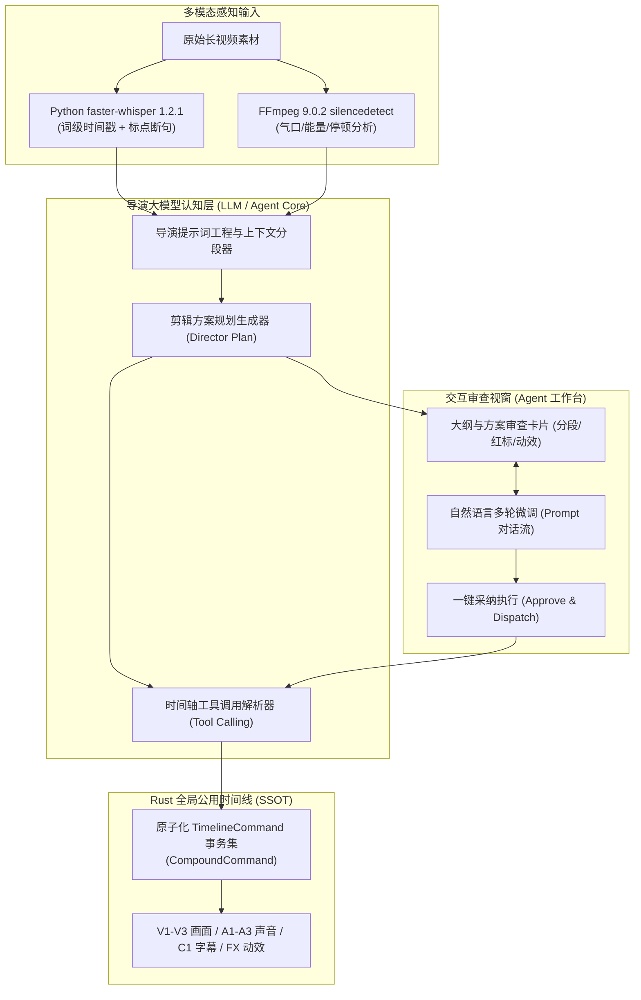

# 导演级 Agent 协议与剪辑指令集规范 (Agent Director & Tool Calling Specification)

> **版本**：v1.0.0  
> **更新时间**：2026-09-23  
> **适用技术栈**：Rust 1.98 (Host), Python 3.13 (`uv`), faster-whisper 1.2.1, OpenAI/Claude 兼容 API 协议  
> **核心地位**：定义 ClipFlow 核心差异化特色——“导演级 Agent”的理解规划模型、Tool Calling 时间轴剪辑指令集、结构化方案 Payload 及 Agent 专属视窗交互规范。

---

## 1. 导演级 Agent 定位与协同拓扑

不同于传统剪辑软件中仅作为侧边栏聊天助手的“单点 AI”，ClipFlow 的 Agent 承担**总导演 (Director)** 角色：
1. **全局内容理解**：解析原始长素材的语音大纲、情绪起伏、无效停顿与主题脉络。
2. **结构化剪辑方案输出**：自主制定包含钩子开头（Hook）、节奏卡点、BGM 选型与动效包装的完整《导演剪辑方案》。
3. **驱动时间轴原子落地**：通过类型安全、可撤销的剪辑指令集，一键将方案编译铺设至全局公用时间线。



---

## 2. LLM 接入层与长素材上下文调度

### 2.1 大模型配置与安全存储

ClipFlow 支持本地大模型与主流云端 API，统一在主进程安全配置中心管理：
- **兼容协议**：标准 OpenAI Chat Completions 协议（兼容 DeepSeek-V3/R1、Claude 3.5 Sonnet、OpenAI GPT-4o 及本地 Ollama / vLLM）。
- **字段规范**：
  ```rust
  pub struct LlmProviderConfig {
      pub provider_id: String,     // 如 "deepseek", "openai", "local-ollama"
      pub base_url: String,        // 如 "https://api.deepseek.com/v1"
      pub api_key: Option<String>, // DPAPI 加密存储于 Windows 凭据管理器
      pub model_name: String,      // 如 "deepseek-chat", "gpt-4o"
      pub max_tokens: u32,
      pub temperature: f32,        // 剪辑规划建议 0.2 ~ 0.4（兼顾创造性与指令稳定性）
  }
  ```

### 2.2 超长视频分幕分块策略 (Context Chunking)

面对时长 30~120 分钟的口播长视频，Whisper 产出的词级转写文本往往包含数万字，超出单次请求的最优认知窗口。系统采用**两级层次化调度**：

1. **第一级：宏观分幕 (Macro Act Segmentation)**：
   - 提取全局文本中每隔 2~3 分钟的粗粒度摘要，构建《全局故事弧线索引》。
   - 识别视频整体结构：片头（Hook/引入）$\to$ 核心观点 1/2/3 $\to$ 案例佐证 $\to$ 结尾总结与行动呼吁（CTA）。
2. **第二级：微观切片 (Micro Section Processing)**：
   - 以自然段落（长停顿或语意转折）为边界切分子任务，分批并发/异步调用 LLM 识别细粒度口误、语气词及冗余车轱辘话。
3. **合成全局方案**：汇总各切片结果，输出统一的《导演剪辑方案 (Director Plan)》。

### 2.3 流式分幕推流与时间线抢跑预标机制 (Progressive Streaming & Anti-Latency)

为杜绝用户在处理 1~2 小时长视频时面对大模型“思考圈”长达 1 分钟的等待焦虑，系统引入**声学抢跑与流式推流双轨机制**：

1. **本地声学物理“贪婪抢跑”（耗时 $\le 2\text{s}$）**：
   - 在大模型尚在分析语义时，Python 子进程先通过本地能量检测（VAD / `silencedetect`）在 2 秒内算出所有物理无声停顿；
   - 公用时间线**瞬间以淡黄色半透明条预标出所有疑似停顿**，向用户传递“系统已极速进入工作”的确定性即时反馈。
2. **分幕流式渐进点亮 (Act-by-Act Streaming)**：
   - 采用 SSE (Server-Sent Events) 流式协议，大模型每分析完一个 2~3 分钟分幕，**在 3~5 秒内立即向前端推流对应章节卡片**；
   - 时间线上对应的段落瞬间由淡黄色升格为鲜红色的确凿切除标记，剧本大纲与卡片瀑布流实时动态生长，用户无需等待全片规划完毕即可立即开始预览或确认已就绪的前序片段。
3. **分幕级局部重试与容灾 (Sectional Failover)**：
   - 若某一段长口播的 LLM 请求因网络波动中断，系统仅对该微观切片发起局部重试，已成功生成的其他幕卡片毫秒级持久化保留，杜绝长流程全盘推倒重来。

---

## 3. 核心剪辑指令集 (Tool Calling Schema)

Agent 操作公用时间线时，必须且仅能通过以下结构化工具调用。

> **时间轴防腐层契约 (ACL Guardrail)**：  
> 工具调用参数与外部通信协议中声明的所有时间参数（如 `start_time_seconds`, `duration_seconds`）统一使用人类与 LLM 习惯的十进制浮点秒（`f64`）。当指令被传递至 Rust 时间轴引擎时，**统一由 `AgentTimelineAcl`（详见 [`timeline-data-model.md` 第 1.4 节](file:///d:/Work/Dev/ClipFlow/docs/timeline-data-model.md) 与 [`01_Agent时间轴防腐层与帧吸附量化规范.md`](file:///d:/Work/Dev/ClipFlow/.local/remediation_plan/01_Agent%E6%97%B6%E9%97%B4%E8%BD%B4%E9%98%B2%E8%85%90%E5%B1%82%E4%B8%8E%E5%B8%A7%E5%90%B8%E9%99%84%E9%87%8F%E5%8C%96%E8%A7%84%E8%8C%83.md)）在进入事务命令栈前执行严格的帧网格硬吸附（`RationalTime`）与 $\le 1$ 帧微隙自动缝合**，保证切片空洞坏帧率严格为 0。

### 3.1 工具清单定义 (JSON Schema)

#### ① 批量切除冗余片段：`timeline_batch_cut_and_ripple`
用于剔除口播气口、停顿、语气助词及废话，并执行波纹左移平齐。

```json
{
  "name": "timeline_batch_cut_and_ripple",
  "description": "批量剔除时间轴上的废弃区间（停顿、错句、语气词），并对其后所有片段执行波纹前移闭合接缝",
  "parameters": {
    "type": "object",
    "properties": {
      "cuts": {
        "type": "array",
        "description": "待剔除的时间区间列表（必须按时间先后升序排列）",
        "items": {
          "type": "object",
          "properties": {
            "start_time_seconds": { "type": "number", "description": "起始秒数" },
            "end_time_seconds": { "type": "number", "description": "结束秒数" },
            "reason": { "type": "string", "enum": ["silence", "filler_word", "repetition", "digression"] }
          },
          "required": ["start_time_seconds", "end_time_seconds", "reason"]
        }
      }
    },
    "required": ["cuts"]
  }
}
```

#### ② 插入辅助补充镜头 (B-Roll)：`timeline_insert_broll`
在口播主讲画面上方轨道插入解释性空镜、演示视频或截图。

```json
{
  "name": "timeline_insert_broll",
  "description": "在指定的视频轨道（如 V2）覆盖插入 B-Roll 补充画面素材",
  "parameters": {
    "type": "object",
    "properties": {
      "asset_id": { "type": "string", "description": "素材资产库中的 UUID" },
      "target_track_index": { "type": "integer", "description": "放置轨道索引（默认 1，即 V2 轨）" },
      "timeline_start_seconds": { "type": "number", "description": "放置在时间轴上的入点时间" },
      "duration_seconds": { "type": "number", "description": "持续展示时长" },
      "source_in_seconds": { "type": "number", "description": "源素材裁切起点（默认 0.0）" }
    },
    "required": ["asset_id", "target_track_index", "timeline_start_seconds", "duration_seconds"]
  }
}
```

#### ③ 挂载 HyperFrames 动态包装：`timeline_attach_hyperframes`
在动效轨（FX 轨）挂载花字、角标、图表等逐帧确定性代码动效。

```json
{
  "name": "timeline_attach_hyperframes",
  "description": "在时间轴指定区间挂载 HyperFrames 动态包装图层",
  "parameters": {
    "type": "object",
    "properties": {
      "template_id": { "type": "string", "description": "模板标识，如 'lower_third_tech' 或 'data_line_chart'" },
      "timeline_start_seconds": { "type": "number", "description": "动效起始展示时间" },
      "duration_seconds": { "type": "number", "description": "动效总持续时长" },
      "template_parameters": {
        "type": "object",
        "description": "注入模板的业务参数（文本、数值、配色等）"
      }
    },
    "required": ["template_id", "timeline_start_seconds", "duration_seconds", "template_parameters"]
  }
}
```

#### ④ 背景音乐铺设与口播避让：`timeline_configure_bgm`
为全片选配背景配乐并配置智能闪避（Ducking）。

```json
{
  "name": "timeline_configure_bgm",
  "description": "在音频背景轨（如 A2）配置配乐，并启用口播人声检测自动降音避让",
  "parameters": {
    "type": "object",
    "properties": {
      "bgm_asset_id": { "type": "string", "description": "BGM 素材 UUID" },
      "base_volume_db": { "type": "number", "description": "无口播时的基础音量（如 -12.0 dB）" },
      "ducking_volume_db": { "type": "number", "description": "口播出现时的避让音量（如 -24.0 dB）" },
      "fade_in_seconds": { "type": "number", "description": "淡入时间（默认 1.5 秒）" },
      "fade_out_seconds": { "type": "number", "description": "结尾淡出时间（默认 2.0 秒）" }
    },
    "required": ["bgm_asset_id", "base_volume_db", "ducking_volume_db"]
  }
}
```

---

## 4. 导演剪辑方案数据结构 (Director Plan Schema)

Agent 思考规划后，在落地前向前端展示完整的结构化方案对象：

```rust
use serde::{Deserialize, Serialize};
use uuid::Uuid;

// 注：DirectorPlan 为前端可视化卡片展示与 LLM 协议交互视图（暴露 f64 便于前端高精度渲染进度与人类阅读）。
// 当创作者在 UI 点击“确认应用建议”时，底层通过 AgentTimelineAcl 转换为纯整数 RationalTime 事务命令执行。
#[derive(Debug, Clone, Serialize, Deserialize)]
pub struct DirectorPlan {
    pub plan_id: Uuid,
    pub title: String,
    pub generated_at: i64,
    /// 视频叙事大纲
    pub outline: Vec<PlanChapter>,
    /// 建议剔除的区间清单（停顿/口误/废话）
    pub suggested_cuts: Vec<SuggestedCut>,
    /// 建议包装的动态元素
    pub suggested_graphics: Vec<SuggestedGraphic>,
    /// 建议的 BGM 配置
    pub suggested_audio: SuggestedAudioPlan,
    /// 预期成片指标
    pub stats: PlanStats,
}

#[derive(Debug, Clone, Serialize, Deserialize)]
pub struct PlanChapter {
    pub chapter_index: u32,
    pub headline: String,
    pub original_time_range: (f64, f64),
    pub key_takeaways: Vec<String>,
    pub rhythm_style: RhythmStyle, // FastPaced, Steady, Climax
}

#[derive(Debug, Clone, Serialize, Deserialize)]
pub struct SuggestedCut {
    pub cut_id: Uuid,
    pub cut_type: CutType, // Silence, FillerWord, Repetition, OffTopic
    pub start: f64,
    pub end: f64,
    pub transcript_excerpt: Option<String>,
    pub confidence: f32,   // 0.0 - 1.0 置信度
    pub approved_by_default: bool,
}

#[derive(Debug, Clone, Serialize, Deserialize)]
pub struct PlanStats {
    pub original_duration_s: f64,
    pub projected_duration_s: f64,
    pub cut_duration_s: f64,
    pub cuts_count: usize,
}
```

---

## 5. Agent 导演工作台专用 UI 规格

当底部达芬奇 Dock 栏处于 `[ Agent ]` 分页时，上层专属视窗展示三区分栏布局：

```
+----------------------------------------------------------------------------------------------------+
| 顶栏: 导演 Agent 模式: [ 深度口播精剪模式 v1.0 ] | 当前模型: [ deepseek-chat (INT8) ] | 运行状态: [ 就绪 ] |
+------------------------------------+------------------------------------+--------------------------+
| 【左栏: 剧本大纲与镜头清单】         | 【中栏: 导演对话与交互决策流】       | 【右栏: 方案对比与成片指标】 |
|                                    |                                    |                          |
| 1. 开门见山 (Hook) [00:00-00:25]    | AI: "已扫描完成 18 分钟素材，发现   | 原始时长: 18分24秒       |
|    - 核心痛点提出                   | 42 处长气口、18 处重复口误。"      | 精剪预期: 11分15秒 (-38%)|
|    - 建议：快节奏，切除前置试音     |                                    | 标记停顿: 42 处          |
|                                    | 用户: "把第二段关于架构的废话再精简 | 待处理废话: 18 处        |
| 2. 核心架构深度拆解 [00:25-05:12]   | 一点，保留最核心的三点。"           |                          |
|    - 模块 1: Rust 主进程            |                                    | [ 预览精简音频 ]         |
|    - 模块 2: Python ASR 子进程      | AI: "明白！已为您重新压缩该段，剔除 |                          |
|                                    | 了 45 秒重复论述，方案已更新。"    | [ ★ 一键采纳并应用到时间轴 ]|
| 3. 结尾行动呼吁 (CTA) [05:12-06:00] |                                    |                          |
+------------------------------------+------------------------------------+--------------------------+
| 【全局公用时间线联动区】: 方案中的待剪除区间在时间线上实时以红底（#4A1515）高亮标注，确认后瞬间波纹折叠 |
+----------------------------------------------------------------------------------------------------+
```

### 5.1 交互核心特性
- **时间线实时投影 (Timeline Projection)**：Agent 处于思考与方案输出阶段时，不破坏原始时间轴，而是以“虚拟图层（Ghost Layer）”形式在公用时间线上红显待剪除区间、紫显建议动效。
- **对话即修改 (Chat-driven Refinement)**：用户只需在中间对话框输入自然语言（例如“不要删那句强调安全的说明”），Agent 自动更新 `DirectorPlan` 中对应片段的 `approved_by_default` 标记。
- **一键原子落地 (Atomic Dispatch)**：点击“一键采纳”后，主进程生成单个 `CompoundCommand` 执行时间轴折叠，毫秒级就绪，且用户随时可在【剪辑】页按 `Ctrl + Z` 完全撤销。
