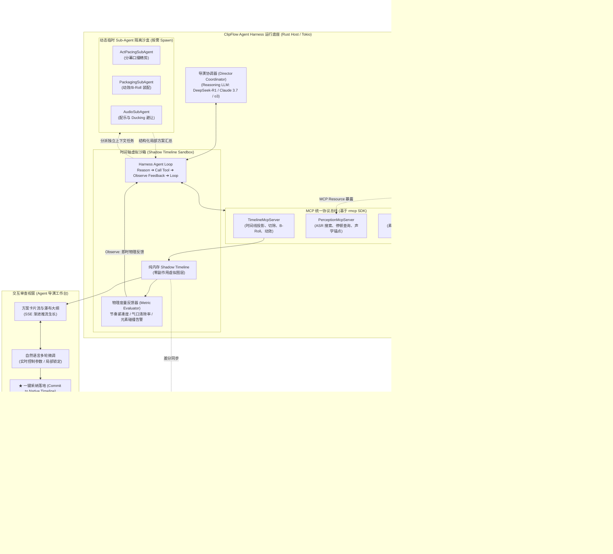
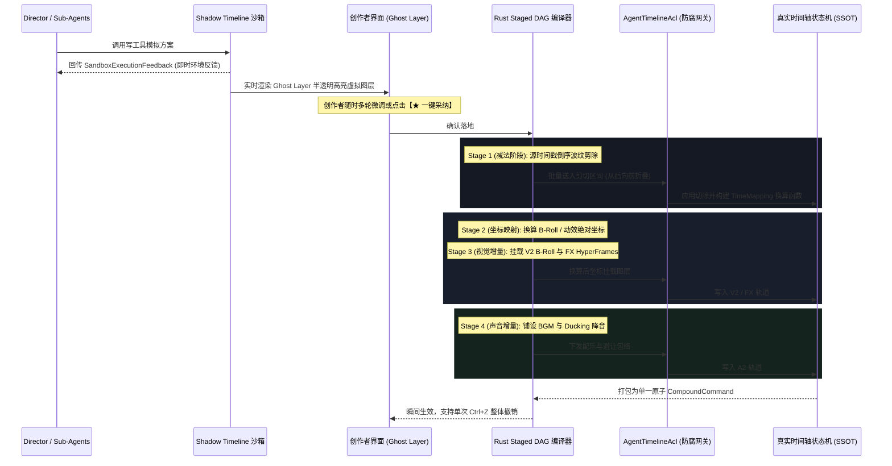

# 导演级 Agent 协议与剪辑指令集规范 (Agent Director & Tool Calling Specification)

> **版本**：v0.2.0 (Modern Agent Harness & MCP Protocol)  
> **更新时间**：2026-10-05  
> **适用技术栈**：Rust 1.99 (Host), Tokio, `rmcp` (官方 MCP Rust SDK), `rig-core` (LLM 统一客户端与工具绑定), Python 3.13 (`uv`), faster-whisper 1.2.1  
> **核心地位**：定义 ClipFlow 核心差异化特色——“导演级 Agent”的现代 Harness 架构（Thin Agent, Fat Platform）、基于 Model Context Protocol (MCP) 的标准剪辑工具集、Shadow Timeline 虚拟沙箱与即时度量反馈闭环、以及动态 Sub-Agent 隔离调度规范。

---

## 1. 现代 Agent Harness 架构与协同拓扑

不同于传统剪辑软件中仅作为侧边栏聊天助手的“单点 AI”，也不同于早期僵化死板的“硬编码静态流水线（Router-Pipeline）”，ClipFlow 的导演级 Agent 采用**现代 Agent Harness 范式（Thin Agent, Fat Platform）**：

1. **核心范式转型**：
   $$\text{Modern Agent} = \text{Model (推理大脑)} + \text{Agent Harness (操作系统级执行底座)}$$
   不再使用硬编码的“总导演 $\to$ 意图路由 $\to$ 固定3个子规划器”瀑布流，而是赋予大模型正交、原子且类型安全的底层时间轴与感知原语，依赖大模型的内生深度思考链（CoT）进行动态自主规划。
2. **开放标准总线 (Model Context Protocol, MCP)**：
   全面基于官方标准 `rmcp` 规范，将时间轴核心、ASR 多模态索引、媒体资产库抽象为内嵌与可拔插的标准 MCP Server。工具定义与调用全面对齐行业生态。
3. **环境即反馈 (Environment-as-Feedback) 与虚拟沙箱**：
   建立**时间轴虚拟沙箱（Shadow Timeline Sandbox）**。Agent 的每一个工具操作均在纯内存的虚拟时间轴上执行，并瞬间产生节奏指标、波形断层与图层碰撞等客观物理度量反馈，形成实时的 `Reason ➜ Act ➜ Observe ➜ Refine` 闭环。
4. **动态 Sub-Agent 上下文隔离**：
   对于超长素材（30~120 分钟），Coordinator 智能体可动态派发短暂生命周期（Ephemeral）的微观切片 Sub-Agent，各子智能体在干净隔离的上下文窗口中独立求解，彻底根除上下文污染与长文本降智。


```mermaid
flowchart TD
    subgraph MultiModal_Perception ["多模态感知输入 (本地 Worker & 引擎)"]
        RawVideo["原始长视频素材"]
        ASR_Engine["Python faster-whisper 1.2.1\n(词级时间戳 + 标点断句)"]
        SilenceDetect["FFmpeg 9.0.2 silencedetect\n(气口/能量/停顿分析)"]
        MemoryIndex["结构化时序记忆 (TimelineMemoryIndex)\n时序物理锚点 + 章节索引 + 历史拒绝指纹"]
        RawVideo --> ASR_Engine & SilenceDetect
        ASR_Engine & SilenceDetect --> MemoryIndex
    end

    subgraph Agent_Harness_Core ["ClipFlow Agent Harness 运行底座 (Rust Host / Tokio)"]
        DirectorCoordinator["导演协调器 (Director Coordinator)\n(Reasoning LLM: DeepSeek-R1 / Claude 3.7 / o3)"]
        
        AgentLoop["Harness Agent Loop\nReason ➔ Call Tool ➔ Observe Feedback ➔ Loop"]
        
        DirectorCoordinator <--> AgentLoop

        subgraph Dynamic_Subagents ["动态临时 Sub-Agent 隔离沙盒 (按需 Spawn)"]
            PacingSub["ActPacingSubAgent\n(分幕口播精剪)"]
            PackagingSub["PackagingSubAgent\n(动效/B-Roll 装配)"]
            AudioSub["AudioSubAgent\n(配乐与 Ducking 避让)"]
        end

        AgentLoop -.->|分派独立上下文任务| Dynamic_Subagents
        Dynamic_Subagents -.->|结构化局部方案汇总| AgentLoop

        subgraph MCP_Protocol_Bus ["MCP 统一协议总线 (基于 rmcp SDK)"]
            TimelineServer["TimelineMcpServer\n(时间线投影、切除、B-Roll、动效)"]
            PerceptionServer["PerceptionMcpServer\n(ASR 搜索、停顿查询、声学锚点)"]
            AssetServer["AssetMcpServer\n(素材检索、HyperFrames 模板)"]
        end

        AgentLoop <--> MCP_Protocol_Bus

        subgraph Shadow_Sandbox ["时间轴虚拟沙箱 (Shadow Timeline Sandbox)"]
            VirtualTimeline["纯内存 Shadow Timeline\n(零副作用虚拟图层)"]
            MetricEvaluator["物理度量反馈器 (Metric Evaluator)\n节奏紧凑度 / 气口清除率 / 元素碰撞告警"]
            TimelineServer --> VirtualTimeline --> MetricEvaluator
            MetricEvaluator -->|Observe: 即时物理反馈| AgentLoop
        end
    end

    subgraph User_Workspace ["交互审查视窗 (Agent 导演工作台)"]
        PlanStreamUI["方案卡片流与瀑布大纲\n(SSE 渐进推流生长)"]
        ChatInterface["自然语言多轮微调\n(实时控制参数 / 局部锁定)"]
        ApproveCommit["★ 一键采纳落地 (Commit to Native Timeline)"]
        PlanStreamUI <--> ChatInterface
        ChatInterface --> ApproveCommit
    end

    subgraph Native_Timeline_SSOT ["Rust 全局公用时间线 (SSOT)"]
        AclGateway["时间轴防腐网关 (AgentTimelineAcl)\nRationalTime 强制帧吸附 & 隙缝缝合"]
        DagCompiler["分阶段执行图编译器 (Staged DAG Compiler)"]
        CompoundTx["单一原子 CompoundCommand 事务"]
        NativeTracks["V1-V3 画面 / A1-A3 声音 / C1 字幕 / FX 动效"]
        GhostLayer["Ghost Layer 虚拟投影 (半透明高亮)"]

        VirtualTimeline -.->|差分同步| GhostLayer
        ApproveCommit --> DagCompiler --> AclGateway --> CompoundTx --> NativeTracks
    end

    MemoryIndex -.->|MCP Resource 暴露| PerceptionServer
    VirtualTimeline --> PlanStreamUI
```

---

## 2. LLM 接入层、思考链与上下文治理

### 2.1 基于 `rig-core` 的多模型统一驱动与思考链契约

系统采用 `rig-core` 统一抽象底层大模型提供商（`LlmClient`），结合 Tokio 异步执行，消灭平台方私有绑定的维护包袱：

- **支持的模型驱动**：
  1. **OpenAI 兼容协议**：DeepSeek-V3 / R1、OpenAI GPT-4o / o3、本地 Ollama / vLLM；
  2. **Anthropic 协议**：Claude 3.5 / 3.7（含 Extended Thinking 模式）、MiniMax-M3.x 系列。
- **配置与安全存储契约**：
  ```rust
  use serde::{Deserialize, Serialize};

  #[derive(Debug, Clone, Copy, PartialEq, Eq, Serialize, Deserialize)]
  pub enum LlmProviderKind {
      OpenAiCompatible,
      Anthropic,
      OllamaLocal,
  }

  #[derive(Debug, Clone, Serialize, Deserialize)]
  pub struct LlmProviderConfig {
      pub provider_id: String,        // 如 "deepseek", "anthropic", "local-ollama"
      pub kind: LlmProviderKind,      // 协议驱动分类
      pub base_url: String,           // 如 "https://api.deepseek.com/v1"
      pub api_key: Option<String>,    // Windows DPAPI 加密存储于凭据管理器
      pub model_name: String,         // 如 "deepseek-reasoner", "claude-3-7-sonnet"
      pub max_prompt_tokens: u32,     // 输入 Token 预算（默认 32,768）
      pub max_completion_tokens: u32, // 输出 Token 预算（默认 8,192）
      pub temperature: f32,           // 剪辑规划推荐 0.2 ~ 0.4
      pub reasoning_budget_tokens: Option<u32>, // 深度思考 Token 预算（Thinking 模式专用）
      pub timeout_seconds: u32,       // 超时时间（默认 45s）
  }
  ```
- **Reasoning / Thinking 连续性保证**：
  在对接 DeepSeek-R1 或 Claude 3.7 Thinking 模式时，多轮 Tool Calling 交互中 Harness **强制将上一轮返回的 `thinking` 块原样透传回大模型上下文**，严禁丢弃思考链，确保模型推理链条完整不漂移。

### 2.2 上下文滚动治理 (Context Compaction & Pruning)

长任务 Agent 会产生海量的只读查询输出（如几千条时间戳信息），极易引发**上下文毒化（Context Poisoning）**与推理迟钝。ClipFlow Harness 引入自动上下文修剪治理机制：

1. **工具执行结果修剪 (Tool Execution Output Pruning)**：
   - 当多轮会话产生新的剪辑决策时，前序轮次中调用 `timeline_inspect_range` 或 `timeline_query_candidates` 返回的庞大原始 JSON 列表被 Harness **自动折叠为摘要哈希锚点**（如 `[已折叠 128 条气口查询结果，时间段 00:00-05:00，状态哈希 #A8F2]`）；
   - 仅保留当前最新一轮工具调用的完整出参，使得上下文长度稳定在“智能甜点区（Smart Zone，$\le 30\text{k}$ tokens）”。
2. **Scratchpad 状态缓存**：
   - 跨多轮会话的剪辑目标、已采纳决议与用户特定偏好被提炼至 Harness 的 `WorkingMemoryScratchpad`，作为置顶系统状态注入，无需在对话历史中反复重述。

### 2.3 超长素材分幕与 Ephemeral Sub-Agent 并发隔离

面对 30~120 分钟的长口播视频，系统坚决杜绝把上万字全量台词塞入单一 Prompt：

1. **第一阶段：Coordinator 宏观意图分幕**：
   - Director Coordinator 读取压缩后的语义章节索引（由 ASR 离线提炼生成）；
   - 划分 3~8 个宏观分幕（Acts），确立各分幕叙事主线与节奏标签（如 `Hook`、`BodyArgument`、`CaseStudy`、`CTA`）。
2. **第二阶段：动态 Spawn 隔离 Sub-Agent**：
   - Coordinator 针对各分幕按需并发派发 `ActPacingSubAgent`；
   - 每个 Sub-Agent 获得**全新的、完全隔离的 Tokio Task 上下文**与**限定的 MCP Tools 白名单**（仅授予当前分幕对应时间区间的操作权限）；
   - 子 Agent 独立完成局部口播气口修剪、错词折叠与动效推荐，求解完毕后将结构化的 `ActPlanChunk` 回传给 Coordinator；
   - 求解结束后 Sub-Agent 上下文立即销毁，内存即刻释放，根除内存泄漏与上下文雪崩。

### 2.4 声学贪婪抢跑与流式推流 (Progressive Streaming & Anti-Latency)

为杜绝用户面对大模型“思考圈”产生等待焦虑，保留并强化**声学抢跑与流式推流双轨机制**：

1. **本地声学物理“贪婪抢跑”（耗时 $\le 2\text{s}$）**：
   - 在大模型尚在解析语义时，Python 子进程先通过本地能量检测（VAD / `silencedetect`）在 2 秒内算出所有物理无声停顿；
   - 公用时间线**瞬间以淡黄色半透明条预标出所有疑似停顿**，向用户传递“系统已极速进入工作”的确定性即时反馈。
2. **分幕流式渐进点亮 (Act-by-Act Streaming)**：
   - 采用 SSE (Server-Sent Events) 流式协议，Sub-Agent 每完成一个 2~3 分钟分幕，**在 3~5 秒内立即向前端推流对应章节卡片**；
   - 时间线上对应的段落瞬间由淡黄色升格为鲜红色的确凿切除标记，剧本大纲与卡片瀑布流实时动态生长，用户无需等待全片规划完毕即可立即开始预览或确认已就绪的前序片段。
3. **分幕级局部重试与容灾 (Sectional Failover)**：
   - 若某一段长口播的 LLM 请求因网络波动中断，系统仅对该微观切片发起局部重试，已成功生成的其他幕卡片毫秒级持久化保留，杜绝长流程全盘推倒重来。

### 2.5 结构化时序记忆模型与感知索引 (Structured Timeline Memory Index)

主进程构建基于内存的**结构化时序记忆索引 (`TimelineMemoryIndex`)**，并通过 MCP Resource 暴露给 Agent 按需读取：

```rust
use std::collections::HashSet;
use serde::{Deserialize, Serialize};
use uuid::Uuid;

/// 时间轴多模态感知记忆索引（Rust 宿主常驻，支撑 Agent 局部只读查询）
#[derive(Debug, Clone, Serialize, Deserialize)]
pub struct TimelineMemoryIndex {
    /// 媒体资产关联 ID
    pub asset_id: Uuid,
    /// 1. 时序物理声学锚点（停顿、极低能量谷值、爆发音点）
    pub acoustic_anchors: Vec<AcousticAnchor>,
    /// 2. 章节语义索引缓存（用于 Coordinator 宏观大纲定位）
    pub semantic_chapters: Vec<SemanticChapterSummary>,
    /// 3. 用户历史拒绝切除片段特征指纹集合（负样本防逆向推荐）
    pub rejected_cut_hashes: HashSet<String>,
}

#[derive(Debug, Clone, Serialize, Deserialize)]
pub struct AcousticAnchor {
    pub anchor_id: Uuid,
    pub source_start_seconds: f64,
    pub source_end_seconds: f64,
    pub kind: AcousticAnchorKind,
    pub energy_level_db: f32,
}

#[derive(Debug, Clone, Copy, PartialEq, Eq, Serialize, Deserialize)]
pub enum AcousticAnchorKind {
    SilenceGap,     // 物理气口/静音
    BreathPause,    // 换气轻声停顿
    EnergySpike,    // 音量重音高潮点（用于卡点）
}

#[derive(Debug, Clone, Serialize, Deserialize)]
pub struct SemanticChapterSummary {
    pub chapter_index: u32,
    pub headline: String,
    pub source_time_range: (f64, f64),
    pub key_takeaways: Vec<String>,
    pub token_estimate: u32,
}
```

---

## 3. 基于 MCP 的剪辑指令集与双向工具契约 (MCP Tools & Protocols)

ClipFlow 全面基于 **官方 `rmcp` 规范** 实现剪辑工具链。工具被划分为**只读感知工具（Inspection Tools）**与**沙箱写入工具（Mutation Tools）**。

### 3.1 官方 `rmcp` 架构落地与工具注册

工具在 Rust 端通过声明式宏与 Trait 直接绑定到 `TimelineMcpServer`：

```rust
use rmcp::prelude::*;
use serde_json::Value;

pub struct TimelineMcpServer {
    // 纯内存 Shadow Timeline 虚拟沙箱
    sandbox: Arc<tokio::sync::RwLock<ShadowTimelineSandbox>>,
    // 真实 SSOT 时间线只读句柄
    native_timeline: Arc<tokio::sync::RwLock<TimelineEngine>>,
}

// 统一注册为符合 Model Context Protocol 的工具服务
#[mcp_server]
impl TimelineMcpServer {
    // 工具定义由 rmcp 宏自动生成符合 MCP 标准的 JSON Schema
}
```

### 3.2 只读感知 MCP Tools (Read-Only Inspection Tools)

> **只读工具四项契约**：  
> 1. **零事务副作用**：严禁触发 `TimelineCommand` 事务栈压栈，纯只读内存状态投影；  
> 2. **读路径免帧吸附**：入参与出参统一使用十进制浮点秒（`f64`），避免多次量化精度损耗；  
> 3. **防上下文膨胀**：单次查询严格限制返回记录条数（默认 50，硬上限 200），支持 `limit` / `offset`；  
> 4. **零媒体二进制**：仅回传结构化轻量元数据与台词摘要，绝对禁止回传音视频原始二进制流或波形采样数据。

#### ① 查询全局工程与时间线概貌：`timeline_inspect_project`
```json
{
  "name": "timeline_inspect_project",
  "description": "查询当前工程的全局时间线元数据（总时长、主轨帧率、各轨道类型/锁定/静音状态、Ghost Layer 虚拟图层激活状态）",
  "inputSchema": {
    "type": "object",
    "properties": {},
    "required": []
  }
}
```

#### ② 查询指定区间时间轴片段：`timeline_inspect_range`
```json
{
  "name": "timeline_inspect_range",
  "description": "查询指定时间范围内各个轨道的片段元数据摘要（返回 clip_id、素材引用、时间区间、是否锁定）",
  "inputSchema": {
    "type": "object",
    "properties": {
      "start_time_seconds": { "type": "number", "description": "查询起点（秒）" },
      "end_time_seconds": { "type": "number", "description": "查询终点（秒）" },
      "track_indices": {
        "type": "array",
        "items": { "type": "integer" },
        "description": "限定查询的轨道索引列表，缺省时查询全部轨道"
      },
      "limit": { "type": "integer", "description": "返回最大片段数（默认 50，上限 200）", "default": 50 },
      "offset": { "type": "integer", "description": "分页偏移量", "default": 0 }
    },
    "required": ["start_time_seconds", "end_time_seconds"]
  }
}
```

#### ③ 查询底层候选切点与气口：`timeline_query_candidates`
```json
{
  "name": "timeline_query_candidates",
  "description": "查询当前素材由物理 VAD 或声学模型初步标定的停顿、气口与语气词候选切点列表",
  "inputSchema": {
    "type": "object",
    "properties": {
      "time_range": {
        "type": "object",
        "properties": {
          "start_seconds": { "type": "number" },
          "end_seconds": { "type": "number" }
        },
        "required": ["start_seconds", "end_seconds"]
      },
      "status_filter": {
        "type": "string",
        "enum": ["all", "pending", "accepted", "rejected"],
        "description": "切点过滤状态（默认 all）"
      },
      "limit": { "type": "integer", "default": 100 }
    },
    "required": ["time_range"]
  }
}
```

#### ④ 检索媒体资产库：`asset_search`
```json
{
  "name": "asset_search",
  "description": "在工程素材库中按关键词、标签或类型检索可用素材资产（仅返回元数据摘要，不含二进制）",
  "inputSchema": {
    "type": "object",
    "properties": {
      "query": { "type": "string", "description": "检索关键词" },
      "kind": {
        "type": "string",
        "enum": ["video", "audio", "image", "hyperframes_template"],
        "description": "素材类型"
      },
      "limit": { "type": "integer", "default": 20 }
    },
    "required": ["query"]
  }
}
```

---

### 3.3 沙箱写入 MCP Tools (Mutation Tools)

> **沙箱即时反馈契约**：  
> 所有写工具均在纯内存的 **`ShadowTimelineSandbox`** 中即时求值。每次执行不仅验证逻辑合法性，而且瞬间返回包含**剪后时长、停顿消除率、音画碰撞诊断**的即时环境度量 `SandboxExecutionFeedback`，供 Agent 实时评估和下一步调整。

#### ① 批量提议切除与波纹折叠：`timeline_propose_cuts`
```json
{
  "name": "timeline_propose_cuts",
  "description": "在沙箱中批量模拟剔除冗余区间（停顿、错句、语气词），并计算波纹前移后的时序投影",
  "inputSchema": {
    "type": "object",
    "properties": {
      "cuts": {
        "type": "array",
        "description": "待剔除的时间区间列表（必须按源时间先后升序排列）",
        "items": {
          "type": "object",
          "properties": {
            "start_time_seconds": { "type": "number", "description": "起始秒数" },
            "end_time_seconds": { "type": "number", "description": "结束秒数" },
            "reason": { "type": "string", "enum": ["silence", "filler_word", "repetition", "digression"] }
          },
          "required": ["start_time_seconds", "end_time_seconds", "reason"]
        }
      },
      "target_track_indices": {
        "type": "array",
        "items": { "type": "integer" },
        "description": "波纹联动生效的轨道索引列表；默认联动主音视频与字幕轨（V1, A1, C1）"
      }
    },
    "required": ["cuts"]
  }
}
```

#### ② 插入辅助镜头 (B-Roll)：`timeline_insert_broll`
```json
{
  "name": "timeline_insert_broll",
  "description": "在指定的视频轨道（如 V2）覆盖插入 B-Roll 补充画面素材",
  "inputSchema": {
    "type": "object",
    "properties": {
      "asset_id": { "type": "string", "description": "素材资产库中的 UUID" },
      "target_track_index": { "type": "integer", "description": "放置轨道索引（默认 1，即 V2 轨）" },
      "source_anchor_seconds": { "type": "number", "description": "挂载在源视频对应解说点的原始秒数" },
      "duration_seconds": { "type": "number", "description": "持续展示时长" },
      "source_in_seconds": { "type": "number", "description": "源素材裁切起点（默认 0.0）" }
    },
    "required": ["asset_id", "target_track_index", "source_anchor_seconds", "duration_seconds"]
  }
}
```

#### ③ 挂载 HyperFrames 动态包装：`timeline_attach_hyperframes`
```json
{
  "name": "timeline_attach_hyperframes",
  "description": "在时间轴指定区间挂载 HyperFrames 动态包装图层",
  "inputSchema": {
    "type": "object",
    "properties": {
      "template_id": { "type": "string", "description": "模板标识，如 'lower_third_tech' 或 'data_line_chart'" },
      "source_anchor_seconds": { "type": "number", "description": "挂载在源视频对应解说点的原始秒数" },
      "duration_seconds": { "type": "number", "description": "动效总持续时长" },
      "template_parameters": {
        "type": "object",
        "description": "注入模板的业务参数（文本、数值、配色等）"
      }
    },
    "required": ["template_id", "source_anchor_seconds", "duration_seconds", "template_parameters"]
  }
}
```

#### ④ 背景音乐铺设与口播避让：`timeline_configure_bgm`
```json
{
  "name": "timeline_configure_bgm",
  "description": "在音频背景轨（如 A2）配置配乐，并启用口播人声检测自动降音避让",
  "inputSchema": {
    "type": "object",
    "properties": {
      "bgm_asset_id": { "type": "string", "description": "BGM 素材 UUID" },
      "base_volume_db": { "type": "number", "description": "无口播时的基础音量（如 -12.0 dB）" },
      "ducking_volume_db": { "type": "number", "description": "口播出现时的避让音量（如 -24.0 dB）" },
      "fade_in_seconds": { "type": "number", "description": "淡入时间（默认 1.5 秒）" },
      "fade_out_seconds": { "type": "number", "description": "结尾淡出时间（默认 2.0 秒）" }
    },
    "required": ["bgm_asset_id", "base_volume_db", "ducking_volume_db"]
  }
}
```

---

### 3.4 Shadow Timeline 虚拟沙箱即时反馈数据结构

写工具在沙箱中求值后返回给大模型的 `SandboxExecutionFeedback`，形成真正的闭环观测：

```rust
use serde::{Deserialize, Serialize};
use uuid::Uuid;

#[derive(Debug, Clone, Serialize, Deserialize)]
pub struct SandboxExecutionFeedback {
    pub call_id: String,
    pub success: bool,
    /// 沙箱当前虚拟状态指标
    pub metrics: SandboxMetrics,
    /// 潜在冲突或合规警告（如重叠遮挡、锁定保护等）
    pub warnings: Vec<SandboxWarning>,
    /// 诊断与自愈上下文
    pub recovery_suggestion: Option<String>,
}

#[derive(Debug, Clone, Serialize, Deserialize)]
pub struct SandboxMetrics {
    /// 剪后虚拟总时长（秒）
    pub projected_duration_seconds: f64,
    /// 较原始时长缩减比例（如 0.35 表示缩短 35%）
    pub reduction_ratio: f32,
    /// 累计消除的无效停顿与语气词数量
    pub total_cuts_count: usize,
    /// 平均每分钟剪辑点密度（用于评估节奏是否过紧或过松）
    pub cuts_per_minute: f32,
}

#[derive(Debug, Clone, Serialize, Deserialize)]
pub struct SandboxWarning {
    pub code: SandboxWarningCode,
    pub message: String,
    pub at_source_seconds: f64,
}

#[derive(Debug, Clone, Copy, PartialEq, Eq, Serialize, Deserialize)]
pub enum SandboxWarningCode {
    PacingTooFast,        // 剪辑点过密，可能影响听感连贯度
    WordBoundaryCutLoss,  // 切点紧贴词尾，建议保留 80ms 缓冲区
    VisualLayerOverlap,   // B-Roll 与 HyperFrames 发生图层空间重叠
    AudioDuckingOverload, // 配乐在多处急剧拉升降落，听感易突兀
}
```

---

### 3.5 分阶段执行图 (Staged DAG Compiler) 与原子提交机制

当创作者在 UI 审查 Ghost Layer 虚拟投影并点击【★ 一键采纳落地】后，主进程 Staged DAG 编译器负责将沙箱方案编译落地至真实的 Rust 公用时间线（SSOT）：


```mermaid
sequenceDiagram
    participant LLM as Director / Sub-Agents
    participant Sandbox as Shadow Timeline 沙箱
    participant UI as 创作者界面 (Ghost Layer)
    participant Host as Rust Staged DAG 编译器
    participant ACL as AgentTimelineAcl (防腐网关)
    participant TL as 真实时间轴状态机 (SSOT)

    LLM->>Sandbox: 调用写工具模拟方案
    Sandbox-->>LLM: 回传 SandboxExecutionFeedback (即时环境反馈)
    Sandbox->>UI: 实时渲染 Ghost Layer 半透明高亮虚拟图层
    Note over UI: 创作者随时多轮微调或点击【★ 一键采纳】
    UI->>Host: 确认落地
    
    rect rgb(20, 25, 35)
        Note over Host: Stage 1 (减法阶段): 源时间戳倒序波纹剪除
        Host->>ACL: 批量送入剪切区间 (从后向前折叠)
        ACL->>TL: 应用切除并构建 TimeMapping 换算函数
    end

    rect rgb(25, 30, 45)
        Note over Host: Stage 2 (坐标映射): 换算 B-Roll / 动效绝对坐标
        Note over Host: Stage 3 (视觉增量): 挂载 V2 B-Roll 与 FX HyperFrames
        Host->>ACL: 换算后坐标挂载图层
        ACL->>TL: 写入 V2 / FX 轨道
    end

    rect rgb(20, 35, 30)
        Note over Host: Stage 4 (声音增量): 铺设 BGM 与 Ducking 降音
        Host->>ACL: 下发配乐与避让包络
        ACL->>TL: 写入 A2 轨道
    end

    TL-->>Host: 打包为单一原子 CompoundCommand
    Host-->>UI: 瞬间生效，支持单次 Ctrl+Z 整体撤销
```

#### 4 阶段流水线编译契约 (Staged Compilation Pipeline)
1. **Stage 1 (减法阶段 - Subtractive Cut & Ripple)**：
   - 提取方案中用户勾选采纳的切点；
   - 严格按照源时间戳从后向前倒序执行切除折叠，保证前序波纹绝不影响未切片段在源素材中的物理索引。
2. **Stage 2 (坐标重映射 - Coordinate Translation)**：
   - Rust 宿主计算切除前后的时间映射函数：
     $$\text{TimeMapping}: t_{\text{source}} \mapsto t_{\text{timeline\_new}}$$
   - 将方案中所有基于源时间标记的 B-Roll 入点、HyperFrames 动效起点自动换算为折叠后的时间线新坐标。
3. **Stage 3 (视觉增量阶段 - Additive Video & Motion)**：
   - 在已折叠的干净时间线上，安全插入 V2 轨 B-Roll 素材与 FX 轨 HyperFrames 包装。
4. **Stage 4 (声音增量阶段 - Additive Audio & Ducking)**：
   - 铺设 A2 轨配乐，并根据主讲人声区间自动生成 Ducking 动态包络。
5. **原子提交 (Atomic Commit)**：
   - 上述 4 个阶段的所有原子子命令统一归集为一个 `CompoundCommand`，一次性压入 `TimelineHistory` 撤销栈，用户在非编主界面按一次 `Ctrl + Z` 即可完全复原。

---

## 4. 导演剪辑方案数据结构 (Director Plan Schema)

```rust
use serde::{Deserialize, Serialize};
use uuid::Uuid;

#[derive(Debug, Clone, Serialize, Deserialize)]
pub struct DirectorPlan {
    pub plan_id: Uuid,
    pub title: String,
    pub generated_at: i64,
    /// 视频叙事大纲
    pub outline: Vec<PlanChapter>,
    /// 建议剔除的区间清单（停顿/口误/废话）
    pub suggested_cuts: Vec<SuggestedCut>,
    /// 建议包装的动态元素
    pub suggested_graphics: Vec<SuggestedGraphic>,
    /// 建议的 BGM 配置
    pub suggested_audio: SuggestedAudioPlan,
    /// 预期成片指标
    pub stats: PlanStats,
}

#[derive(Debug, Clone, Serialize, Deserialize)]
pub struct PlanChapter {
    pub chapter_index: u32,
    pub headline: String,
    /// 对应源素材时间区间 (秒)
    pub original_time_range: (f64, f64),
    pub key_takeaways: Vec<String>,
    pub rhythm_style: RhythmStyle, // FastPaced, Steady, Climax
}

#[derive(Debug, Clone, Serialize, Deserialize)]
pub struct SuggestedCut {
    pub cut_id: Uuid,
    pub cut_type: CutType, // Silence, FillerWord, Repetition, OffTopic
    /// 源素材起始秒数
    pub start: f64,
    /// 源素材结束秒数
    pub end: f64,
    pub transcript_excerpt: Option<String>,
    pub confidence: f32,   // 0.0 - 1.0 置信度
    pub approved_by_default: bool,
    /// 关联的源片段 ID（可选）
    pub source_clip_id: Option<Uuid>,
}

#[derive(Debug, Clone, Serialize, Deserialize)]
pub struct PlanStats {
    pub original_duration_s: f64,
    pub projected_duration_s: f64,
    pub cut_duration_s: f64,
    pub cuts_count: usize,
}

#[derive(Debug, Clone, Copy, PartialEq, Eq, Serialize, Deserialize)]
pub enum RhythmStyle {
    FastPaced, // 紧凑快节奏
    Steady,    // 平稳叙事
    Climax,    // 高潮强调
}

#[derive(Debug, Clone, Copy, PartialEq, Eq, Serialize, Deserialize)]
pub enum CutType {
    Silence,    // 物理停顿/气口
    FillerWord, // 语气词
    Repetition, // 口误结巴
    OffTopic,   // 跑题废话
}

#[derive(Debug, Clone, Serialize, Deserialize)]
pub struct SuggestedGraphic {
    pub graphic_id: Uuid,
    pub anchor_chapter_index: Option<u32>,
    pub template_id: String,
    pub source_start_seconds: f64,
    pub duration_seconds: f64,
    pub template_parameters: serde_json::Value,
    pub rationale: String,
    pub approved_by_default: bool,
}

#[derive(Debug, Clone, Serialize, Deserialize)]
pub struct SuggestedAudioPlan {
    pub bgm_asset_id: Option<Uuid>,
    pub mood_tag: String,
    pub base_volume_db: f32,
    pub ducking_volume_db: f32,
    pub fade_in_seconds: f32,
    pub fade_out_seconds: f32,
    pub enabled_by_default: bool,
}
```

---

## 5. Agent 导演工作台专用 UI 规格

当底部达芬奇 Dock 栏处于 `[ Agent ]` 分页时，上层专属视窗展示三区分栏布局：

```
+----------------------------------------------------------------------------------------------------+
| 顶栏: 导演模式: [ 现代自适应精剪 v0.2 ] | 引擎: [ deepseek-reasoner ] | 阶段: [ 沙箱推演 -> Ghost Layer 就绪 ] |
+------------------------------------+------------------------------------+--------------------------+
| 【左栏: 剧本大纲与镜头瀑布】         | 【中栏: 导演对话与即时交互流】       | 【右栏: 沙箱指标与成片诊断】 |
|                                    |                                    |                          |
| 1. 开门见山 (Hook) [00:00-00:25]    | AI: "已在 Shadow 沙箱完成推演：    | 原始时长: 18分24秒       |
|    - 核心痛点提出                   | 识别 42 处长气口、18 处口误。      | 剪后预期: 11分15秒 (-38%)|
|    - 建议：快节奏，切除前置试音     | 沙箱度量：节奏密度 5.4剪/分。"     | 标记停顿: 42 处          |
|                                    |                                    | 待处理废话: 18 处        |
| 2. 核心架构拆解 [00:25-05:12]       | 用户: "第二段的架构介绍不要剪太紧， | 警告: 02:15 动效与B-Roll重叠|
|    - 模块 1: Rust 主进程            | 保留核心解说。"                    |                          |
|    - 模块 2: Python ASR 子进程      |                                    | [ 试听虚拟沙箱音频 ]     |
|                                    | AI: "明白！已更新沙箱方案，解除对应 |                          |
| 3. 结尾行动呼吁 [05:12-06:00]       | 切除标记，Ghost 图层已实时刷新。"   | [ ★ 一键采纳并应用到时间轴 ]|
+------------------------------------+------------------------------------+--------------------------+
| 【全局公用时间线联动区】: 方案实时在公用时间线上以半透明 Ghost Layer 投影展示，采纳后瞬间原子落地 |
+----------------------------------------------------------------------------------------------------+
```

### 5.1 交互核心特性
- **时间线实时投影 (Ghost Layer Projection)**：沙箱方案实时以半透明色投影在主时间轴上（红底表示待切除，紫底表示待挂载动效），创作者随时在非编主轨上肉眼直观核验。
- **对话即修改 (Chat-driven Interactive Refinement)**：创作者可随意打断或微调，Agent 调用 MCP 工具更新 Shadow Timeline，Ghost Layer 毫秒级无感刷新。
- **一键原子落地 (Atomic Commit)**：点击“一键采纳”后，底层 Staged DAG 编译器一次性打包生成单一 `CompoundCommand`，毫秒级落地生效，`Ctrl + Z` 完全撤销。

---

## 6. 口播台词优化与字幕闭环

### 6.1 字幕断句与容错自愈
针对大模型在台词去口头语气词或标点规范化时产生的轻微语法失配，执行层构建最多 3 轮的自愈循环：

```
[输入带编号字幕字典] ──► [LLM 纠错推理] ──► [json_repair 容错解析] ──► [确定性校验]
                                                                    │
      ┌────────────────────── 校验失败 (最多重试 3 轮) ───────────────┤
      ▼                                                             ▼
[注入差错反馈重新提示]                                           [校验通过]
                                                                    │
[若 3 轮仍失配] ──► [SubtitleAligner (difflib.ndiff) 兜底对齐] ◄────┘
                                     │
                      [输出 100% 对应时间戳的干净字幕]
```

1. **结构容错解析**：统一使用 `json_repair` 容错解析模型输出；
2. **确定性多维校验**：键完整性 1:1 校验与编辑距离防语义漂移校验；
3. **闭环反馈修正**：失配时将具体缺失 Key 回传纠偏；
4. **底层对齐兜底**：若超限则调用序列差分对齐器安全占位对齐，杜绝时间戳破损。

### 6.2 现代双语反思翻译
结合具备 Extended Thinking 能力的现代模型，无需复杂的外部多轮提示词堆叠，直接通过结构化 Prompt 要求模型在 CoT 思考链中自发完成“语义初翻 $\to$ 7 大口播机翻味诊断反思 $\to$ 母语级影视重写”，产出高质量双语字幕。

---

## 7. 依赖收口与架构落地规范 (Cargo Dependency Contract)

根据 `AGENTS.md` 的严格依赖收口红线，新增依赖严格限制于以下两个成熟库，并限定作用域：

1. **`rmcp`** (官方 Model Context Protocol Rust SDK)：
   - **引入理由**：标准化工具定义与调用契约，消除私有 JSON 编解码维护包袱，实现工具解耦与生态互通。
   - **作用域**：仅在 `clipflow-ipc` 或专门的 Agent 服务模块中引入，绝不污染底层纯逻辑数据层 `clipflow-timeline`。
2. **`rig-core`** (Rust 现代 LLM/Agent 统一框架)：
   - **引入理由**：统一抽象 20+ LLM 提供商，提供强类型 Tool 绑定与 Thinking 思考链透传，避免手写大量脆弱的 HTTP/SSE 客户端。
   - **作用域**：仅作为 Agent 宿主层驱动，与 UI 层和多媒体底层彻底解耦。
