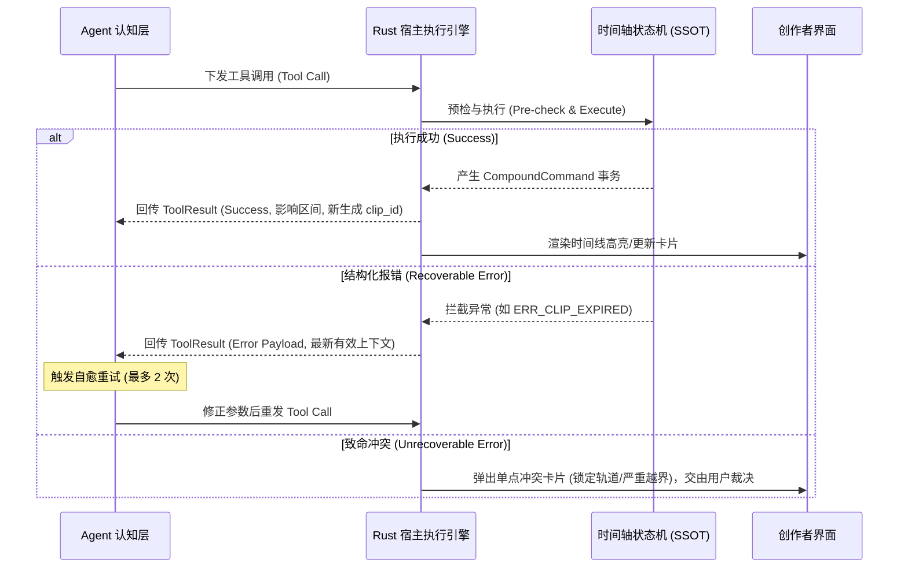

# 导演级 Agent 协议与剪辑指令集规范 (Agent Director & Tool Calling Specification)

> **版本**：v0.1.0  
> **更新时间**：2026-09-26  
> **适用技术栈**：Rust 1.98 (Host), Python 3.13 (`uv`), faster-whisper 1.2.1, OpenAI/Claude 兼容 API 协议  
> **核心地位**：定义 ClipFlow 核心差异化特色——“导演级 Agent”的理解规划模型、Tool Calling 时间轴剪辑指令集、结构化方案 Payload 及 Agent 专属视窗交互规范。

---

## 1. 导演级 Agent 定位与协同拓扑

不同于传统剪辑软件中仅作为侧边栏聊天助手的“单点 AI”，ClipFlow 的 Agent 承担**总导演 (Director)** 角色：
1. **全局内容理解**：解析原始长素材的语音大纲、情绪起伏、无效停顿与主题脉络。
2. **结构化剪辑方案输出**：自主制定包含钩子开头（Hook）、节奏卡点、BGM 选型与动效包装的完整《导演剪辑方案》。
3. **驱动时间轴原子落地**：通过类型安全、可撤销的剪辑指令集，一键将方案编译铺设至全局公用时间线。

```mermaid
flowchart TD
    subgraph Raw_Perception ["多模态感知输入"]
        RawVideo["原始长视频素材"]
        ASR_Engine["Python faster-whisper 1.2.1\n(词级时间戳 + 标点断句)"]
        SilenceDetect["FFmpeg 9.0.2 silencedetect\n(气口/能量/停顿分析)"]
        RawVideo --> ASR_Engine
        RawVideo --> SilenceDetect
    end

    subgraph Director_Cognition ["导演大模型认知层 (LLM / Agent Core)"]
        PromptEngine["导演提示词工程与上下文分段器"]
        PlanGenerator["剪辑方案规划生成器 (Director Plan)"]
        
        ASR_Engine & SilenceDetect --> PromptEngine
        PromptEngine --> PlanGenerator
    end

    subgraph User_Approval ["交互审查视窗 (Agent 工作台)"]
        PlanView["大纲与方案审查卡片 (分段/红标/动效)"]
        ChatModify["自然语言多轮微调 (Prompt 对话流)"]
        ApproveBtn["★ 一键采纳执行 (Approve & Dispatch)"]
        PlanView <--> ChatModify
        ChatModify --> ApproveBtn
    end

    subgraph Execution_Engine ["执行与防腐层 (Rust Host Engine)"]
        ToolExecutor["时间轴工具调用解析器 (Tool Calling / ACL)"]
        TimelineCmds["原子化 TimelineCommand 事务集\n(CompoundCommand)"]
        ToolExecutor --> TimelineCmds
    end

    subgraph Native_Timeline ["Rust 全局公用时间线 (SSOT)"]
        Tracks["V1-V3 画面 / A1-A3 声音 / C1 字幕 / FX 动效"]
        GhostLayer["Ghost Layer 虚拟投影层 (半透明高亮)"]
    end

    PlanGenerator --> PlanView
    PlanGenerator -.->|虚拟高亮差分投影| GhostLayer
    Native_Timeline -.->|timeline_query_* 只读状态感知| PromptEngine
    ApproveBtn --> ToolExecutor
    TimelineCmds --> Tracks
    ToolExecutor -.->|ToolResult 结构化报错回灌 (自愈重试)| PromptEngine
```

---

## 2. LLM 接入层与长素材上下文调度

### 2.1 大模型配置、Token 预算与容灾存储

ClipFlow 支持本地大模型与主流云端 API，统一在主进程安全配置中心管理：
- **兼容协议**：标准 OpenAI Chat Completions 协议（兼容 DeepSeek-V3/R1、Claude 3.5 Sonnet、OpenAI GPT-4o 及本地 Ollama / vLLM）。
- **字段规范与 Token 预算**：
  ```rust
  pub struct LlmProviderConfig {
      pub provider_id: String,     // 如 "deepseek", "openai", "local-ollama"
      pub base_url: String,        // 如 "https://api.deepseek.com/v1"
      pub api_key: Option<String>, // DPAPI 加密存储于 Windows 凭据管理器
      pub model_name: String,      // 如 "deepseek-chat", "gpt-4o"
      pub max_prompt_tokens: u32,  // 输入 Token 上限预算（如 16,384），输入前由本地 Tokenizer 预检阻断超限
      pub max_completion_tokens: u32, // 输出 Token 上限预算（如 4,096）
      pub temperature: f32,        // 剪辑规划建议 0.2 ~ 0.4（兼顾创造性与指令稳定性）
      pub timeout_seconds: u32,    // 单次请求超时时间（默认 30s）
      pub fallback_model_name: Option<String>, // 二级降级备用模型（如 "deepseek-chat" -> "local-ollama"）
  }
  ```
- **Token 预算与超限防御契约**：在文本送入大模型前，主进程必须调用轻量本地分词器（基于 `tiktoken-rs`）预估 Prompt 长度。若超出 `max_prompt_tokens`，强制触发宏微两级分幕切片（Hierarchical Chunking），严禁静默发送导致 API 拒绝报错。


### 2.2 超长视频分幕分块策略 (Context Chunking)

面对时长 30~120 分钟的口播长视频，Whisper 产出的词级转写文本往往包含数万字，超出单次请求的最优认知窗口。系统采用**两级层次化调度**：

1. **第一级：宏观分幕 (Macro Act Segmentation)**：
   - 提取全局文本中每隔 2~3 分钟的粗粒度摘要，构建《全局故事弧线索引》。
   - 识别视频整体结构：片头（Hook/引入）$\to$ 核心观点 1/2/3 $\to$ 案例佐证 $\to$ 结尾总结与行动呼吁（CTA）。
2. **第二级：微观切片 (Micro Section Processing)**：
   - 以自然段落（长停顿或语意转折）为边界切分子任务，分批并发/异步调用 LLM 识别细粒度口误、语气词及冗余车轱辘话。
3. **合成全局方案**：汇总各切片结果，输出统一的《导演剪辑方案 (Director Plan)》。

### 2.3 流式分幕推流与时间线抢跑预标机制 (Progressive Streaming & Anti-Latency)

为杜绝用户在处理 1~2 小时长视频时面对大模型“思考圈”长达 1 分钟的等待焦虑，系统引入**声学抢跑与流式推流双轨机制**：

1. **本地声学物理“贪婪抢跑”（耗时 $\le 2\text{s}$）**：
   - 在大模型尚在分析语义时，Python 子进程先通过本地能量检测（VAD / `silencedetect`）在 2 秒内算出所有物理无声停顿；
   - 公用时间线**瞬间以淡黄色半透明条预标出所有疑似停顿**，向用户传递“系统已极速进入工作”的确定性即时反馈。
2. **分幕流式渐进点亮 (Act-by-Act Streaming)**：
   - 采用 SSE (Server-Sent Events) 流式协议，大模型每分析完一个 2~3 分钟分幕，**在 3~5 秒内立即向前端推流对应章节卡片**；
   - 时间线上对应的段落瞬间由淡黄色升格为鲜红色的确凿切除标记，剧本大纲与卡片瀑布流实时动态生长，用户无需等待全片规划完毕即可立即开始预览或确认已就绪的前序片段。
3. **分幕级局部重试与容灾 (Sectional Failover)**：
   - 若某一段长口播的 LLM 请求因网络波动中断，系统仅对该微观切片发起局部重试，已成功生成的其他幕卡片毫秒级持久化保留，杜绝长流程全盘推倒重来。

---

## 3. 核心剪辑指令集与双向工具契约 (Tool Calling Schema & Protocols)

Agent 操作公用时间线时，必须且仅能通过以下结构化工具调用。系统建立**“先读后改、读写隔离、类型安全”**的双向工具契约：
- **只读查询工具 (Read-Only Inspection Tools)**：支持多轮对话时“先看现状再定策略”，实现精准的现状感知；
- **写操作与事务工具 (Mutation Tools)**：生成修改建议，经过用户确认后原子化落地为 `CompoundCommand`；
- **执行结果回环 (Tool-Result Feedback Loop)**：执行层将执行成败与结构化错误码实时回传模型，形成闭环自愈。

### 3.1 时间线只读查询工具 (Read-Only Inspection Tools)

> **只读工具四项契约**：  
> 1. **零事务副作用**：严禁触发 `TimelineCommand` 事务栈压栈，纯只读内存状态投影，不影响 Undo/Redo 历史；  
> 2. **读路径免帧吸附**：入参与出参统一使用人类与 LLM 友好的十进制浮点秒（`f64`），不经过 `AgentTimelineAcl` 的强制整数帧截断，避免多次量化带来的精度损耗；  
> 3. **防上下文膨胀 (Context Window Protection)**：单次查询严格限制返回记录条数（默认 50，硬上限 200），支持 `limit` / `offset` 分页，防止数万字时间戳撑爆 LLM 窗口；  
> 4. **零媒体二进制**：仅回传结构化轻量元数据与台词摘要，绝对禁止回传音视频原始二进制流或波形采样数据。

#### ① 查询全局工程与时间线概貌：`timeline_query_project`
用于在会话开端或执行大范围改动前感知时间线全局结构（主序列总时长、帧率、各轨道状态与 Ghost Layer）。

```json
{
  "name": "timeline_query_project",
  "description": "查询当前工程的全局时间线元数据（总时长、主轨帧率、各轨道类型/锁定/静音状态、Ghost Layer 虚拟图层激活状态）",
  "parameters": {
    "type": "object",
    "properties": {},
    "required": []
  }
}
```

#### ② 查询指定区间时间轴片段：`timeline_query_range`
用于查询局部时间段内各轨道具体有哪些素材片段（回答“这段素材现在在哪条轨上、多长、是否锁死”）。

```json
{
  "name": "timeline_query_range",
  "description": "查询指定时间范围内各个轨道的片段元数据摘要（返回 clip_id、素材引用、时间区间、是否锁定）",
  "parameters": {
    "type": "object",
    "properties": {
      "start_time_seconds": { "type": "number", "description": "查询起点（秒）" },
      "end_time_seconds": { "type": "number", "description": "查询终点（秒）" },
      "track_indices": {
        "type": "array",
        "items": { "type": "integer" },
        "description": "限定查询的轨道索引列表，缺省时查询全部轨道"
      },
      "limit": { "type": "integer", "description": "返回最大片段数（默认 50，上限 200）", "default": 50 },
      "offset": { "type": "integer", "description": "分页偏移量", "default": 0 }
    },
    "required": ["start_time_seconds", "end_time_seconds"]
  }
}
```

#### ③ 查询底层候选切点与气口：`timeline_query_cut_candidates`
用于获取 Python ASR / VAD 已经标出的物理静音或语气词切点，以便 Agent 在此基础上做语义二次判定。

```json
{
  "name": "timeline_query_cut_candidates",
  "description": "查询当前素材由物理 VAD 或声学模型初步标定的停顿、气口与语气词候选切点列表",
  "parameters": {
    "type": "object",
    "properties": {
      "time_range": {
        "type": "object",
        "properties": {
          "start_seconds": { "type": "number" },
          "end_seconds": { "type": "number" }
        }
      },
      "status_filter": {
        "type": "string",
        "enum": ["all", "pending", "accepted", "rejected"],
        "description": "切点过滤状态（默认 all）"
      },
      "limit": { "type": "integer", "default": 100 }
    }
  }
}
```

#### ④ 检索媒体资产库：`asset_search`
用于检索可用 B-Roll 素材、配乐素材或 HyperFrames 动效模板，以便精准填写挂载参数。

```json
{
  "name": "asset_search",
  "description": "在工程素材库中按关键词、标签或类型检索可用素材资产（仅返回元数据摘要，不含二进制）",
  "parameters": {
    "type": "object",
    "properties": {
      "query": { "type": "string", "description": "检索关键词" },
      "kind": {
        "type": "string",
        "enum": ["video", "audio", "image", "hyperframes_template"],
        "description": "素材类型"
      },
      "limit": { "type": "integer", "default": 20 }
    }
  }
}
```

---

### 3.2 时间线写操作与事务工具 (Mutation Tools)

> **时间轴防腐层写契约 (ACL Guardrail)**：  
> 所有写工具参数中声明的时间参数统一使用人类习惯的 `f64`。当指令送入底层 Rust 事务执行前，**必须由 `AgentTimelineAcl` 执行严格的帧网格硬吸附（`RationalTime`）与 $\le 1$ 帧微隙自动缝合**，保证切片空洞坏帧率严格为 0。

#### ① 批量切除冗余片段：`timeline_batch_cut_and_ripple`
用于剔除口播气口、停顿、语气助词及废话，并执行波纹左移平齐。

```json
{
  "name": "timeline_batch_cut_and_ripple",
  "description": "批量剔除时间轴上的废弃区间（停顿、错句、语气词），并对其后所有片段执行波纹前移闭合接缝",
  "parameters": {
    "type": "object",
    "properties": {
      "cuts": {
        "type": "array",
        "description": "待剔除的时间区间列表（必须按时间先后升序排列）",
        "items": {
          "type": "object",
          "properties": {
            "start_time_seconds": { "type": "number", "description": "起始秒数" },
            "end_time_seconds": { "type": "number", "description": "结束秒数" },
            "reason": { "type": "string", "enum": ["silence", "filler_word", "repetition", "digression"] }
          },
          "required": ["start_time_seconds", "end_time_seconds", "reason"]
        }
      },
      "target_track_indices": {
        "type": "array",
        "items": { "type": "integer" },
        "description": "波纹联动生效的轨道索引列表；默认仅联动主视频/主音频与字幕轨（即 V1, A1, C1），自动保护背景音乐轨（A2）及其他非主讲音画轨不被误切截断"
      }
    },
    "required": ["cuts"]
  }
}
```

#### ② 插入辅助补充镜头 (B-Roll)：`timeline_insert_broll`
在口播主讲画面上方轨道插入解释性空镜、演示视频或截图。

```json
{
  "name": "timeline_insert_broll",
  "description": "在指定的视频轨道（如 V2）覆盖插入 B-Roll 补充画面素材",
  "parameters": {
    "type": "object",
    "properties": {
      "asset_id": { "type": "string", "description": "素材资产库中的 UUID" },
      "target_track_index": { "type": "integer", "description": "放置轨道索引（默认 1，即 V2 轨）" },
      "timeline_start_seconds": { "type": "number", "description": "放置在时间轴上的入点时间" },
      "duration_seconds": { "type": "number", "description": "持续展示时长" },
      "source_in_seconds": { "type": "number", "description": "源素材裁切起点（默认 0.0）" }
    },
    "required": ["asset_id", "target_track_index", "timeline_start_seconds", "duration_seconds"]
  }
}
```

#### ③ 挂载 HyperFrames 动态包装：`timeline_attach_hyperframes`
在动效轨（FX 轨）挂载花字、角标、图表等逐帧确定性代码动效。

```json
{
  "name": "timeline_attach_hyperframes",
  "description": "在时间轴指定区间挂载 HyperFrames 动态包装图层",
  "parameters": {
    "type": "object",
    "properties": {
      "template_id": { "type": "string", "description": "模板标识，如 'lower_third_tech' 或 'data_line_chart'" },
      "timeline_start_seconds": { "type": "number", "description": "动效起始展示时间" },
      "duration_seconds": { "type": "number", "description": "动效总持续时长" },
      "template_parameters": {
        "type": "object",
        "description": "注入模板的业务参数（文本、数值、配色等）"
      }
    },
    "required": ["template_id", "timeline_start_seconds", "duration_seconds", "template_parameters"]
  }
}
```

#### ④ 背景音乐铺设与口播避让：`timeline_configure_bgm`
为全片选配背景配乐并配置智能闪避（Ducking）。

```json
{
  "name": "timeline_configure_bgm",
  "description": "在音频背景轨（如 A2）配置配乐，并启用口播人声检测自动降音避让",
  "parameters": {
    "type": "object",
    "properties": {
      "bgm_asset_id": { "type": "string", "description": "BGM 素材 UUID" },
      "base_volume_db": { "type": "number", "description": "无口播时的基础音量（如 -12.0 dB）" },
      "ducking_volume_db": { "type": "number", "description": "口播出现时的避让音量（如 -24.0 dB）" },
      "fade_in_seconds": { "type": "number", "description": "淡入时间（默认 1.5 秒）" },
      "fade_out_seconds": { "type": "number", "description": "结尾淡出时间（默认 2.0 秒）" }
    },
    "required": ["bgm_asset_id", "base_volume_db", "ducking_volume_db"]
  }
}
```

---

### 3.3 工具执行回环与自愈机制 (Tool-Result & Self-Healing Protocol)

现行非编交互中，用户在与 Agent 交互期间可能在时间线上随时进行手动移动、加锁或剪切。若工具执行发生偏差，系统通过 **Tool-Result 回环协议** 将执行层状态精准回传大模型，避免单次执行失败导致整个剪辑方案作废：


```mermaid
sequenceDiagram
    participant LLM as Agent 认知层
    participant Host as Rust 宿主执行引擎
    participant TL as 时间轴状态机 (SSOT)
    participant UI as 创作者界面

    LLM->>Host: 下发工具调用 (Tool Call)
    Host->>TL: 预检与执行 (Pre-check & Execute)
    alt 执行成功 (Success)
        TL-->>Host: 产生 CompoundCommand 事务
        Host-->>LLM: 回传 ToolResult (Success, 影响区间, 新生成 clip_id)
        Host->>UI: 渲染时间线高亮/更新卡片
    else 结构化报错 (Recoverable Error)
        TL-->>Host: 拦截异常 (如 ERR_CLIP_EXPIRED)
        Host-->>LLM: 回传 ToolResult (Error Payload, 最新有效上下文)
        Note over LLM: 触发自愈重试 (最多 2 次)
        LLM->>Host: 修正参数后重发 Tool Call
    else 致命冲突 (Unrecoverable Error)
        Host->>UI: 弹出单点冲突卡片 (锁定轨道/严重越界)，交由用户裁决
    end
```

#### 结构化执行结果载荷：`ToolExecutionResult`
```rust
#[derive(Debug, Clone, Serialize, Deserialize)]
pub struct ToolExecutionResult {
    pub call_id: String,
    pub success: bool,
    pub error: Option<ToolErrorPayload>,
    /// 执行成功时，受影响的时间区间（已吸附帧精度秒数）
    pub affected_time_range: Option<(f64, f64)>,
    /// 新生成的片段 ID 映射（用于多轮跟踪）
    pub generated_clip_ids: Vec<Uuid>,
}

#[derive(Debug, Clone, Serialize, Deserialize)]
pub struct ToolErrorPayload {
    pub code: ToolErrorCode,
    pub message: String,
    /// 诊断信息与可恢复上下文（如目标切片当前实际所在的时间区间）
    pub recovery_context: Option<serde_json::Value>,
}

#[derive(Debug, Clone, Copy, PartialEq, Eq, Serialize, Deserialize)]
pub enum ToolErrorCode {
    /// 片段已不存在或已被前序命令分裂，附带当前区间真实 clip_id
    ErrClipExpired,
    /// 目标轨道被创作者手动加锁保护
    ErrTrackLocked,
    /// 声明的时间范围超出当前序列总有效时长
    ErrTimeOutOfBounds,
    /// 轨道元素重叠碰撞且未允许覆盖
    ErrCollisionOverlap,
    /// 波纹剪切会导致下游关键人工打点错位
    ErrRippleDisruption,
}
```

- **两轮自愈兜底机制 (2-Turn Auto-Healing)**：
  1. 当遇到 `ErrClipExpired` 或 `ErrTimeOutOfBounds` 这类轻微偏差时，Rust 宿主将错误详情与当前真实的切片 ID 及最新区间以 `tool-result` 格式送回大模型上下文，模型自动自愈校正参数并发起二次调用；
  2. 若连续 2 次重试仍未成功，中断自愈，前端工作台弹出醒目的琥珀色提示条，标明“该建议片段位置发生变动，请人工确认”，杜绝死循环消耗 API 配额。


---

## 4. 导演剪辑方案数据结构 (Director Plan Schema)

Agent 思考规划后，在落地前向前端展示完整的结构化方案对象：

```rust
use serde::{Deserialize, Serialize};
use uuid::Uuid;

// 注：DirectorPlan 为前端可视化卡片展示与 LLM 协议交互视图（暴露 f64 便于前端高精度渲染进度与人类阅读）。
// 当创作者在 UI 点击“确认应用建议”时，底层通过 AgentTimelineAcl 转换为纯整数 RationalTime 事务命令执行。
#[derive(Debug, Clone, Serialize, Deserialize)]
pub struct DirectorPlan {
    pub plan_id: Uuid,
    pub title: String,
    pub generated_at: i64,
    /// 视频叙事大纲
    pub outline: Vec<PlanChapter>,
    /// 建议剔除的区间清单（停顿/口误/废话）
    pub suggested_cuts: Vec<SuggestedCut>,
    /// 建议包装的动态元素
    pub suggested_graphics: Vec<SuggestedGraphic>,
    /// 建议的 BGM 配置
    pub suggested_audio: SuggestedAudioPlan,
    /// 预期成片指标
    pub stats: PlanStats,
}

#[derive(Debug, Clone, Serialize, Deserialize)]
pub struct PlanChapter {
    pub chapter_index: u32,
    pub headline: String,
    pub original_time_range: (f64, f64),
    pub key_takeaways: Vec<String>,
    pub rhythm_style: RhythmStyle, // FastPaced, Steady, Climax
}

#[derive(Debug, Clone, Serialize, Deserialize)]
pub struct SuggestedCut {
    pub cut_id: Uuid,
    pub cut_type: CutType, // Silence, FillerWord, Repetition, OffTopic
    pub start: f64,
    pub end: f64,
    pub transcript_excerpt: Option<String>,
    pub confidence: f32,   // 0.0 - 1.0 置信度
    pub approved_by_default: bool,
}

#[derive(Debug, Clone, Serialize, Deserialize)]
pub struct PlanStats {
    pub original_duration_s: f64,
    pub projected_duration_s: f64,
    pub cut_duration_s: f64,
    pub cuts_count: usize,
}

/// 剪辑节奏风格
#[derive(Debug, Clone, Copy, PartialEq, Eq, Serialize, Deserialize)]
pub enum RhythmStyle {
    /// 紧凑快节奏（适合短视频 Hook 开头、冲突点）
    FastPaced,
    /// 平稳叙事（适合主干观点阐述、案例展开）
    Steady,
    /// 高潮强调（适合核心金句、总结升华）
    Climax,
}

/// 建议切除片段的语义分类
#[derive(Debug, Clone, Copy, PartialEq, Eq, Serialize, Deserialize)]
pub enum CutType {
    /// 物理停顿/气口
    Silence,
    /// 无意义语气词/口头禅（如“那个”、“然后”）
    FillerWord,
    /// 结巴与口误重复
    Repetition,
    /// 跑题废话或离题段落
    OffTopic,
}

/// 导演建议挂载的动态视觉包装 (对齐 timeline_attach_hyperframes)
#[derive(Debug, Clone, Serialize, Deserialize)]
pub struct SuggestedGraphic {
    pub graphic_id: Uuid,
    /// 动效模板标识（如 "lower_third_tech", "data_line_chart"）
    pub template_id: String,
    /// 在时间轴上的起始秒数 (f64)
    pub timeline_start_seconds: f64,
    /// 持续时长秒数 (f64)
    pub duration_seconds: f64,
    /// 模板注入参数（文本内容、高亮配色、数值等）
    pub template_parameters: serde_json::Value,
    /// 建议理由与包装意图
    pub rationale: String,
    /// 默认是否勾选采纳
    pub approved_by_default: bool,
}

/// 导演建议配乐方案 (对齐 timeline_configure_bgm)
#[derive(Debug, Clone, Serialize, Deserialize)]
pub struct SuggestedAudioPlan {
    /// 建议选配的 BGM 素材资产 ID（若未指定则由用户手动挑选）
    pub bgm_asset_id: Option<Uuid>,
    /// 推荐的情绪与风格标签（如 "Upbeat", "Cinematic", "Minimal Lo-Fi"）
    pub mood_tag: String,
    /// 默认基础音量 (dB，如 -14.0)
    pub base_volume_db: f32,
    /// 口播出现时的人声避让音量 (dB，如 -26.0)
    pub ducking_volume_db: f32,
    /// 淡入时间（秒）
    pub fade_in_seconds: f32,
    /// 淡出时间（秒）
    pub fade_out_seconds: f32,
    /// 默认是否启用 BGM 铺设
    pub enabled_by_default: bool,
}
```

---

## 5. Agent 导演工作台专用 UI 规格

当底部达芬奇 Dock 栏处于 `[ Agent ]` 分页时，上层专属视窗展示三区分栏布局：

```
+----------------------------------------------------------------------------------------------------+
| 顶栏: 导演 Agent 模式: [ 深度口播精剪模式 v1.0 ] | 当前模型: [ deepseek-chat (INT8) ] | 运行状态: [ 就绪 ] |
+------------------------------------+------------------------------------+--------------------------+
| 【左栏: 剧本大纲与镜头清单】         | 【中栏: 导演对话与交互决策流】       | 【右栏: 方案对比与成片指标】 |
|                                    |                                    |                          |
| 1. 开门见山 (Hook) [00:00-00:25]    | AI: "已扫描完成 18 分钟素材，发现   | 原始时长: 18分24秒       |
|    - 核心痛点提出                   | 42 处长气口、18 处重复口误。"      | 精剪预期: 11分15秒 (-38%)|
|    - 建议：快节奏，切除前置试音     |                                    | 标记停顿: 42 处          |
|                                    | 用户: "把第二段关于架构的废话再精简 | 待处理废话: 18 处        |
| 2. 核心架构深度拆解 [00:25-05:12]   | 一点，保留最核心的三点。"           |                          |
|    - 模块 1: Rust 主进程            |                                    | [ 预览精简音频 ]         |
|    - 模块 2: Python ASR 子进程      | AI: "明白！已为您重新压缩该段，剔除 |                          |
|                                    | 了 45 秒重复论述，方案已更新。"    | [ ★ 一键采纳并应用到时间轴 ]|
| 3. 结尾行动呼吁 (CTA) [05:12-06:00] |                                    |                          |
+------------------------------------+------------------------------------+--------------------------+
| 【全局公用时间线联动区】: 方案中的待剪除区间在时间线上实时以红底（#2B1214）高亮标注，确认后瞬间波纹折叠 |
+----------------------------------------------------------------------------------------------------+
```

### 5.1 交互核心特性
- **时间线实时投影 (Timeline Projection)**：Agent 处于思考与方案输出阶段时，不破坏原始时间轴，而是以“虚拟图层（Ghost Layer）”形式在公用时间线上红显待剪除区间、紫显建议动效。
- **对话即修改 (Chat-driven Refinement)**：用户只需在中间对话框输入自然语言（例如“不要删那句强调安全的说明”），Agent 自动更新 `DirectorPlan` 中对应片段的 `approved_by_default` 标记。
- **一键原子落地 (Atomic Dispatch)**：点击“一键采纳”后，主进程生成单个 `CompoundCommand` 执行时间轴折叠，毫秒级就绪，且用户随时可在【剪辑】页按 `Ctrl + Z` 完全撤销。
