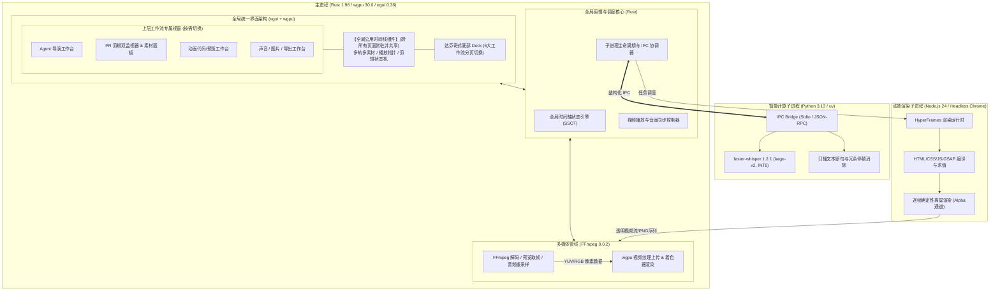

# 系统架构设计 (Architecture)

## 1. 架构目标与设计原则

- **高帧率即时渲染**：主进程采用 **Rust + wgpu 30.0 + egui 0.36**，利用 GPU 硬件加速，确保在多轨复杂时间轴拖拽与高码率音视频播放时保持 60+ FPS，彻底避免传统 Web 桌面端的掉帧与高内存占用。
- **异构解耦多进程模型**：
  - 渲染与剪辑核心（Rust）为宿主主进程；
  - 深度学习推理（Python `faster-whisper`）为独立子进程；
  - 动效渲染（`HyperFrames`）为独立任务进程。
- **专业非编时间轴驱动**：在 Rust 内部实现完全对齐 Premiere Pro (PR) 的时间轴数据模型与状态机。

---

## 2. 整体多进程与模块拓扑

---

## 3. 技术栈选型与职责分工

| 层次/模块 | 技术选型 | 版本/规范 | 决策与核心职责 |
| :--- | :--- | :--- | :--- |
| **桌面主进程宿主** | Rust | 1.98 (MSVC) | 内存安全、高性能原生并发，负责应用生命周期与时间轴状态调度 |
| **GUI 即时模式框架** | egui | 0.36 | 轻量、无开销、纯 Rust 编写的 Immediate Mode GUI，易于绘制专业音视频波形与时间轴 |
| **图形与渲染后端** | wgpu | 30.0 | 跨平台 GPU 硬件加速（DirectX 12 / Vulkan），用于 UI 渲染与视频解码帧纹理呈现 |
| **多媒体底层引擎** | FFmpeg | 9.0.2 | 原生绑定或动态调用，负责快速取帧、实时缩略图生成、无损切片与导出渲染 |
| **智能语音转写 (ASR)** | Python + faster-whisper | Python 3.13 (`uv`), faster-whisper 1.2.1, 模型: `large-v2` | 默认 GPU (CUDA) + INT8，无显卡自动回退 CPU（批大小设定为 8） |
| **可编程动效引擎** | HyperFrames | Node.js 24 LTS / Headless | 基于 Web 技术栈逐帧确定性渲染角标、花字、数据动画等包装图层 |

---

## 4. 剪辑界面对齐 PR 的核心实现

为了实现“剪辑界面完全对齐 Premiere Pro”，Rust 主进程需要实现以下面板与数据结构：

### 4.1 四大核心面板布局
1. **项目素材面板 (Project Panel)**：素材元数据展示、树状目录分组、拖拽进入时间轴。
2. **源监视器 (Source Monitor)** 与 **节目监视器 (Program Monitor)**：
   - 源监视器：单素材入点 (In) / 出点 (Out) 标记与试看。
   - 节目监视器：多轨合成预览，渲染当前播放指针位置的合成帧，支持缩放与安全框。
3. **效果控件 (Effect Controls)**：位置、缩放、旋转、不透明度、音量关键帧微调。
4. **多轨时间轴 (Multi-track Timeline)**：
   - 轨道划分：视频轨道（V1, V2, V3...）、音频轨道（A1, A2, A3...）。
   - 核心交互：时间轴标尺（Timecode）、播放指针（Playhead）、磁性吸附（Snapping）、波纹删除（Ripple Delete）、刀片工具（Razor Tool）。

### 4.2 数据模型定义（Rust 端）
- `Project`：包含所有素材 `Asset` 与序列 `Sequence`。
- `Sequence`：时间轴序列，包含帧率（Timebase）、分辨率及音视频轨列表 `Vec<Track>`。
- `Track`：有序片段容器，分为 `VideoTrack` 与 `AudioTrack`。
- `Clip`：剪辑片段，记录媒体源引用 `SourceRef`、源起止时间 `In/Out` 及时间轴放置时间 `TimelineIn/Out`。

### 4.3 全局公用时间线常驻架构 (Global Shared Engine)
- **状态常驻与单例引用**：`TimelineEngine` 实例不归属于某一个 Page，而是置于主进程根状态 `AppState`（如 `Arc<Mutex<TimelineState>>` 或全局即时状态）。所有工作流页面（Agent、剪辑、动画、声音、图片、导出）在渲染帧均直接绑定并操作同一实例。
- **时间与音画同步解耦**：底层由全局 `PlaybackManager` 维护主时钟（Master Clock），切换工作流页面仅改变上层辅助视图的挂载与交互侧重点，多轨时间轴视图和音视频硬解播放头连续播放不卡顿、不重构。
- **重绘调度与零开销待机门控 (`RepaintScheduler`)**：
  为彻底杜绝即时模式 GUI 无休止空转重绘导致的硬件发热，主事件循环集成三态调度器：
  1. **`Dormant` (绝对休眠态)**：暂停且无交互超过 150ms，禁止调用任何 `request_repaint()`，线程挂起于 Windows OS 消息队列，CPU 占用降为 **0.0%**；
  2. **`Playing` (音画播放态)**：仅以显示器垂直同步或 60 FPS 节拍器调用 `request_repaint_after(16.6ms)`，且仅重绘播放头与监视器贴图；
  3. **`Interacting` (即时交互态)**：拖拽播放头或缩放时，以满刷新率即时响应；
  4. **跨线程点火唤醒**：后台 Python ASR 片段到达或 FFmpeg 解码就绪时，通过持有的 `egui::Context` 发送单次 `request_repaint()` 穿透唤醒主消息泵。

---

## 5. 导演级 Agent 工作流与协同机制

1. **意图与规划阶段 (Agent 界面)**：
   - 用户上传长素材，Agent 自动调用 Python 子进程进行全局 ASR 与口播静音/错重分析。
   - Agent 输出《剪辑方案规划案》：包含主题分段、节奏高潮点、精简后的口播台词清单、建议的 BGM 情绪与动效位置。
2. **执行与下发阶段**：
   - 用户确认或修改方案后，Agent 将结构化剪辑脚本转换为 Rust 的 `Sequence` 指令集。
   - Rust 核心执行自动粗剪，将素材片段瞬间铺排到多轨时间轴上。
3. **动效生成与合成阶段 (动画界面)**：
   - Agent 根据文案生成 HyperFrames 动效代码（HTML/CSS）。
   - 调度 HyperFrames 离屏渲染出带透明通道的切片，挂载到时间轴高层轨道（如 V2/V3）。
4. **人工微调与导出阶段 (剪辑/导出界面)**：
   - 用户在对齐 PR 的专业时间轴中进行毫秒级微调。
   - 在“导出”页面调用 FFmpeg 9.0.2 硬件加速完成母带输出。
