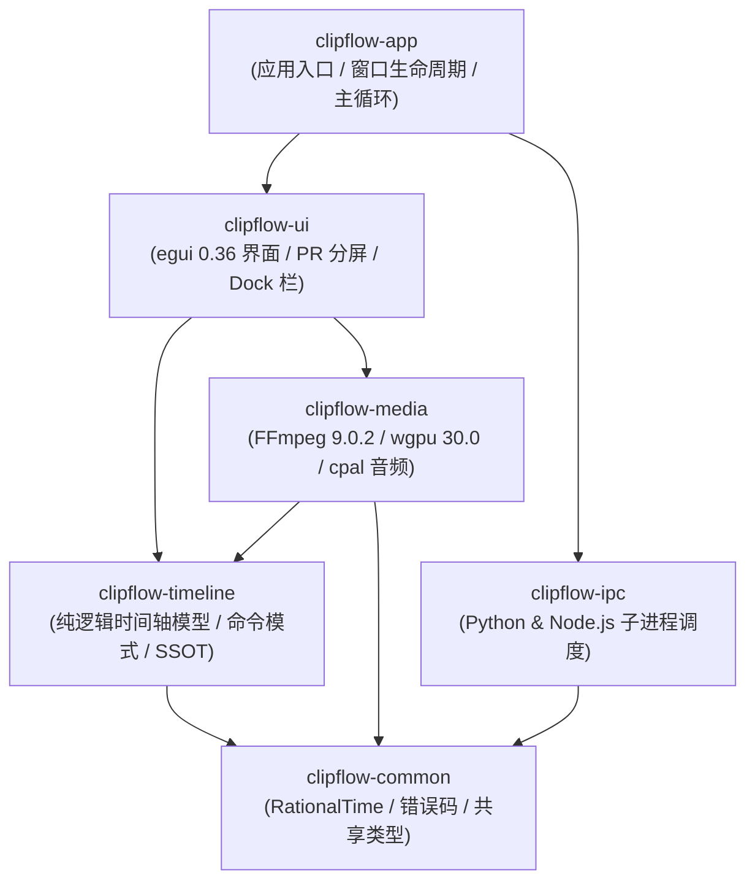
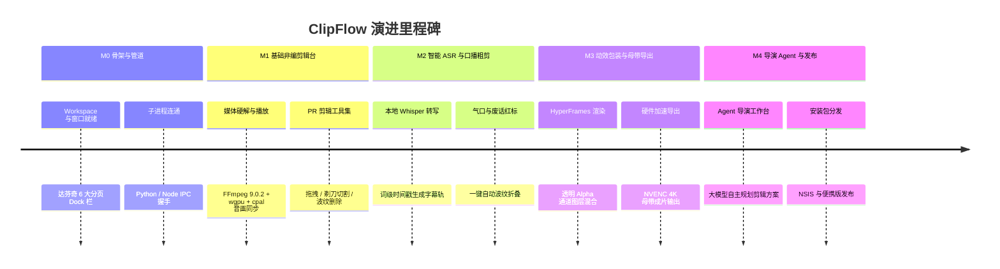

# 代码仓库架构与开发路线图 (Codebase Structure & Development Roadmap)

> **版本**：v1.0.0  
> **更新时间**：2026-09-23  
> **适用技术栈**：Rust 1.98 (Cargo Workspace), Python 3.13 (`uv`), Node.js 24 LTS, FFmpeg 9.0.2  
> **核心地位**：指导 ClipFlow 源码目录划分、各 crate 职责边界、单向依赖图谱与 M0~M4 渐进式开发里程碑验收标准。

---

## 1. 仓库工程目录全景 (Polyglot Monorepo)

ClipFlow 采用复合多运行时架构，根目录通过严格的隔离规约组织跨语言模块：

```
ClipFlow/
├── .cargo/
│   └── config.toml                 # MSVC 编译优化与链接器参数
├── .python-version                  # 严格钉住 Python 3.13
├── Cargo.toml                       # Rust 顶层 Workspace 配置
├── pyproject.toml                   # Python 3.13 (uv) 依赖声明
├── package.json                     # Node.js 24 LTS 动效环境配置
├── AGENTS.md                        # 智能体代码工程守则
├── docs/                            # 核心规格与架构文档 (SSOT)
├── resources/                       # 外部静态资源
│   ├── hyperframes_templates/       # 预置动效模板库 (HTML/CSS/JS)
│   └── icons/                       # 界面图标与品牌资产
│
├── crates/                          # Rust 核心工程矩阵 (Cargo Workspace)
│   ├── clipflow-common/             # 基础元语: 时间码、错误类型、日志定义
│   ├── clipflow-timeline/           # 纯逻辑时间轴引擎: Project/Sequence/Clip/Undo栈
│   ├── clipflow-media/              # 多媒体管线: FFmpeg 9.0.2/wgpu纹理/cpal音频/波形
│   ├── clipflow-ipc/                # 跨进程协调: 管理 Python 与 Node 子进程生命周期
│   ├── clipflow-ui/                 # 全局界面: 达芬奇Dock、PR剪辑台、公用时间线视图
│   └── clipflow-app/                # 桌面主入口: 窗口宿主、主时钟事件循环
│
├── python/
│   └── clipflow_worker/             # Python 智能计算子进程
│       ├── asr/                     # faster-whisper 1.2.1 推理引擎
│       ├── nlp/                     # 口播文本断句、停顿与语气词清洗
│       └── ipc/                     # Stdio / Named Pipe JSON-RPC 桥接
│
└── node/
    └── hyperframes_renderer/        # HyperFrames 离屏动效渲染子进程
        ├── engine/                  # Headless Chromium 虚拟时钟与确定性步进
        └── templates/               # 模板编译器与参数绑定层
```

---

## 2. Rust Workspace 各 Crate 职责边界与依赖拓扑

为了保证系统可测性与高编译并行度，各个 crate 之间遵循**单向无环依赖 (DAG)** 规范：



### 2.1 Crate 详细职责

| Crate 标识 | 依赖外部核心库 | 核心职责与边界 |
| :--- | :--- | :--- |
| **`clipflow-common`** | `serde`, `uuid`, `thiserror` | 亚毫秒 `RationalTime`、`TimeRange`、SMPTE 时间码、系统统一 `Result<T, ClipFlowError>`。绝不依赖渲染和媒体库。 |
| **`clipflow-timeline`**| `clipflow-common`, `zstd` | `Project`, `Sequence`, `Track`, `Clip`, `Keyframe` 数据模型；`TimelineCommand` 命令栈（Undo/Redo）；`.clipflow` 序列化与反序列化。纯数据与状态机，无 GUI 依赖。 |
| **`clipflow-media`** | `ffmpeg-sys-next` (9.0.2), `wgpu` 30.0, `cpal` | 视频硬解（D3D11VA）、锁页环形帧池（`PinnedFramePool`）、NV12 双平面极速上传、WGSL 全色域色彩矩阵着色器、监视器自适应下采样（`ProxyGovernor`）、WASAPI 硬件 DAC 时钟锚定、`MonotonicClampedClock` 无锁单调箝位外推主时钟、双阈值迟滞渲染调度（`HysteresisSyncComparator`）、波形峰值文件 (`.peak`) 生成与多媒体三级容灾看门狗。 |
| **`clipflow-ipc`** | `tokio`, `serde_json`, `interprocess` | 管理 Python (`uv`) 和 Node.js 子进程启动、保活、心跳检测与 Windows 命名管道/标准流异步 JSON-RPC 调度。 |
| **`clipflow-ui`** | `egui` 0.36, `egui_wgpu`, `winit` | 达芬奇底部 6 大分页 Dock 栏切换、PR 剪辑四区分屏、全局公用时间线视图渲染、关键帧曲线编辑器、工控绿视觉映射。 |
| **`clipflow-app`** | `eframe` 0.36, `tracing` | 应用程序 `main()` 入口、跨模块依赖注入、全局状态根 (`AppState`) 托管、系统托盘与异常捕获。 |

---

## 3. 分阶段开发路线图 (Milestones)

全流程划分为 5 个递进式里程碑，各阶段具有明确、可自动或人工核对的验收标准：



---

### 3.1 Milestone 0 (M0)：工程骨架与基础通信链路

- **目标**：建立完整的开发环境与多语言多进程通信骨架。
- **核对项与验收标准**：
  1. 执行 `cargo check --workspace` 编译零警告；
  2. 启动 `cargo run` 正常渲染出应用窗口（带有 12px Win 11 圆角和纯黑底色）；
  3. 底部达芬奇 Dock 栏 6 大分页按钮可自由点击切换，底部时间线骨架常驻保持；
  4. Rust 主进程拉起 Python `uv` 子进程，完成 `ping` / `pong` 管道测试。

---

### 3.2 Milestone 1 (M1)：媒体硬解播放与 PR 经典剪辑台

- **目标**：实现对齐 Premiere Pro 的高帧率多轨音视频剪辑体验。
- **核对项与验收标准**：
  1. **素材导入**：从本地磁盘拖拽 `.mp4` 文件到项目素材池，异步生成封面缩略图并解析元数据；
  2. **双监视器呈现**：
     - 源监视器支持双击素材试看，标记入出点并拖入时间轴；
     - 节目监视器实时呈现时间轴多轨叠加画面；
  3. **硬解与音画同步**：D3D11VA 硬解经由 `PinnedFramePool` 锁页帧池上传，`ProxyGovernor` 快速拖拽自适应代理生效；`cpal` (WASAPI) 驱动发声，`MonotonicClampedClock` 无锁单调外推时钟生效（时间倒流严格 0 次，单帧步进微抖 $\le 0.05\text{ms}$），双阈值迟滞比较器锁定，音画全流程漂移死锁在 $\le 2.0\text{ms}$；拖拽响应 $\le 25\text{ms}$；
  4. **时间轴核心工具**：支持选择工具 (V)、剃刀分割工具 (C)、波纹删除 (Shift+Del)，支持快捷键 `Ctrl + Z` / `Ctrl + Y` 撤销重做。

---

### 3.3 Milestone 2 (M2)：智能 ASR 转写与口播无感粗剪

- **目标**：打通口播视频核心提效痛点——基于文本的一键粗剪与字幕整理。
- **核对项与验收标准**：
  1. **本地高精度转写**：Python 子进程加载 `faster-whisper 1.2.1` (`large-v2`, INT8)，在支持 CUDA 的设备上实现 10x 实时倍速转写，无显卡自动降级 CPU；
  2. **字幕轨联动**：转写完成在时间轴 C1 轨自动铺设字幕片段，文字与音频波形毫秒级对齐；
  3. **气口与语气词清洗**：调用 `speech.analyze_cuts` 接口，自动在时间轴上用红底标注无声停顿（$\ge 400\text{ms}$）与语气助词，点击“一键粗剪”瞬间波纹对齐。

---

### 3.4 Milestone 3 (M3)：HyperFrames 动效包装与硬件加速母带导出

- **目标**：实现 Web 技术栈动态图层叠加与成片母带高质量输出。
- **核对项与验收标准**：
  1. **动效逐帧渲染**：Node.js 24 无头浏览器虚拟时钟步进正常，生成带 Alpha 通道的 RGBA 帧，在【动画】页面支持实时 60fps 预览；
  2. **多层 GPU 合成**：时间轴 FX 轨道挂载科技角标，节目监视器中文字与视频背景融合完美；
  3. **母带硬件导出**：在【导出】页面配置 1080p/4K 预设，FFmpeg 调用 NVENC (H.264/HEVC) 进行 GPU 编码，导出成片音画同步、色彩无偏差。

---

### 3.5 Milestone 4 (M4)：导演级 Agent 全闭环与发布交付

- **目标**：Agent 承担整篇视频策划与导演职能，形成生产级分发包。
- **核对项与验收标准**：
  1. **导演工作台**：在 `[ Agent ]` 分页中，AI 自动提炼长素材大纲、生成包含分段节奏与 BGM 建议的《导演剪辑方案》；
  2. **Tool Calling 自动化**：用户在对话框确认方案后，Agent 自动调用剪辑工具集，秒级生成整条多轨时间线；
  3. **发布与打包**：执行打包脚本，生成完整的 NSIS 单文件安装包与 Portable 便携版，内嵌所需 Python 与 Node 运行时，在干净的 Windows 10/11 测试机上开箱即用。
