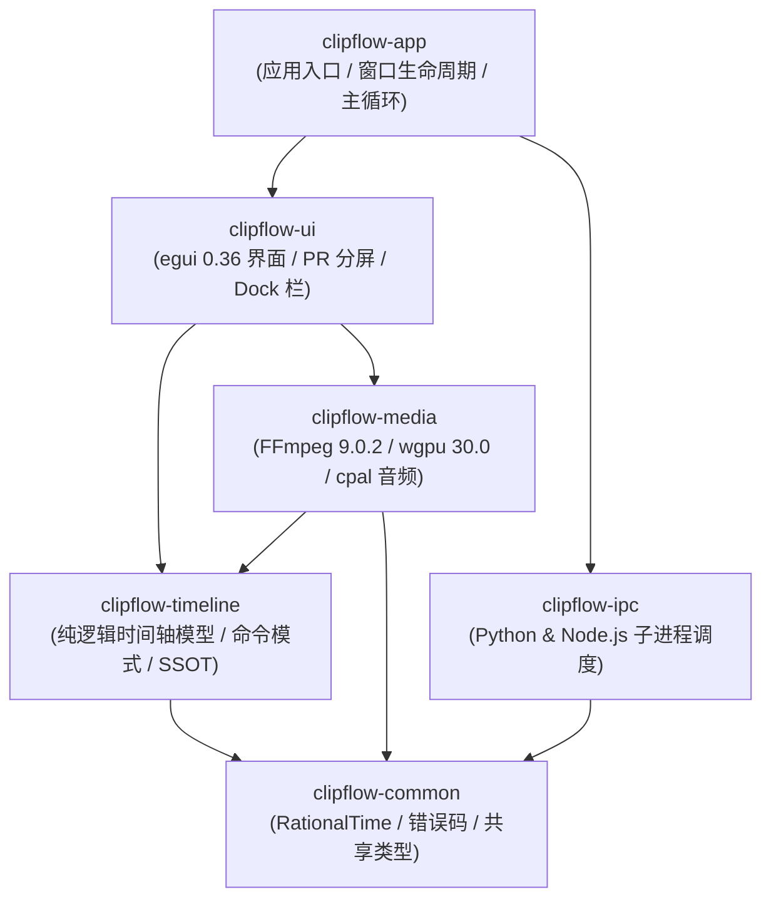
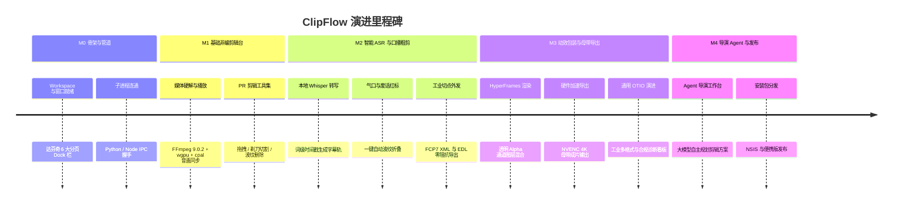

# 代码仓库架构与开发路线图 (Codebase Structure & Development Roadmap)

> **版本**：v1.0.0  
> **更新时间**：2026-09-23  
> **适用技术栈**：Rust 1.98 (Cargo Workspace), Python 3.13 (`uv`), Node.js 24 LTS, FFmpeg 9.0.2  
> **核心地位**：指导 ClipFlow 源码目录划分、各 crate 职责边界、单向依赖图谱与 M0~M4 渐进式开发里程碑验收标准。

---

## 1. 仓库工程目录全景 (Polyglot Monorepo)

ClipFlow 采用复合多运行时架构，根目录通过严格的隔离规约组织跨语言模块：

```
ClipFlow/
├── .cargo/
│   └── config.toml                 # MSVC 编译优化与链接器参数
├── .python-version                  # 严格钉住 Python 3.13
├── Cargo.toml                       # Rust 顶层 Workspace 配置
├── pyproject.toml                   # Python 3.13 (uv) 依赖声明
├── package.json                     # Node.js 24 LTS 动效环境配置
├── AGENTS.md                        # 智能体代码工程守则
├── docs/                            # 核心规格与架构文档 (SSOT)
├── resources/                       # 外部静态资源
│   ├── hyperframes_templates/       # 预置动效模板库 (HTML/CSS/JS)
│   └── icons/                       # 界面图标与品牌资产
│
├── crates/                          # Rust 核心工程矩阵 (Cargo Workspace)
│   ├── clipflow-common/             # 基础元语: 时间码、错误类型、日志定义
│   ├── clipflow-timeline/           # 纯逻辑时间轴引擎: Project/Sequence/Clip/Undo栈
│   ├── clipflow-media/              # 多媒体管线: FFmpeg 9.0.2/wgpu纹理/cpal音频/波形
│   ├── clipflow-ipc/                # 跨进程协调: 管理 Python 与 Node 子进程生命周期
│   ├── clipflow-ui/                 # 全局界面: 达芬奇Dock、PR剪辑台、公用时间线视图
│   └── clipflow-app/                # 桌面主入口: 窗口宿主、主时钟事件循环
│
├── python/
│   └── clipflow_worker/             # Python 智能计算子进程
│       ├── asr/                     # faster-whisper 1.2.1 推理引擎
│       ├── nlp/                     # 口播文本断句、停顿与语气词清洗
│       └── ipc/                     # Stdio / Named Pipe JSON-RPC 桥接
│
└── node/
    └── hyperframes_renderer/        # HyperFrames 离屏动效渲染子进程
        ├── engine/                  # Headless Chromium 虚拟时钟与确定性步进
        └── templates/               # 模板编译器与参数绑定层
```

---

## 2. Rust Workspace 各 Crate 职责边界与依赖拓扑

为了保证系统可测性与高编译并行度，各个 crate 之间遵循**单向无环依赖 (DAG)** 规范：



### 2.1 Crate 详细职责

| Crate 标识 | 依赖外部核心库 | 核心职责与边界 |
| :--- | :--- | :--- |
| **`clipflow-common`** | `serde`, `uuid`, `thiserror` | 亚毫秒 `RationalTime`、`TimeRange`、SMPTE 时间码、系统统一 `Result<T, ClipFlowError>`。绝不依赖渲染和媒体库。 |
| **`clipflow-timeline`**| `clipflow-common`, `zstd`, `quick-xml` | `Project`, `Sequence`, `Track`, `Clip`, `Keyframe` 数据模型；`TimelineCommand` 命令栈（Undo/Redo）；`.clipflow` 序列化与反序列化；`TimelineExporter` 外部工程导出标准 Trait、`CutList` 一维切点抽取与有理数整除帧对齐引擎、Apple FCP7 XML (`xmeml v5`) 与规范化 CMX 3600 EDL 流式序列化器、`ConformInspector` 静态合规与降级诊断扫描器，以及面向 M3+ 的 OpenTimelineIO (OTIO) 通用 IR 中枢。纯数据与状态机，无 GUI 依赖。 |
| **`clipflow-media`** | `ffmpeg-sys-next` (9.0.2), `wgpu` 30.0, `cpal`, `windows` | 视频硬解（D3D11VA）、锁页环形帧池（`PinnedFramePool`）、NV12 双平面极速上传、WGSL 全色域色彩矩阵着色器、监视器自适应下采样（`ProxyGovernor`）、WASAPI 硬件 DAC 时钟锚定、`MonotonicClampedClock` 无锁单调箝位外推主时钟、双阈值迟滞渲染调度（`HysteresisSyncComparator`）、波形峰值文件 (`.peak`) 生成、Windows 命名共享内存 Raw RGBA 消费器（`SharedMemoryConsumer`）、动效帧完成账本（`FrameLedger`）与多媒体三级容灾看门狗。 |
| **`clipflow-ipc`** | `tokio`, `serde_json`, `interprocess`, `windows-sys` | 管理 Python (`uv`) 和 Node.js 子进程生命周期；Windows 内核级 `JobGuard` 作业对象强绑定（`KILL_ON_JOB_CLOSE` 零孤儿逃逸）；Windows 异步双工命名管道驱动（`\\.\pipe\clipflow-*` JSON-RPC 2.0）；子进程 `stderr` 独立异步非阻塞排水管线（`AsyncStderrDrainer` 消除 4KB 缓冲死锁）；双轨看门狗（0ms 物理 BrokenPipe 即时捕获 + 分片任务进度租约 `ProgressLeaseTracker`）；三级容灾自愈状态机（`FallbackGovernor`: L1 重试 $\to$ L2 CUDA OOM/驱动缺失自愈降级 CPU $\to$ L3 熔断隔离）；跨语言 ASR 服务契约抽象（`AsrWorkerProvider`）与纯内存测试桩（`MockAsrWorker`）。 |
| **`clipflow-ui`** | `egui` 0.36, `egui_wgpu`, `winit` | 达芬奇底部 6 大分页 Dock 栏切换、PR 剪辑四区分屏、全局公用时间线视图渲染、关键帧曲线编辑器、导出合规与降级诊断看板（`DiagnosticReport`）、工控绿视觉映射。 |
| **`clipflow-app`** | `eframe` 0.36, `tracing` | 应用程序 `main()` 入口、跨模块依赖注入、全局状态根 (`AppState`) 托管、系统托盘与异常捕获。 |

---

## 3. 分阶段开发路线图 (Milestones)

全流程划分为 5 个递进式里程碑，各阶段具有明确、可自动或人工核对的验收标准：



---

### 3.1 Milestone 0 (M0)：工程骨架与基础通信链路

- **目标**：建立完整的开发环境与多语言多进程通信骨架。
- **核对项与验收标准**：
  1. 执行 `cargo check --workspace` 编译零警告；
  2. 启动 `cargo run` 正常渲染出应用窗口（带有 12px Win 11 圆角和纯黑底色）；
  3. 底部达芬奇 Dock 栏 6 大分页按钮可自由点击切换，底部时间线骨架常驻保持；
  4. **内核级进程绑定与信道握手**：
     - Windows `JobGuard` 作业对象生效，主进程通过 `CREATE_SUSPENDED` 原子挂入 Python `uv` 子进程；
     - 主进程意外退出或任务管理器强杀时，系统后台无任何残留孤儿进程（孤儿逃逸率严格为 **$0.0\%$**）；
     - 基于异步双工命名管道（`\\.\pipe\clipflow-py-{pid}`）完成 JSON-RPC 2.0 `ping` / `pong` 握手，RTT 延迟 $\le 0.5\text{ms}$。

---

### 3.2 Milestone 1 (M1)：媒体硬解播放与 PR 经典剪辑台

- **目标**：实现对齐 Premiere Pro 的高帧率多轨音视频剪辑体验。
- **核对项与验收标准**：
  1. **素材导入**：从本地磁盘拖拽 `.mp4` 文件到项目素材池，异步生成封面缩略图并解析元数据；
  2. **双监视器呈现**：
     - 源监视器支持双击素材试看，标记入出点并拖入时间轴；
     - 节目监视器实时呈现时间轴多轨叠加画面；
  3. **硬解与音画同步**：D3D11VA 硬解经由 `PinnedFramePool` 锁页帧池上传，`ProxyGovernor` 快速拖拽自适应代理生效；`cpal` (WASAPI) 驱动发声，`MonotonicClampedClock` 无锁单调外推时钟生效（时间倒流严格 0 次，单帧步进微抖 $\le 0.05\text{ms}$），双阈值迟滞比较器锁定，音画全流程漂移死锁在 $\le 2.0\text{ms}$；拖拽响应 $\le 25\text{ms}$；
  4. **时间轴核心工具**：支持选择工具 (V)、剃刀分割工具 (C)、波纹删除 (Shift+Del)，支持快捷键 `Ctrl + Z` / `Ctrl + Y` 撤销重做；
  5. **IPC 防死锁与 0ms 崩溃捕获**：
     - `AsyncStderrDrainer` 持续排空子进程日志，在高密度日志（10,000 行/秒）下死锁率严格为 **$0.0\%$**，日志无缝沉淀至 `tracing`；
     - 模拟子进程段错误退出，主进程通过命名管道 `BrokenPipe` 在 **$\le 1.0\text{ms}$** 内完成即时异常感知，绝不陷入超时假死。

---

### 3.3 Milestone 2 (M2)：智能 ASR 转写与口播无感粗剪

- **目标**：打通口播视频核心提效痛点——基于文本的一键粗剪、字幕整理与工业级工程切点外发。
- **核对项与验收标准**：
  1. **本地高精度转写与分片进度租约**：
     - Python 子进程加载 `faster-whisper 1.2.1` (`large-v2`, INT8)，在支持 CUDA 的设备上实现 10x 实时倍速转写；
     - 启用 `ProgressLeaseTracker` 分片任务进度租约机制，60 分钟长音频转写期间长任务误杀率严格为 **$0.0\%$**，死锁挂起判定窗口锁定在 $\le 4.5\text{s}$ 内；
  2. **字幕轨联动**：转写完成在时间轴 C1 轨自动铺设字幕片段，文字与音频波形毫秒级对齐；
  3. **气口与语气词清洗**：调用 `speech.analyze_cuts` 接口，自动在时间轴上用红底标注无声停顿（$\ge 400\text{ms}$）与语气助词，点击“一键粗剪”瞬间波纹对齐；
  4. **三级容灾与 CUDA 自愈降级 CPU 验收**：
     - 模拟显存 OOM 或无兼容独立显卡，`FallbackGovernor` 自动捕获并在 **$\le 3.5\text{s}$** 内平滑降级为 CPU 模式拉起，UI 弹出温和通知；
     - 模拟环境严重损坏（Exit Code 9009），熔断器生效，停止连环重启并弹出诊断看板，时间轴工程 100% 安全保留；
  5. **工业级切点工程外发与 0 帧漂移验收**：
     - 实现 `Fcp7XmlSerializer` 导出符合 Apple FCP7 XML (`xmeml v5`) 规范的 `.xml` 文件，在 Premiere Pro 与 DaVinci Resolve 中一键导入并实现素材 $100\%$ 自动套底，1000 个切片端到端帧精度绝对无缝对齐（0 帧累积漂移）；
     - 实现 `EdlGenerator` 导出规范化 CMX 3600 `.edl` 文件，Reel ID 规约为 8 字符，通过注入 `* FROM CLIP NAME` 与 `* SOURCE FILE` 扩展注释安全传递 UTF-8 中文路径；
     - 内存流式导出耗时 $\le 15\text{ms}$（60 分钟时间线/1000 切点），导出前自动触发 `ConformInspector` 进行静态合规扫描。

---

### 3.4 Milestone 3 (M3)：HyperFrames 动效包装与硬件加速母带导出

- **目标**：实现 Web 技术栈动态图层叠加、成片母带高质量输出与通用工业 IR 演进。
- **核对项与验收标准**：
  1. **动效离屏逐帧渲染与共享内存直传**：
     - Node.js 24 无头 Chromium 启动参数显存硬限（512MB）与 120 帧轻量清洗机制生效，连续渲染 3000 帧内存稳定锁定在 $\le 300\text{MB}$；
     - 基于 Win32 命名共享内存映射 Raw RGBA 像素，4K 单帧传输延迟严格 $\le 1.5\text{ms}$，P99 延迟 $\le 2.5\text{ms}$，零堆分配、零 GC 抖动；
     - 双 Worker 异步预热乒乓池（`PingPongPoolManager`）无缝交接，交接帧顿挫 $\le 0.5\text{ms}$，消除冷启动流水线断崖；纯函数求值契约保障零状态闪烁（Pixel Diff 严格为 0）；
  2. **多层 GPU 合成与看门狗容灾**：
     - 时间轴 FX 轨道挂载科技角标，节目监视器中文字与视频背景融合完美；
     - 模拟 Chromium 进程意外退出（`SIGKILL`），Rust 宿主看门狗在 $100\text{ms}$ 内捕获退出码、拉起备用 Worker 并从 `FrameLedger` 断点帧接续生产，母带导出任务无感完成且成片无任何坏帧；
  3. **母带硬件导出**：
     - 在【导出】页面配置 1080p/4K 预设，FFmpeg 调用 NVENC (H.264/HEVC) 进行 GPU 编码，导出成片音画严格同步、色彩无偏差、导出帧连续无丢帧；
  4. **OpenTimelineIO (OTIO) 通用 IR 演进与合规诊断看板**：
     - 集成 `TimelineExporter` 下的 `OtioTimeline` 通用中间层，实现多轨时间轴向 Apple FCPX 磁性故事板（`<spine>` 树）的降维投影；
     - 在 UI 导出面板呈现可视化合规诊断看板（`DiagnosticReport`），若检测到 HyperFrames Web 动效图层（FX 轨），自动提示“建议渲染为 Apple ProRes 4444 独立透明图层后送入 PR 叠加”。

---


### 3.5 Milestone 4 (M4)：导演级 Agent 全闭环与发布交付

- **目标**：Agent 承担整篇视频策划与导演职能，形成生产级分发包。
- **核对项与验收标准**：
  1. **导演工作台**：在 `[ Agent ]` 分页中，AI 自动提炼长素材大纲、生成包含分段节奏与 BGM 建议的《导演剪辑方案》；
  2. **Tool Calling 自动化**：用户在对话框确认方案后，Agent 自动调用剪辑工具集，秒级生成整条多轨时间线；
  3. **发布与打包**：执行打包脚本，生成完整的 NSIS 单文件安装包与 Portable 便携版，内嵌所需 Python 与 Node 运行时，在干净的 Windows 10/11 测试机上开箱即用。
