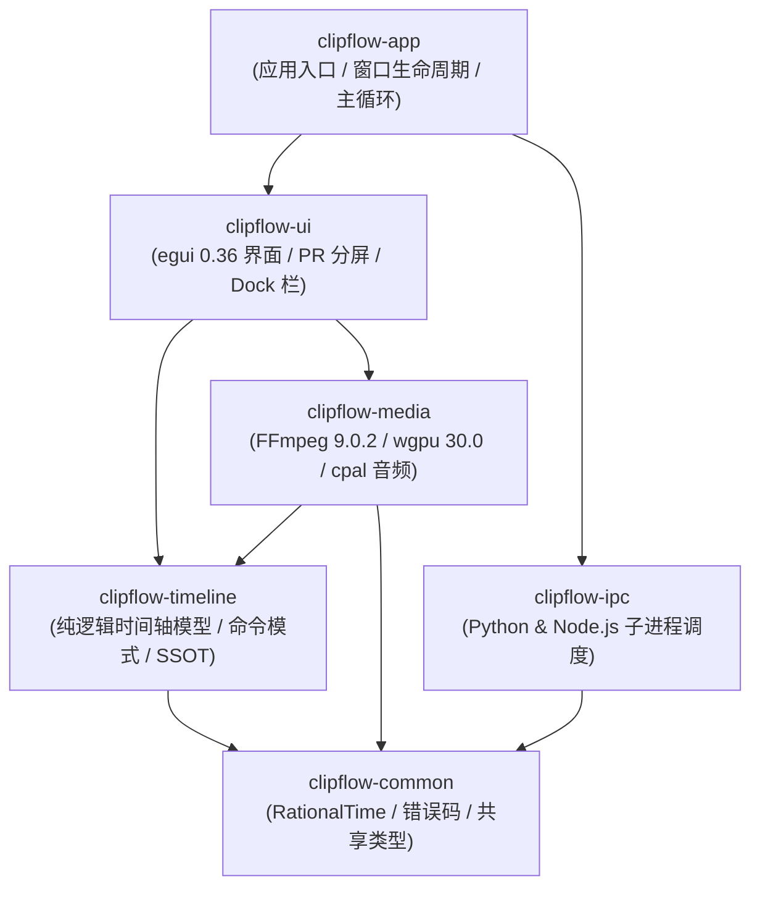

# 代码仓库架构与模块职责规范 (Codebase Structure & Crate Topology)

> **版本**：v1.0.0  
> **更新时间**：2026-09-26  
> **适用技术栈**：Rust 1.98 (Cargo Workspace), Python 3.13 (`uv`), Node.js 24 LTS, FFmpeg 9.0.2  
> **核心地位**：指导 ClipFlow 源码目录划分、各 crate 职责边界与单向无环依赖图谱（DAG）。

---

## 1. 仓库工程目录全景 (Polyglot Monorepo)

ClipFlow 采用复合多运行时架构，根目录通过严格的隔离规约组织跨语言模块：

```
ClipFlow/
├── .cargo/
│   └── config.toml                 # MSVC 编译优化与链接器参数
├── .python-version                  # 严格钉住 Python 3.13
├── Cargo.toml                       # Rust 顶层 Workspace 配置
├── pyproject.toml                   # Python 3.13 (uv) 依赖声明
├── package.json                     # Node.js 24 LTS 动效环境配置
├── AGENTS.md                        # 智能体代码工程守则
├── docs/                            # 核心规格与架构文档 (SSOT)
├── resources/                       # 外部静态资源
│   ├── hyperframes_templates/       # 预置动效模板库 (HTML/CSS/JS)
│   └── icons/                       # 界面图标与品牌资产
│
├── crates/                          # Rust 核心工程矩阵 (Cargo Workspace)
│   ├── clipflow-common/             # 基础元语: 时间码、错误类型、日志定义
│   ├── clipflow-timeline/           # 纯逻辑时间轴引擎: Project/Sequence/Clip/Undo栈
│   ├── clipflow-media/              # 多媒体管线: FFmpeg 9.0.2/wgpu纹理/cpal音频/波形
│   ├── clipflow-ipc/                # 跨进程协调: 管理 Python 与 Node 子进程生命周期
│   ├── clipflow-ui/                 # 全局界面: 达芬奇Dock、PR剪辑台、公用时间线视图
│   └── clipflow-app/                # 桌面主入口: 窗口宿主、主时钟事件循环
│
├── python/
│   └── clipflow_worker/             # Python 智能计算子进程
│       ├── asr/                     # faster-whisper 1.2.1 推理引擎
│       ├── nlp/                     # 口播文本断句、停顿与语气词清洗
│       └── ipc/                     # Stdio / Named Pipe JSON-RPC 桥接
│
└── node/
    └── hyperframes_renderer/        # HyperFrames 离屏动效渲染子进程
        ├── engine/                  # Headless Chromium 虚拟时钟与确定性步进
        └── templates/               # 模板编译器与参数绑定层
```

---

## 2. Rust Workspace 各 Crate 职责边界与依赖拓扑

为了保证系统可测性与高编译并行度，各个 crate 之间遵循**单向无环依赖 (DAG)** 规范：



### 2.1 Crate 详细职责

| Crate 标识 | 依赖外部核心库 | 核心职责与边界 |
| :--- | :--- | :--- |
| **`clipflow-common`** | `serde`, `uuid`, `thiserror` | 亚毫秒 `RationalTime`、`TimeRange`、SMPTE 时间码、系统统一 `Result<T, ClipFlowError>`。绝不依赖渲染和媒体库。 |
| **`clipflow-timeline`**| `clipflow-common`, `zstd`, `quick-xml` | `Project`, `Sequence`, `Track`, `Clip`, `Keyframe` 数据模型；`TimelineCommand` 命令栈（Undo/Redo）；`.clipflow` 序列化与反序列化；`TimelineExporter` 外部工程导出标准 Trait、`CutList` 一维切点抽取与有理数整除帧对齐引擎、Apple FCP7 XML (`xmeml v5`) 与规范化 CMX 3600 EDL 流式序列化器、`ConformInspector` 静态合规与降级诊断扫描器，以及面向 M3+ 的 OpenTimelineIO (OTIO) 通用 IR 中枢。纯数据与状态机，无 GUI 依赖。 |
| **`clipflow-media`** | `ffmpeg-sys-next` (9.0.2), `wgpu` 30.0, `cpal`, `windows` | 视频硬解（D3D11VA）、锁页环形帧池（`PinnedFramePool`）、NV12 双平面极速上传、WGSL 全色域色彩矩阵着色器、监视器自适应下采样（`ProxyGovernor`）、WASAPI 硬件 DAC 时钟锚定、`MonotonicClampedClock` 无锁单调箝位外推主时钟、双阈值迟滞渲染调度（`HysteresisSyncComparator`）、波形峰值文件 (`.peak`) 生成、Windows 命名共享内存 Raw RGBA 消费器（`SharedMemoryConsumer`）、动效帧完成账本（`FrameLedger`）与多媒体三级容灾看门狗。 |
| **`clipflow-ipc`** | `tokio`, `serde_json`, `interprocess`, `windows-sys` | 管理 Python (`uv`) 和 Node.js 子进程生命周期；Windows 内核级 `JobGuard` 作业对象强绑定（`KILL_ON_JOB_CLOSE` 零孤儿逃逸）；Windows 异步双工命名管道驱动（`\\.\pipe\clipflow-*` JSON-RPC 2.0）；子进程 `stderr` 独立异步非阻塞排水管线（`AsyncStderrDrainer` 消除 4KB 缓冲死锁）；双轨看门狗（0ms 物理 BrokenPipe 即时捕获 + 分片任务进度租约 `ProgressLeaseTracker`）；三级容灾自愈状态机（`FallbackGovernor`: L1 重试 $\to$ L2 CUDA OOM/驱动缺失自愈降级 CPU $\to$ L3 熔断隔离）；跨语言 ASR 服务契约抽象（`AsrWorkerProvider`）与纯内存测试桩（`MockAsrWorker`）。 |
| **`clipflow-ui`** | `egui` 0.36, `egui_wgpu`, `winit` | 达芬奇底部 6 大分页 Dock 栏切换、PR 剪辑四区分屏、全局公用时间线视图渲染、关键帧曲线编辑器、导出合规与降级诊断看板（`DiagnosticReport`）、Neutral Modern 深色主题映射（深岩灰 `#0F1115`、表面 `#171A21`、钴蓝 `#2F6FEB`、12/8/4px 几何圆角梯队）。 |
| **`clipflow-app`** | `eframe` 0.36, `tracing` | 应用程序 `main()` 入口、跨模块依赖注入、全局状态根 (`AppState`) 托管、系统托盘与异常捕获。 |

---

## 3. 开发路线图与任务追踪 (Roadmap Reference)

ClipFlow 的全生命周期研发路线图、各里程碑原子任务拆解（48 项 WBS）、执行时序依赖与自动化验收命令 (DoD) 已独立收录于专属任务看板规范：

👉 **[工程研发路线图与原子任务看板 (docs/roadmap.md)](file:///d:/Work/Dev/ClipFlow/docs/roadmap.md)**

开发期间统一以 `docs/roadmap.md` 作为进度标记、时序推进与任务领取的单一执行事实来源。
