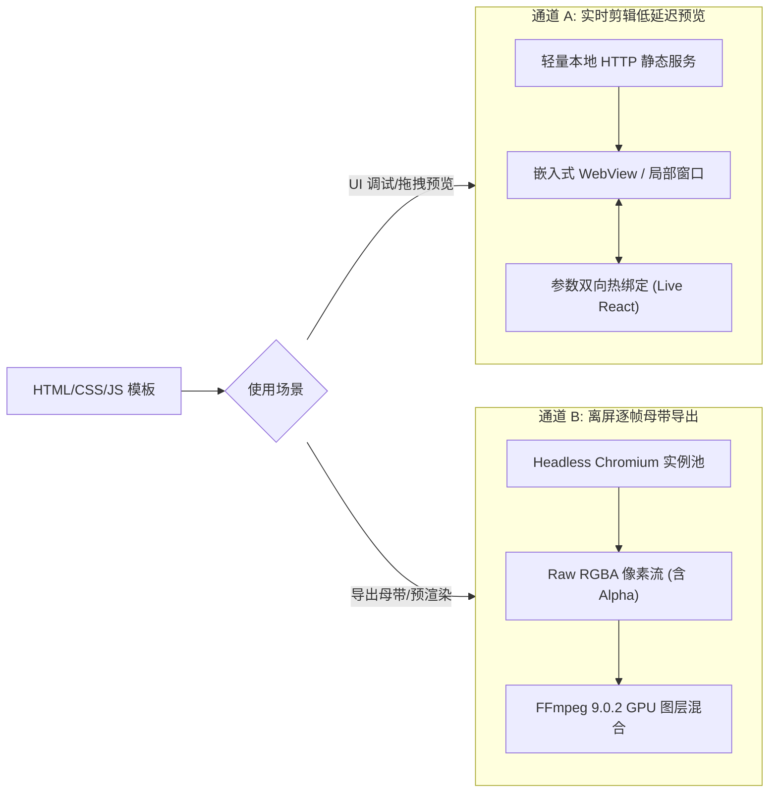

# HyperFrames 动效引擎集成规范 (HyperFrames Motion Engine Specification)

> **版本**：v1.0.0  
> **更新时间**：2026-09-23  
> **适用技术栈**：Node.js 24 LTS, Headless Chromium (CDP / Playwright Core), GSAP 3.12, Rust 1.98  
> **核心地位**：定义 ClipFlow“代码化动态包装”标准——基于 Web 技术栈（HTML/CSS/JS/GSAP）构建 Agent 友好、逐帧确定性渲染的透明通道动态图层，并无缝合成至时间轴。

---

## 1. 动效架构与运行拓扑

HyperFrames 继承 Agent-Native 设计哲学：让 AI 导演与人类用户均能通过标准 Web 代码与参数结构，快速生成角标、花字、数据动态图表等包装特效，摆脱传统视频软件对封闭动效插件（如 AE 模板）的繁琐依赖。

```mermaid
flowchart TD
    subgraph Rust_Host ["Rust 1.98 宿主主进程"]
        TimelineCore["时间轴动效轨道 (FX Tracks)"]
        SubprocessMgr["HyperFrames 进程生命周期管理器"]
        Compositor["wgpu 30.0 离屏图层混合器"]
    end

    subgraph Node_Worker ["HyperFrames 子进程 (Node.js 24 LTS)"]
        CLI_Daemon["Node IPC 守护服务 (Stdio / Named Pipe)"]
        VirtualClock["虚拟时钟与确定性步进调度器 (Virtual Clock)"]
        ChromePool["Headless Chromium 渲染实例池 (CDP)"]
        
        CLI_Daemon --> VirtualClock --> ChromePool
    end

    subgraph Web_Template ["动效模板页面 (HTML/CSS/GSAP)"]
        DOM["HTML/SVG DOM 结构"]
        GSAP_Timeline["GSAP 动画时间轴 (.seek(t))"]
        CanvasBuffer["离屏 RGBA 像素缓冲 (Alpha 通道)"]
        DOM & GSAP_Timeline --> CanvasBuffer
    end

    TimelineCore -->|渲染请求: {template_id, frame_idx, params}| SubprocessMgr
    SubprocessMgr <==>|结构化 IPC| CLI_Daemon
    ChromePool --> Web_Template
    CanvasBuffer -->|无损 RGBA 像素流 / 共享内存| Compositor
```

---

## 2. 动效模板封装标准规范 (Package Spec)

每个 HyperFrames 动效组件为一个标准文件夹，存放于 `resources/hyperframes_templates/` 目录下：

```
lower_third_tech/
├── manifest.json       # 模板元数据、参数 Schema 与时长规格
├── index.html          # HTML 骨架与视口配置
├── style.css           # 动效样式 (支持 CSS 变量与主题色)
├── main.js             # GSAP 驱动脚本与帧求值入口
└── assets/             # 预置字体、SVG 图标或 Lottie JSON
```

### 2.1 模板元数据清单：`manifest.json`

```json
{
  "id": "lower_third_tech",
  "name": "极客科技风角标",
  "version": "1.0.0",
  "author": "ClipFlow Team",
  "category": "LowerThirds",
  "canvas": {
    "width": 1920,
    "height": 1080,
    "default_fps": 60,
    "duration_frames": 180
  },
  "parameters": {
    "primary_text": {
      "type": "string",
      "label": "主讲人 / 主标题",
      "default": "ClipFlow 核心架构师",
      "max_length": 30
    },
    "secondary_text": {
      "type": "string",
      "label": "职务 / 副标题",
      "default": "Rust & AI 系统工程师",
      "max_length": 50
    },
    "accent_color": {
      "type": "color",
      "label": "信号强调色",
      "default": "#76B900"
    },
    "show_badge_icon": {
      "type": "boolean",
      "label": "显示认证图标",
      "default": true
    }
  }
}
```

---

## 3. 确定性逐帧步进渲染原理 (Deterministic Stepping)

传统网页录屏方案由于宿主机 CPU/GPU 负载波动，极易产生丢帧、掉速或动画不同步。HyperFrames 通过**虚拟时间劫持 (Virtual Time Injection)** 保证数学级逐帧确定性。

### 3.1 虚拟时间注入脚本 (`runtime_shim.js`)

在 Headless 页面加载前注入底层 Shim，完全接管浏览器原生时钟事件：

```javascript
// runtime_shim.js
(() => {
  let virtualTimeMs = 0;
  
  // 劫持高精度时间
  window.performance.now = () => virtualTimeMs;
  Date.now = () => 1700000000000 + virtualTimeMs;

  // 劫持 requestAnimationFrame
  const animationCallbacks = [];
  window.requestAnimationFrame = (callback) => {
    animationCallbacks.push(callback);
    return animationCallbacks.length;
  };

  // 全局精确帧跳转接口
  window.__clipflow_seek_frame = async (frameIndex, fps) => {
    virtualTimeMs = (frameIndex / fps) * 1000;
    
    // 驱动 GSAP 时间轴精确跳转
    if (window.__hyperframes_tl) {
      window.__hyperframes_tl.seek(virtualTimeMs / 1000, false);
    }

    // 触发本帧 RAF 回调
    const callbacksToRun = [...animationCallbacks];
    animationCallbacks.length = 0;
    for (const cb of callbacksToRun) {
      cb(virtualTimeMs);
    }

    // 等待 DOM 栅格化完成
    await document.fonts.ready;
    return true;
  };
})();
```

### 3.2 Node.js 离屏抓帧与传输协议

Node.js 控制端通过 Chrome DevTools Protocol (CDP) 驱动无头浏览器：

1. **下发跳转**：调用 `Runtime.evaluate` 执行 `__clipflow_seek_frame(frame, 60)`。
2. **截帧输出**：
   - 方式 A (单帧管道)：调用 `Page.captureScreenshot({ format: 'png', fromSurface: true })`，带 Alpha 透明通道。
   - 方式 B (超高速共享内存)：利用 Chromium `HeadlessSurface` 共享句柄直接把 Raw RGBA 内存映射至 Rust 进程地址空间，单帧捕获耗时 $\le 8\text{ms}$。

---

## 4. 双通道架构：快速低延迟预览 vs 离屏母带输出



### 4.1 通道 A：实时剪辑低延迟预览
- **目标**：用户在【动画】页面调节文字或参数时，无需等待后端逐帧渲染，直接以原生 60fps 实时热更新预览。
- **机制**：由轻量本地服务承载，参数变更通过 WebSocket 毫秒级推送到 DOM，实现“所改即所见”。

### 4.2 通道 B：离屏母带生产导出
- **目标**：最终导出成片或用户在 PR 剪辑台进行复杂多轨堆叠时，提供广播级无损透明图层。
- **机制**：Node.js 子进程启动无头集群逐帧步进输出，送入 `wgpu` 离屏合成管线与视频主轨（V1）完美贴合。

---

## 5. 预置核心动效资产库标准 (Standard Templates)

ClipFlow 出厂预内置 5 款通用高频动效模板：

| 模板 ID | 模板名称 | 典型应用场景 | 暴露可调参数 |
| :--- | :--- | :--- | :--- |
| `lower_third_tech` | **科技工控下三分之一角标** | 人物出场、头衔介绍、观点提示 | 主标题、副标题、信号强调色、图标 |
| `chapter_title_card` | **极简全屏章节转场卡** | 视频分段、议题切换、大纲推进 | 章节大序号、章节名称、背景模糊度 |
| `animated_data_chart` | **动态数据折线/柱状图** | 商业汇报、数据分析、趋势展示 | 数据点数组、折线颜色、数值单位、缓动类型 |
| `device_mockup_frame` | **智能设备样机展示框** | 移动端 App 演示、网页操作录屏 | 手机/笔记本外观、样机边框材质、阴影强度 |
| `keyword_callout` | **重点关键词高亮气泡** | 口播金句强化、专业术语解释 | 关键词、背景气泡高亮色、出现动效手势 |

---

## 6. 动画工作台专属 UI 规格

当达芬奇 Dock 栏切换至 `[ 动画 ]` 分页时，上层专属视窗展示三区工作台：

```
+----------------------------------------------------------------------------------------------------+
| 顶栏: 动效组件: [ 极客科技风角标 v1.0 ] | 时长: [ 00:00:03:00 ] | 关联轨道: [ FX1 ] | 分辨率: [ 1080P ] |
+------------------------------------+------------------------------------+--------------------------+
| 【左栏: 模板组件库 & 预设】          | 【中栏: 动效实时预览主视窗】         | 【右栏: 参数表单与代码微调】 |
|                                    |                                    |                          |
| [ 搜索动效模板...             ]    | +--------------------------------+ | [ 基础参数调节 ]          |
| > 角标 (Lower Thirds) [12]         | |                                | | 主讲人姓名:              |
|   - 极客科技风角标 (当前选用)       | |   [ 预览画面 - 支持透明底网格 ]  | | [ 张三 / 架构师        ] |
|   - 极简扁平双行角标               | |                                | | 信号色: [#76B900 (绿) ▼] |
| > 章节卡片 (Title Cards) [8]       | |                                | |                          |
| > 数据图表 (Data Charts) [6]       | |   张三 / 架构师                | | ------------------------ |
| > 重点气泡 (Callouts) [15]         | |   =================            | | [ 进阶 Web 动效代码微调 ]|
|                                    | +--------------------------------+ | <style>                    |
|                                    | [ 播放 / 暂停 ] [ 循环预览 ]       |   .accent { color: var(..) |
|                                    | 时间码: 00:00:01:15                | </style>                   |
+------------------------------------+------------------------------------+--------------------------+
| 【全局公用时间线联动区】: 播放指针与动效时间进度严格对齐；拖拽动效手柄可自由拉伸入出点时长               |
+----------------------------------------------------------------------------------------------------+
```

### 6.1 动画工作台核心联动原则
- **底图衬托机制**：预览视窗支持勾选“叠加底层视频帧”，允许用户直观评估角标或花字覆盖在实际口播人像上的遮挡关系与对比度。
- **与全局公用时间线双向同步**：
  - 在时间线上移动播放指针，动画预览视窗即刻跳转至对应时刻的求值帧；
  - 在时间线上拖拽动效切片两端，实时更新 `manifest.json` 的 `duration_frames`。
