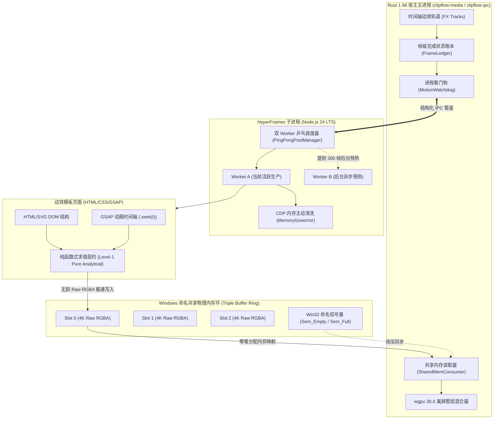
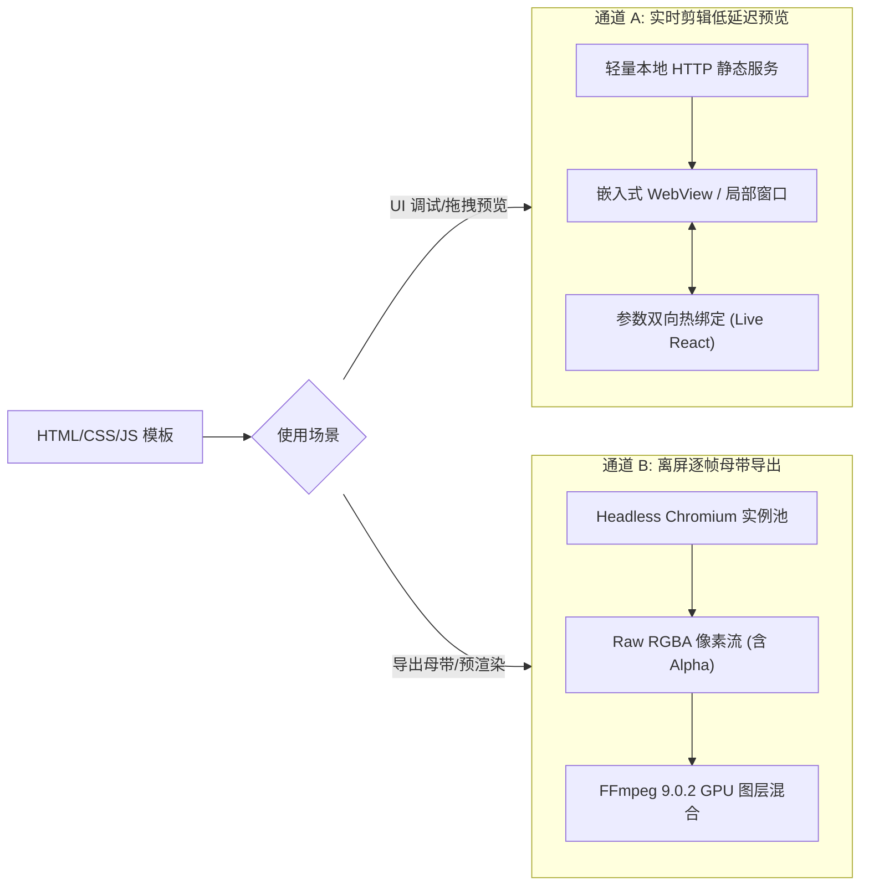

# HyperFrames 动效引擎集成规范 (HyperFrames Motion Engine Specification)

> **版本**：v1.0.0  
> **更新时间**：2026-09-26  
> **适用技术栈**：Node.js 24 LTS, Headless Chromium (CDP / Playwright Core), GSAP 3.12, Rust 1.98  
> **核心地位**：定义 ClipFlow“代码化动态包装”标准——基于 Web 技术栈（HTML/CSS/JS/GSAP）构建 Agent 友好、逐帧确定性渲染的透明通道动态图层，并无缝合成至时间轴。

---

## 1. 动效架构与运行拓扑

HyperFrames 继承 Agent-Native 设计哲学：让 AI 导演与人类用户均能通过标准 Web 代码与参数结构，快速生成角标、花字、数据动态图表等包装特效，摆脱传统视频软件对封闭动效插件（如 AE 模板）的繁琐依赖。



---

## 2. 动效模板封装标准规范 (Package Spec)

每个 HyperFrames 动效组件为一个标准文件夹，存放于 `resources/hyperframes_templates/` 目录下：

```
lower_third_tech/
├── manifest.json       # 模板元数据、参数 Schema 与时长规格
├── index.html          # HTML 骨架与视口配置
├── style.css           # 动效样式 (支持 CSS 变量与主题色)
├── main.js             # GSAP 驱动脚本与帧求值入口
└── assets/             # 预置字体、SVG 图标或 Lottie JSON
```

### 2.1 模板元数据清单：`manifest.json`

```json
{
  "id": "lower_third_tech",
  "name": "极客科技风角标",
  "version": "1.0.0",
  "author": "ClipFlow Team",
  "category": "LowerThirds",
  "canvas": {
    "width": 1920,
    "height": 1080,
    "default_fps": 60,
    "duration_frames": 180
  },
  "parameters": {
    "primary_text": {
      "type": "string",
      "label": "主讲人 / 主标题",
      "default": "ClipFlow 核心架构师",
      "max_length": 30
    },
    "secondary_text": {
      "type": "string",
      "label": "职务 / 副标题",
      "default": "Rust & AI 系统工程师",
      "max_length": 50
    },
    "accent_color": {
      "type": "color",
      "label": "信号强调色",
      "default": "#2F6FEB"
    },
    "show_badge_icon": {
      "type": "boolean",
      "label": "显示认证图标",
      "default": true
    }
  }
}
```

### 2.2 纯函数式确定性求值契约 (Level-1 Pure Analytical Contract)

为了防止多 Worker 乒乓切换、帧跳转 seek 或断点重试时发生画面粒子突跳与闪烁（Popping Glitch），所有 HyperFrames 模板与 Agent 生成的动效脚本必须严格遵守**纯函数确定性契约**：

$$S(t) = \mathcal{F}(t, \vec{P}, \text{Seed})$$

1. **绝对禁止有状态时间累加器**：严禁在全局或外部闭包作用域声明 `let x += speed * dt` 等依赖前序帧累加的变量；任何位置、透明度、旋转角必须是虚拟时间 $t$（秒）的显式数学映射；
2. **确定性伪随机数隔离**：严禁使用 `Math.random()`，必须使用种子固化的 PRNG（如 `DeterministicRNG`），且在单帧求值时基于帧序号重置随机种子；
3. **Canvas / WebGL 纯函数重绘**：Canvas 与 WebGL 每一帧入口必须显式清屏（`ctx.clearRect`），完全基于当前 $t$ 全量重绘，杜绝图层历史像素残留；
4. **静态 AST 扫描合规拦截**：模板载入与大模型生成代码时，自动运行 `TemplateValidator`，检测并拦截访问原生时钟、`Math.random()` 或非局部累加语句。

---

## 3. 确定性逐帧步进渲染与资源治理规范 (Deterministic Stepping & Governance)

传统网页录屏方案由于宿主机 CPU/GPU 负载波动，极易产生丢帧、掉速或动画不同步。HyperFrames 通过**虚拟时间劫持 (Virtual Time Injection)** 与**系统级资源治理**保证数学级逐帧确定性与长效导出平平稳性。

### 3.1 虚拟时间注入脚本 (`runtime_shim.js`)

在 Headless 页面加载前注入底层 Shim，完全接管浏览器原生时钟事件：

```javascript
// runtime_shim.js
(() => {
  let virtualTimeMs = 0;
  
  // 劫持高精度时间
  window.performance.now = () => virtualTimeMs;
  Date.now = () => 1700000000000 + virtualTimeMs;

  // 劫持 requestAnimationFrame
  const animationCallbacks = [];
  window.requestAnimationFrame = (callback) => {
    animationCallbacks.push(callback);
    return animationCallbacks.length;
  };

  // 全局精确帧跳转接口
  window.__clipflow_seek_frame = async (frameIndex, fps) => {
    virtualTimeMs = (frameIndex / fps) * 1000;
    
    // 驱动 GSAP 时间轴精确跳转
    if (window.__hyperframes_tl) {
      window.__hyperframes_tl.seek(virtualTimeMs / 1000, false);
    }

    // 触发本帧 RAF 回调
    const callbacksToRun = [...animationCallbacks];
    animationCallbacks.length = 0;
    for (const cb of callbacksToRun) {
      cb(virtualTimeMs);
    }

    // 等待 DOM 字体与栅格化完成
    await document.fonts.ready;
    return true;
  };
})();
```

### 3.2 生产级 Headless Chromium 启动参数硬限矩阵

Node.js 在拉起无头渲染实例时，必须传入严格显存上限与后台隔离参数，掐死 Skia 资源的无度膨胀：

```javascript
export const CHROMIUM_LOCKED_FLAGS = [
  '--headless=new',                       // 启用 Chrome 新一代原生无头架构
  '--use-gl=angle',                        // 锁定 Direct3D 11/12 硬件加速后端
  '--force-gpu-mem-available-mb=512',      // 严格限制 GPU 可用显存池为 512MB，强制 Skia 及时释放冷纹理
  '--gpu-program-cache-size-kb=32768',     // 着色器程序缓存上限锁定为 32MB
  '--disable-gpu-shader-disk-cache',       // 禁用磁盘着色器缓存，避免渲染期磁盘 I/O 抖动
  '--disable-dev-shm-usage',               // 禁止直接映射 /dev/shm，防止高并发下容器内存溢出
  '--disable-background-networking',       // 彻底关闭后台网络探测与更新服务
  '--disable-breakpad',                    // 禁用系统崩溃上报守护
  '--disable-extensions',                  // 禁用所有插件扩展
  '--js-flags="--max-old-space-size=512 --expose-gc"' // V8 堆上限 512MB，并暴露底层 gc() 钩子
];
```

### 3.3 CDP 帧间无感主动清洗管线 (`MemoryGovernor`)

无需销毁页面，利用 CDP 底层指令在帧间隙执行轻量级清理，将常驻物理内存稳定锁定在 $220\text{MB} \sim 280\text{MB}$：
- **周期性轻量清洗**：每渲染完成 **120 帧**（相当于 2 秒动效），由 Node 控制端下发 `Memory.forciblyPurgeJavaScriptMemory`，清除 Skia GPU 纹理与可丢弃内存块，耗时仅需 $2 \sim 4\text{ms}$，渲染流水线无感平滑；
- **深度防超限清仓**：通过 `Performance.getMetrics` 探针检测到 V8 堆内存超 $400\text{MB}$ 时，触发 `HeapProfiler.collectGarbage` 深度清理。

### 3.4 Windows 命名共享内存 Raw RGBA 零拷贝直传与背压流控

彻底废除基于 Base64 编码的单帧 CDP 截屏协议，在 Node.js 与 Rust 之间搭建物理内存高速公路：
1. **三槽位循环共享内存环 (Triple Buffer Ring)**：通过 Win32 API `CreateFileMappingW` 开辟命名共享物理内存（4K 单槽 32MB，总计约 96MB），由 Node 渲染端写入，Rust 宿主直接零拷贝读取；
2. **原子信号量背压流控**：使用 Windows 原生命名信号量 `Sem_Empty`（初值 3）与 `Sem_Full`（初值 0）刚性协调生产者与消费者，防止丢帧与槽位覆盖；
3. **单帧直传延迟**：4K 3840x2160 RGBA 单帧物理传输延迟锁定在 **$\le 1.5\text{ms}$**，相较于 Base64 提速 30 倍以上。

### 3.5 双 Worker 异步预热乒乓池 (`PingPongPoolManager`)

面向 3000 帧以上的长视频动效母带导出，彻底终结单实例串行重启导致的 170ms~500ms 冷启动黑洞：
1. **安全分段与前瞻预热**：设定单 Worker 连续求值安全容量为 3000 帧；当当前活跃生产的 Worker A 运行至第 **2700 帧**（提前 300 帧，约 5 秒窗口）时，调度器在后台异步拉起 Worker B；
2. **后台无感预编译**：Worker B 在独立线程静默加载 HTML、编译 GSAP、加载 Web 字体并预先 seek 到第 3001 帧完成 GPU 着色器预热；
3. **瞬时 0ms 指针交接**：Worker A 交付完第 3000 帧的瞬间，主控指针原子切换至 Worker B，第 3001 帧零等待即时吐出；随后 Worker A 异步优雅退出。整个导出过程对于 Rust 宿主和 FFmpeg 编码器完全无感、绝对不顿挫。

---

## 4. 双通道架构：快速低延迟预览 vs 离屏母带输出



### 4.1 通道 A：实时剪辑低延迟预览
- **目标**：用户在【动画】页面调节文字或参数时，无需等待后端逐帧渲染，直接以原生 60fps 实时热更新预览。
- **机制**：由轻量本地服务承载，参数变更通过 WebSocket 毫秒级推送到 DOM，实现“所改即所见”。

### 4.2 通道 B：离屏母带生产导出
- **目标**：最终导出成片或用户在 PR 剪辑台进行复杂多轨堆叠时，提供广播级无损透明图层。
- **机制**：Node.js 子进程启动无头集群逐帧步进输出，送入 `wgpu` 离屏合成管线与视频主轨（V1）完美贴合。

---

## 5. 预置核心动效资产库标准 (Standard Templates)

ClipFlow 出厂预内置 5 款通用高频动效模板：

| 模板 ID | 模板名称 | 典型应用场景 | 暴露可调参数 |
| :--- | :--- | :--- | :--- |
| `lower_third_tech` | **科技工控下三分之一角标** | 人物出场、头衔介绍、观点提示 | 主标题、副标题、信号强调色、图标 |
| `chapter_title_card` | **极简全屏章节转场卡** | 视频分段、议题切换、大纲推进 | 章节大序号、章节名称、背景模糊度 |
| `animated_data_chart` | **动态数据折线/柱状图** | 商业汇报、数据分析、趋势展示 | 数据点数组、折线颜色、数值单位、缓动类型 |
| `device_mockup_frame` | **智能设备样机展示框** | 移动端 App 演示、网页操作录屏 | 手机/笔记本外观、样机边框材质、阴影强度 |
| `keyword_callout` | **重点关键词高亮气泡** | 口播金句强化、专业术语解释 | 关键词、背景气泡高亮色、出现动效手势 |

---

## 6. 动画工作台专属 UI 规格

当达芬奇 Dock 栏切换至 `[ 动画 ]` 分页时，上层专属视窗展示三区工作台：

```
+----------------------------------------------------------------------------------------------------+
| 顶栏: 动效组件: [ 极客科技风角标 v1.0 ] | 时长: [ 00:00:03:00 ] | 关联轨道: [ FX1 ] | 分辨率: [ 1080P ] |
+------------------------------------+------------------------------------+--------------------------+
| 【左栏: 模板组件库 & 预设】          | 【中栏: 动效实时预览主视窗】         | 【右栏: 参数表单与代码微调】 |
|                                    |                                    |                          |
| [ 搜索动效模板...             ]    | +--------------------------------+ | [ 基础参数调节 ]          |
| > 角标 (Lower Thirds) [12]         | |                                | | 主讲人姓名:              |
|   - 极客科技风角标 (当前选用)       | |   [ 预览画面 - 支持透明底网格 ]  | | [ 张三 / 架构师        ] |
|   - 极简扁平双行角标               | |                                | | 信号色: [#2F6FEB (钴蓝) ▼] |
| > 章节卡片 (Title Cards) [8]       | |                                | |                          |
| > 数据图表 (Data Charts) [6]       | |   张三 / 架构师                | | ------------------------ |
| > 重点气泡 (Callouts) [15]         | |   =================            | | [ 进阶 Web 动效代码微调 ]|
|                                    | +--------------------------------+ | <style>                    |
|                                    | [ 播放 / 暂停 ] [ 循环预览 ]       |   .accent { color: var(..) |
|                                    | 时间码: 00:00:01:15                | </style>                   |
+------------------------------------+------------------------------------+--------------------------+
| 【全局公用时间线联动区】: 播放指针与动效时间进度严格对齐；拖拽动效手柄可自由拉伸入出点时长               |
+----------------------------------------------------------------------------------------------------+
```

### 6.1 动画工作台核心联动原则
- **底图衬托机制**：预览视窗支持勾选“叠加底层视频帧”，允许用户直观评估角标或花字覆盖在实际口播人像上的遮挡关系与对比度。
- **与全局公用时间线双向同步**：
  - 在时间线上移动播放指针，动画预览视窗即刻跳转至对应时刻的求值帧；
  - 在时间线上拖拽动效切片两端，实时更新 `manifest.json` 的 `duration_frames`。

---

## 7. 动效子进程看门狗与母带导出断点续帧容灾 (Fault-Tolerance & Watchdog)

在长达数万帧的母带离屏导出过程中，必须死守成片零掉帧与零闪退的底线：

1. **Rust 宿主帧级位图账本 (`FrameLedger`)**：
   - 宿主内存维护高精度 `BitVec` 连续性校验，精准跟踪哪些帧已被 FFmpeg 硬件编码器消费入库，哪些处于飞行中（In-Flight）；
2. **Crash 捕获与 50ms 局部自愈重试**：
   - 若 Chromium 进程因显卡驱动 TDR 重置或内存被系统杀毒软件中断，Rust 异步看门狗（`MotionWatchdog`）通过心跳探针与 `Child::try_wait` 在 **$100\text{ms}$** 内捕获异常退出；
   - 账本自动检索未完成的首个断点帧 $F_{\text{fail}}$，立即在后台拉起备用 Worker；
   - 依赖纯函数式求值契约，备用 Worker 直接调用 `__clipflow_seek_frame(F_fail)` 瞬间复原画面并接续生产，母带导出任务全程不中断、不花屏、严格 0 坏帧。

