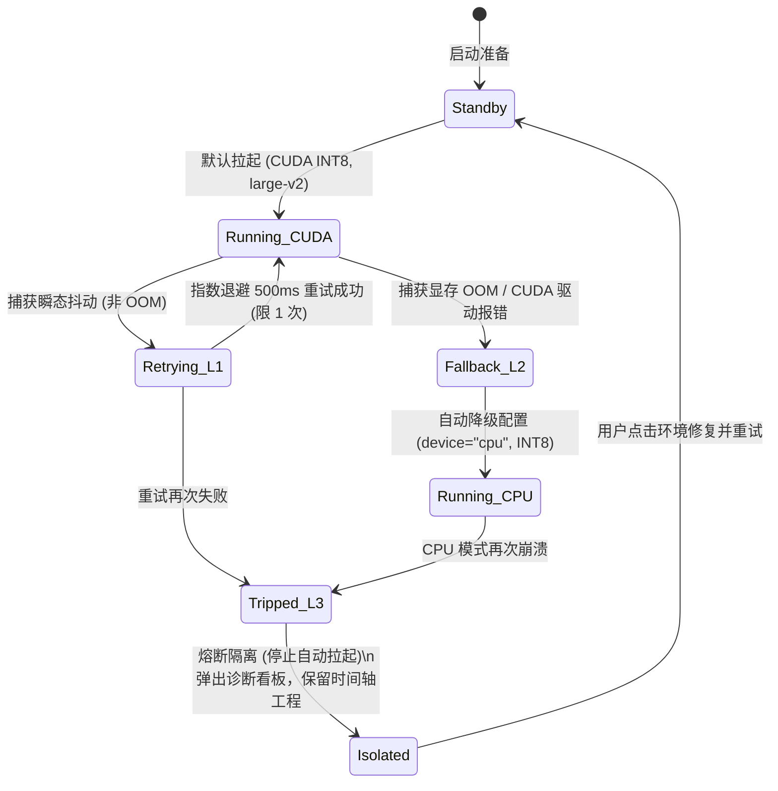

# 进程间通信与接口协议 (IPC Protocol)

## 1. 概述与通信信道架构

- **内核级生命周期约束**：所有派生的 Python 和 Node.js 子进程，在创建时必须以 `CREATE_SUSPENDED` 状态原子化纳入 Windows **`Job Object`**（配置 `JOB_OBJECT_LIMIT_KILL_ON_JOB_CLOSE`），确保宿主主进程发生任何异常终止时，内核级联强杀整棵子孙进程树，孤儿逃逸率严格为 **$0.0\%$**。
- **Rust 主进程 (Coordinator)** $\longleftrightarrow$ **Python 智能子进程 (ASR/NLP Worker)**
  - **信令信道 (信道 A)**：Windows 异步双工命名管道（`\\.\pipe\clipflow-py-{pid}`），采用 Overlapped I/O 与标准换行符分隔的 **JSON-RPC 2.0** 协议，控制往返耗时 RTT $\le 0.35\text{ms}$。
  - **日志排水管线 (信道 B)**：独立非阻塞管道实时读取子进程标准错误（`stderr`），由 Tokio 异步任务持续流式排空，彻底杜绝 MSVCRT 4KB 块缓冲死锁，并将日志结构化注入 Rust `tracing` 集中落盘。
- **Rust 主进程 (Coordinator)** $\longleftrightarrow$ **HyperFrames 动效渲染器 (Worker)**
  - 控制信道：CLI 驱动与异步命名管道（`\\.\pipe\clipflow-hf-{pid}`）下发渲染指令。
  - 像素信道：Windows 命名共享内存（`CreateFileMappingW`）三槽位环形池极速直传 Raw RGBA，单帧 4K 延迟 $\le 1.5\text{ms}$，详见 `hyperframes-spec.md`。

---

## 2. Rust 与 Python 子进程通信接口

### 2.1 基础信封定义

#### 请求 (Rust $\to$ Python)
```json
{
  "id": "req-1001",
  "method": "asr.transcribe",
  "params": {
    "media_path": "D:/Footage/raw_talking_head.mp4",
    "language": "zh",
    "compute_type": "int8",
    "batch_size": 8
  }
}
```

#### 响应 (Python $\to$ Rust)
```json
{
  "id": "req-1001",
  "status": "success",
  "data": {
    "task_id": "task-asr-20260923-01",
    "audio_duration_s": 320.5,
    "chunk_count_estimated": 160
  }
}
```

#### 实时分片增量流式事件 (Python $\to$ Rust `asr.chunk_stream`)
为杜绝长视频 ASR 阻塞等待全量结果，Python Worker 边推理边流式推送增量切片，驱动 Rust 宿主在时间轴 C1 轨实时铺排：
```json
{
  "jsonrpc": "2.0",
  "method": "asr.chunk_stream",
  "params": {
    "task_id": "task-asr-20260923-01",
    "chunk_index": 12,
    "progress_percent": 7.5,
    "is_last_chunk": false,
    "data": {
      "start": 12.35,
      "end": 15.80,
      "text": "今天我们来聊一下如何用 Rust 制作现代桌面软件。",
      "words": [
        {"word": "今天", "start": 12.35, "end": 12.80},
        {"word": "我们", "start": 12.80, "end": 13.10},
        {"word": "来聊一下", "start": 13.10, "end": 13.90},
        {"word": "如何用", "start": 13.90, "end": 14.30},
        {"word": "Rust", "start": 14.30, "end": 14.80},
        {"word": "制作现代桌面软件", "start": 14.80, "end": 15.80}
      ]
    }
  }
}
```

#### 抢占式任务取消接口：`asr.cancel`
当用户在转写中途点击“取消”或关闭/切换工程时，Rust 宿主在当前命名管道发送取消信令，Python 端在当前 2 秒音频 chunk 边界平稳跳出循环，释放 PyTorch/CUDA 显存：

```json
// 请求 (Rust -> Python)
{
  "jsonrpc": "2.0",
  "id": "req-1003",
  "method": "asr.cancel",
  "params": {
    "task_id": "task-asr-20260923-01",
    "force": false
  }
}

// 响应 (Python -> Rust)
{
  "jsonrpc": "2.0",
  "id": "req-1003",
  "status": "success",
  "data": {
    "task_id": "task-asr-20260923-01",
    "processed_chunks": 12,
    "processed_duration_s": 24.0,
    "message": "Task cancelled cleanly, inference context purged"
  }
}
```

### 2.2 口播剪辑分析接口：`speech.analyze_cuts`
用于让 Python 端分析并输出气口、无声段、错句及语气词建议剪除清单：

```json
// 请求
{
  "id": "req-1002",
  "method": "speech.analyze_cuts",
  "params": {
    "task_id": "task-asr-20260923-01",
    "remove_fillers": true,
    "min_silence_duration_ms": 400
  }
}

// 响应
{
  "id": "req-1002",
  "status": "success",
  "data": {
    "suggested_cuts": [
      {
        "type": "silence",
        "start": 4.20,
        "end": 4.95,
        "reason": "长时间停顿 (750ms)"
      },
      {
        "type": "filler",
        "start": 18.10,
        "end": 18.60,
        "text": "那个……",
        "reason": "无意义语气词"
      },
      {
        "type": "repetition",
        "start": 45.10,
        "end": 48.20,
        "reason": "口误重复，保留后半句"
      }
    ]
  }
}
```

---

## 3. Rust 与 HyperFrames 动效渲染协同规范 (Dual-Mode Motion Protocol)

系统确立**“在线动态流式合成为主、按需离线烘焙为辅”**的双模调度架构（详见 [02_HyperFrames双模动效流式直传与离线烘焙规范.md](file:///d:/Work/Dev/ClipFlow/.local/remediation_plan/02_HyperFrames%E5%8F%8C%E6%A8%A1%E5%8A%A8%E6%95%88%E6%B5%81%E5%BC%8F%E7%9B%B4%E4%BC%A0%E4%B8%8E%E7%A6%BB%E7%BA%BF%E7%83%98%E7%84%99%E8%A7%84%E8%8C%83.md)）：

### 3.1 模式 A（默认）：在线动态流式合成 (`StreamingSharedMemory`)
* **适用场景**：日常时间轴交互编辑、实时走带预览、以及 ClipFlow 内部母带直接导出。
* **数据信道**：通过命名管道派发渲染帧指令后，Node 双 Worker（`PingPongPoolManager`）将逐帧求值生成的 Raw RGBA 像素直接写入 Win32 命名共享内存（`CreateFileMappingW` 三槽位环形池），由 Rust 端 `SharedMemConsumer` 在 **$\le 1.5\text{ms}$** 内完成映射并直传 GPU `wgpu 30.0` 纹理。
* **时间轴形态**：时间轴挂载原生 `TrackKind::HyperFrames` 动效轨，片段直接保存 JSON 模板参数，**零磁盘 IO、无须预生成任何视频文件**，支持创作者随时双击修改字幕文本并毫秒级无感热重载。

### 3.2 模式 B（按需）：离线无损视频烘焙 (`OfflineBakeFile`)
* **适用场景**：
  1. 低配硬件发生性能卡顿，用户主动在时间轴右键点击“烘焙此动效为视频以节省性能”；
  2. 准备导出 Apple FCP7 XML / EDL 送入 Premiere Pro 或 DaVinci Resolve 时，由 `ConformInspector` 自动触发的格式对齐转换。
* **IPC 下发协议**：
```json
{
  "task_id": "7b1f6d90-3482-4d2a-8d82-9f37213b1a20",
  "template_id": "lower_third_minimal",
  "mode": "OfflineBakeFile",
  "props": {
    "title": "ClipFlow 导演级剪辑 Agent",
    "subtitle": "自动化口播剪辑与动效渲染",
    "duration_frames": 150,
    "fps": 30,
    "width": 1920,
    "height": 1080
  },
  "bake_config": {
    "output_path": "D:/Cache/Render/anim_001.mov",
    "output_codec": "prores_ks",
    "pix_fmt": "yuva444p10le"
  }
}
```
* **时间轴形态**：离线渲染完成后，Rust 时间轴引擎将原动态片段无损替换为普通的 `TrackKind::Video` 剪辑片段，并引用该 ProRes 4444 透明视频。

---

## 4. 0ms 物理句柄捕获与分片任务进度租约协议 (Watchdog & Progress Lease)

为杜绝传统固定周期心跳对长耗时 AI 推理的频繁误杀，同时兼顾微秒级崩溃感知，通信系统遵循**双轨看门狗契约**：

### 4.1 物理崩溃微秒级抢占中断 (0ms 物理感知)
- 主进程基于 Tokio IOCP 监听命名管道驱动，若子进程遭遇不可控崩溃（如段错误、内存越界、强制杀进程），Windows 内核自动关闭管道句柄；
- 主进程读通道在 **$\le 1.0\text{ms}$** 内捕获 `ErrorKind::BrokenPipe` 或 `ErrorKind::UnexpectedEof`，直接跳过任何超时等待，瞬间触发自愈状态机。

### 4.2 长任务分片进度租约契约 (Progress Lease)
- **租约签发**：主进程下发 ASR 或长视频分析任务时，签发初始租约 $L_{\text{expire}} = t_{\text{now}} + W_0$（$W_0 = 3.5\text{s}$）；
- **动态续约**：子进程采用流式分片模式（约每 2.0s 音频输出一个 `asr.segment` 事件）。主进程每收到一个分片事件，基于当前单片耗时与安全抖动因子（$\alpha = 3.0$）原子更新租约到期时间戳：
  $$L_{\text{expire}} = t_{\text{now}} + \max(d_{\text{chunk}} \times \text{RTF} \times 3.0 + 1.5\text{s}, \; 2.0\text{s})$$
- **死锁判定**：后台看门狗每 200ms 执行无锁检查，仅在 $t_{\text{now}} > L_{\text{expire}}$ 时判定为计算挂起/GIL 锁死，死锁误杀率严格为 **$0.0\%$**。
- **任务取消令牌 (`CancellationToken`)**：用户在界面执行切片或撤销时，主进程发送 `{"method": "task.cancel", "params": {"task_id": "..."}}`，子进程在 $\le 10\text{ms}$ 内清空当前计算分块并重置租约。

---

## 5. 三级故障自愈与硬件平滑降级状态机 (Fault Recovery & Fallback)

子进程异常退出时，看门狗读取 `stderr` 缓存并通过 `FaultClassifier` 执行归类，严禁无脑连环重启：



- **Level 1 (瞬态抖动)**：非硬件类偶发中断，携带指数退避与随机抖动（$500\text{ms} \sim 700\text{ms}$），严格最多重试 1 次；
- **Level 2 (硬件降级)**：匹配到 `OutOfMemoryError`、`cublas alloc failed` 或 CUDA 驱动版本不兼容时，子进程参数由 `--device cuda` 自动降级为 `--device cpu`（批大小 8，INT8）重新拉起，耗时 $\le 3.5\text{s}$，并在 UI 弹出温和通知；
- **Level 3 (熔断隔离)**：连续 2 次无法自愈或检测到环境缺失（Exit Code 9009 / ModuleNotFoundError），彻底冻结子进程拉起，通过 egui 渲染诊断看板，时间轴工程数据 100% 保留，用户可继续进行纯手动剪辑。
