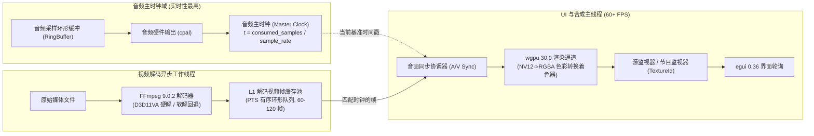
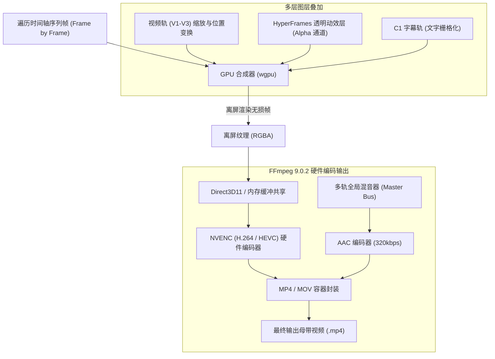

# 多媒体管线与音画同步渲染规范 (Media Pipeline & A/V Sync Specification)

> **版本**：v1.0.0  
> **更新时间**：2026-09-23  
> **适用技术栈**：Rust 1.98, FFmpeg 9.0.2 (MSVC 静态/动态绑定), wgpu 30.0 (DirectX 12 / Vulkan), cpal 0.15  
> **核心地位**：规范从多媒体硬解、像素格式转换、GPU 纹理上传、音频驱动时钟同步到多轨离屏母带导出的完整管线。

---

## 1. 总体多媒体拓扑与并发线程模型

ClipFlow 针对 4K 60fps 场景的低延迟与平滑播放要求，采用**四线程解耦流式架构**：



---

## 2. 视频硬解与 wgpu 30.0 纹理渲染管线

### 2.1 FFmpeg 9.0.2 硬件加速解码策略 (Windows D3D11VA)

1. **硬件加速初始化**：
   - 首选 `AV_HWDEVICE_TYPE_D3D11VA`（Windows 原生 DirectX 11/12 交互友好）。
   - 显卡驱动不可用或格式不受支持时，平滑降级至 `AV_HWDEVICE_TYPE_DXVA2`；最终兜底多线程 CPU 软解（`threads = available_cores`）。
2. **解码输出格式**：
   - 硬件解码直出格式为 `AV_PIX_FMT_NV12`（Y 亮度单平面 + UV 色度交错平面）。
   - **零 CPU 转换原则**：严禁在 CPU 侧调用 `sws_scale` 将 NV12 转为 RGBA（会导致 4K 高分辨率下 CPU 吞吐暴跌）。直接将 NV12 两个原始内存平面上传至 GPU。

### 2.2 NV12 零拷贝 GPU 纹理上传与 WGSL 着色器

wgpu 端创建两个独立纹理：
- **`texture_y`**：格式 `wgpu::TextureFormat::R8Unorm`（分辨率 $W \times H$）
- **`texture_uv`**：格式 `wgpu::TextureFormat::Rg8Unorm`（分辨率 $W/2 \times H/2$）

#### WGSL 色彩空间矩阵转换着色器 (`nv12_to_rgba.wgsl`)
支持 **BT.709 (HD/4K)** 与 **BT.601 (SD)** 色彩空间自适应转换，内置线性插值与无损色域校准：

```wgsl
struct VertexOutput {
    @builtin(position) position: vec4<f32>,
    @location(0) tex_coords: vec2<f32>,
};

@group(0) @binding(0) var sampler_linear: sampler;
@group(0) @binding(1) var texture_y: texture_2d<f32>;
@group(0) @binding(2) var texture_uv: texture_2d<f32>;

struct ColorMatrixUniform {
    matrix: mat3x3<f32>,
    offset: vec3<f32>,
};
@group(0) @binding(3) var<uniform> color_matrix: ColorMatrixUniform;

@fragment
fn fs_main(in: VertexOutput) -> @location(0) vec4<f32> {
    // 采样 Y 分量与 UV 分量
    let y = textureSample(texture_y, sampler_linear, in.tex_coords).r;
    let uv = textureSample(texture_uv, sampler_linear, in.tex_coords).rg;

    // 去除偏置并应用转换矩阵 (默认 BT.709)
    let yuv = vec3<f32>(y - 0.062745, uv.x - 0.50196, uv.y - 0.50196);
    let rgb = color_matrix.matrix * yuv + color_matrix.offset;

    return vec4<f32>(clamp(rgb, vec3<f32>(0.0), vec3<f32>(1.0)), 1.0);
}
```

### 2.3 监视器视窗与 `egui::TextureId` 绑定

- 在每帧 egui 渲染阶段前，`wgpu` 将片段合成至离屏帧缓冲区（Off-screen Framebuffer）。
- 通过 `egui_wgpu::Renderer::register_native_texture` 注册为 `egui::TextureId`。
- 源监视器和节目监视器只需在 UI 代码中调用 `ui.image(egui::load::SizedTexture::new(tex_id, size))` 即可实现原生 GPU 硬件零损耗呈现。

---

## 3. 音画同步 (A/V Sync) 与主时钟调度算法

### 3.1 为什么采用音频作为主时钟 (Audio Master Clock)

人耳对声音的卡顿、爆音和断续容忍度极其苛刻（$\ge 5\text{ms}$ 的突变即可察觉），而人眼对视频画面轻微的帧等待或丢帧具有自然融合容忍度。因此，**系统时钟严格以音频消费游标作为 Master Clock**。

### 3.2 采样点基准时钟计算

通过 `cpal` 音频驱动设备回调：

$$\text{Time}_{\text{audio}} = \frac{\text{TotalSamplesConsumed}}{\text{SampleRate}} + \text{DeviceOutputLatency}$$

- `SampleRate` 统一在主混音器重采样为 **48000 Hz 32-bit Float**。
- `DeviceOutputLatency` 动态查询 Windows WASAPI 驱动缓冲时延（一般为 5ms ~ 15ms）。

### 3.3 视频渲染决策状态机

在主线程每次执行画面重绘时，比对当前待显示视频帧的显示时间戳 $PTS_{\text{video}}$ 与 $\text{Time}_{\text{audio}}$ 的差值 $\Delta t = PTS_{\text{video}} - \text{Time}_{\text{audio}}$：

```
                    ┌────────────────────────┐
                    │      计算偏差 Δt       │
                    │  PTS_video - Time_clk  │
                    └───────────┬────────────┘
                                │
        ┌───────────────────────┼───────────────────────┐
        ▼                       ▼                       ▼
  Δt > +10ms              -10ms ≤ Δt ≤ +10ms       Δt < -10ms
 视频跑得太快                 【理想同步区】            视频严重滞后
        │                       │                       │
        ▼                       ▼                       ▼
【等待策略 (Hold)】        【渲染本帧 (Render)】     【追赶/丢帧策略】
本帧暂不上屏，保持上一帧，   上传贴图并推进帧队列     │
等待音频时钟追上                                      ├─ -40ms ≤ Δt < -10ms:
                                                      │  立即渲染，不延时
                                                      └─ Δt < -40ms:
                                                         直接丢弃当前帧，连续
                                                         读取下一帧直到对齐
```

### 3.4 变速播放与快速拖拽 (Scrubbing) 处理

- **快速拖拽播放头时**：
  1. 瞬间停止音频播放并清空音频 RingBuffer。
  2. 解码管线切换为“快速寻帧（Fast Seek）”模式：仅解码临近的 I/IDR 关键帧与目标帧，其余 B/P 帧跳过计算。
  3. 停止拖拽（Mouse Release）后，以释放点所在帧为基准重新启动音频硬件流。
- **变速播放 (0.5x ~ 2.0x)**：
  - 音频流经由 WSOLA（Waveform Similarity Overlap-Add）变调不变速算法实时重采样处理，确保音频语调正常。

---

## 4. 高性能多级缓存系统设计

为了支撑剪辑台高频拖拽、百轨并发与实时声波渲染，设立三级专用缓存机制：

### 4.1 L1 视频帧解码环形缓冲池 (Decoded Frame Ring Buffer)

- **容量**：常驻内存 60 ~ 120 帧（1080p 约占用 200MB ~ 400MB 内存）。
- **策略**：
  - 双向预读：以播放头为中心，向前（Future）预读 70% 帧，向后（Past）保留 30% 帧（便于即时单帧后退或慢速倒放）。
  - LRU 淘汰机制：一旦内存压力超过设定的水位线（例如 1.5GB），优先淘汰离当前时间码最远的非关键帧。

### 4.2 L2 缩略图金字塔 (Thumbnail Pyramid)

- **生成时机**：素材导入工程时，后台低优先级线程池启动抽帧。
- **物理布局**：存储于工程临时的 `.thumbs/` 目录下，命名为 `{asset_sha256}_{step_ms}.bin`。
- **规格**：
  - 缩略图固定规格：高度 72px，宽度按素材画幅自适应（如 128px）。
  - 存储格式：轻量 WebP 或原始 RGB565 压缩块。
  - **缩放级联**：
    - Level 0 (大缩放)：每 1 秒一张图；
    - Level 1 (中缩放)：每 5 秒一张图；
    - Level 2 (全局视角)：每 30 秒一张图。时间轴缩放时刻直接根据当前每像素代表时长读取对应 Level，极速流畅。

### 4.3 音频波形峰值缓存文件 (`.peak`)

为防止在多轨时间轴展开时频繁解码长音频导致界面卡死，ClipFlow 采用专业音频 DAW 级的峰值缓存协议：

```
+-------------------------------------------------------------------+
| Header: "CFPK" (4B) | Version (2B) | Channels (2B) | SampleRate (4B) |
+-------------------------------------------------------------------+
| WindowSize: u32 (默认 256 采样点一个数据包)                          |
+-------------------------------------------------------------------+
| Peak Records Array:                                               |
| [                                                                 |
|   { min_sample: i16, max_sample: i16, rms_energy: u16 }, ...       |
| ]                                                                 |
+-------------------------------------------------------------------+
```

- **极速渲染**：40 分钟口播音频的 `.peak` 文件大小仅约为 **1.2 MB**。
- **UI 绘制映射**：egui 在时间轴上绘制波形时，只需读取可视区域对应区间的 Min/Max 序列，一次性构造为 GPU 三角形网格（`egui::Mesh`），毫秒级 60fps 拖拽无卡顿。

---

## 5. 母带导出与硬件编码管线

导出页面触发母带导出时，主进程启动专用的离屏批处理渲染上下文：



### 5.1 导出特性与质量规约
- **背压控制 (Backpressure)**：GPU 合成帧率与 NVENC 编码吞吐量严格保持流控队列深度 $\le 3$，防止内存无限制溢出。
- **色彩空间一致性**：导出渲染通道强制使用 Rec.709 全范围（Full Range）或限制范围（Limited Range，TV标准），与节目监视器预览所见即所得。
