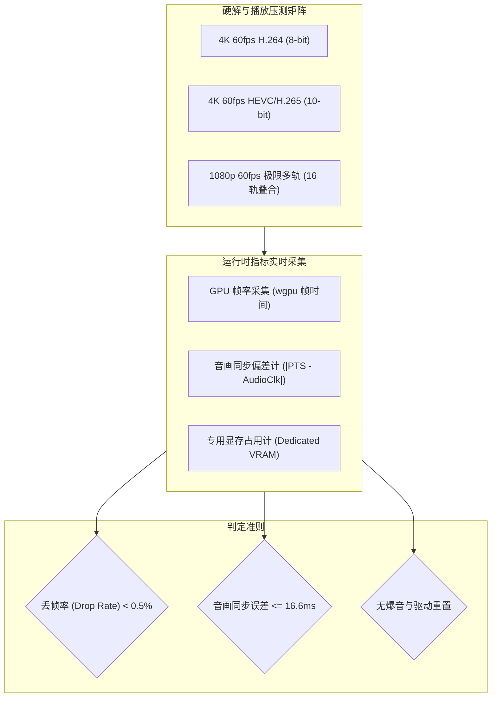
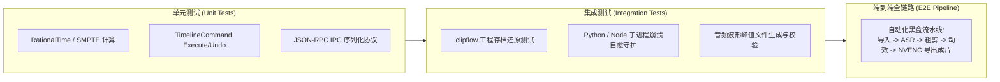

# 性能基准与质量验收规范 (QA & Performance Benchmarks)

> **版本**：v1.0.0  
> **更新时间**：2026-09-23  
> **适用技术栈**：Rust 1.98, wgpu 30.0, egui 0.36, FFmpeg 9.0.2, Python 3.13 / faster-whisper 1.2.1  
> **核心地位**：明确 ClipFlow 桌面端在音画同步、多轨渲染吞吐、内存/显存配额、ASR 精度及自动化测试验收的量化基准，作为所有功能合并与版本发布的唯一准入红线。

---

## 1. 核心性能指标与验收阈值 (Performance SLAs)

| 维度 / 场景 | 核心度量指标 (KPI) | 达标红线阈值 (Target SLA) | 极限回退阈值 (Floor) | 校验方式 |
| :--- | :--- | :--- | :--- | :--- |
| **主时钟单调性 (Time Inversion)**| 任何异常工况下的时间回退次数 | **严格 0 次 (零容忍)** | 0 次 | 欠载恢复与多线程高频查询断言监控 |
| **单帧微观步进抖动 (Jitter)** | 60/120 FPS 每帧时间差抖动 | **$\le 0.05\text{ ms}$** | $\le 0.5\text{ ms}$ | 连续帧时间戳 QPC 差值统计采集 |
| **全流程音画同步 (A/V Drift)** | 连续播放 60 分钟音视频累积差值 | **$\le 2.0\text{ ms}$ (广播级)** | $\le 5.0\text{ ms}$ | SMPTE 闪烁视频音画传感器比对 |
| **主时钟无锁查询耗时** | `Clock::now_ns()` 单次耗时 | **$\le 15\text{ ns}$** | $\le 50\text{ ns}$ | Criterion 多线程无锁并发查询微基准 |
| **声卡断连自愈耗时** | 驱动欠载/设备拔出无缝降级 | **$\le 10\text{ ms}$** | $\le 30\text{ ms}$ | 100ms 超时看门狗自动切入纯单调时钟 |
| **界面流畅度** | 8 轨复杂工程平移/缩放 | **$\ge 60\text{ FPS}$** (无掉帧) | $\ge 50\text{ FPS}$ | egui 帧渲染统计与 wgpu 帧耗时统计 |
| **高频横向缩放 (Zoom)** | 60min 至 1s 连续缩放往复 | **$\ge 55\text{ FPS}$** | $\ge 50\text{ FPS}$ | 波形 LOD 滞后切换与网格复用压测 |
| **单帧 UI 细分耗时** | 60min/20轨/2000切片高负荷 | **$\le 1.0\text{ ms}$** | $\le 1.5\text{ ms}$ | egui 单帧布局与网格细分耗时采集 |
| **空闲待机 CPU 占用率** | 停止播放且无交互 5 秒 | **$0.0\%$ (绝对静默)** | $\le 0.1\%$ | Windows 任务管理器单核 CPU 占用采样 |
| **播放头拖拽响应** | 拖拽指针到画面更新延迟 | **$\le 25\text{ ms}$** | $\le 35\text{ ms}$ | 1/4 代理激活下高精度时钟捕获 Mouse 到上屏 |
| **4K NV12 DMA 上传耗时** | 单帧锁页内存直灌 GPU | **$\le 1.0\text{ ms}$** | $\le 1.5\text{ ms}$ | `queue.write_texture` 执行耗时精准采集 |
| **色彩还原精度 ($\Delta E_{00}$)** | 着色器与 CPU 标杆转码色差 | **$\le 0.5$ (无损)** | $\le 1.0$ | SMPTE 与 ColorChecker 24 色卡自动化比对 |
| **驱动重置自愈耗时 (TDR)** | 模拟 DeviceLost 无感重建 | **$\le 100\text{ ms}$** | $\le 200\text{ ms}$ | 设备丢失捕获到新 Texture 上屏耗时 |
| **连续播放堆内存抖动** | 连续播放 1 小时堆分配计数 | **$0\text{ MB}$ (0 分配)** | $\le 5\text{ MB}$ | `PinnedFramePool` 零堆分配内存工作集采样 |
| **宿主基础内存** | 无工程空载常驻内存 (RAM) | **$\le 150\text{ MB}$** | $\le 200\text{ MB}$ | Windows 任务管理器 Working Set 观测 |
| **重度工程内存** | 1 小时 4K 视频编辑 4 小时 | **$\le 1.8\text{ GB}$ (0 泄漏)** | $\le 2.5\text{ GB}$ | 长时间稳定性压测与泄露探测 |
| **GPU 显存占用** | 多轨 4K 实时剪辑模式 | **$\le 1.2\text{ GB}$** | $\le 1.8\text{ GB}$ | DXGI 显存适配器专用显存用量统计 |
| **动效共享内存直传延迟** | 4K Raw RGBA 共享内存单帧直传 | **$\le 1.5\text{ ms}$** | $\le 2.5\text{ ms}$ | `SharedMemoryConsumer` 映射到 wgpu 上传精确耗时 |
| **动效 Worker 常驻总内存** | 连续离屏渲染 3000 帧物理内存 | **$\le 280\text{ MB}$** | $\le 512\text{ MB}$ | Windows Working Set 采样，硬限 512MB 与清洗生效 |
| **CDP 内存清洗帧间耗时** | 120 帧周期清空 Skia 纹理缓存 | **$\le 5.0\text{ ms}$** | $\le 10.0\text{ ms}$ | `Memory.forciblyPurgeJavaScriptMemory` 执行耗时 |
| **动效双 Worker 切换顿挫** | 3000 帧周期乒乓指针交接间隙 | **$\le 0.5\text{ ms}$ (无感)** | $\le 2.0\text{ ms}$ | 前瞻预热完成后的原子切换时间戳差值统计 |
| **动效求值确定性漂移** | 任意跳转 seek 与顺序求值像素差 | **严格 0 误差 (0 Pixel)** | 0 误差 | 逐像素差分与 SHA-256 散列哈希校验 |
| **动效子进程崩溃自愈耗时** | 渲染期强杀 Chromium 断点重试 | **$\le 100\text{ ms}$** | $\le 300\text{ ms}$ | 故障注入到备用 Worker 接续生成首帧耗时 |
| **动效母带导出坏帧率** | 10000 帧长动效导出坏帧/丢帧 | **严格 0 帧 (100% 完整)** | 0 帧 | FFmpeg `nullsink` 全帧连续性与解码完整性校验 |
| **ASR 推理倍速** | Whisper `large-v2` (INT8) | **$\ge 12\times$ 实时倍速 (GPU)** | $\ge 8\times$ (GPU) | 10 分钟口播转写耗时统计 ($\le 50\text{s}$) |
| **粗剪切口平滑度** | 气口剪切处爆音/吞字率 | **0 吞字 / 0 爆音** | 瑕疵率 $< 0.1\%$ | 音频波形过零点与微淡入淡出检测 |
| **孤儿进程逃逸率** | 宿主 Panic/任务管理器强杀 | **严格 $0.0\%$ (零逃逸)** | 严格 $0.0\%$ | Windows Job Object 级联强杀子孙进程树验收 |
| **物理崩溃捕获感知延迟** | 子进程段错误退出到主进程感知 | **$\le 1.0\text{ ms}$** | $\le 5.0\text{ ms}$ | 命名管道 `BrokenPipe` / `EOF` 异步事件响应耗时 |
| **IPC 控制信令往返 (RTT)** | 4KB JSON-RPC 请求响应 | **$\le 0.35\text{ ms}$** | $\le 1.0\text{ ms}$ | Windows 命名管道 (NPFS) Overlapped I/O 测算 |
| **长任务租约误杀率** | 60 分钟长音频口播 ASR 转写 | **严格 $0.0\%$ (零误杀)** | 严格 $0.0\%$ | `ProgressLeaseTracker` 分片自适应动态延期验收 |
| **CUDA OOM 降级 CPU 耗时** | 显存耗尽捕获并以 CPU 模式重载 | **$\le 3.5\text{ s}$** | $\le 5.0\text{ s}$ | `FallbackGovernor` L2 模式匹配与 CPU 模式拉起耗时 |

---

## 2. 音视频硬解与渲染性能测试准则



### 2.1 音画同步严苛测试标准
- **测试素材**：使用标准 SMPTE 闪烁测试视频（带有每秒单帧蜂鸣音频与对应帧画面方块闪白）。
- **判定标准**：
  - **唇音对齐精度**：音频蜂鸣发生的瞬间，画面白色方块必须在 $\le 2.0\text{ms}$ 窗口内呈现；
  - **主时钟零回退验证**：自动化测试探针全量捕获每一次 `now_ns()` 输出，断言 $t_{n} \ge t_{n-1}$，时间倒流率严格为 0；
  - **连续微观平滑度**：60/120 FPS 渲染帧的时间步进抖动标准差 $\sigma \le 0.05\text{ms}$，严禁出现声卡 10ms 阶梯微观顿挫；
  - **长效零累积漂移**：连续播放 60 分钟，底层有理数时钟与 WASAPI 硬件 DAC 游标累积漂移 $\le 2.0\text{ms}$。

### 2.2 变频拖拽 (Fast Scrubbing) 压力测试
- 在 4K 高码率时间轴上，通过脚本模拟以 120Hz 频率在 00:00:00 至 01:00:00 间随机进行大幅度时间码跳步拖拽；
- 验收指标：
  - 解码管线不得产生死锁（Deadlock）；
  - 内存波动受控，L1 解码环形缓冲池保持 LRU 正确淘汰，显存不得溢出（OOM）。

---

## 3. AI 语音转写与口播粗剪质量基准

### 3.1 ASR 转写准确率基准 (Benchmark Dataset)

测试采用标准的中文口播公开评测集（包含科技、财经、日常口播，带有不同语速与轻微方言口音）：

| 指标 | 目标基准 | 测试方法与公式 |
| :--- | :--- | :--- |
| **字符错误率 (CER)** | $\le 3.5\%$ | $\text{CER} = \frac{S + D + I}{N} \times 100\%$ ($S$: 替换, $D$: 缺失, $I$: 插入) |
| **词级时间戳偏差** | $\le 40\text{ ms}$ | 人工对齐音频音素起始点与 Whisper `words.start` 偏差统计 |
| **标点断句合理度** | 断句 F1-Score $\ge 90\%$ | 标点切分与标准文本句末停顿对齐测试 |

### 3.2 口播粗剪切除平滑度规范 (Anti-Popping Spec)

为了杜绝自动化粗剪经常出现的“切口爆音（Click/Pop）”和“半字吞音”，系统必须通过以下声学算法检验：

1. **过零点对齐 (Zero-Crossing Detection)**：
   - 所有自动化剪切点必须微调至音频信号振幅最接近 0V 的过零点（误差 $\le 2\text{ms}$），杜绝直流偏置突变导致的喇叭爆音。
2. **边缘保护余量 (Padding Margin)**：
   - 静音区间剪除时，在语音结束侧保留 **$+30\text{ms}$** 衰减尾音余量，在后一段语音起始侧提前 **$-40\text{ms}$** 开启，确保首字辅音（如 b, p, d, t）发音完整。
3. **微交叉渐变 (Micro-Crossfade)**：
   - 相邻两个重新拼合的片段接缝处，自动施加 **$5\text{ms}$** 的线性等功率交叉淡入淡出。

---

## 4. HyperFrames 动效确定性与渲染基准

### 4.1 数学级逐帧确定性校验 (Bit-Identical Verification)

为确保 Web 动效在不同硬件配置导出时完全一致，执行哈希一致性测试：

1. **基准测试**：在标准测试机上导出预置角标模板（`lower_third_tech`，180 帧），对生成的 180 张 RGBA 帧分别计算 SHA-256 哈希值，记录为《黄金参考指纹库 (Golden Baseline)》。
2. **压力对比**：在 CPU 负载 95%（模拟后台并发导出或重度计算）的环境下再次运行相同渲染任务；
3. **验收合格标准**：180 帧的 SHA-256 哈希值必须与黄金参考指纹库 **100% 逐比特匹配**（允许由于跨显卡平台微小的着色器四舍五入差异，但严禁出现哪怕 1 帧的动画时序错位）。

### 4.2 离屏母带生成吞吐与共享内存基准
- **Windows 命名共享内存直传**：4K 60fps 单帧从 Node 写入到 Rust wgpu 上传总物理延迟严格 **$\le 1.5\text{ms}$**，相较于传统 CDP Base64 管道提速 30 倍；
- **1080p 60fps 动效渲染吞吐**：单 Worker 离屏吞吐稳定在 **$\ge 50\text{ FPS}$**；
- **4K 60fps 动效渲染吞吐**：单 Worker 离屏吞吐稳定在 **$\ge 35\text{ FPS}$**。

### 4.3 显存硬限与周期清洗长效稳定性测试
- **测试方法**：加载包含高密度 SVG 变形与 Canvas 粒子发射的复合角标模板，以 60 FPS 连续离屏求值 **3000 帧**；
- **判定标准**：
  1. 启动参数 `--force-gpu-mem-available-mb=512` 生效；
  2. 每 120 帧下发 `Memory.forciblyPurgeJavaScriptMemory`，清洗耗时单次 $\le 5\text{ms}$，且不中断渲染流水线；
  3. Chromium 进程及其 GPU 进程的 Working Set 物理内存全程平稳收敛于 **$\le 280\text{MB}$**，严禁出现发散型线性内存膨胀。

### 4.4 双 Worker 异步预热乒乓池平滑性测试
- **测试方法**：在 6000 帧长动效导出过程中，监测第 3000 帧跨越至第 3001 帧的交接窗口；
- **判定标准**：
  1. 活跃 Worker A 渲染推进至第 2700 帧时，调度器在后台成功异步触发 Worker B 启动；
  2. Worker B 在前瞻窗口内完成 HTML/CSS 加载、WebFont 字体解析（`document.fonts.ready`）与首帧 GPU 着色器预热，提前进入 `Ready` 状态；
  3. 切换指针瞬态顿挫 **$\le 0.5\text{ms}$**，下游 FFmpeg 硬件编码队列输入平直，绝无冷启动引起的帧间隔暴增。

### 4.5 动效断点续帧自愈测试 (Chaos Injection)
- **测试方法**：在动效导出至第 1500 帧瞬间，向当前活跃的 Chromium 注入 `SIGKILL` 强杀信号；
- **判定标准**：
  1. Rust 宿主看门狗在 **$100\text{ms}$** 内捕获子进程退出状态；
  2. 从 `FrameLedger` 原子账本中精准定位未交付的断点帧（第 1500 帧），并在后台 50ms 内唤醒备用 Worker 接管；
  3. 依赖纯函数式求值契约直接调用 `seek(1500)`，成片经 FFmpeg 完整性复核，严格 **0 缺帧、0 坏帧、0 闪烁**。

---

## 5. 自动化测试套件矩阵 (Test Automation Architecture)



### 5.1 持续集成 (CI) 必跑命令

在本地开发或 CI 自动化构建流水线中，必须依次通过以下命令核验：

```powershell
# 1. 代码格式化与静态检查 (Rust)
cargo fmt --all -- --check
cargo clippy --workspace --all-targets -- -D warnings

# 2. 运行纯逻辑单元测试 (核心时间轴引擎)
cargo test --workspace

# 3. 运行 Python 智能子进程单元测试
uv run pytest python/clipflow_worker/tests/

# 4. 运行工程存储稳定性压力测试
cargo test -p clipflow-timeline --test project_serialization_stress -- --nocapture
```

### 5.2 子进程自愈容灾测试 (Resilience & Chaos Test)
- **测试场景 1：孤儿进程零逃逸验证**：
  - 启动包含 Python Worker 与 Node.js/Chromium 的完整工程，调用 Win32 `TerminateProcess` 强制瞬间杀死主进程；
  - 合格断言：操作系统进程表中绝无任何残留的 `python.exe`、`node.exe` 或 `chrome.exe`，孤儿逃逸率严格为 **$0.0\%$**。
- **测试场景 2：物理崩溃即时捕获与 Stdio 防死锁测试**：
  - 子进程以 10,000 行/秒狂吐 50MB 垃圾日志到 `stderr`，同时注入 `SIGSEGV` 段错误；
  - 合格断言：主进程读通道在 **$\le 1.0\text{ms}$** 内收到 `BrokenPipe`，且主事件循环零挂起，死锁率严格为 **$0.0\%$**。
- **测试场景 3：CUDA OOM 自愈降级 CPU 模式演练**：
  - 模拟显存不足抛出 `torch.cuda.OutOfMemoryError`；
  - 合格断言：`FallbackGovernor` 自动捕获并在 **$\le 3.5\text{s}$** 内降级为 CPU 模式重新拉起，时间轴工程数据 100% 留存，UI 提示温和明确；连续失败时触发 L3 熔断器，绝不引发死循环雪崩。
