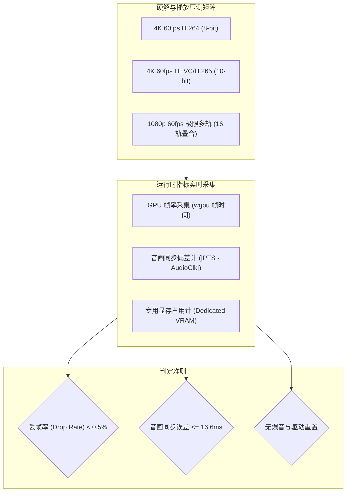
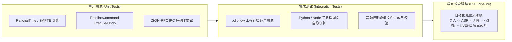

# 性能基准与质量验收规范 (QA & Performance Benchmarks)

> **版本**：v1.0.0  
> **更新时间**：2026-09-23  
> **适用技术栈**：Rust 1.98, wgpu 30.0, egui 0.36, FFmpeg 9.0.2, Python 3.13 / faster-whisper 1.2.1  
> **核心地位**：明确 ClipFlow 桌面端在音画同步、多轨渲染吞吐、内存/显存配额、ASR 精度及自动化测试验收的量化基准，作为所有功能合并与版本发布的唯一准入红线。

---

## 1. 核心性能指标与验收阈值 (Performance SLAs)

| 维度 / 场景 | 核心度量指标 (KPI) | 达标红线阈值 (Target SLA) | 极限回退阈值 (Floor) | 校验方式 |
| :--- | :--- | :--- | :--- | :--- |
| **音画同步 (A/V Sync)** | 音视频时间戳差值 $|\Delta t|$ | **$\le 16.6\text{ ms}$ (1 帧以内)** | $\le 30\text{ ms}$ | cpal 音频时钟与视频 PTS 差值监控 |
| **界面流畅度** | 8 轨复杂工程平移/缩放 | **$\ge 60\text{ FPS}$** (无掉帧) | $\ge 50\text{ FPS}$ | egui 帧渲染统计与 wgpu 帧耗时统计 |
| **高频横向缩放 (Zoom)** | 60min 至 1s 连续缩放往复 | **$\ge 55\text{ FPS}$** | $\ge 50\text{ FPS}$ | 波形 LOD 滞后切换与网格复用压测 |
| **单帧 UI 细分耗时** | 60min/20轨/2000切片高负荷 | **$\le 1.0\text{ ms}$** | $\le 1.5\text{ ms}$ | egui 单帧布局与网格细分耗时采集 |
| **空闲待机 CPU 占用率** | 停止播放且无交互 5 秒 | **$0.0\%$ (绝对静默)** | $\le 0.1\%$ | Windows 任务管理器单核 CPU 占用采样 |
| **播放头拖拽响应** | 拖拽指针到画面更新延迟 | **$\le 25\text{ ms}$** | $\le 35\text{ ms}$ | 1/4 代理激活下高精度时钟捕获 Mouse 到上屏 |
| **4K NV12 DMA 上传耗时** | 单帧锁页内存直灌 GPU | **$\le 1.0\text{ ms}$** | $\le 1.5\text{ ms}$ | `queue.write_texture` 执行耗时精准采集 |
| **色彩还原精度 ($\Delta E_{00}$)** | 着色器与 CPU 标杆转码色差 | **$\le 0.5$ (无损)** | $\le 1.0$ | SMPTE 与 ColorChecker 24 色卡自动化比对 |
| **驱动重置自愈耗时 (TDR)** | 模拟 DeviceLost 无感重建 | **$\le 100\text{ ms}$** | $\le 200\text{ ms}$ | 设备丢失捕获到新 Texture 上屏耗时 |
| **连续播放堆内存抖动** | 连续播放 1 小时堆分配计数 | **$0\text{ MB}$ (0 分配)** | $\le 5\text{ MB}$ | `PinnedFramePool` 零堆分配内存工作集采样 |
| **宿主基础内存** | 无工程空载常驻内存 (RAM) | **$\le 150\text{ MB}$** | $\le 200\text{ MB}$ | Windows 任务管理器 Working Set 观测 |
| **重度工程内存** | 1 小时 4K 视频编辑 4 小时 | **$\le 1.8\text{ GB}$ (0 泄漏)** | $\le 2.5\text{ GB}$ | 长时间稳定性压测与泄露探测 |
| **GPU 显存占用** | 多轨 4K 实时剪辑模式 | **$\le 1.2\text{ GB}$** | $\le 1.8\text{ GB}$ | DXGI 显存适配器专用显存用量统计 |
| **ASR 推理倍速** | Whisper `large-v2` (INT8) | **$\ge 12\times$ 实时倍速 (GPU)** | $\ge 8\times$ (GPU) | 10 分钟口播转写耗时统计 ($\le 50\text{s}$) |
| **粗剪切口平滑度** | 气口剪切处爆音/吞字率 | **0 吞字 / 0 爆音** | 瑕疵率 $< 0.1\%$ | 音频波形过零点与微淡入淡出检测 |

---

## 2. 音视频硬解与渲染性能测试准则



### 2.1 音画同步严苛测试标准
- **测试素材**：使用标准 SMPTE 闪烁测试视频（带有每秒单帧蜂鸣音频与对应帧画面方块闪白）。
- **判定标准**：
  - 音频蜂鸣发生的瞬间，画面白色方块必须且仅能在正负 1 帧以内呈现；
  - 连续播放 60 分钟，主时钟漂移累积必须等于 0（严禁使用浮点累加，由有理数 `RationalTime` 保证）。

### 2.2 变频拖拽 (Fast Scrubbing) 压力测试
- 在 4K 高码率时间轴上，通过脚本模拟以 120Hz 频率在 00:00:00 至 01:00:00 间随机进行大幅度时间码跳步拖拽；
- 验收指标：
  - 解码管线不得产生死锁（Deadlock）；
  - 内存波动受控，L1 解码环形缓冲池保持 LRU 正确淘汰，显存不得溢出（OOM）。

---

## 3. AI 语音转写与口播粗剪质量基准

### 3.1 ASR 转写准确率基准 (Benchmark Dataset)

测试采用标准的中文口播公开评测集（包含科技、财经、日常口播，带有不同语速与轻微方言口音）：

| 指标 | 目标基准 | 测试方法与公式 |
| :--- | :--- | :--- |
| **字符错误率 (CER)** | $\le 3.5\%$ | $\text{CER} = \frac{S + D + I}{N} \times 100\%$ ($S$: 替换, $D$: 缺失, $I$: 插入) |
| **词级时间戳偏差** | $\le 40\text{ ms}$ | 人工对齐音频音素起始点与 Whisper `words.start` 偏差统计 |
| **标点断句合理度** | 断句 F1-Score $\ge 90\%$ | 标点切分与标准文本句末停顿对齐测试 |

### 3.2 口播粗剪切除平滑度规范 (Anti-Popping Spec)

为了杜绝自动化粗剪经常出现的“切口爆音（Click/Pop）”和“半字吞音”，系统必须通过以下声学算法检验：

1. **过零点对齐 (Zero-Crossing Detection)**：
   - 所有自动化剪切点必须微调至音频信号振幅最接近 0V 的过零点（误差 $\le 2\text{ms}$），杜绝直流偏置突变导致的喇叭爆音。
2. **边缘保护余量 (Padding Margin)**：
   - 静音区间剪除时，在语音结束侧保留 **$+30\text{ms}$** 衰减尾音余量，在后一段语音起始侧提前 **$-40\text{ms}$** 开启，确保首字辅音（如 b, p, d, t）发音完整。
3. **微交叉渐变 (Micro-Crossfade)**：
   - 相邻两个重新拼合的片段接缝处，自动施加 **$5\text{ms}$** 的线性等功率交叉淡入淡出。

---

## 4. HyperFrames 动效确定性与渲染基准

### 4.1 数学级逐帧确定性校验 (Bit-Identical Verification)

为确保 Web 动效在不同硬件配置导出时完全一致，执行哈希一致性测试：

1. **基准测试**：在标准测试机上导出预置角标模板（`lower_third_tech`，180 帧），对生成的 180 张 RGBA 帧分别计算 SHA-256 哈希值，记录为《黄金参考指纹库 (Golden Baseline)》。
2. **压力对比**：在 CPU 负载 95%（模拟后台并发导出或重度计算）的环境下再次运行相同渲染任务；
3. **验收合格标准**：180 帧的 SHA-256 哈希值必须与黄金参考指纹库 **100% 逐比特匹配**（允许由于跨显卡平台微小的着色器四舍五入差异，但严禁出现哪怕 1 帧的动画时序错位）。

### 4.2 离屏母带生成吞吐性能
- 1080p 60fps 动效渲染：单帧离屏抓取耗时 $\le 12\text{ms}$（导出速度 $\ge 1.4\times$ 实时倍速）；
- 4K 60fps 动效渲染：单帧离屏抓取耗时 $\le 30\text{ms}$。

---

## 5. 自动化测试套件矩阵 (Test Automation Architecture)



### 5.1 持续集成 (CI) 必跑命令

在本地开发或 CI 自动化构建流水线中，必须依次通过以下命令核验：

```powershell
# 1. 代码格式化与静态检查 (Rust)
cargo fmt --all -- --check
cargo clippy --workspace --all-targets -- -D warnings

# 2. 运行纯逻辑单元测试 (核心时间轴引擎)
cargo test --workspace

# 3. 运行 Python 智能子进程单元测试
uv run pytest python/clipflow_worker/tests/

# 4. 运行工程存储稳定性压力测试
cargo test -p clipflow-timeline --test project_serialization_stress -- --nocapture
```

### 5.2 子进程自愈容灾测试 (Resilience & Chaos Test)
- **模拟场景**：在主进程处于空闲、剪辑或播放状态时，通过外部命令强制终止 `python.exe` 或 `node.exe` 进程。
- **合格判定**：
  1. Rust 宿主主进程绝不发生崩溃或闪退；
  2. 界面弹出轻量 Toast 提示：“智能计算服务意外断开，正在后台自愈重启...”；
  3. `clipflow-ipc` 协调器在 **2 秒内** 静默重新拉起子进程并恢复通信握手。
