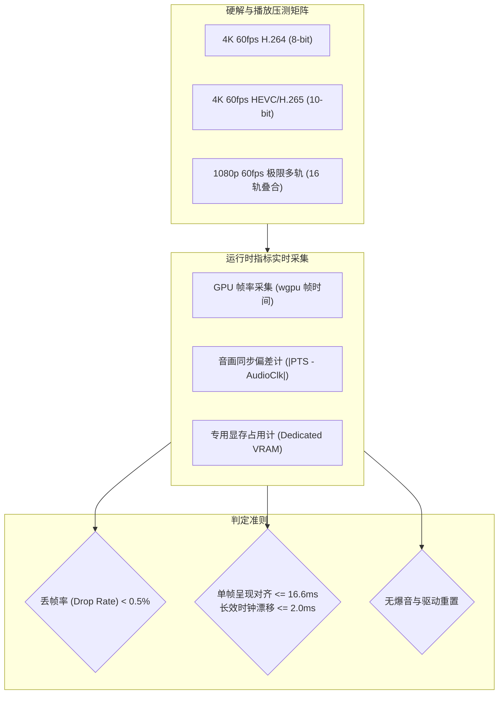
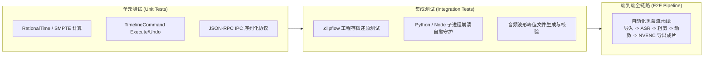

# 性能基准与质量验收规范 (QA & Performance Benchmarks)

> **版本**：v0.3.0  
> **更新时间**：2026-10-07  
> **适用技术栈**：Rust 1.99, wgpu 30.0, egui 0.36, FFmpeg 9.0.2, Python 3.13 / faster-whisper 1.2.1  
> **核心地位**：明确 ClipFlow 桌面端在音画同步、多轨渲染吞吐、内存/显存配额、ASR 精度及自动化测试验收的量化基准，作为所有功能合并与版本发布的唯一准入红线。

---

## 1. 核心性能指标与验收阈值 (Performance SLAs)

| 维度 / 场景 | 核心度量指标 (KPI) | 达标红线阈值 (Target SLA) | 极限回退阈值 (Floor) | 校验方式 |
| :--- | :--- | :--- | :--- | :--- |
| **主时钟单调性 (Time Inversion)**| 任何异常工况下的时间回退次数 | **严格 0 次 (零容忍)** | 0 次 | 欠载恢复与多线程高频查询断言监控 |
| **单帧微观步进抖动 (Jitter)** | 60/120 FPS 每帧时间差抖动 | **$\le 0.05\text{ ms}$** | $\le 0.5\text{ ms}$ | 连续帧时间戳 QPC 差值统计采集 |
| **全流程音画同步 (A/V Drift)** | 连续播放 60 分钟音视频累积差值 | **$\le 2.0\text{ ms}$ (广播级)** | $\le 5.0\text{ ms}$ | SMPTE 闪烁视频音画传感器比对 |
| **主时钟无锁查询耗时** | `Clock::now_ns()` 单次耗时 | **$\le 15\text{ ns}$** | $\le 50\text{ ns}$ | Criterion 多线程无锁并发查询微基准 |
| **声卡断连自愈耗时** | 驱动欠载/设备拔出无缝降级 | **$\le 10\text{ ms}$** | $\le 30\text{ ms}$ | 100ms 超时看门狗自动切入纯单调时钟 |
| **界面流畅度** | 8 轨复杂工程平移/缩放 | **$\ge 60\text{ FPS}$** (无掉帧) | $\ge 50\text{ FPS}$ | egui 帧渲染统计与 wgpu 帧耗时统计 |
| **高频横向缩放 (Zoom)** | 60min 至 1s 连续缩放往复 | **$\ge 55\text{ FPS}$** | $\ge 50\text{ FPS}$ | 波形 LOD 滞后切换与网格复用压测 |
| **单帧 UI 细分耗时** | 60min/20轨/2000切片高负荷 | **$\le 1.0\text{ ms}$** | $\le 1.5\text{ ms}$ | egui 单帧布局与网格细分耗时采集 |
| **空闲待机 CPU 占用率** | 停止播放且无交互 5 秒 (150ms 触发休眠后稳定采样) | **$\le 0.1\%$ (均值静默)** | $\le 0.5\%$ | Windows 任务管理器单核 CPU 占用采样 |
| **播放头拖拽响应** | 拖拽指针到画面更新延迟 | **$\le 25\text{ ms}$** | $\le 35\text{ ms}$ | 1/4 代理激活下高精度时钟捕获 Mouse 到上屏 |
| **4K NV12 DMA 上传耗时** | 单帧锁页内存直灌 GPU | **$\le 1.0\text{ ms}$** | $\le 1.5\text{ ms}$ | `queue.write_texture` 执行耗时精准采集 |
| **色彩还原精度 ($\Delta E_{00}$)** | 着色器与 CPU 标杆转码色差 | **$\le 0.5$ (无损)** | $\le 1.0$ | SMPTE 与 ColorChecker 24 色卡自动化比对 |
| **驱动重置自愈耗时 (TDR)** | 模拟 DeviceLost 无感重建 | **$\le 100\text{ ms}$** | $\le 200\text{ ms}$ | 设备丢失捕获到新 Texture 上屏耗时 |
| **连续播放堆内存抖动** | 连续播放 1 小时堆分配计数 | **$0\text{ MB}$ (0 分配)** | $\le 5\text{ MB}$ | `PinnedFramePool` 零堆分配内存工作集采样 |
| **宿主基础内存** | 无工程空载常驻内存 (RAM) | **$\le 150\text{ MB}$** | $\le 200\text{ MB}$ | Windows 任务管理器 Working Set 观测 |
| **重度工程内存** | 1 小时 4K 视频编辑 4 小时 | **$\le 1.8\text{ GB}$ (0 泄漏)** | $\le 2.5\text{ GB}$ | 长时间稳定性压测与泄露探测 |
| **GPU 显存占用** | 多轨 4K 实时剪辑模式 | **$\le 1.2\text{ GB}$** | $\le 1.8\text{ GB}$ | DXGI 显存适配器专用显存用量统计 |
| **动效共享内存直传延迟** | 4K Raw RGBA 共享内存单帧直传 | **$\le 1.5\text{ ms}$** | $\le 2.5\text{ ms}$ | `SharedMemoryConsumer` 映射到 wgpu 上传精确耗时 |
| **动效 Worker 常驻总内存** | 连续离屏渲染 3000 帧物理内存 | **$\le 280\text{ MB}$** | $\le 512\text{ MB}$ | Windows Working Set 采样，硬限 512MB 与清洗生效 |
| **CDP 内存清洗帧间耗时** | 120 帧周期清空 Skia 纹理缓存 | **$\le 5.0\text{ ms}$** | $\le 10.0\text{ ms}$ | `Memory.forciblyPurgeJavaScriptMemory` 执行耗时 |
| **动效双 Worker 切换顿挫** | 3000 帧周期乒乓指针交接间隙 | **$\le 0.5\text{ ms}$ (无感)** | $\le 2.0\text{ ms}$ | 前瞻预热完成后的原子切换时间戳差值统计 |
| **动效求值确定性漂移** | 任意跳转 seek 与顺序求值像素差 | **严格 0 误差 (0 Pixel)** | 0 误差 | 逐像素差分与 SHA-256 散列哈希校验 |
| **动效子进程崩溃自愈耗时** | 渲染期强杀 Chromium 断点重试 | **$\le 100\text{ ms}$** | $\le 300\text{ ms}$ | 故障注入到备用 Worker 接续生成首帧耗时 |
| **动效母带导出坏帧率** | 10000 帧长动效导出坏帧/丢帧 | **严格 0 帧 (100% 完整)** | 0 帧 | FFmpeg `nullsink` 全帧连续性与解码完整性校验 |
| **ASR 推理倍速** | Whisper `large-v2` (INT8) | **$\ge 12\times$ 实时倍速 (GPU)** | $\ge 8\times$ (GPU) | 10 分钟口播转写耗时统计 ($\le 50\text{s}$) |
| **长音频缝合接缝瑕疵率** | 60 分钟长音频 (3 块拼接) 重叠区吞字/叠字 | **严格 0 吞字 / 0 叠字** | 严格 0.0% | `ChunkMerger` 滑动窗口拼接与音频逐字对照比对 |
| **逆向断句时间戳映射率** | LLM 语义切分回溯词级时间戳成功率 | **$\ge 99.5\%$** | $\ge 98.0\%$ | `nlp.align_sentences` 滑动窗口映射准确率统计 |
| **断句失配规则兜底耗时** | 大模型幻觉时降级为声学规则断句耗时 | **$\le 10\text{ ms}$** | $\le 25\text{ ms}$ | 500ms 物理停顿间隙与高频连词规则切分基准 |
| **字幕胶囊背景着色帧耗时** | WGSL SDF 单帧绘制全量可见字幕底框 | **$\le 0.05\text{ ms}$** | $\le 0.2\text{ ms}$ | `SubtitleBoxPass` 离屏着色管线基准测试 |
| **粗剪切口平滑度** | 气口剪切处爆音/吞字率 | **0 吞字 / 0 爆音** | 瑕疵率 $< 0.1\%$ | 音频波形过零点与微淡入淡出检测 |
| **孤儿进程逃逸率** | 宿主 Panic/任务管理器强杀 | **严格 $0.0\%$ (零逃逸)** | 严格 $0.0\%$ | Windows Job Object 级联强杀子孙进程树验收 |
| **物理崩溃捕获感知延迟** | 子进程段错误退出到主进程感知 | **$\le 1.0\text{ ms}$** | $\le 5.0\text{ ms}$ | 命名管道 `BrokenPipe` / `EOF` 异步事件响应耗时 |
| **IPC 控制信令往返 (RTT)** | 4KB JSON-RPC 请求响应 | **$\le 0.35\text{ ms}$** | $\le 1.0\text{ ms}$ | Windows 命名管道 (NPFS) Overlapped I/O 测算 |
| **长任务租约误杀率** | 60 分钟长音频口播 ASR 转写 | **严格 $0.0\%$ (零误杀)** | 严格 $0.0\%$ | `ProgressLeaseTracker` 分片自适应动态延期验收 |
| **CUDA OOM 降级 CPU 耗时** | 显存耗尽捕获并以 CPU 模式重载 | **$\le 3.5\text{ s}$** | $\le 5.0\text{ s}$ | `FallbackGovernor` L2 模式匹配与 CPU 模式拉起耗时 |
| **FCP7 XML 导出纯耗时** | 60 分钟时间线 / 1000 个切点 | **$\le 15\text{ ms}$** | $\le 50\text{ ms}$ | `quick-xml` 流式无锁内存序列化压测 |
| **CMX 3600 EDL 导出纯耗时** | 60 分钟时间线 / 1000 个切点 | **$\le 5\text{ ms}$** | $\le 20\text{ ms}$ | 80 列定宽纯文本流式生成微基准 |
| **外部工程切点绝对漂移** | 1000 个连续切片首尾入出点 | **严格 0 帧 (0 漂移)** | 严格 0 帧 | `i128` 有理数整除与 SMPTE 帧精确断言 |
| **外部非编套底成功率** | PR 2025/2026 与 DaVinci 19 | **$\ge 99.9\%$ (秒开)** | $\ge 99.0\%$ | 自动化工程导入脚本与无头 CLI 校验 |
| **不可逆图层合规诊断检出率** | 挂载 HyperFrames FX 或变速 | **$100.0\%$ (零漏报)** | $100.0\%$ | `ConformInspector` 静态扫描测试断言 |
| **Agent 浮点时间量化耗时** | 1000 个切点从 `f64` 吸附到 `RationalTime` | **$\le 0.02\text{ ms}$** | $\le 0.1\text{ ms}$ | `AgentTimelineAcl` 批量帧吸附性能微基准 |
| **Agent 粗剪切片接缝空洞率** | 连续切片帧网格缝合后黑屏空洞数 | **严格 0 帧 (0.0%)** | 0 帧 | 连续切除区间拓扑连续性校验 |
| **音频 8 轨通道条混音吞吐** | 8 轨并行 4 段 EQ + 压缩 + 降噪 + 推子 | **$\ge 192\text{ kHz}$** | $\ge 96\text{ kHz}$ | `cpal` 混音缓冲区满载基准压测 |
| **UI 页面切换重排耗时** | 切换 6 大 Dock 栏满宽时间线重绘耗时 | **$\le 0.5\text{ ms}$** | $\le 2.0\text{ ms}$ | egui 即时模式切页帧耗时统计 |
| **Agent 冗余切除准确率 (Precision)** | 黄金评测集建议切除区间的有效性 | **$\ge 92.0\%$** | $\ge 85.0\%$ | Golden Cut Eval 与人工 Ground Truth 比对 |
| **Agent 废话切除召回率 (Recall)** | 黄金评测集中废弃气口/错句的检出率 | **$\ge 88.0\%$** | $\ge 80.0\%$ | Golden Cut Eval 标准用例全量比对 |
| **Agent 工具参数幻觉率** | 生成越界时间戳或无效 ID 的次数 | **严格 0 次 (零容忍)** | 0 次 | 自动化工具调用参数合法性断言测试 |
| **Agent 核心句断裂率** | 核心主谓宾语义被错误切断的比率 | **严格 0 次 (零容忍)** | 0 次 | 语义依存句法树连通性校验断言 |
| **Agent 局部错误自愈率** | 片段过期等可恢复错误 2 次内自愈比例 | **$\ge 95.0\%$** | $\ge 90.0\%$ | 故障注入测试与 Tool-Result 回环演练 |

---

## 2. 音视频硬解与渲染性能测试准则


```mermaid
flowchart TD
    subgraph Test_Matrix ["硬解与播放压测矩阵"]
        Format1["4K 60fps H.264 (8-bit)"]
        Format2["4K 60fps HEVC/H.265 (10-bit)"]
        Format3["1080p 60fps 极限多轨 (16 轨叠合)"]
    end

    subgraph Monitoring ["运行时指标实时采集"]
        FPS_Mon["GPU 帧率采集 (wgpu 帧时间)"]
        Sync_Mon["音画同步偏差计 (|PTS - AudioClk|)"]
        VRAM_Mon["专用显存占用计 (Dedicated VRAM)"]
    end

    subgraph Pass_Criteria ["判定准则"]
        Check1{"丢帧率 (Drop Rate) < 0.5%"}
        Check2{"单帧呈现对齐 <= 16.6ms\n长效时钟漂移 <= 2.0ms"}
        Check3{"无爆音与驱动重置"}
    end

    Test_Matrix --> Monitoring
    Monitoring --> Check1 & Check2 & Check3
```

### 2.1 音画同步严苛测试标准
- **测试素材**：使用标准 SMPTE 闪烁测试视频（带有每秒单帧蜂鸣音频与对应帧画面方块闪白）。
- **判定标准**：
  - **单帧微观呈现对齐容差**：在 60 FPS 刷新下，音频蜂鸣触发时刻与对应画面方块的实际上屏时间差锁定在 $\le 16.6\text{ms}$（1 帧显示周期内）；
  - **唇音对齐精度**：音频蜂鸣发生的瞬间，画面白色方块在经过前瞻锁相与迟滞比较后，瞬态同步窗口收敛至 $\le 2.0\text{ms}$；
  - **主时钟零回退验证**：自动化测试探针全量捕获每一次 `now_ns()` 输出，断言 $t_{n} \ge t_{n-1}$，时间倒流率严格为 0；
  - **连续微观平滑度**：60/120 FPS 渲染帧的时间步进抖动标准差 $\sigma \le 0.05\text{ms}$，严禁出现声卡 10ms 阶梯微观顿挫；
  - **长效零累积漂移**：连续播放 60 分钟，底层有理数时钟与 WASAPI 硬件 DAC 游标累积漂移 $\le 2.0\text{ms}$。

### 2.2 变频拖拽 (Fast Scrubbing) 压力测试
- 在 4K 高码率时间轴上，通过脚本模拟以 120Hz 频率在 00:00:00 至 01:00:00 间随机进行大幅度时间码跳步拖拽；
- 验收指标：
  - 解码管线不得产生死锁（Deadlock）；
  - 内存波动受控，L1 解码环形缓冲池保持 LRU 正确淘汰，显存不得溢出（OOM）。

### 2.3 CI 自动化测试环境兼容与硬件守卫 (CI Environment Guards)
- 在无物理独显的 GitHub Actions / 云端 Windows Server 虚拟机测试节点上，执行 `cargo test -p clipflow-media --test d3d11va_decode_smoke` 等硬件相关测试时，测试用例必须内置前置探测守卫：
  - 若调用 Windows DXGI / D3D11 探测不到物理适配器或驱动不支持硬解上下文创建，自动化测试**优雅跳过（Skip）或自动降级验证多线程 CPU 软解回退分支**；
  - 严禁在无物理 GPU 的基础 CI 节点上因显卡驱动缺失抛出未捕获 panic 导致 CI 门禁误报。全量 D3D11VA 硬解物理验收仅在配备物理 GPU 的 Dedicated Runner 上作为准入条件。

---

## 3. AI 语音转写与口播粗剪质量基准

### 3.1 ASR 转写准确率基准 (Benchmark Dataset)

测试采用标准的中文口播公开评测集（包含科技、财经、日常口播，带有不同语速与轻微方言口音）：

| 指标 | 目标基准 | 测试方法与公式 |
| :--- | :--- | :--- |
| **字符错误率 (CER)** | $\le 3.5\%$ | $\text{CER} = \frac{S + D + I}{N} \times 100\%$ ($S$: 替换, $D$: 缺失, $I$: 插入) |
| **词级时间戳偏差** | $\le 40\text{ ms}$ | 人工对齐音频音素起始点与 Whisper `words.start` 偏差统计 |
| **标点断句合理度** | 断句 F1-Score $\ge 90\%$ | 标点切分与标准文本句末停顿对齐测试 |
| **长音频接缝连续性** | 严格 0 吞字 / 0 叠字 | 60 分钟长音频 (3 块拼接) `ChunkMerger` 重叠区连续性比对 |
| **逆向断句映射率** | $\ge 99.5\%$ | `nlp.align_sentences` 滑动窗口映射词级时间戳准确率 |
| **规则兜底响应耗时** | $\le 10\text{ ms}$ | 500ms 物理停顿间隙与高频连词规则切分基准耗时 |

### 3.2 口播粗剪切除平滑度规范 (Anti-Popping Spec)

为了杜绝自动化粗剪经常出现的“切口爆音（Click/Pop）”和“半字吞音”，系统必须通过以下声学算法检验：

1. **过零点对齐 (Zero-Crossing Detection)**：
   - 所有自动化剪切点必须微调至音频信号振幅最接近 0V 的过零点（误差 $\le 2\text{ms}$），杜绝直流偏置突变导致的喇叭爆音。
2. **边缘保护余量 (Padding Margin)**：
   - 静音区间剪除时，在语音结束侧保留 **$+30\text{ms}$** 衰减尾音余量，在后一段语音起始侧提前 **$-40\text{ms}$** 开启，确保首字辅音（如 b, p, d, t）发音完整。
3. **微交叉渐变 (Micro-Crossfade)**：
   - 相邻两个重新拼合的片段接缝处，自动施加 **$5\text{ms}$** 的线性等功率交叉淡入淡出。

---

## 4. HyperFrames 动效确定性与渲染基准

### 4.1 数学级逐帧确定性校验 (Bit-Identical Verification)

为确保 Web 动效在不同硬件配置导出时完全一致，执行哈希一致性测试：

1. **基准测试**：在标准测试机上导出预置角标模板（`lower_third_tech`，180 帧），对生成的 180 张 RGBA 帧分别计算 SHA-256 哈希值，记录为《黄金参考指纹库 (Golden Baseline)》。
2. **压力对比**：在 CPU 负载 95%（模拟后台并发导出或重度计算）的环境下再次运行相同渲染任务；
3. **验收合格标准**：180 帧的 SHA-256 哈希值必须与黄金参考指纹库 **100% 逐比特匹配**（允许由于跨显卡平台微小的着色器四舍五入差异，但严禁出现哪怕 1 帧的动画时序错位）。

### 4.2 离屏母带生成吞吐与共享内存基准
- **Windows 命名共享内存直传**：4K 60fps 单帧从 Node 写入到 Rust wgpu 上传总物理延迟严格 **$\le 1.5\text{ms}$**，相较于传统 CDP Base64 管道提速 30 倍；
- **1080p 60fps 动效渲染吞吐**：单 Worker 离屏吞吐稳定在 **$\ge 50\text{ FPS}$**；
- **4K 60fps 动效渲染吞吐**：单 Worker 离屏吞吐稳定在 **$\ge 35\text{ FPS}$**。

### 4.3 显存硬限与周期清洗长效稳定性测试
- **测试方法**：加载包含高密度 SVG 变形与 Canvas 粒子发射的复合角标模板，以 60 FPS 连续离屏求值 **3000 帧**；
- **判定标准**：
  1. 启动参数 `--force-gpu-mem-available-mb=512` 生效；
  2. 每 120 帧下发 `Memory.forciblyPurgeJavaScriptMemory`，清洗耗时单次 $\le 5\text{ms}$，且不中断渲染流水线；
  3. Chromium 进程及其 GPU 进程的 Working Set 物理内存全程平稳收敛于 **$\le 280\text{MB}$**，严禁出现发散型线性内存膨胀。

### 4.4 双 Worker 异步预热乒乓池平滑性测试
- **测试方法**：在 6000 帧长动效导出过程中，监测第 3000 帧跨越至第 3001 帧的交接窗口；
- **判定标准**：
  1. 活跃 Worker A 渲染推进至第 2700 帧时，调度器在后台成功异步触发 Worker B 启动；
  2. Worker B 在前瞻窗口内完成 HTML/CSS 加载、WebFont 字体解析（`document.fonts.ready`）与首帧 GPU 着色器预热，提前进入 `Ready` 状态；
  3. 切换指针瞬态顿挫 **$\le 0.5\text{ms}$**，下游 FFmpeg 硬件编码队列输入平直，绝无冷启动引起的帧间隔暴增。

### 4.5 动效断点续帧自愈测试 (Chaos Injection)
- **测试方法**：在动效导出至第 1500 帧瞬间，向当前活跃的 Chromium 注入 `SIGKILL` 强杀信号；
- **判定标准**：
  1. Rust 宿主看门狗在 **$100\text{ms}$** 内捕获子进程退出状态；
  2. 从 `FrameLedger` 原子账本中精准定位未交付的断点帧（第 1500 帧），并在后台 50ms 内唤醒备用 Worker 接管；
  3. 依赖纯函数式求值契约直接调用 `seek(1500)`，成片经 FFmpeg 完整性复核，严格 **0 缺帧、0 坏帧、0 闪烁**。

---

## 5. 自动化测试套件矩阵 (Test Automation Architecture)


```mermaid
flowchart LR
    subgraph Layer1 ["单元测试 (Unit Tests)"]
        T1["RationalTime / SMPTE 计算"]
        T2["TimelineCommand Execute/Undo"]
        T3["JSON-RPC IPC 序列化协议"]
    end

    subgraph Layer2 ["集成测试 (Integration Tests)"]
        IT1[".clipflow 工程存档还原测试"]
        IT2["Python / Node 子进程崩溃自愈守护"]
        IT3["音频波形峰值文件生成与校验"]
    end

    subgraph Layer3 ["端到端全链路 (E2E Pipeline)"]
        E2E["自动化黑盒流水线:\n导入 -> ASR -> 粗剪 -> 动效 -> NVENC 导出成片"]
    end

    Layer1 --> Layer2 --> Layer3
```

### 5.1 持续集成 (CI) 必跑命令

在本地开发或 CI 自动化构建流水线中，必须依次通过以下命令核验：

```powershell
# 1. 代码格式化与静态检查 (Rust)
cargo fmt --all -- --check
cargo clippy --workspace --all-targets -- -D warnings

# 2. 运行纯逻辑与通信单元测试 (核心时间轴引擎 & IPC/Agent Harness)
cargo test --workspace
cargo test -p clipflow-ipc

# 3. 运行 Python 智能子进程单元测试
uv run pytest python/clipflow_worker/tests/

# 4. 运行工程存储稳定性压力测试
cargo test -p clipflow-timeline --test project_serialization_stress -- --nocapture
```

### 5.2 子进程自愈容灾测试 (Resilience & Chaos Test)
- **测试场景 1：孤儿进程零逃逸验证**：
  - 启动包含 Python Worker 与 Node.js/Chromium 的完整工程，调用 Win32 `TerminateProcess` 强制瞬间杀死主进程；
  - 合格断言：操作系统进程表中绝无任何残留的 `python.exe`、`node.exe` 或 `chrome.exe`，孤儿逃逸率严格为 **$0.0\%$**。
- **测试场景 2：物理崩溃即时捕获与 Stdio 防死锁测试**：
  - 子进程以 10,000 行/秒狂吐 50MB 垃圾日志到 `stderr`，同时注入 `SIGSEGV` 段错误；
  - 合格断言：主进程读通道在 **$\le 1.0\text{ms}$** 内收到 `BrokenPipe`，且主事件循环零挂起，死锁率严格为 **$0.0\%$**。
- **测试场景 3：CUDA OOM 自愈降级 CPU 模式演练**：
  - 模拟显存不足抛出 `torch.cuda.OutOfMemoryError`；
  - 合格断言：`FallbackGovernor` 自动捕获并在 **$\le 3.5\text{s}$** 内降级为 CPU 模式重新拉起，时间轴工程数据 100% 留存，UI 提示温和明确；连续失败时触发 L3 熔断器，绝不引发死循环雪崩。

### 5.3 外部工程交换与套底精度验收测试 (NLE Interchange & Conforming Tests)
- **测试场景 1：1000 切片 0 帧累积漂移自动化测试**：
  - 构造包含 1000 个长度为 0.2s~1.5s 的切片序列（23.976 / 25 / 29.97 / 59.94 各帧率覆盖），调用 `CutListExtractor` 与 `Fcp7XmlSerializer`；
  - 合格断言：相邻连续切片严格满足 $End_n \equiv Start_{n+1}$，首尾总时长帧数与时间轴有理数帧数差绝对为 **0 帧**，耗时 $\le 15\text{ms}$。
- **测试场景 2：中文长路径与特殊字符 RFC 3986 转义验证**：
  - 素材路径包含中文字符、空格、`&`、`#` 及网络共享盘 UNC 格式；
  - 合格断言：生成的 FCP7 XML 中 `<pathurl>` 100% 格式化为合法 `file://localhost/...` 百分号转义 URI；EDL 扩展注释 `* FROM CLIP NAME` 完整保留原始 UTF-8 文本，无乱码或字段溢出。
- **测试场景 3：DaVinci Resolve / Premiere Pro 实机工程导入与自动重连验证**：
  - 导出 `.xml` 文件，通过自动化脚本或命令行调起 DaVinci Resolve 19 与 Premiere Pro 2025/2026 进行静默导入；
  - 合格断言：工程导入零告警弹窗，媒体素材全部自动高亮上线（零 Media Offline），各切点画面与源视频严格重合。
- **测试场景 4：HyperFrames 动效不可逆降级诊断与 ProRes 4444 替代建议验证**：
  - 在时间轴 FX 轨道添加 3 处 HyperFrames Web 动态角标，触发导出检查；
  - 合格断言：`ConformInspector` 100% 检出 `UnsupportedDropped` 严重度条目，并在 UI 诊断报告看板中给出“建议先渲染为 Apple ProRes 4444 独立透明图层后送入 PR 叠加”的操作建议。

---

## 6. Agent 导演决策质量基准与回归门禁 (Agent Quality & Evaluation Benchmarks)

传统工程基准（ASR CER、吸附耗时、渲染丢帧）仅能度量物理管线性能，无法评估 Agent“剪辑方案好不好、有没有幻觉”。为此，ClipFlow 建立标准化的**黄金评测集 (Golden Cut Dataset)** 与**自动化决策质量回归门禁**。

### 6.1 黄金评测集规约 (Golden Cut Dataset Specification)

黄金评测集存储于 `tests/fixtures/agent_eval_corpus/`，涵盖 4 大典型口播视频场景，总计 120 分钟素材与词级对齐 Ground Truth：

| 测试集标识 | 场景类型 | 时长 | 语言风格 | 核心考核重点 |
| :--- | :--- | :--- | :--- | :--- |
| `EVAL-TECH-01` | 科技数码快剪 | 15 min | 高语速、密集技术专有名词 | 专有名词保护、长气口压缩、快节奏卡点 |
| `EVAL-FIN-02` | 财经知识长口播 | 45 min | 中速、严谨长难句、多论据分层 | 宏观分幕结构合理度、从句与核心句完整性 |
| `EVAL-LIVE-03` | 带货互动口播 | 30 min | 倒装句、频繁语气词（“然后/对吧”） | 语气助词高召回剔除、兴奋点 Hook 保留 |
| `EVAL-POD-04` | 访谈对谈片段 | 30 min | 双人轻微抢话、思考停顿与结巴重复 | 结巴口误剪除、非主讲背景音保护 |

每段素材均预先通过资深剪辑师完成逐帧标注，形成确定性的参考剪辑答案（Ground Truth），包含：
- `ground_truth_cuts.json`：必须剪除的停顿、废话与语气词区间；
- `protected_key_takeaways.json`：绝对禁止破坏的核心论点与结论时间戳白名单。

### 6.2 决策质量核心度量与红线门禁 (Pass/Fail Gates)

在 CI 或本地开发运行 `cargo test -p clipflow-app --test agent_golden_eval` 时，评测引擎自动化断言以下 5 大硬性指标：

1. **废话切除准确率 (Cut Precision)**：
   $$\text{Precision} = \frac{|\text{建议切除区间} \cap \text{标注切除区间}|}{|\text{建议切除区间}|} \ge 92.0\%$$
   *（红线：若低于 85.0%，视为过度误切，阻断合入）*
2. **废话切除召回率 (Cut Recall)**：
   $$\text{Recall} = \frac{|\text{建议切除区间} \cap \text{标注切除区间}|}{|\text{标注切除区间}|} \ge 88.0\%$$
   *（红线：若低于 80.0%，视为剪除保守，粗剪效果不显著）*
3. **核心语义完整性破坏率 (Semantic Disruption Rate)**：
   $$\text{DisruptionRate} = \frac{|\text{建议切除区间} \cap \text{受保护核心句时间}|}{|\text{受保护核心句总数}|} \equiv 0.0\%$$
   *（零容忍红线：任何将主谓宾核心句从中途截断、造成听感不通顺的情况，断言直接 Panic 失败）*
4. **工具调用参数幻觉率 (Hallucination Rate)**：
   校验模型生成的工具调用入参：
   - 引用未分配的 `clip_id` 或 `asset_id`；
   - 时间戳起点 > 终点，或超出素材物理总时长；
   - 目标轨道索引不存在或为只读锁定轨；  
   **合格标准：上述非法调用次数必须严格为 0**。
5. **Tool-Result 局部自愈成功率 (Auto-Healing Success Rate)**：
   通过故障注入测试（模拟在 Agent 规划期间，人工切碎某个 Clip 导致 ID 过期），回传 `ERR_CLIP_EXPIRED` 结构化错误：
   $$\text{HealRate} = \frac{\text{2 次内成功修正参数并执行成功数}}{\text{总注入故障数}} \ge 95.0\%$$

### 6.3 Prompt 与模型版本回归保护机制
任何针对 Prompt 模板、分块切片算法或 LLM 接入层代码的 Pull Request，必须在提交前附带黄金评测集的回归对比报告：
```powershell
# 运行 Agent 决策质量全量黄金基准测试
cargo test -p clipflow-app --test agent_golden_eval -- --nocapture
```
若发现综合评分低于上一版本基线，CI 自动阻止合并，确保提示词工程的迭代具备明确的量化回归守护。

### 6.4 工程级鲁棒性与确定性测试桩回归 (Mock Harness CI Gates)
为了保证 Agent 模块在 GitHub Actions 等无 GPU、无外网 API 凭证的严苛 CI 环境中实现确定性自动化核验，系统以 `MockLlmDriver` 纯内存测试桩（详见 [`agent-director-spec.md` 第 8.3 节](agent-director-spec.md#83-确定性内存测试桩与-ci-回归契约-deterministic-mock-harness-for-ci)）为核心准入红线：

1. **50ms 全链路纯内存回归门禁 (Golden CI Benchmark)**：
   - 执行命令：`cargo test -p clipflow-ipc --test agent_mock_harness_eval`；
   - 验证闭环：ASR 内存索引解析 $\to$ Mock 思考块与只读查询工具派发 $\to$ Shadow Timeline 物理度量求值 $\to$ Staged DAG 编译 $\to$ 真实 `TimelineEngine` 原子写入 $\to$ 单次 `undo()` 彻底还原；
   - **性能与质量红线**：单线程运行耗时绝对锁定在 **$\le 50\text{ms}$**，0 坏帧、0 悬挂异步任务、0 内存泄漏。
2. **Tokio `CancellationToken` 级联打断与 5ms 回滚断言**：
   - 模拟 Agent 在并发求解分幕切片中途，创作者突然触发拖拽播放头或点击取消；
   - 合格断言：根 Token 触发取消后，所有 Ephemeral Sub-Agent 与异步流瞬时级联终止，纯内存 `ShadowTimelineSandbox` 在 **$\le 5\text{ms}$** 内清空未提交切片并复原主时间线镜像，前端 Ghost Layer 虚拟投影毫秒级静默卸载。
3. **断路器与双水位 Token 熔断断言**：
   - 注入死循环工具调用（连续 2 次相同入参），断言断路器在第 2 次立即弹开并阻断调用；
   - 模拟上下文膨胀，断言在达到软水位（32,768 Tokens）时 100% 触发上下文修剪（Context Compaction），达到硬水位（49,152 Tokens）时立即强制熔断并交付当前最佳方案。

