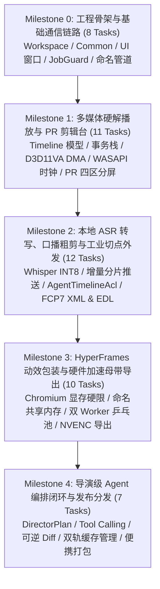
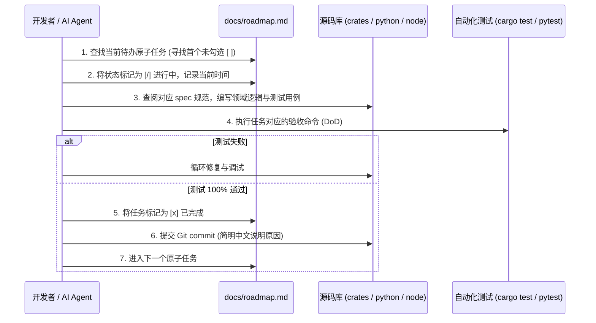

# 工程研发路线图与原子任务看板 (Development Roadmap & Task Board)

> **版本**：v1.0.0  
> **更新时间**：2026-09-26  
> **状态索引**：`[ ]` 待开始 | `[/]` 进行中 | `[x]` 已完成并通过验收 | `[-]` 已废弃/跳过  
> **当前活动里程碑**：**Milestone 0 (M0)**  
> **核心地位**：指导 ClipFlow 全生命周期的任务分解、依赖时序、验收命令 (DoD) 与进度追踪的单一执行事实来源。

---

## 1. 研发执行与协作准则 (Engineering Conventions)

1. **单任务闭环原则**：每个原子任务（Task）代码量控制在 $100 \sim 400$ 行，具有明确的输入、输出与自动化验证命令；严禁未验证提交。
2. **测试先行与零回归**：涉及数据模型与算法的核心功能，必须先编写单元测试（Unit Test），确保 `cargo test` 100% 覆盖关键边界分支。
3. **断点续写机制**：每次会话交接或开发中断时，将当前正在推进的任务标记为 `[/]`，并在任务下方注明最新的测试结果或阻塞点，保证下一轮开发零认知损耗继续推进。
4. **统一分支规范**：各里程碑在对应特性分支（如 `feature/m0-scaffold`）开发，全部 Task 验证通过后方可合入 `main`。

---

## 2. 里程碑概览与关键路径 (Critical Path)



---

## 3. Milestone 0 (M0)：工程骨架与基础通信链路

- **核心目标**：完成 Polyglot Monorepo 多语言多进程骨架搭建，实现 Rust 宿主窗口秒开与 Windows Job Object 内核级安全通信链路。
- **总任务数**：8 个原子任务

- [ ] **M0-T01 多语言仓库根工程初始化**
  - **前置依赖**：无
  - **涉改模块**：根目录 `Cargo.toml`, `.cargo/config.toml`, `pyproject.toml`, `package.json`, `.python-version`
  - **对应规范**：[docs/environment-setup.md](file:///d:/Work/Dev/ClipFlow/docs/environment-setup.md) & [docs/codebase-structure.md](file:///d:/Work/Dev/ClipFlow/docs/codebase-structure.md)
  - **核心交付物**：配置 MSVC 编译优化、6 大 Rust Crate 骨架目录、`uv` 锁定 Python 3.13 虚拟环境及 Node.js 24 基础包声明。
  - **验收命令 (DoD)**：
    ```bash
    cargo check --workspace
    uv run python --version # 输出 3.13.x
    node --version          # 输出 v24.x.x
    ```

- [ ] **M0-T02 基础类型与时间数学库实现 (`clipflow-common`)**
  - **前置依赖**：M0-T01
  - **涉改模块**：`crates/clipflow-common/`
  - **对应规范**：[docs/timeline-data-model.md 第 1 节](file:///d:/Work/Dev/ClipFlow/docs/timeline-data-model.md)
  - **核心交付物**：实现 `RationalTime` 有理数时间、`TimeRange` 左闭右开区间、`SmpteTimecode` SMPTE 时间码解析与格式化、系统统一错误枚举 `ClipFlowError`。
  - **验收命令 (DoD)**：
    ```bash
    cargo test -p clipflow-common
    ```

- [ ] **M0-T03 主窗口宿主与工控绿视觉主题 (`clipflow-app` & `clipflow-ui`)**
  - **前置依赖**：M0-T02
  - **涉改模块**：`crates/clipflow-app/`, `crates/clipflow-ui/`
  - **对应规范**：[docs/ui-spec.md](file:///d:/Work/Dev/ClipFlow/docs/ui-spec.md)
  - **核心交付物**：搭建 `eframe`/`egui 0.36` + `wgpu 30.0` 应用程序主入口，严格应用 NVIDIA 官方深色模式设计体系（纯黑底板、2px 精密锐角、`#76B900` 电能绿信号、Teal/Blue 交互色彩转移）与 egui 样式映射表。
  - **验收命令 (DoD)**：
    ```bash
    cargo run -p clipflow-app # 窗口秒级弹出，无渲染报错，主题色彩对齐规范
    ```

- [ ] **M0-T04 达芬奇式底部 Dock 栏交互与工作流路由**
  - **前置依赖**：M0-T03
  - **涉改模块**：`crates/clipflow-ui/`
  - **对应规范**：[docs/prd.md 第 2 节](file:///d:/Work/Dev/ClipFlow/docs/prd.md) & [docs/edit-layout-spec.md](file:///d:/Work/Dev/ClipFlow/docs/edit-layout-spec.md)
  - **核心交付物**：实现底部 6 大分页 Dock 切换器（Agent、剪辑、动画、声音、图片、导出），下半屏挂载全局公用时间线占位底座，点击 Dock 按钮实现平滑路由切换。
  - **验收命令 (DoD)**：
    ```bash
    cargo test -p clipflow-ui # 包含切页状态机单测，切页耗时 <= 0.5ms
    ```

- [ ] **M0-T05 Windows Job Object 内核级生命周期强绑定 (`clipflow-ipc`)**
  - **前置依赖**：M0-T01
  - **涉改模块**：`crates/clipflow-ipc/`
  - **对应规范**：[docs/ipc-protocol.md 第 1 节](file:///d:/Work/Dev/ClipFlow/docs/ipc-protocol.md)
  - **核心交付物**：封装 Win32 原生 `CreateJobObjectW` 与 `SetInformationJobObject` (`JOB_OBJECT_LIMIT_KILL_ON_JOB_CLOSE`) 为安全的 RAII 结构体 `JobGuard`；支持以 `CREATE_SUSPENDED` 挂接子进程。
  - **验收命令 (DoD)**：
    ```bash
    cargo test -p clipflow-ipc --test job_guard_kill_test # 宿主被强杀时子进程 100% 连带退出
    ```

- [ ] **M0-T06 异步双工命名管道与 JSON-RPC 2.0 握手信道 (`clipflow-ipc`)**
  - **前置依赖**：M0-T05
  - **涉改模块**：`crates/clipflow-ipc/`, `python/clipflow_worker/`
  - **对应规范**：[docs/ipc-protocol.md 第 2 节](file:///d:/Work/Dev/ClipFlow/docs/ipc-protocol.md)
  - **核心交付物**：实现 Windows 命名管道服务驱动（`\\.\pipe\clipflow-py-{pid}`），支持基于换行符分隔的 JSON-RPC 2.0 请求响应，实现 `ping` / `pong` 握手。
  - **验收命令 (DoD)**：
    ```bash
    cargo test -p clipflow-ipc --test named_pipe_rtt_test # 往返 RTT <= 0.35ms
    ```

- [ ] **M0-T07 子进程 `stderr` 异步排空与集中日志收集**
  - **前置依赖**：M0-T06
  - **涉改模块**：`crates/clipflow-ipc/`
  - **对应规范**：[docs/ipc-protocol.md 第 1 节](file:///d:/Work/Dev/ClipFlow/docs/ipc-protocol.md)
  - **核心交付物**：实现 `AsyncStderrDrainer`，以 Tokio 异步任务持续流式读取 Python 与 Node 子进程的标准错误，彻底消除 MSVCRT 4KB 缓冲死锁，并将日志转发至 Rust `tracing`。
  - **验收命令 (DoD)**：
    ```bash
    cargo test -p clipflow-ipc --test stderr_drain_deadlock_test # 高压灌入 10000 行日志 0 阻塞
    ```

- [ ] **M0-T08 M0 里程碑集成冒烟套件**
  - **前置依赖**：M0-T01 ~ M0-T07
  - **涉改模块**：`tests/m0_integration.rs`
  - **对应规范**：[docs/qa-and-benchmarks.md 第 1 节](file:///d:/Work/Dev/ClipFlow/docs/qa-and-benchmarks.md)
  - **核心交付物**：编写全自动冒烟测试脚本，一键拉起桌面宿主与 Python 测试子进程，校验窗口创建、Dock 栏切换、IPC 握手及无残留退出。
  - **验收命令 (DoD)**：
    ```bash
    cargo test --test m0_integration
    ```

---

## 4. Milestone 1 (M1)：媒体硬解播放与 PR 经典剪辑台

- **核心目标**：打通 FFmpeg 9.0.2 D3D11VA 硬解到 wgpu 30.0 渲染链路，确立 WASAPI 硬件单调主时钟，交付完全对齐 Premiere Pro 四区分屏与多轨时间线剪辑台。
- **总任务数**：11 个原子任务

- [ ] **M1-T01 纯逻辑多轨数据模型与序列化 (`clipflow-timeline`)**
  - **前置依赖**：M0-T02
  - **涉改模块**：`crates/clipflow-timeline/`
  - **对应规范**：[docs/timeline-data-model.md 第 2 节](file:///d:/Work/Dev/ClipFlow/docs/timeline-data-model.md)
  - **核心交付物**：实现 `Project`, `Sequence`, `Track`, `Clip`, `Keyframe` 核心结构体，采用扁平 Uuid 索引，实现无环单向数据图。
  - **验收命令 (DoD)**：`cargo test -p clipflow-timeline --test model_tests`

- [ ] **M1-T02 命令模式事务栈与 WAL 预写 (`clipflow-timeline`)**
  - **前置依赖**：M1-T01
  - **涉改模块**：`crates/clipflow-timeline/`
  - **对应规范**：[docs/timeline-data-model.md 第 3 节](file:///d:/Work/Dev/ClipFlow/docs/timeline-data-model.md)
  - **核心交付物**：实现 `TimelineCommand` Trait 及插入切片、删除切片、分割切片等原子命令，实现基于内存栈的 Undo/Redo 与 `session.wal` 追加流写入。
  - **验收命令 (DoD)**：`cargo test -p clipflow-timeline --test undo_redo_wal_tests`

- [ ] **M1-T03 FFmpeg 9.0.2 D3D11VA 硬件解码与锁页帧池 (`clipflow-media`)**
  - **前置依赖**：M0-T01
  - **涉改模块**：`crates/clipflow-media/`
  - **对应规范**：[docs/media-pipeline-spec.md 第 2 节](file:///d:/Work/Dev/ClipFlow/docs/media-pipeline-spec.md)
  - **核心交付物**：绑定 `ffmpeg-sys-next`，配置 D3D11VA 硬件加速提取 NV12 数据，实现 `PinnedFramePool`（`VirtualAlloc` + `VirtualLock` 钉住物理内存），支持零拷贝 DMA 直传。
  - **验收命令 (DoD)**：`cargo test -p clipflow-media --test d3d11va_dma_test`

- [ ] **M1-T04 WGSL NV12 双平面转 RGBA 色彩矩阵着色器 (`clipflow-media`)**
  - **前置依赖**：M1-T03
  - **涉改模块**：`crates/clipflow-media/shaders/nv12_to_rgba.wgsl`
  - **对应规范**：[docs/media-pipeline-spec.md 第 2.3 节](file:///d:/Work/Dev/ClipFlow/docs/media-pipeline-spec.md)
  - **核心交付物**：编写 wgpu 全屏大三角形着色器，实现 BT.709/BT.601 与 Limited/Full Range 自动矩阵切换，色彩精度 $\Delta E_{00} \le 0.5$。
  - **验收命令 (DoD)**：`cargo test -p clipflow-media --test color_matrix_accuracy`

- [ ] **M1-T05 WASAPI 原生硬件单调主时钟与迟滞比较器 (`clipflow-media`)**
  - **前置依赖**：M0-T02
  - **涉改模块**：`crates/clipflow-media/`
  - **对应规范**：[docs/media-pipeline-spec.md 第 3 节](file:///d:/Work/Dev/ClipFlow/docs/media-pipeline-spec.md)
  - **核心交付物**：实现 `cpal` WASAPI 输出流，挂接 `IAudioClock` 硬件采样游标，封装 `MonotonicClampedClock`（无锁 CAS，时间回退严格为 0，单次查询 $\le 15\text{ns}$），引入施密特双阈值迟滞比较器消除 10ms 拍频顿挫。
  - **验收命令 (DoD)**：`cargo test -p clipflow-media --test monotonic_clock_test`

- [ ] **M1-T06 音频波形峰值文件 (`.peak`) 提取与多级 LOD 金字塔**
  - **前置依赖**：M1-T03
  - **涉改模块**：`crates/clipflow-media/`
  - **对应规范**：[docs/media-pipeline-spec.md 第 4.4 节](file:///d:/Work/Dev/ClipFlow/docs/media-pipeline-spec.md) & [docs/cache-and-storage-spec.md](file:///d:/Work/Dev/ClipFlow/docs/cache-and-storage-spec.md)
  - **核心交付物**：实现后台音频流分块扫描，生成存储于 `.clipflow_cache/` 的 `.peak` 二进制波形，支持自适应 LOD 精度读取与顶点 Mesh 复用。
  - **验收命令 (DoD)**：`cargo test -p clipflow-media --test waveform_lod_test`

- [ ] **M1-T07 PR 经典两层分屏工作台界面实现 (`clipflow-ui`)**
  - **前置依赖**：M0-T03, M1-T01
  - **涉改模块**：`crates/clipflow-ui/`
  - **对应规范**：[docs/edit-layout-spec.md 第 1~2 节](file:///d:/Work/Dev/ClipFlow/docs/edit-layout-spec.md)
  - **核心交付物**：在上半屏构建 25% 项目素材面板、50% 双监视器视窗（源监视器/节目监视器，集成 wgpu 硬件纹理贴图）、25% 属性效果面板，下半屏铺满 100% 满宽时间线底座。
  - **验收命令 (DoD)**：`cargo test -p clipflow-ui --test pr_layout_render_test`

- [ ] **M1-T08 核心多轨公用时间线视图与二维视口裁剪 (`clipflow-ui`)**
  - **前置依赖**：M1-T07
  - **涉改模块**：`crates/clipflow-ui/`
  - **对应规范**：[docs/edit-layout-spec.md 第 4 节](file:///d:/Work/Dev/ClipFlow/docs/edit-layout-spec.md)
  - **核心交付物**：实现多轨标尺绘制、V1~V3 与 A1~A3 轨道头渲染、正交二维 AABB 视口裁剪二分算法，支持滚轮平移与播放头实时跟随，单帧 UI 细分耗时 $\le 1.0\text{ms}$。
  - **验收命令 (DoD)**：`cargo test -p clipflow-ui --test viewport_culling_perf`

- [ ] **M1-T09 J-K-L 动态飞梭走带与剪辑修饰键行为矩阵 (`clipflow-ui`)**
  - **前置依赖**：M1-T08, M1-T05
  - **涉改模块**：`crates/clipflow-ui/`
  - **对应规范**：[docs/edit-layout-spec.md 第 2.5 节](file:///d:/Work/Dev/ClipFlow/docs/edit-layout-spec.md)
  - **核心交付物**：实现 J-K-L 级联倍速走带状态机（$1\times \sim 16\times$ 正反飞梭）、`Alt + 拖拽` 原地复制切片副本、`Alt + 滚轮` 以鼠标光标为中心缩放时间轴、`S` 键磁吸吸附切换及 `Shift` 临时反转。
  - **验收命令 (DoD)**：`cargo test -p clipflow-ui --test shuttle_keybinds_test`

- [ ] **M1-T10 监视器 1/4 代理流控与 DeviceLost 容灾看门狗 (`clipflow-media`)**
  - **前置依赖**：M1-T03, M1-T04
  - **涉改模块**：`crates/clipflow-media/`
  - **对应规范**：[docs/architecture.md 第 4.4 节](file:///d:/Work/Dev/ClipFlow/docs/architecture.md)
  - **核心交付物**：实现 `ProxyGovernor` 调度器（快速拖拽自动切入 540p 代理，带宽 $\le 60\text{MB/s}$，拖拽延迟 $\le 25\text{ms}$）；模拟 DirectX 设备丢失，管线在 $100\text{ms}$ 内无感重建。
  - **验收命令 (DoD)**：`cargo test -p clipflow-media --test device_lost_recovery_test`

- [ ] **M1-T11 M1 音画同步与 60 FPS 播放全链路验收**
  - **前置依赖**：M1-T01 ~ M1-T10
  - **涉改模块**：`tests/m1_av_sync_bench.rs`
  - **对应规范**：[docs/qa-and-benchmarks.md 第 2 节](file:///d:/Work/Dev/ClipFlow/docs/qa-and-benchmarks.md)
  - **核心交付物**：输入 SMPTE 闪烁校准视频连续播放 60 分钟，自动化断言音画累积漂移 $\le 2.0\text{ms}$，界面渲染稳定 60 FPS，空闲待机 CPU 占用 0.0%。
  - **验收命令 (DoD)**：`cargo test --test m1_av_sync_bench -- --nocapture`

---

## 5. Milestone 2 (M2)：本地 ASR 转写、口播粗剪与工业切点外发

- **核心目标**：集成本地 `faster-whisper` INT8 推理，打通词级时间戳流式铺排与口播文本粗剪，落地符合 Apple FCP7 XML 与 CMX 3600 EDL 工业标准的零阻抗外发管线。
- **总任务数**：12 个原子任务

- [ ] **M2-T01 Python Worker `faster-whisper` 模型加载与 CUDA/CPU 自愈状态机**
  - **前置依赖**：M0-T06
  - **涉改模块**：`python/clipflow_worker/asr/`
  - **对应规范**：[docs/architecture.md 第 4.6 节](file:///d:/Work/Dev/ClipFlow/docs/architecture.md) & [docs/cache-and-storage-spec.md](file:///d:/Work/Dev/ClipFlow/docs/cache-and-storage-spec.md)
  - **核心交付物**：从 `%LOCALAPPDATA%\ClipFlow\models` 载入 `large-v2` INT8 权重；实现显存 OOM 捕获并在 $\le 3.5\text{s}$ 内平滑降级为 CPU 模式，提供 `MockAsrWorker` 供单元测试脱机运行。
  - **验收命令 (DoD)**：`uv run pytest python/clipflow_worker/tests/test_asr_fallback.py`

- [ ] **M2-T02 IPC `asr.chunk_stream` 实时流式分片推送与进度租约**
  - **前置依赖**：M2-T01
  - **涉改模块**：`python/clipflow_worker/`, `crates/clipflow-ipc/`
  - **对应规范**：[docs/ipc-protocol.md 第 2 节](file:///d:/Work/Dev/ClipFlow/docs/ipc-protocol.md)
  - **核心交付物**：实现按 2 秒音频分片增量上报 `asr.chunk_stream` 事件；Rust 侧集成 `ProgressLeaseTracker`，动态计算长任务超时租约，长视频转写误杀率严格为 0.0%。
  - **验收命令 (DoD)**：`cargo test -p clipflow-ipc --test lease_tracker_test`

- [ ] **M2-T03 IPC 抢占式软中断与显存重置 (`asr.cancel`)**
  - **前置依赖**：M2-T02
  - **涉改模块**：`crates/clipflow-ipc/`, `python/clipflow_worker/`
  - **对应规范**：[docs/ipc-protocol.md 第 2 节](file:///d:/Work/Dev/ClipFlow/docs/ipc-protocol.md)
  - **核心交付物**：支持 Rust 发送非阻塞 `asr.cancel`，Python Worker 在下一个 chunk 边界平稳跳出推理循环并释放 PyTorch CUDA 上下文。
  - **验收命令 (DoD)**：`cargo test -p clipflow-ipc --test cancel_inference_test`

- [ ] **M2-T04 `AgentTimelineAcl` 防腐网关与帧网格硬吸附 (`clipflow-timeline`)**
  - **前置依赖**：M1-T01
  - **涉改模块**：`crates/clipflow-timeline/`
  - **对应规范**：[docs/timeline-data-model.md 第 1.4 节](file:///d:/Work/Dev/ClipFlow/docs/timeline-data-model.md)
  - **核心交付物**：实现将外部 `f64` 浮点秒量化吸附至整数帧分界的数学算子，自动消除 $\le 1$ 帧微隙，杜绝黑屏坏帧。
  - **验收命令 (DoD)**：`cargo test -p clipflow-timeline --test acl_snapping_test`

- [ ] **M2-T05 口播停顿、气口与错重句声学/NLP 检测 (`speech.analyze_cuts`)**
  - **前置依赖**：M2-T02
  - **涉改模块**：`python/clipflow_worker/nlp/`
  - **对应规范**：[docs/ipc-protocol.md 第 2.2 节](file:///d:/Work/Dev/ClipFlow/docs/ipc-protocol.md)
  - **核心交付物**：基于静音能量检测与台词重复模式匹配，输出待切除的气口（$\ge 400\text{ms}$）、语气助词和重复句时间区间列表。
  - **验收命令 (DoD)**：`uv run pytest python/clipflow_worker/tests/test_nlp_cleaner.py`

- [ ] **M2-T06 文本驱动剪辑双模联动状态机 (`clipflow-ui`)**
  - **前置依赖**：M1-T08, M2-T04
  - **涉改模块**：`crates/clipflow-ui/`
  - **对应规范**：[docs/subtitle-render-spec.md 第 4 节](file:///d:/Work/Dev/ClipFlow/docs/subtitle-render-spec.md)
  - **核心交付物**：在 UI 文本面板滑选台词按 `Delete` 触发对应音视频片段的波纹剪切（Ripple Cut）；双击文字进入原位纠错（只改字幕文本，切片时长严格冻结）。
  - **验收命令 (DoD)**：`cargo test -p clipflow-ui --test text_based_edit_test`

- [ ] **M2-T07 过零点检测、辅音保护与 5ms 微等功率交叉渐变 (`clipflow-media`)**
  - **前置依赖**：M1-T05, M2-T06
  - **涉改模块**：`crates/clipflow-media/`
  - **对应规范**：[docs/qa-and-benchmarks.md 第 3.2 节](file:///d:/Work/Dev/ClipFlow/docs/qa-and-benchmarks.md)
  - **核心交付物**：实现音频切点波形过零点对齐（$\le 2\text{ms}$）、语音尾音 $+30\text{ms}$ 保留、起始辅音 $-40\text{ms}$ 保护窗及拼合接缝处 5ms 交叉淡入淡出，彻底消除爆音。
  - **验收命令 (DoD)**：`cargo test -p clipflow-media --test zero_crossing_anti_pop_test`

- [ ] **M2-T08 基于 `cosmic-text` + `glyphon` 的 GPU 离屏文本着色管线 (`clipflow-ui`)**
  - **前置依赖**：M1-T04
  - **涉改模块**：`crates/clipflow-ui/`, `crates/clipflow-media/`
  - **对应规范**：[docs/subtitle-render-spec.md 第 1~3 节](file:///d:/Work/Dev/ClipFlow/docs/subtitle-render-spec.md)
  - **核心交付物**：构建 wgpu 独立文本着色通道，实现 Windows 微软雅黑字体回退、文字描边与阴影着色器，以及播放头随动词级卡拉OK染色高亮。
  - **验收命令 (DoD)**：`cargo test -p clipflow-ui --test subtitle_gpu_render_test`

- [ ] **M2-T09 Apple FCP7 XML (`xmeml v5`) 流式序列化器 (`clipflow-timeline`)**
  - **前置依赖**：M1-T01
  - **涉改模块**：`crates/clipflow-timeline/`
  - **对应规范**：[docs/timeline-data-model.md 第 5.3 节](file:///d:/Work/Dev/ClipFlow/docs/timeline-data-model.md)
  - **核心交付物**：基于 `quick-xml` 流式生成符合 FCP7 XML 规范的文件，路径强制采用 RFC 3986 `file://localhost/...` 百分号转义，1000 个切点生成耗时 $\le 15\text{ms}$。
  - **验收命令 (DoD)**：`cargo test -p clipflow-timeline --test fcp7_xml_export_test`

- [ ] **M2-T10 规范化 CMX 3600 EDL 流式生成器 (`clipflow-timeline`)**
  - **前置依赖**：M1-T01
  - **涉改模块**：`crates/clipflow-timeline/`
  - **对应规范**：[docs/timeline-data-model.md 第 5.3 节](file:///d:/Work/Dev/ClipFlow/docs/timeline-data-model.md)
  - **核心交付物**：实现 80 列定宽对齐的 EDL 生成器，通过注入 `* FROM CLIP NAME` 扩展注释行传递 UTF-8 中文路径，杜绝穿孔卡乱码。
  - **验收命令 (DoD)**：`cargo test -p clipflow-timeline --test edl_export_test`

- [ ] **M2-T11 `ConformInspector` 静态合规预检与降级诊断扫描器**
  - **前置依赖**：M2-T09, M2-T10
  - **涉改模块**：`crates/clipflow-timeline/`, `crates/clipflow-ui/`
  - **对应规范**：[docs/timeline-data-model.md 第 5.4 节](file:///d:/Work/Dev/ClipFlow/docs/timeline-data-model.md)
  - **核心交付物**：在外部导出前自动扫描时间轴，若挂载动效层或变速曲线，弹出三级诊断看板并提供 ProRes 4444 独立图层渲染替代建议。
  - **验收命令 (DoD)**：`cargo test -p clipflow-timeline --test conform_inspector_test`

- [ ] **M2-T12 M2 外部非编套底与 1000 切点 0 帧漂移自动化验收**
  - **前置依赖**：M2-T01 ~ M2-T11
  - **涉改模块**：`tests/m2_conformance_test.rs`
  - **对应规范**：[docs/qa-and-benchmarks.md 第 1 节](file:///d:/Work/Dev/ClipFlow/docs/qa-and-benchmarks.md)
  - **核心交付物**：利用 Python 自动化脚本调用 Premiere Pro 与 DaVinci Resolve CLI 导入生成的 XML，断言切点套底成功率 $\ge 99.9\%$，端到端 0 帧时间漂移。
  - **验收命令 (DoD)**：`cargo test --test m2_conformance_test`

---

## 6. Milestone 3 (M3)：HyperFrames 动效包装与硬件加速母带导出

- **核心目标**：接入 HyperFrames Web 动效逐帧确定性渲染引擎，通过 Win32 命名共享内存实现 4K 极速合成，交付母带级离线导出管线。
- **总任务数**：10 个原子任务

- [ ] **M3-T01 Node.js 24 无头 Chromium 动效运行时搭建**
  - **前置依赖**：M0-T01
  - **涉改模块**：`node/hyperframes_renderer/`
  - **对应规范**：[docs/hyperframes-spec.md 第 1 节](file:///d:/Work/Dev/ClipFlow/docs/hyperframes-spec.md)
  - **核心交付物**：启动 Headless Chromium 并注入虚拟时间驱动，实现 HTML/CSS/GSAP 模板在指定帧索引下的逐帧确定性求值与离屏截图。
  - **验收命令 (DoD)**：`node node/hyperframes_renderer/test_frame_render.js`

- [ ] **M3-T02 Chromium 512MB 显存硬配额注入与 CDP 内存清洗管线**
  - **前置依赖**：M3-T01
  - **涉改模块**：`node/hyperframes_renderer/`
  - **对应规范**：[docs/hyperframes-spec.md 第 2 节](file:///d:/Work/Dev/ClipFlow/docs/hyperframes-spec.md)
  - **核心交付物**：注入 `--force-gpu-mem-available-mb=512` 启动标志，建立每 120 帧主动调用 `Memory.forciblyPurgeJavaScriptMemory` 清洗机制，连续渲染 3000 帧内存锁定在 $\le 300\text{MB}$。
  - **验收命令 (DoD)**：`node node/hyperframes_renderer/test_memory_leak.js`

- [ ] **M3-T03 Win32 命名共享内存 Raw RGBA 传输环形池 (`clipflow-media`)**
  - **前置依赖**：M1-T03, M3-T01
  - **涉改模块**：`crates/clipflow-media/`, `node/hyperframes_renderer/`
  - **对应规范**：[docs/hyperframes-spec.md 第 3 节](file:///d:/Work/Dev/ClipFlow/docs/hyperframes-spec.md)
  - **核心交付物**：基于 Windows `CreateFileMappingW` 实现 3 槽位命名共享内存环形队列，Node 写入后 Rust `SharedMemoryConsumer` 映射直传 wgpu 纹理，单帧延迟 $\le 1.5\text{ms}$。
  - **验收命令 (DoD)**：`cargo test -p clipflow-media --test shared_memory_ipc_test`

- [ ] **M3-T04 双 Worker 异步预热乒乓池 (`PingPongPoolManager`)**
  - **前置依赖**：M3-T02, M3-T03
  - **涉改模块**：`crates/clipflow-ipc/`
  - **对应规范**：[docs/hyperframes-spec.md 第 4 节](file:///d:/Work/Dev/ClipFlow/docs/hyperframes-spec.md)
  - **核心交付物**：调度 Worker A 生产第 $1 \sim 3000$ 帧，Worker B 提前 300 帧后台异步冷启动预热，在 3000 帧交界处原子切换环形指针，交接顿挫 $\le 0.5\text{ms}$。
  - **验收命令 (DoD)**：`cargo test -p clipflow-ipc --test ping_pong_pool_test`

- [ ] **M3-T05 动效纯函数求值契约静态 AST 扫描器 (`TemplateValidator`)**
  - **前置依赖**：M3-T01
  - **涉改模块**：`node/hyperframes_renderer/templates/`
  - **对应规范**：[docs/hyperframes-spec.md 第 2.2 节](file:///d:/Work/Dev/ClipFlow/docs/hyperframes-spec.md)
  - **核心交付物**：基于 Babel/SWC 实现静态代码分析器，拦截 LLM 生成代码中的非局部时间累加器（`x += v * dt`）与全局原生时钟调用。
  - **验收命令 (DoD)**：`node node/hyperframes_renderer/templates/test_validator.js`

- [ ] **M3-T06 动效工作台实时代码编辑与图层挂载 (`clipflow-ui`)**
  - **前置依赖**：M1-T07, M3-T03
  - **涉改模块**：`crates/clipflow-ui/`
  - **对应规范**：[docs/prd.md 第 2 节 动画页](file:///d:/Work/Dev/ClipFlow/docs/prd.md)
  - **核心交付物**：在达芬奇 Dock 栏【动画】分页集成轻量代码编辑器与模板库面板，支持将代码动效作为 Clip 挂载到时间轴 V2/V3 轨并实时双监视器预览。
  - **验收命令 (DoD)**：`cargo test -p clipflow-ui --test anim_page_test`

- [ ] **M3-T07 动效子进程崩溃捕获与断点接续看门狗 (`FrameLedger`)**
  - **前置依赖**：M3-T04
  - **涉改模块**：`crates/clipflow-media/`, `crates/clipflow-ipc/`
  - **对应规范**：[docs/hyperframes-spec.md 第 5 节](file:///d:/Work/Dev/ClipFlow/docs/hyperframes-spec.md)
  - **核心交付物**：记录已写入磁盘的动效帧账本 `FrameLedger`；模拟 Chromium 异常强杀，看门狗在 $100\text{ms}$ 内捕获并在断点帧无损接续渲染，导出坏帧率严格为 0。
  - **验收命令 (DoD)**：`cargo test -p clipflow-media --test frame_ledger_recovery_test`

- [ ] **M3-T08 FFmpeg NVENC 硬件加速多轨母带离线导出管线 (`clipflow-media`)**
  - **前置依赖**：M1-T03, M3-T03
  - **涉改模块**：`crates/clipflow-media/`
  - **对应规范**：[docs/media-pipeline-spec.md 第 5 节](file:///d:/Work/Dev/ClipFlow/docs/media-pipeline-spec.md)
  - **核心交付物**：构建离线时间戳单步时钟，按帧合成 V1~V3 画面与 C1 字幕，调用 FFmpeg 9.0.2 NVENC 硬件编码为 4K MP4 / ProRes 4444 独立母带。
  - **验收命令 (DoD)**：`cargo test -p clipflow-media --test master_export_test`

- [ ] **M3-T09 声音页混音台通道条与 MasterBus 效果器数据绑定 (`clipflow-ui`)**
  - **前置依赖**：M1-T05
  - **涉改模块**：`crates/clipflow-ui/`, `crates/clipflow-timeline/`
  - **对应规范**：[docs/workflow-pages-spec.md 第 1 节](file:///d:/Work/Dev/ClipFlow/docs/workflow-pages-spec.md)
  - **核心交付物**：在【声音】页面渲染 8 轨纵向混音通道条与 MasterBus，绑定 4 段 EQ、降噪及音量推子，实现对底层音频缓冲区的实时增益控制。
  - **验收命令 (DoD)**：`cargo test -p clipflow-ui --test audio_mixer_test`

- [ ] **M3-T10 M3 动效确定性与万帧母带导出全连续性验收**
  - **前置依赖**：M3-T01 ~ M3-T09
  - **涉改模块**：`tests/m3_mastering_bench.rs`
  - **对应规范**：[docs/qa-and-benchmarks.md 第 1 节](file:///d:/Work/Dev/ClipFlow/docs/qa-and-benchmarks.md)
  - **核心交付物**：导出 10,000 帧长动效成片，SHA-256 逐帧比对任意 seek 与顺序渲染结果（差异严格为 0），FFmpeg `nullsink` 校验连续性 0 丢帧。
  - **验收命令 (DoD)**：`cargo test --test m3_mastering_bench -- --nocapture`

---

## 7. Milestone 4 (M4)：导演级 Agent 编排闭环与发布分发

- **核心目标**：打通大语言模型意图理解到时间轴 Tool Calling 自动化编排，交付可逆 Diff 审查看板，完成 NSIS 与便携绿色版安装包打包分发。
- **总任务数**：7 个原子任务

- [ ] **M4-T01 `DirectorPlan` 结构化剪辑方案与指令集解析器 (`clipflow-timeline`)**
  - **前置依赖**：M1-T01, M2-T04
  - **涉改模块**：`crates/clipflow-timeline/`
  - **对应规范**：[docs/agent-director-spec.md 第 2 节](file:///d:/Work/Dev/ClipFlow/docs/agent-director-spec.md)
  - **核心交付物**：解析大模型生成的包含分段大纲、切点列表、BGM 选配及动效参数的 JSON Schema，校验合法性并生成 `TimelineCommand` 批处理任务。
  - **验收命令 (DoD)**：`cargo test -p clipflow-timeline --test director_plan_parser_test`

- [ ] **M4-T02 大模型意图规划、台词大纲分块与 Prompt 引擎集成**
  - **前置依赖**：M4-T01
  - **涉改模块**：`crates/clipflow-app/`
  - **对应规范**：[docs/agent-director-spec.md 第 3 节](file:///d:/Work/Dev/ClipFlow/docs/agent-director-spec.md)
  - **核心交付物**：实现对长篇 Whisper 台词的分层大纲压缩（Hierarchical Chunking），组装导演级提示词并调用 LLM API 产出结构化剪辑案。
  - **验收命令 (DoD)**：`cargo test -p clipflow-app --test llm_director_prompt_test`

- [ ] **M4-T03 Agent 导演对话工作台与可逆 Diff 审查看板 (`clipflow-ui`)**
  - **前置依赖**：M4-T02, M1-T08
  - **涉改模块**：`crates/clipflow-ui/`
  - **对应规范**：[docs/agent-director-spec.md 第 4 节](file:///d:/Work/Dev/ClipFlow/docs/agent-director-spec.md)
  - **核心交付物**：在【Agent】分页呈现人机自然语言对话流；方案生成后在时间线上呈现半透明“Ghost Clip”差分视图，用户点击“应用”一键合入时间轴。
  - **验收命令 (DoD)**：`cargo test -p clipflow-ui --test agent_diff_board_test`

- [ ] **M4-T04 Agent 自动编写 HyperFrames 代码并挂载轨道**
  - **前置依赖**：M3-T06, M4-T01
  - **涉改模块**：`crates/clipflow-timeline/`
  - **对应规范**：[docs/hyperframes-spec.md](file:///d:/Work/Dev/ClipFlow/docs/hyperframes-spec.md) & [docs/agent-director-spec.md](file:///d:/Work/Dev/ClipFlow/docs/agent-director-spec.md)
  - **核心交付物**：Agent 根据当前台词语义自动生成角标、高潮卡点花字与数据图表 HTML/CSS 代码，自动通过 `TemplateValidator` 校验并挂载至 V2 轨道。
  - **验收命令 (DoD)**：`cargo test -p clipflow-timeline --test agent_motion_codegen_test`

- [ ] **M4-T05 工程持久化容器 `.clipflow` 与双轨缓存清理看板**
  - **前置依赖**：M1-T02
  - **涉改模块**：`crates/clipflow-timeline/`, `crates/clipflow-ui/`
  - **对应规范**：[docs/cache-and-storage-spec.md](file:///d:/Work/Dev/ClipFlow/docs/cache-and-storage-spec.md) & [docs/timeline-data-model.md 第 4 节](file:///d:/Work/Dev/ClipFlow/docs/timeline-data-model.md)
  - **核心交付物**：实现工程元数据的 Zstandard 压缩序列化；在偏好设置提供当前工程缓存大小查看、一键清理代理/动效及孤儿缓存扫描清理功能。
  - **验收命令 (DoD)**：`cargo test -p clipflow-timeline --test project_container_zstd_test`

- [ ] **M4-T06 复合运行时编排与 Portable 便携版自动化构建**
  - **前置依赖**：M0-T01, M4-T05
  - **涉改模块**：`scripts/build_portable.ps1`
  - **对应规范**：[docs/packaging-release.md](file:///d:/Work/Dev/ClipFlow/docs/packaging-release.md)
  - **核心交付物**：编写 PowerShell 构建脚本，编译 Rust Release 二进制，抽取独立的 Python 运行时（含 `faster-whisper`）与 Node 运行时，打包为纯相对寻址的绿色便携 Zip 包。
  - **验收命令 (DoD)**：`pwsh scripts/build_portable.ps1 # 生成 ClipFlow-v1.0.0-Portable.zip`

- [ ] **M4-T07 NSIS 单文件安装包与全量 53 项 SLA 终检验收**
  - **前置依赖**：M4-T06
  - **涉改模块**：`scripts/installer.nsi`, `tests/full_sla_acceptance.rs`
  - **对应规范**：[docs/packaging-release.md](file:///d:/Work/Dev/ClipFlow/docs/packaging-release.md) & [docs/qa-and-benchmarks.md](file:///d:/Work/Dev/ClipFlow/docs/qa-and-benchmarks.md)
  - **核心交付物**：构建带有静默 VC++ 运行库检测的 NSIS 安装包；在干净 Windows 10/11 测试机上一键安装，运行全量 53 项 SLA 自动化测试套件并全数通过。
  - **验收命令 (DoD)**：`cargo test --test full_sla_acceptance -- --nocapture`

---

## 8. 任务执行与日常跟踪流程 (Daily Workflow)


