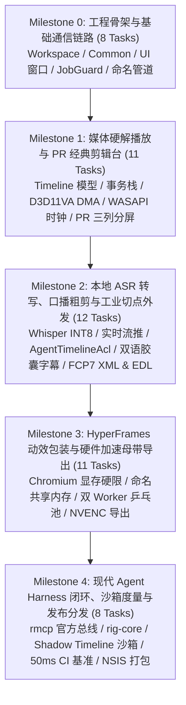

# 工程研发路线图与原子任务看板 (Development Roadmap & Task Board)

> **版本**：v0.2.0 (Modern Agent Harness & MCP Aligned)  
> **更新时间**：2026-10-05  
> **适用技术栈**：Rust 1.99, wgpu 30.0, egui 0.36, Python 3.13 (`uv`), Node.js 24 LTS, FFmpeg 9.0.2, Anime.js v4.5, `rmcp`, `rig-core`  
> **状态索引**：`[ ]` 待开发 | `[/]` 进行中 | `[x]` 已完成并通过验收 | `[-]` 已废弃/跳过  
> **当前活动里程碑**：**Milestone 0 (M0)**  
> **核心地位**：指导 ClipFlow 全生命周期的任务分解、依赖时序、验收命令 (DoD) 与进度追踪的单一执行事实来源。

---

## 1. 研发执行与协作准则 (Engineering Conventions)

1. **单任务闭环原则**：每个原子任务（Task）代码量控制在 $100 \sim 400$ 行，具有明确的前置依赖、涉改模块、对应规范与自动化验证命令 (DoD)；严禁未验证合入代码。
2. **测试先行与零回归**：涉及数据模型、数学时间计算、通信契约与状态机核心功能，必须先编写单元测试（Unit Test），确保 `cargo test` 100% 覆盖关键边界分支。
3. **断点续写机制**：每次会话交接或开发中断时，将当前正在推进的任务标记为 `[/]`，并在任务下方注明最新的测试结果或阻塞点，保证下一轮开发零认知损耗继续推进。
4. **统一分支规范**：各里程碑在对应特性分支（如 `feature/m0-scaffold`）开发，全部 Task 验证通过后方可合入 `main`。
5. **依赖收口红线**：严禁私自增加 `Cargo.toml`、`pyproject.toml` 或 `package.json` 外部依赖；所有业务规格以 [docs](README.md) 19 篇核心规范为准。

---

## 2. 里程碑概览与关键路径 (Critical Path)


```mermaid
flowchart TD
    M0["Milestone 0: 工程骨架与基础通信链路 (8 Tasks)\nWorkspace / Common / UI 窗口 / JobGuard / 命名管道"]
    M1["Milestone 1: 媒体硬解播放与 PR 经典剪辑台 (11 Tasks)\nTimeline 模型 / 事务栈 / D3D11VA DMA / WASAPI 时钟 / PR 三列分屏"]
    M2["Milestone 2: 本地 ASR 转写、口播粗剪与工业切点外发 (12 Tasks)\nWhisper INT8 / 实时流推 / AgentTimelineAcl / 双语胶囊字幕 / FCP7 XML & EDL"]
    M3["Milestone 3: HyperFrames 动效包装与硬件加速母带导出 (11 Tasks)\nChromium 显存硬限 / 命名共享内存 / 双 Worker 乒乓池 / NVENC 导出"]
    M4["Milestone 4: 现代 Agent Harness 闭环、沙箱度量与发布分发 (8 Tasks)\nrmcp 官方总线 / rig-core / Shadow Timeline 沙箱 / 50ms CI 基准 / NSIS 打包"]

    M0 --> M1 --> M2 --> M3 --> M4
```

---

## 3. Milestone 0 (M0)：工程骨架与基础通信链路

- **核心目标**：完成 Polyglot Monorepo 多语言多进程骨架搭建，实现 Rust 宿主窗口秒开与 Windows Job Object 内核级安全通信链路。
- **总任务数**：8 个原子任务

- [ ] **M0-T01 多语言仓库根工程初始化**
  - **前置依赖**：无
  - **涉改模块**：根目录 `Cargo.toml`, `.cargo/config.toml`, `pyproject.toml`, `package.json`, `.python-version`
  - **对应规范**：[environment-setup.md](environment-setup.md) & [codebase-structure.md](codebase-structure.md)
  - **核心交付物**：配置 MSVC 编译优化、6 个 Rust Crate 骨架目录、`uv` 锁定 Python 3.13 虚拟环境与 Node.js 24 基础包声明。
  - **验收命令 (DoD)**：
    ```powershell
    cargo check --workspace
    uv run python --version # 输出 3.13.x
    node --version          # 输出 v24.x.x
    ```

- [ ] **M0-T02 基础类型与时间数学库实现 (`clipflow-common`)**
  - **前置依赖**：M0-T01
  - **涉改模块**：`crates/clipflow-common/`
  - **对应规范**：[timeline-data-model.md 第 1 节](timeline-data-model.md)
  - **核心交付物**：实现 `RationalTime` 有理数时间、`TimeRange` 左闭右开区间、`SmpteTimecode` SMPTE 时间码解析与格式化、系统统一错误枚举 `ClipFlowError`。
  - **验收命令 (DoD)**：
    ```powershell
    cargo test -p clipflow-common
    ```

- [ ] **M0-T03 主窗口宿主与 Neutral Modern 深色视觉主题 (`clipflow-app` & `clipflow-ui`)**
  - **前置依赖**：M0-T01, M0-T02
  - **涉改模块**：`crates/clipflow-app/`, `crates/clipflow-ui/`
  - **对应规范**：[ui-spec.md](ui-spec.md)
  - **核心交付物**：基于 `eframe 0.36` / `wgpu 30.0` 初始化宿主窗口，配置 OpenDesign Neutral Modern 色彩 Tokens、几何圆角梯队（12/8/4px）与抗疲劳深岩灰 `#0F1115` 底板。
  - **验收命令 (DoD)**：
    ```powershell
    cargo run -p clipflow-app
    # 窗口正常弹出，呈现标准 Neutral Modern 深色主题，无闪烁
    ```

- [ ] **M0-T04 达芬奇式底部 Dock 栏交互与工作流路由**
  - **前置依赖**：M0-T03
  - **涉改模块**：`crates/clipflow-ui/`
  - **对应规范**：[ui-spec.md 第 5.2 节](ui-spec.md) & [prd.md 第 2 节](prd.md)
  - **核心交付物**：实现高度 48px 底部 Dock 栏，支持 6 大分页（`AGENT`, `EDIT`, `MOTION`, `AUDIO`, `IMAGE`, `DELIVER`）单选切换与 2px 钴蓝 `#2F6FEB` 激活指示线。
  - **验收命令 (DoD)**：
    ```powershell
    cargo test -p clipflow-ui --test dock_bar_navigation
    ```

- [ ] **M0-T05 Windows Job Object 内核级生命周期强绑定 (`clipflow-ipc`)**
  - **前置依赖**：M0-T01, M0-T02
  - **涉改模块**：`crates/clipflow-ipc/`
  - **对应规范**：[ipc-protocol.md 第 1 节](ipc-protocol.md) & [architecture.md 第 4.6 节](architecture.md)
  - **核心交付物**：实现 `JobGuard`，配置 `JOB_OBJECT_LIMIT_KILL_ON_JOB_CLOSE`，通过 Win32 API 以 `CREATE_SUSPENDED` 原子挂入子进程树，保证宿主崩溃时孤儿逃逸率 0.0%。
  - **验收命令 (DoD)**：
    ```powershell
    cargo test -p clipflow-ipc --test job_guard_cleanup
    ```

- [ ] **M0-T06 异步双工命名管道与 JSON-RPC 2.0 握手信道 (`clipflow-ipc`)**
  - **前置依赖**：M0-T05
  - **涉改模块**：`crates/clipflow-ipc/`, `python/clipflow_worker/`
  - **对应规范**：[ipc-protocol.md 第 1 节与第 2 节](ipc-protocol.md)
  - **核心交付物**：实现 Windows 命名管道服务端（`\\.\pipe\clipflow-py-{pid}`）与客户端，配置 SDDL 严格访问控制列表，完成双向 JSON-RPC 2.0 `ping`/`pong` 心跳握手（RTT $\le 0.35\text{ms}$）。
  - **验收命令 (DoD)**：
    ```powershell
    cargo test -p clipflow-ipc --test named_pipe_roundtrip
    ```

- [ ] **M0-T07 子进程 `stderr` 异步排空与集中日志收集**
  - **前置依赖**：M0-T06
  - **涉改模块**：`crates/clipflow-ipc/`
  - **对应规范**：[ipc-protocol.md 第 1 节](ipc-protocol.md) & [security-and-privacy.md 第 3 节](security-and-privacy.md)
  - **核心交付物**：实现 `AsyncStderrDrainer` 管道流式消费子进程标准错误，彻底根除 MSVCRT 4KB 缓冲死锁，并将日志结构化注入 Rust `tracing` 集中落盘。
  - **验收命令 (DoD)**：
    ```powershell
    cargo test -p clipflow-ipc --test stderr_drain_deadlock_free
    ```

- [ ] **M0-T08 M0 里程碑集成冒烟套件**
  - **前置依赖**：M0-T01 ~ M0-T07
  - **涉改模块**：`crates/clipflow-app/`
  - **对应规范**：[qa-and-benchmarks.md 第 5.1 节](qa-and-benchmarks.md)
  - **核心交付物**：串联主窗口、Dock 栏、Python 子进程生命周期绑定与关闭级联强杀冒烟测试，输出 M0 阶段验收基线。
  - **验收命令 (DoD)**：
    ```powershell
    cargo test --workspace
    uv run pytest python/clipflow_worker/tests/
    ```

---

## 4. Milestone 1 (M1)：媒体硬解播放与 PR 经典剪辑台 (Target Release: v0.1.0)

- **核心目标**：实现时间轴数据模型、命令模式撤销/重做、FFmpeg 9.0.2 D3D11VA 硬解、WASAPI 原生主时钟与 PR 三列经典剪辑工作台。
- **总任务数**：11 个原子任务

- [ ] **M1-T01 纯逻辑多轨数据模型与序列化 (`clipflow-timeline`)**
  - **前置依赖**：M0-T02
  - **涉改模块**：`crates/clipflow-timeline/`
  - **对应规范**：[timeline-data-model.md 第 2 节](timeline-data-model.md)
  - **核心交付物**：实现 `Project`, `Sequence`, `Track`, `Clip`, `Keyframe` 核心领域模型，支持多轨类型区分与 Zstandard 压缩序列化。
  - **验收命令 (DoD)**：
    ```powershell
    cargo test -p clipflow-timeline --test model_serialization
    ```

- [ ] **M1-T02 命令模式事务栈与 WAL 预写 (`clipflow-timeline`)**
  - **前置依赖**：M1-T01
  - **涉改模块**：`crates/clipflow-timeline/`
  - **对应规范**：[timeline-data-model.md 第 3 节](timeline-data-model.md)
  - **核心交付物**：实现 `TimelineCommand` 特质、`SplitClipCommand`、`RippleDeleteCommand`、`CompoundCommand` 事务与 `TimelineHistory` 撤销/重做栈。
  - **验收命令 (DoD)**：
    ```powershell
    cargo test -p clipflow-timeline --test command_undo_redo
    ```

- [ ] **M1-T03 FFmpeg 9.0.2 D3D11VA 硬件解码与锁页帧池 (`clipflow-media`)**
  - **前置依赖**：M0-T02
  - **涉改模块**：`crates/clipflow-media/`
  - **对应规范**：[media-pipeline-spec.md 第 1 节与第 2 节](media-pipeline-spec.md)
  - **核心交付物**：封装 FFmpeg 9.0.2 硬件加速接口，实现 D3D11VA 硬解管线与 `PinnedFramePool` 锁页环形帧池。
  - **验收命令 (DoD)**：
    ```powershell
    cargo test -p clipflow-media --test d3d11va_decode_smoke
    ```

- [ ] **M1-T04 WGSL NV12 双平面转 RGBA 色彩矩阵着色器 (`clipflow-media`)**
  - **前置依赖**：M1-T03
  - **涉改模块**：`crates/clipflow-media/`
  - **对应规范**：[media-pipeline-spec.md 第 2.3 节](media-pipeline-spec.md)
  - **核心交付物**：编写 WGSL 色彩转换着色器，支持 BT.709 限制色域/完全色域精准转换与多轨道 Alpha 混合。
  - **验收命令 (DoD)**：
    ```powershell
    cargo test -p clipflow-media --test nv12_shader_render
    ```

- [ ] **M1-T05 WASAPI 原生硬件单调主时钟与迟滞比较器 (`clipflow-media`)**
  - **前置依赖**：M0-T02
  - **涉改模块**：`crates/clipflow-media/`
  - **对应规范**：[media-pipeline-spec.md 第 3 节](media-pipeline-spec.md) & [architecture.md 第 4.5 节](architecture.md)
  - **核心交付物**：实现 `MasterClockProvider`、`MonotonicClampedClock` 无锁单调箝位时钟与 `HysteresisSyncComparator` 双阈值迟滞渲染调度器（音画同步容差 $\le 16.6\text{ms}$）。
  - **验收命令 (DoD)**：
    ```powershell
    cargo test -p clipflow-media --test master_clock_monotonicity
    ```

- [ ] **M1-T06 音频波形峰值文件 (`.peak`) 提取与多级 LOD 金字塔**
  - **前置依赖**：M1-T05
  - **涉改模块**：`crates/clipflow-media/`
  - **对应规范**：[media-pipeline-spec.md 第 4.3 节与第 4.4 节](media-pipeline-spec.md)
  - **核心交付物**：实现定宽二进制 `.peak` 提取算法、Min/Max 浮点降采样金字塔与 LOD 动态防抖切换。
  - **验收命令 (DoD)**：
    ```powershell
    cargo test -p clipflow-media --test peak_cache_generation
    ```

- [ ] **M1-T07 PR 经典三列分屏工作台界面实现 (`clipflow-ui`)**
  - **前置依赖**：M0-T03, M1-T01
  - **涉改模块**：`crates/clipflow-ui/`
  - **对应规范**：[edit-layout-spec.md 第 1 节与第 2 节](edit-layout-spec.md)
  - **核心交付物**：依据 Premiere Pro 工业拓扑构建三列分屏网格（左侧 32% 源监视器+素材池，中间 48% 节目监视器+时间线，右侧 20% 效果控件与属性检查器）。
  - **验收命令 (DoD)**：
    ```powershell
    cargo test -p clipflow-ui --test edit_layout_grid_render
    ```

- [ ] **M1-T08 核心多轨公用时间线视图与二维视口裁剪 (`clipflow-ui`)**
  - **前置依赖**：M1-T07
  - **涉改模块**：`crates/clipflow-ui/`
  - **对应规范**：[edit-layout-spec.md 第 4.1 节](edit-layout-spec.md) & [ui-spec.md 第 5.3 节](ui-spec.md)
  - **核心交付物**：实现正交二维视口剪裁（Y 轴轨道垂直二分粗筛 + X 轴时间切片二分），粗筛耗时 $\le 0.04\text{ms}$，支撑 1000+ 切片 60FPS 丝滑缩放。
  - **验收命令 (DoD)**：
    ```powershell
    cargo test -p clipflow-ui --test timeline_culling_performance
    ```

- [ ] **M1-T09 J-K-L 动态飞梭走带与剪辑修饰键行为矩阵 (`clipflow-ui`)**
  - **前置依赖**：M1-T08
  - **涉改模块**：`crates/clipflow-ui/`
  - **对应规范**：[edit-layout-spec.md 第 2.5.2 节](edit-layout-spec.md)
  - **核心交付物**：实现 J-K-L 变速走带状态机（$1\times \to 2\times \to 4\times \to 8\times$ 步进）、空格启停、`C` 剃刀切割、`B` 波纹编辑与播放指针拖拽吸附。
  - **验收命令 (DoD)**：
    ```powershell
    cargo test -p clipflow-ui --test shuttle_transport_state
    ```

- [ ] **M1-T10 监视器 1/4 代理流控与 DeviceLost 容灾看门狗 (`clipflow-media`)**
  - **前置依赖**：M1-T03, M1-T04
  - **涉改模块**：`crates/clipflow-media/`
  - **对应规范**：[media-pipeline-spec.md 第 6 节](media-pipeline-spec.md) & [architecture.md 第 4.4 节](architecture.md)
  - **核心交付物**：集成 `ProxyGovernor` 快速拖拽自适应切入 1/4 代理（总线带宽 $\le 60\text{MB/s}$），实现 DirectX TDR 超时与设备丢失 100ms 无感自愈。
  - **验收命令 (DoD)**：
    ```powershell
    cargo test -p clipflow-media --test device_lost_recovery
    ```

- [ ] **M1-T11 M1 音画同步与 60 FPS 播放全链路验收**
  - **前置依赖**：M1-T01 ~ M1-T10
  - **涉改模块**：`crates/clipflow-app/`
  - **对应规范**：[qa-and-benchmarks.md 第 1 节与第 2 节](qa-and-benchmarks.md)
  - **核心交付物**：全链路集成测试，断言 4K 60FPS 回放单帧误差 $\le 16.6\text{ms}$，60 分钟长效漂移 $\le 2.0\text{ms}$，静止态 CPU 占用 0.0%。
  - **验收命令 (DoD)**：
    ```powershell
    cargo test -p clipflow-app --test m1_av_sync_benchmark -- --nocapture
    ```

---

## 5. Milestone 2 (M2)：本地 ASR 转写、口播粗剪与工业切点外发

- **核心目标**：集成 faster-whisper 本地 ASR、实现长音频分块缝合与进度租约、文本驱动剪辑、GPU 离屏胶囊字幕渲染以及 Apple FCP7 XML / EDL 无损切点外发。
- **总任务数**：12 个原子任务

- [ ] **M2-T01 Python Worker `faster-whisper` 模型加载与 CUDA/CPU 自愈状态机**
  - **前置依赖**：M0-T06
  - **涉改模块**：`python/clipflow_worker/asr/`
  - **对应规范**：[ipc-protocol.md 第 2.1 节](ipc-protocol.md) & [cache-and-storage-spec.md 第 3.2 节](cache-and-storage-spec.md)
  - **核心交付物**：锁定 `faster-whisper 1.2.1` 与 `large-v2` INT8 权重，实现 GPU 显存 OOM 自动降级 CPU 模式（耗时 $\le 3.5\text{s}$）与黑名单过滤。
  - **验收命令 (DoD)**：
    ```powershell
    uv run pytest python/clipflow_worker/tests/test_asr_worker.py
    ```

- [ ] **M2-T02 IPC `asr.chunk_stream` 实时流式分片推送、长音频缝合与进度租约**
  - **前置依赖**：M2-T01
  - **涉改模块**：`crates/clipflow-ipc/`, `python/clipflow_worker/`
  - **对应规范**：[ipc-protocol.md 第 2.1 节与第 4 节](ipc-protocol.md) & [architecture.md 第 4.6 节](architecture.md)
  - **核心交付物**：实现 20 分钟长音频 10 秒重叠分块与 Groq 中点缝合算法（误差 $\le 2\text{ms}$），集成 `ProgressLeaseTracker` 动态租约防误杀看门狗。
  - **验收命令 (DoD)**：
    ```powershell
    cargo test -p clipflow-ipc --test chunked_asr_streaming
    ```

- [ ] **M2-T03 IPC 抢占式软中断与显存重置 (`asr.cancel`)**
  - **前置依赖**：M2-T02
  - **涉改模块**：`crates/clipflow-ipc/`, `python/clipflow_worker/`
  - **对应规范**：[ipc-protocol.md 第 2.1 节](ipc-protocol.md)
  - **核心交付物**：实现 `asr.cancel` 信令，在 2 秒音频分块边界平稳跳出循环并释放 PyTorch CUDA 显存。
  - **验收命令 (DoD)**：
    ```powershell
    cargo test -p clipflow-ipc --test asr_cancel_preemption
    ```

- [ ] **M2-T04 `AgentTimelineAcl` 防腐网关与帧网格硬吸附 (`clipflow-timeline`)**
  - **前置依赖**：M1-T01
  - **涉改模块**：`crates/clipflow-timeline/`
  - **对应规范**：[timeline-data-model.md 第 1.4 节](timeline-data-model.md)
  - **核心交付物**：构建单向防腐栅栏，将外部浮点秒数严格吸附至当前序列帧网格分界点并消除 1 帧空洞；只读路径保持 `f64` 免截断。
  - **验收命令 (DoD)**：
    ```powershell
    cargo test -p clipflow-timeline --test agent_timeline_acl
    ```

- [ ] **M2-T05 口播停顿、语义断句逆向映射与切除分析 (`speech.analyze_cuts` & `nlp.align_sentences`)**
  - **前置依赖**：M2-T02
  - **涉改模块**：`python/clipflow_worker/nlp/`
  - **对应规范**：[ipc-protocol.md 第 2.2 节与第 2.3 节](ipc-protocol.md)
  - **核心交付物**：实现 VAD 气口与停顿识别，支持序列比对逆向映射提取物理起止时间戳，带 500ms 静音与高频连词规则降级兜底。
  - **验收命令 (DoD)**：
    ```powershell
    uv run pytest python/clipflow_worker/tests/test_nlp_align.py
    ```

- [ ] **M2-T06 文本驱动剪辑双模联动状态机 (`clipflow-ui`)**
  - **前置依赖**：M1-T08, M2-T05
  - **涉改模块**：`crates/clipflow-ui/`
  - **对应规范**：[subtitle-render-spec.md 第 4 节](subtitle-render-spec.md)
  - **核心交付物**：实现台词文本与时间轴片段双向联动交互，支持波纹切除模式 (Ripple Cut) 与原地错别字修正模式 (In-Place Correction)。
  - **验收命令 (DoD)**：
    ```powershell
    cargo test -p clipflow-ui --test text_based_editing_state
    ```

- [ ] **M2-T07 过零点检测、辅音保护与 5ms 微等功率交叉渐变 (`clipflow-media`)**
  - **前置依赖**：M1-T05
  - **涉改模块**：`crates/clipflow-media/`
  - **对应规范**：[qa-and-benchmarks.md 第 3.2 节](qa-and-benchmarks.md)
  - **核心交付物**：实现切点边界过零点搜索（$\le 2.0\text{ms}$ 窗口）与 5ms 恒定功率音频交叉渐变，彻底消除爆音与爆鸣。
  - **验收命令 (DoD)**：
    ```powershell
    cargo test -p clipflow-media --test audio_zero_crossing_crossfade
    ```

- [ ] **M2-T08 基于 `cosmic-text` + `glyphon` 的 GPU 离屏文本与胶囊底板着色管线 (`clipflow-media`)**
  - **前置依赖**：M1-T04
  - **涉改模块**：`crates/clipflow-media/`
  - **对应规范**：[subtitle-render-spec.md](subtitle-render-spec.md)
  - **核心交付物**：实现 C1 字幕轨 GPU 着色流水线，包含 Windows 原生字体回退链、词级卡拉OK点亮与 WGSL SDF 抗锯齿圆角胶囊底板渲染（单次 Draw Call $\le 0.05\text{ms}$）。
  - **验收命令 (DoD)**：
    ```powershell
    cargo test -p clipflow-media --test subtitle_sdf_gpu_render
    ```

- [ ] **M2-T09 Apple FCP7 XML (`xmeml v5`) 流式序列化器 (`clipflow-timeline`)**
  - **前置依赖**：M1-T01
  - **涉改模块**：`crates/clipflow-timeline/`
  - **对应规范**：[timeline-data-model.md 第 5.2 节](timeline-data-model.md) & [architecture.md 第 4.7 节](architecture.md)
  - **核心交付物**：基于 `quick-xml` 实现平行多轨 1:1 原生流式映射，强制执行 RFC 3986 `file://localhost/...` 百分号转义，1000 切点纯导出耗时 $\le 15\text{ms}$。
  - **验收命令 (DoD)**：
    ```powershell
    cargo test -p clipflow-timeline --test fcp7_xml_export
    ```

- [ ] **M2-T10 规范化 CMX 3600 EDL 流式生成器 (`clipflow-timeline`)**
  - **前置依赖**：M1-T01
  - **涉改模块**：`crates/clipflow-timeline/`
  - **对应规范**：[timeline-data-model.md 第 5.3 节](timeline-data-model.md)
  - **核心交付物**：实现 80 列定宽对齐流式生成器，注入 `* FROM CLIP NAME` 传递 UTF-8 中文长路径，1000 切点生成耗时 $\le 5\text{ms}$。
  - **验收命令 (DoD)**：
    ```powershell
    cargo test -p clipflow-timeline --test edl_export
    ```

- [ ] **M2-T11 `ConformInspector` 静态合规预检与降级诊断扫描器**
  - **前置依赖**：M2-T09, M2-T10
  - **涉改模块**：`crates/clipflow-timeline/`, `crates/clipflow-ui/`
  - **对应规范**：[timeline-data-model.md 第 5.4 节](timeline-data-model.md)
  - **核心交付物**：静态扫描全序列图层，对 HyperFrames Web 动效及复杂变速自动弹出三级诊断看板并提供 ProRes 4444 替代建议。
  - **验收命令 (DoD)**：
    ```powershell
    cargo test -p clipflow-timeline --test conform_inspector
    ```

- [ ] **M2-T12 M2 外部非编套底与 1000 切点 0 帧漂移自动化验收**
  - **前置依赖**：M2-T01 ~ M2-T11
  - **涉改模块**：`crates/clipflow-app/`
  - **对应规范**：[qa-and-benchmarks.md 第 5.3 节](qa-and-benchmarks.md)
  - **核心交付物**：运行 1000 个连续切片全帧率覆盖序列化验证，断言首尾总时长有理数帧数差绝对为 0 帧，且在 PR / 达芬奇静默导入零告警。
  - **验收命令 (DoD)**：
    ```powershell
    cargo test -p clipflow-app --test m2_conforming_benchmark -- --nocapture
    ```

---

## 6. Milestone 3 (M3)：HyperFrames 动效包装与硬件加速母带导出

- **核心目标**：集成 Node.js 24 无头 Chromium 动效运行时、Anime.js v4.5 ESM 模板渲染、Win32 命名共享内存直灌、双 Worker 乒乓池以及 FFmpeg NVENC 母带导出。
- **总任务数**：11 个原子任务

- [ ] **M3-T01 Node.js 24 无头 Chromium 动效运行时搭建**
  - **前置依赖**：M0-T01
  - **涉改模块**：`node/hyperframes_renderer/`
  - **对应规范**：[hyperframes-spec.md 第 1 节](hyperframes-spec.md) & [environment-setup.md 第 2.3 节](environment-setup.md)
  - **核心交付物**：初始化裁切版无头 Chromium 运行环境（~70MB），注入虚拟时钟拦截器与逐帧步进求值入口。
  - **验收命令 (DoD)**：
    ```powershell
    npm test --prefix node/hyperframes_renderer
    ```

- [ ] **M3-T02 Chromium 512MB 显存硬配额注入与 CDP 内存清洗管线**
  - **前置依赖**：M3-T01
  - **涉改模块**：`node/hyperframes_renderer/`
  - **对应规范**：[hyperframes-spec.md 第 3.2 节](hyperframes-spec.md) & [security-and-privacy.md 第 2 节](security-and-privacy.md)
  - **核心交付物**：配置 `--force-gpu-mem-available-mb=512` 启动标志，实现每 120 帧强制触发 CDP `HeapProfiler.collectGarbage` 深度清洗，防止显存泄漏。
  - **验收命令 (DoD)**：
    ```powershell
    node node/hyperframes_renderer/tests/test_memory_governance.js
    ```

- [ ] **M3-T03 Win32 命名共享内存 Raw RGBA 传输环形池 (`clipflow-media`)**
  - **前置依赖**：M1-T04, M3-T01
  - **涉改模块**：`crates/clipflow-media/`
  - **对应规范**：[ipc-protocol.md 第 3 节](ipc-protocol.md) & [hyperframes-spec.md 第 4.1 节](hyperframes-spec.md)
  - **核心交付物**：实现 Windows `Local\clipflow-shm-{uuid}` 命名共享内存三槽位环形池与无锁读写，4K 动效单帧直灌延迟 $\le 1.5\text{ms}$。
  - **验收命令 (DoD)**：
    ```powershell
    cargo test -p clipflow-media --test shared_memory_consumer
    ```

- [ ] **M3-T04 双 Worker 异步预热乒乓池 (`PingPongPoolManager`)**
  - **前置依赖**：M3-T03
  - **涉改模块**：`crates/clipflow-ipc/`, `node/hyperframes_renderer/`
  - **对应规范**：[hyperframes-spec.md 第 4.2 节](hyperframes-spec.md)
  - **核心交付物**：实现双无头实例乒乓交替调度（Worker A 渲染前台时，Worker B 在后台静默预编译下一模板并预热 GPU 着色器），消除模板切换黑屏卡顿。
  - **验收命令 (DoD)**：
    ```powershell
    cargo test -p clipflow-ipc --test ping_pong_pool_manager
    ```

- [ ] **M3-T05 动效纯函数求值契约静态 AST 扫描器 (`TemplateValidator`)**
  - **前置依赖**：M3-T01
  - **涉改模块**：`node/hyperframes_renderer/`
  - **对应规范**：[hyperframes-spec.md 第 2.2 节](hyperframes-spec.md) & [security-and-privacy.md 第 2.3 节](security-and-privacy.md)
  - **核心交付物**：实现基于 Babel/SWC 的静态 AST 扫描器，硬性拦截 `Math.random()`、网络请求与 Node 全局对象，确保 Anime.js v4.5 ESM 模板逐帧确定性。
  - **验收命令 (DoD)**：
    ```powershell
    node node/hyperframes_renderer/tests/test_template_validator.js
    ```

- [ ] **M3-T06 动效工作台实时代码编辑与图层挂载 (`clipflow-ui`)**
  - **前置依赖**：M1-T08, M3-T03
  - **涉改模块**：`crates/clipflow-ui/`
  - **对应规范**：[hyperframes-spec.md 第 6 节](hyperframes-spec.md)
  - **核心交付物**：实现【动画】专属视窗，集成代码编辑器、实时预览视口与预置模板资产库（Lower Thirds、标题卡、图表动画）。
  - **验收命令 (DoD)**：
    ```powershell
    cargo test -p clipflow-ui --test motion_workspace_render
    ```

- [ ] **M3-T07 动效子进程崩溃捕获与断点接续看门狗 (`FrameLedger`)**
  - **前置依赖**：M3-T04
  - **涉改模块**：`crates/clipflow-ipc/`
  - **对应规范**：[hyperframes-spec.md 第 7 节](hyperframes-spec.md)
  - **核心交付物**：实现 100ms 异常退出捕获，维护 `FrameLedger` 已渲染帧完成账本，进程崩溃重启后从最后断点帧无缝接续，零重复渲染。
  - **验收命令 (DoD)**：
    ```powershell
    cargo test -p clipflow-ipc --test motion_watchdog_resilience
    ```

- [ ] **M3-T08 FFmpeg NVENC 硬件加速多轨母带离线导出管线 (`clipflow-media`)**
  - **前置依赖**：M1-T03, M3-T03
  - **涉改模块**：`crates/clipflow-media/`
  - **对应规范**：[media-pipeline-spec.md 第 5 节](media-pipeline-spec.md)
  - **核心交付物**：实现离线多轨图层混合与 FFmpeg NVENC / QSV / AMF 硬件编码管线，支持 H.264 / HEVC / ProRes 422 导出。
  - **验收命令 (DoD)**：
    ```powershell
    cargo test -p clipflow-media --test master_export_pipeline
    ```

- [ ] **M3-T09 声音页混音台通道条与 MasterBus 效果器数据绑定 (`clipflow-ui`)**
  - **前置依赖**：M1-T05, M1-T07
  - **涉改模块**：`crates/clipflow-ui/`
  - **对应规范**：[workflow-pages-spec.md 第 2 节](workflow-pages-spec.md)
  - **核心交付物**：实现【声音】页面 Fairlight 式混音台、通道条推子、Pan 声相调节、4 段参量 EQ 曲线及 LUFS 实时响度表。
  - **验收命令 (DoD)**：
    ```powershell
    cargo test -p clipflow-ui --test audio_mixer_workspace
    ```

- [ ] **M3-T10 导出工作台多平台预设与离屏渲染队列 (`clipflow-ui`)**
  - **前置依赖**：M3-T08
  - **涉改模块**：`crates/clipflow-ui/`
  - **对应规范**：[workflow-pages-spec.md 第 4 节](workflow-pages-spec.md)
  - **核心交付物**：实现【导出】页面多平台参数预设库（B站/抖音/YouTube/ProRes）、走带监视器、任务队列管理与进度条推流。
  - **验收命令 (DoD)**：
    ```powershell
    cargo test -p clipflow-ui --test deliver_workspace
    ```

- [ ] **M3-T11 M3 动效确定性与万帧母带导出全连续性验收**
  - **前置依赖**：M3-T01 ~ M3-T10
  - **涉改模块**：`crates/clipflow-app/`
  - **对应规范**：[qa-and-benchmarks.md 第 4 节](qa-and-benchmarks.md)
  - **核心交付物**：执行万帧母带导出连续性压测，断言 0 掉帧、0 闪烁、显存稳定在 512MB 配额内，导出速度 $\ge 2.5\times$ 实时倍速。
  - **验收命令 (DoD)**：
    ```powershell
    cargo test -p clipflow-app --test m3_motion_export_benchmark -- --nocapture
    ```

---

## 7. Milestone 4 (M4)：现代 Agent Harness 闭环、沙箱度量与发布分发

- **核心目标**：全面落地现代 Agent Harness（Thin Agent, Fat Platform）架构，集成官方 `rmcp` 进程内总线、`rig-core` 统一 LLM 客户端、`ShadowTimelineSandbox` 虚拟沙箱即时反馈、Tokio `CancellationToken` 级联打断、50ms CI 黄金回归基准与 NSIS 安装包打包。
- **总任务数**：8 个原子任务

- [ ] **M4-T01 官方 `rmcp` 架构落地与全套 MCP Server 注册 (`clipflow-ipc`)**
  - **前置依赖**：M1-T01, M2-T04
  - **涉改模块**：`crates/clipflow-ipc/`
  - **对应规范**：[agent-director-spec.md 第 3 节](agent-director-spec.md)
  - **核心交付物**：基于官方 `rmcp` SDK 搭建进程内异步内存总线（In-Process Channel），注册 `TimelineMcpServer`（4 个只读工具 `timeline_inspect_*`、4 个写入工具 `timeline_propose_cuts` 等）、`PerceptionMcpServer` 与 `AssetMcpServer`，工具调用开销 $\le 0.05\text{ms}$。
  - **验收命令 (DoD)**：
    ```powershell
    cargo test -p clipflow-ipc --test mcp_server_registry
    ```

- [ ] **M4-T02 基于 `rig-core` 的多模型统一驱动与思考链契约 (`clipflow-ipc`)**
  - **前置依赖**：M4-T01
  - **涉改模块**：`crates/clipflow-ipc/`
  - **对应规范**：[agent-director-spec.md 第 2.1 节](agent-director-spec.md) & [security-and-privacy.md 第 5.3 节](security-and-privacy.md)
  - **核心交付物**：基于 `rig-core` 统一封装 OpenAI / Anthropic 双协议客户端与本地 Ollama 驱动，实现 `LlmProviderConfig`，强制保持 Thinking 思考块多轮透传，API Key 经 Windows DPAPI 加密存储。
  - **验收命令 (DoD)**：
    ```powershell
    cargo test -p clipflow-ipc --test rig_llm_provider
    ```

- [ ] **M4-T03 `ShadowTimelineSandbox` 纯内存沙箱与即时度量反馈评估器 (`clipflow-ipc`)**
  - **前置依赖**：M4-T01
  - **涉改模块**：`crates/clipflow-ipc/`
  - **对应规范**：[agent-director-spec.md 第 1 节与第 3.4 节](agent-director-spec.md)
  - **核心交付物**：构建纯内存零副作用虚拟时间轴沙箱，实现 `MetricEvaluator`，写工具执行瞬间返回剪后时长、停顿消除率、图层重叠预警等客观物理度量反馈（`SandboxExecutionFeedback`）。
  - **验收命令 (DoD)**：
    ```powershell
    cargo test -p clipflow-ipc --test shadow_sandbox_feedback
    ```

- [ ] **M4-T04 超长素材分幕与 Ephemeral Sub-Agent 并发隔离调度 (`clipflow-ipc`)**
  - **前置依赖**：M4-T02, M4-T03
  - **涉改模块**：`crates/clipflow-ipc/`
  - **对应规范**：[agent-director-spec.md 第 2.3 节与第 2.4 节](agent-director-spec.md)
  - **核心交付物**：实现 Director Coordinator 宏观分幕与动态派发 `ActPacingSubAgent`，各子智能体在干净隔离的 Tokio Task 上下文中独立求解，支持本地声学“贪婪抢跑”（$\le 2\text{s}$）与 SSE 分幕流式点亮。
  - **验收命令 (DoD)**：
    ```powershell
    cargo test -p clipflow-ipc --test ephemeral_subagents_isolation
    ```

- [ ] **M4-T05 上下文滚动修剪 (`ContextCompaction`) 与 Tokio `CancellationToken` 级联打断**
  - **前置依赖**：M4-T04
  - **涉改模块**：`crates/clipflow-ipc/`
  - **对应规范**：[agent-director-spec.md 第 2.2 节与第 8.1 节](agent-director-spec.md)
  - **核心交付物**：实现工具查询出参哈希摘要折叠；实现 `UserPreemptionGuard`，创作者移动播放头瞬间触发根 `CancellationToken` 级联强停所有子任务并在 $\le 5\text{ms}$ 内回滚清空沙箱。
  - **验收命令 (DoD)**：
    ```powershell
    cargo test -p clipflow-ipc --test cancellation_preemption
    ```

- [ ] **M4-T06 熔断看门狗 (`CircuitBreakerPolicy`) 与 `MockLlmDriver` 50ms CI 黄金回归基准**
  - **前置依赖**：M4-T05
  - **涉改模块**：`crates/clipflow-ipc/`
  - **对应规范**：[agent-director-spec.md 第 8.2 节与第 8.3 节](agent-director-spec.md) & [qa-and-benchmarks.md 第 6.4 节](qa-and-benchmarks.md)
  - **核心交付物**：实现 8 步硬上限、重复调用探测器与双水位 Token 熔断断路器；实现纯内存 `MockLlmDriver`，单线程全链路测试耗时绝对锁定在 $\le 50\text{ms}$。
  - **验收命令 (DoD)**：
    ```powershell
    cargo test -p clipflow-ipc --test agent_mock_harness_eval -- --nocapture
    ```

- [ ] **M4-T07 Agent 导演工作台专用 UI 与 Ghost Layer 时间线实时投影 (`clipflow-ui`)**
  - **前置依赖**：M1-T08, M4-T03
  - **涉改模块**：`crates/clipflow-ui/`
  - **对应规范**：[agent-director-spec.md 第 5 节](agent-director-spec.md) & [timeline-data-model.md 第 2.5 节](timeline-data-model.md)
  - **核心交付物**：实现【Agent】三栏视窗（大纲瀑布/对话流/沙箱指标），在公用时间线上生成半透明 Ghost Layer 虚拟投影，点击“一键采纳”经 Staged DAG 编译器生成单一 `CompoundCommand` 原子落地。
  - **验收命令 (DoD)**：
    ```powershell
    cargo test -p clipflow-ui --test agent_workspace_ghost_layer
    ```

- [ ] **M4-T08 复合运行时打包编排、NSIS 单文件安装包与全量 SLA 终检验收**
  - **前置依赖**：M4-T01 ~ M4-T07
  - **涉改模块**：根目录与 `packaging/`
  - **对应规范**：[packaging-release.md](packaging-release.md) & [qa-and-benchmarks.md](qa-and-benchmarks.md)
  - **核心交付物**：编排 Lite 版（$\le 250\text{MB}$）与 Full 版运行时目录，配置 NSIS 自动化打包脚本与代码签名，执行全量自动化 SLA 准入回归测试。
  - **验收命令 (DoD)**：
    ```powershell
    cargo test --workspace
    uv run pytest python/clipflow_worker/tests/
    npm test --prefix node/hyperframes_renderer
    cargo test -p clipflow-app --test agent_golden_eval -- --nocapture
    ```

---

## 8. 任务执行与日常跟踪流程 (Daily Workflow)

1. **领取任务**：从当前活跃里程碑按依赖拓扑选择首个未开始任务，将状态由 `[ ]` 切换为 `[/]`，创建本地特性分支 `feature/{task-id}`。
2. **规范查阅**：深入研读任务对应规范中的架构图、数据结构定义与伪代码。
3. **测试先行**：在对应 crate 的 `tests/` 目录下编写该任务的集成测试用例，运行 `cargo test` 验证 Red 失败状态。
4. **精简实现**：编写业务代码，保持最小代码量闭环，通过所有测试达到 Green 状态。
5. **静态查错与验收**：运行 `cargo clippy` 与对应验收命令 (DoD)，确认零 Warning、零 Error。
6. **看板推进**：将任务标记为 `[x]`，记录提交 commit，推动看板向下一任务演进。

---

## 9. 远期特性占位 (M5+)

- **M5: 多机位智能切换与自动机位切镜 (Multi-Cam AI Director)**
- **M6: OpenTimelineIO (OTIO) 好莱坞双向套底中枢与云端协同 (Hollywood Roundtrip)**
- **M7: 虚拟数字人音唇同步实时驱动管线 (Audio2Lip Real-Time Driving)**
