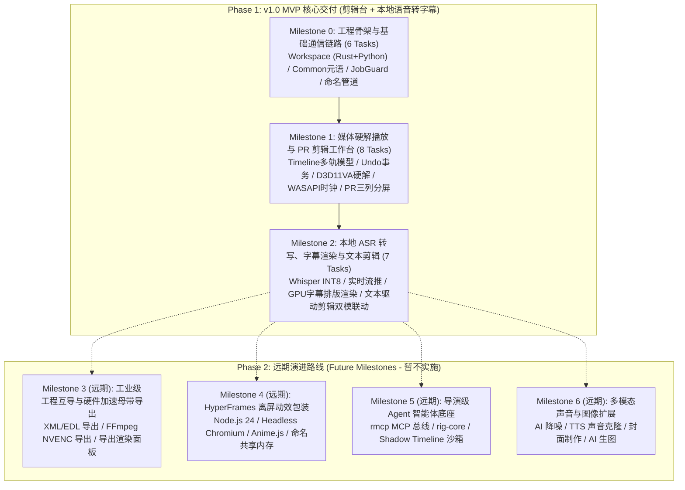

# 工程研发路线图与原子任务看板 (Development Roadmap & Task Board)

> **版本**：v0.3.0 (v1.0 MVP: 剪辑工作台与语音转字幕纯净收敛版)  
> **更新时间**：2026-10-05  
> **适用技术栈**：Rust 1.99, wgpu 30.0, egui 0.36, Python 3.13 (`uv`), FFmpeg 9.0.2, faster-whisper 1.2.1  
> **状态索引**：`[ ]` 待开始 | `[/]` 进行中 | `[x]` 已完成并通过验收 | `[-]` 已废弃/跳过  
> **当前活动里程碑**：**Milestone 0 (M0)**  
> **核心地位**：指导 ClipFlow 全生命周期的任务分解、依赖时序、验收命令 (DoD) 与进度追踪的单一执行事实来源 (SSOT)。

---

## 1. 研发执行与协作准则 (Engineering Conventions)

1. **单任务闭环原则**：每个原子任务（Task）代码量控制在 $100 \sim 400$ 行，具有明确的前置依赖、涉改模块、对应规范与自动化验证命令 (DoD)；严禁未经验证合入代码。
2. **测试先行与零回归**：涉及数据模型、数学时间计算、通信契约与状态机核心功能，必须先编写单元测试（Unit Test），确保 `cargo test` 100% 覆盖关键边界分支。
3. **断点续写机制**：每次会话交接或开发中断时，将当前正在推进的任务标记为 `[/]`，并在任务下方注明最新的测试结果或阻塞点，保证下一轮开发零认知损耗继续推进。
4. **统一分支规范**：各里程碑在对应特性分支（如 `feature/m0-scaffold`）开发，全部 Task 验证通过后方可合入 `main`。
5. **依赖收口红线**：v1.0 严禁引入 Node.js、npm 或外部动效包；严禁私自增加 `Cargo.toml` 与 `pyproject.toml` 依赖；所有业务规格以 [docs](README.md) 核心规范为准。

---

## 2. 里程碑概览与关键路径 (Critical Path)


```mermaid
flowchart TD
    subgraph Phase1["Phase 1: v1.0 MVP 核心交付 (剪辑台 + 本地语音转字幕)"]
        M0["Milestone 0: 工程骨架与基础通信链路 (6 Tasks)\nWorkspace (Rust+Python) / Common元语 / JobGuard / 命名管道"]
        M1["Milestone 1: 媒体硬解播放与 PR 剪辑工作台 (8 Tasks)\nTimeline多轨模型 / Undo事务 / D3D11VA硬解 / WASAPI时钟 / PR三列分屏"]
        M2["Milestone 2: 本地 ASR 转写、字幕渲染与文本剪辑 (7 Tasks)\nWhisper INT8 / 实时流推 / GPU字幕排版渲染 / 文本驱动剪辑双模联动"]
        M0 --> M1 --> M2
    end

    subgraph Phase2["Phase 2: 远期演进路线 (Future Milestones - 暂不实施)"]
        M3["Milestone 3 (远期): 工业级工程互导与硬件加速母带导出\nXML/EDL 导出 / FFmpeg NVENC 导出 / 导出渲染面板"]
        M4["Milestone 4 (远期): HyperFrames 离屏动效包装\nNode.js 24 / Headless Chromium / Anime.js / 命名共享内存"]
        M5["Milestone 5 (远期): 导演级 Agent 智能体底座\nrmcp MCP 总线 / rig-core / Shadow Timeline 沙箱"]
        M6["Milestone 6 (远期): 多模态声音与图像扩展\nAI 降噪 / TTS 声音克隆 / 封面制作 / AI 生图"]
        M2 -.-> M3
        M2 -.-> M4
        M2 -.-> M5
        M2 -.-> M6
    end
```

---

## 3. Milestone 0 (M0)：工程骨架与基础通信链路

- **核心目标**：完成 Rust + Python 双语言工程骨架搭建，实现 Rust 宿主窗口秒开与 Windows Job Object 内核级安全通信链路。
- **总任务数**：6 个原子任务
- **预估工期**：1 周

- [ ] **M0-T01 双语言仓库根工程初始化**
  - **前置依赖**：无
  - **涉改模块**：根目录 `Cargo.toml`, `.cargo/config.toml`, `pyproject.toml`, `.python-version`
  - **对应规范**：[environment-setup.md](environment-setup.md) & [codebase-structure.md](codebase-structure.md)
  - **核心交付物**：配置 MSVC 编译优化、6 个 Rust Crate 骨架目录、`uv` 锁定 Python 3.13 虚拟环境；彻底剔除 Node.js / `package.json` 依赖声明。
  - **验收命令 (DoD)**：
    ```powershell
    cargo check --workspace
    uv run python --version # 必须输出 Python 3.13.x
    ```

- [ ] **M0-T02 基础类型与时间数学库实现 (`clipflow-common`)**
  - **前置依赖**：M0-T01
  - **涉改模块**：`crates/clipflow-common/`
  - **对应规范**：[timeline-data-model.md 第 1 节](timeline-data-model.md)
  - **核心交付物**：实现 `RationalTime` 亚毫秒有理数时间、`TimeRange` 左闭右开区间、`SmpteTimecode` SMPTE 时间码解析与格式化、系统统一错误枚举 `ClipFlowError`。
  - **验收命令 (DoD)**：
    ```powershell
    cargo test -p clipflow-common
    ```

- [ ] **M0-T03 主窗口宿主与 Neutral Modern 深色视觉主题 (`clipflow-app` & `clipflow-ui`)**
  - **前置依赖**：M0-T01, M0-T02
  - **涉改模块**：`crates/clipflow-app/`, `crates/clipflow-ui/`
  - **对应规范**：[ui-spec.md](ui-spec.md)
  - **核心交付物**：基于 `eframe 0.36` / `wgpu 30.0` 初始化宿主窗口，配置 OpenDesign Neutral Modern 色彩 Tokens、几何圆角梯队（12/8/4px）与抗疲劳深岩灰 `#0F1115` 底板。
  - **验收命令 (DoD)**：
    ```powershell
    cargo run -p clipflow-app
    # 窗口正常弹出，呈现标准 Neutral Modern 深色主题，无闪烁
    ```

- [ ] **M0-T04 剪辑工作台分屏容器骨架与导航路由 (`clipflow-ui`)**
  - **前置依赖**：M0-T03
  - **涉改模块**：`crates/clipflow-ui/`
  - **对应规范**：[ui-spec.md 第 5.2 节](ui-spec.md) & [prd.md 第 2 节](prd.md)
  - **核心交付物**：实现高度 48px 底部导航栏，默认常驻 `EDIT` 剪辑页面，其余非 v1 分页置灰并提示规划中；构建 PR 三列经典分屏容器框架。
  - **验收命令 (DoD)**：
    ```powershell
    cargo test -p clipflow-ui --test edit_layout_scaffold
    ```

- [ ] **M0-T05 Windows Job Object 内核级生命周期强绑定 (`clipflow-ipc`)**
  - **前置依赖**：M0-T01, M0-T02
  - **涉改模块**：`crates/clipflow-ipc/`
  - **对应规范**：[ipc-protocol.md 第 1 节](ipc-protocol.md) & [architecture.md 第 4.6 节](architecture.md)
  - **核心交付物**：实现 `JobGuard`，配置 `JOB_OBJECT_LIMIT_KILL_ON_JOB_CLOSE`，通过 Win32 API 与 `CREATE_SUSPENDED` 原子挂入 Python 子进程，保证宿主异常崩溃时孤儿进程逃逸率 0.0%。
  - **验收命令 (DoD)**：
    ```powershell
    cargo test -p clipflow-ipc --test job_guard_cleanup
    ```

- [ ] **M0-T06 异步双工命名管道与 stderr 异步排空 (`clipflow-ipc`)**
  - **前置依赖**：M0-T05
  - **涉改模块**：`crates/clipflow-ipc/`, `python/clipflow_worker/`
  - **对应规范**：[ipc-protocol.md 第 1~2 节](ipc-protocol.md) & [security-and-privacy.md 第 3 节](security-and-privacy.md)
  - **核心交付物**：实现 Windows 命名管道服务端（`\\.\pipe\clipflow-py-{pid}`）与客户端双工握手（JSON-RPC 2.0 `ping`/`pong` 心跳 RTT $\le 0.35\text{ms}$）；实现 `AsyncStderrDrainer` 管道流式消费子进程标准错误，彻底根除 MSVCRT 4KB 缓冲死锁。
  - **验收命令 (DoD)**：
    ```powershell
    cargo test -p clipflow-ipc --test ipc_roundtrip
    ```

---

## 4. Milestone 1 (M1)：媒体硬解播放与 PR 经典剪辑台

- **核心目标**：实现时间轴数据模型、工程文件持久化、命令模式撤销/重做、FFmpeg 9.0.2 D3D11VA 硬解、WASAPI 原生主时钟与 PR 三列经典剪辑工作台。
- **总任务数**：8 个原子任务
- **预估工期**：2 周

- [ ] **M1-T01 纯逻辑多轨数据模型与 `.clipflow` 序列化 (`clipflow-timeline`)**
  - **前置依赖**：M0-T02
  - **涉改模块**：`crates/clipflow-timeline/`
  - **对应规范**：[timeline-data-model.md 第 2 节与第 4 节](timeline-data-model.md)
  - **核心交付物**：实现 `Project`, `Sequence`, `Track`, `Clip` 领域模型，明确划分视频轨、音频轨、字幕轨；实现工程快照保存与读取，支持 Zstandard 压缩的 `.clipflow` 本地序列化与反序列化。
  - **验收命令 (DoD)**：
    ```powershell
    cargo test -p clipflow-timeline --test model_serialization
    ```

- [ ] **M1-T02 命令模式剪辑事务栈与 Undo/Redo (`clipflow-timeline`)**
  - **前置依赖**：M1-T01
  - **涉改模块**：`crates/clipflow-timeline/`
  - **对应规范**：[timeline-data-model.md 第 3 节](timeline-data-model.md)
  - **核心交付物**：实现 `TimelineCommand` 特质，落地 `SplitClipCommand`（剃刀分割）、`RippleDeleteCommand`（波纹删除）、`MoveClipCommand`（片段移动）与 `TimelineHistory` 撤销/重做栈。
  - **验收命令 (DoD)**：
    ```powershell
    cargo test -p clipflow-timeline --test command_undo_redo
    ```

- [ ] **M1-T03 FFmpeg 9.0.2 D3D11VA 硬件解码与锁页帧池 (`clipflow-media`)**
  - **前置依赖**：M0-T02
  - **涉改模块**：`crates/clipflow-media/`
  - **对应规范**：[media-pipeline-spec.md 第 1 节与第 2 节](media-pipeline-spec.md)
  - **核心交付物**：封装 FFmpeg 9.0.2 硬件加速接口，实现 D3D11VA 零拷贝硬解管线与 `PinnedFramePool` 锁页环形帧池。
  - **验收命令 (DoD)**：
    ```powershell
    cargo test -p clipflow-media --test d3d11va_decode_smoke
    ```

- [ ] **M1-T04 WGSL NV12 双平面转 RGBA 色彩矩阵着色器 (`clipflow-media`)**
  - **前置依赖**：M1-T03
  - **涉改模块**：`crates/clipflow-media/`
  - **对应规范**：[media-pipeline-spec.md 第 2.3 节](media-pipeline-spec.md)
  - **核心交付物**：编写 WGSL 色彩转换着色器，支持 BT.709 限制色域/完全色域精准转换与多轨道 Alpha 混合。
  - **验收命令 (DoD)**：
    ```powershell
    cargo test -p clipflow-media --test nv12_shader_render
    ```

- [ ] **M1-T05 WASAPI 原生硬件单调主时钟与迟滞比较器 (`clipflow-media`)**
  - **前置依赖**：M0-T02
  - **涉改模块**：`crates/clipflow-media/`
  - **对应规范**：[media-pipeline-spec.md 第 3 节](media-pipeline-spec.md) & [architecture.md 第 4.5 节](architecture.md)
  - **核心交付物**：实现 `MasterClockProvider`、`MonotonicClampedClock` 无锁单调箝位时钟与 `HysteresisSyncComparator` 双阈值迟滞渲染调度器（音画同步容差 $\le 16.6\text{ms}$）。
  - **验收命令 (DoD)**：
    ```powershell
    cargo test -p clipflow-media --test master_clock_monotonicity
    ```

- [ ] **M1-T06 音频波形峰值文件 (`.peak`) 提取与多级 LOD 金字塔 (`clipflow-media`)**
  - **前置依赖**：M1-T05
  - **涉改模块**：`crates/clipflow-media/`
  - **对应规范**：[media-pipeline-spec.md 第 4.3 节与第 4.4 节](media-pipeline-spec.md)
  - **核心交付物**：实现定宽二进制 `.peak` 提取算法、Min/Max 浮点降采样金字塔与时间轴 LOD 动态波形渲染。
  - **验收命令 (DoD)**：
    ```powershell
    cargo test -p clipflow-media --test peak_cache_generation
    ```

- [ ] **M1-T07 核心多轨公用时间线视图与二维视口裁剪 (`clipflow-ui`)**
  - **前置依赖**：M0-T04, M1-T01
  - **涉改模块**：`crates/clipflow-ui/`
  - **对应规范**：[edit-layout-spec.md 第 4.1 节](edit-layout-spec.md) & [ui-spec.md 第 5.3 节](ui-spec.md)
  - **核心交付物**：实现正交二维视口剪裁（Y 轴轨道垂直二分 + X 轴时间切片二分），粗筛耗时 $\le 0.04\text{ms}$，支持 1000+ 片段 60FPS 丝滑缩放与横向平移。
  - **验收命令 (DoD)**：
    ```powershell
    cargo test -p clipflow-ui --test timeline_culling_performance
    ```

- [ ] **M1-T08 J-K-L 走带状态机与基础剪辑快捷键矩阵 (`clipflow-ui`)**
  - **前置依赖**：M1-T07
  - **涉改模块**：`crates/clipflow-ui/`
  - **对应规范**：[edit-layout-spec.md 第 2.5 节](edit-layout-spec.md)
  - **核心交付物**：实现 J-K-L 动态变速走带状态机（$-8\times \dots 1\times \to 2\times \to 4\times \to 8\times$）、空格启停、`C` 键剃刀剪切、`B` 键波纹编辑、片段拖拽边缘修剪与网格磁吸。
  - **验收命令 (DoD)**：
    ```powershell
    cargo test -p clipflow-ui --test shuttle_transport_state
    ```

---

## 5. Milestone 2 (M2)：本地 ASR 转写、字幕渲染与文本驱动剪辑

- **核心目标**：集成 faster-whisper 本地 ASR、实现流式分片推送、GPU 离屏胶囊字幕渲染以及文本驱动剪辑双向联动。
- **总任务数**：7 个原子任务
- **预估工期**：2 周

- [ ] **M2-T01 Python Worker `faster-whisper` 模型加载与自愈状态机 (`python/clipflow_worker`)**
  - **前置依赖**：M0-T06
  - **涉改模块**：`python/clipflow_worker/asr/`
  - **对应规范**：[ipc-protocol.md 第 2.1 节](ipc-protocol.md) & [cache-and-storage-spec.md 第 3.2 节](cache-and-storage-spec.md)
  - **核心交付物**：锁定 `faster-whisper 1.2.1` 与 `large-v2` INT8 权重，实现 GPU 显存 OOM 自动降级 CPU 模式（耗时 $\le 3.5\text{s}$）与黑名单过滤机制。
  - **验收命令 (DoD)**：
    ```powershell
    uv run pytest python/clipflow_worker/tests/test_asr_worker.py
    ```

- [ ] **M2-T02 IPC `asr.chunk_stream` 实时流式分片推送与抢占取消 (`clipflow-ipc`)**
  - **前置依赖**：M2-T01
  - **涉改模块**：`crates/clipflow-ipc/`, `python/clipflow_worker/`
  - **对应规范**：[ipc-protocol.md 第 2.1 节与第 4 节](ipc-protocol.md)
  - **核心交付物**：实现长音频分块流式转写推送（`asr.chunk_stream`）与中点缝合；支持 `asr.cancel` 抢占式软中断信令，2 秒分块边界内平稳跳出并释放 PyTorch CUDA 显存。
  - **验收命令 (DoD)**：
    ```powershell
    cargo test -p clipflow-ipc --test chunked_asr_streaming
    ```

- [ ] **M2-T03 字幕轨道模型与时间戳防腐网关 (`clipflow-timeline`)**
  - **前置依赖**：M1-T01, M2-T02
  - **涉改模块**：`crates/clipflow-timeline/`
  - **对应规范**：[timeline-data-model.md 第 1.4 节与第 2 节](timeline-data-model.md)
  - **核心交付物**：扩展 `SubtitleTrack` 与 `SubtitleClip` 数据模型，构建单向防腐栅栏将外部浮点秒数严格吸附至视频帧网格分界点，消除 1 帧空洞。
  - **验收命令 (DoD)**：
    ```powershell
    cargo test -p clipflow-timeline --test subtitle_track_model
    ```

- [ ] **M2-T04 基于 `cosmic-text` + `glyphon` 的 GPU 离屏字幕着色管线 (`clipflow-media`)**
  - **前置依赖**：M1-T04, M2-T03
  - **涉改模块**：`crates/clipflow-media/`
  - **对应规范**：[subtitle-render-spec.md](subtitle-render-spec.md)
  - **核心交付物**：实现 GPU 文本排版着色流水线，支持 Windows 原生字体回退链、词级时间点亮与 WGSL SDF 抗锯齿圆角胶囊底板渲染（单次 Draw Call $\le 0.05\text{ms}$）。
  - **验收命令 (DoD)**：
    ```powershell
    cargo test -p clipflow-media --test subtitle_gpu_render
    ```

- [ ] **M2-T05 文本驱动剪辑双模联动状态机 (`clipflow-ui`)**
  - **前置依赖**：M1-T08, M2-T03
  - **涉改模块**：`crates/clipflow-ui/`
  - **对应规范**：[subtitle-render-spec.md 第 4 节](subtitle-render-spec.md)
  - **核心交付物**：实现台词文本与时间轴片段双向联动交互：支持在字幕列表直接修正错别字（原地文本更新），以及选中无用台词/静音做波纹切除 (Ripple Cut)。
  - **验收命令 (DoD)**：
    ```powershell
    cargo test -p clipflow-ui --test text_based_editing_state
    ```

- [ ] **M2-T06 切点过零点检测与 5ms 音频微等功率交叉渐变 (`clipflow-media`)**
  - **前置依赖**：M1-T05
  - **涉改模块**：`crates/clipflow-media/`
  - **对应规范**：[qa-and-benchmarks.md 第 3.2 节](qa-and-benchmarks.md)
  - **核心交付物**：实现剪辑切点边界过零点搜索（$\le 2.0\text{ms}$ 窗口）与 5ms 恒定功率音频交叉渐变，消除文本切除切点处的爆音与爆鸣。
  - **验收命令 (DoD)**：
    ```powershell
    cargo test -p clipflow-media --test audio_zero_crossing
    ```

- [ ] **M2-T07 v1.0 剪辑与字幕全链路集成冒烟套件 (`clipflow-app`)**
  - **前置依赖**：M0-T01 ~ M2-T06
  - **涉改模块**：`crates/clipflow-app/`
  - **对应规范**：[qa-and-benchmarks.md 第 5 节](qa-and-benchmarks.md)
  - **核心交付物**：打通核心闭环：导入视频 $\to$ 音频提取与 Whisper 转写 $\to$ 字幕上轨并呈现于节目监视器 $\to$ 文本驱动波纹修剪 $\to$ 4K 60FPS 回放音画同步（单帧误差 $\le 16.6\text{ms}$）。
  - **验收命令 (DoD)**：
    ```powershell
    cargo test -p clipflow-app --test v1_mvp_smoke_benchmark -- --nocapture
    ```

---

## 6. 远期规划待办池 (Future Milestones Parking Lot)

> **规划说明**：以下里程碑在 v1.0 研发周期内**不启动、不编写代码**，仅作为架构向后兼容与演进预留之单一事实记录。

### Milestone 3 (远期规划)：工业级工程互导与硬件加速母带导出 (Target Release: v0.2.0)
- **定位**：支持视频母带渲染与行业级非编剪辑工程互导。
- **核心待办**：
  - Apple FCP7 XML (`xmeml v5`) 流式序列化器
  - 规范化 CMX 3600 EDL 流式生成器
  - `ConformInspector` 静态合规预检与降级诊断扫描器
  - 工业字幕格式导出 (`.srt` / `.vtt`)
  - FFmpeg NVENC/QSV/AMF 硬件加速视频压制管线与 Deliver 导出面板

### Milestone 4 (远期规划)：HyperFrames 离屏动效包装与模板引擎 (Target Release: v0.3.0)
- **定位**：集成 Web 级高保真动态图层包装。
- **核心待办**：
  - Node.js 24 LTS 与 Headless Chromium 离屏虚拟时钟运行时搭建
  - Anime.js v4.5 ESM 模板编译器与参数绑定层
  - Windows 命名共享内存（`SharedMemoryConsumer`）Raw RGBA 零拷贝回传直灌
  - 双 Chromium Worker 乒乓池调度与显存配额硬限制（$\le 1.2\text{GB}$）

### Milestone 5 (远期规划)：现代 Agent Harness 与自动化剪辑智能体 (Target Release: v0.4.0)
- **定位**：引入导演级 AI 智能体辅助与全自动粗剪工作流。
- **核心待办**：
  - 基于 `rmcp` 进程内总线与 `rig-core` 的 Agent Harness 运行时底座
  - Shadow Timeline 虚拟沙箱即时反馈与轻量状态比对
  - 智能粗剪 Agent：基于口播断句与气口分析的自动化 A-Roll 粗剪
  - 智能包装 Agent：依据语义自动下发动效与字幕高亮策略

### Milestone 6 (远期规划)：多模态声音与图像扩展工作流 (Target Release: v0.5.0)
- **定位**：补全声音调音台与图像封面制作多模态页面。
- **核心待办**：
  - 声音工作流：多轨混音台、AI 降噪、TTS 语音合成与声音克隆
  - 图像工作流：AI 视频封面图智能提取、提示词生图与缩略图批量排版
