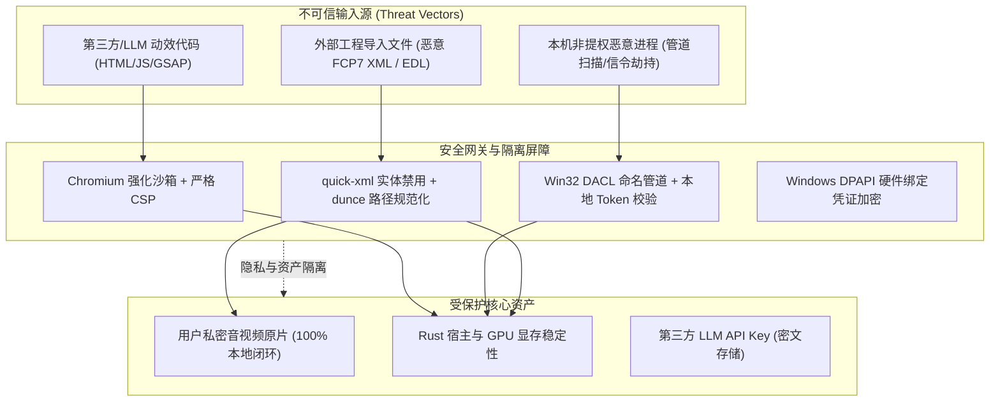

# 安全威胁模型、沙箱隔离与隐私合规规范 (Security, Sandboxing & Privacy Specification)

> **版本**：v1.0.0  
> **更新时间**：2026-09-26  
> **适用技术栈**：Rust 1.98 (MSVC), Windows Win32 API, Node.js 24 / Chromium, Python 3.13  
> **核心地位**：规范全系统多进程安全边界、Web 动效执行沙箱、Windows 命名管道访问控制列表 (DACL)、工程文件防注入与用户媒体隐私保护机制。

---

## 1. 威胁建模与安全分级 (Threat Model & Security Levels)

ClipFlow 具备“本地硬件加速 + 本地 AI 推理 + 云端 LLM 编排 + Web 动态代码渲染”的复合多进程特征。在 STRIDE 模型下，系统确立如下安全分级与防御边界：



---

## 2. HyperFrames 动效渲染安全沙箱规范 (Chromium Sandboxing)

无头 Chromium 负责执行用户导入或大模型动态生成的 HTML/CSS/JS/GSAP 动效。为杜绝恶意代码利用浏览器内核漏洞实现本地文件读取或远程代码执行 (RCE)，系统设立三重硬隔离：

### 2.1 启动参数安全基线 (Flag Whitelist & Blacklist)
- **绝对禁用标志 (Blacklist - 严禁配置)**：
  - 严禁 `--no-sandbox`（必须开启 Chromium 原生系统级沙箱）；
  - 严禁 `--disable-web-security`（禁止破坏同源策略与文件协议隔离）。
- **强制注入安全标志 (Whitelist - 必须配置)**：
  - `--disable-remote-fonts`（禁止远程字体下载，防止字体解析器内存漏洞）；
  - `--disable-background-networking`（切断一切后台自动网络请求）；
  - `--disable-sync` / `--disable-default-apps`（剥离无关网络组件）；
  - `--disable-local-storage`（禁止持久化写盘）；
  - `--force-gpu-mem-available-mb=512`（显存配额硬限，防 DoS 崩溃）。

### 2.2 强制内容安全策略 (Content Security Policy)
所有由 Node.js 渲染器加载的 HTML 页面，必须在 `<head>` 顶部硬编码注入严格 CSP，彻底阻断网络发起与动态脚本注入：
```html
<meta http-equiv="Content-Security-Policy" 
      content="default-src 'self' 'unsafe-inline'; 
               script-src 'self' 'unsafe-inline'; 
               style-src 'self' 'unsafe-inline'; 
               img-src 'self' data: blob:; 
               connect-src 'none'; 
               object-src 'none'; 
               base-uri 'none';">
```

### 2.3 模板静态 AST 安全扫描 (`TemplateValidator`)
在模板交由无头浏览器解析前，Node 渲染管线必须执行基于 Babel/SWC 的静态 AST 扫描：
- 严格禁止 Node 原生全局对象：`process`, `require`, `Buffer`, `__dirname`, `child_process`, `fs`；
- 严格禁止动态网络与执行原语：`fetch`, `XMLHttpRequest`, `WebSocket`, `eval`, `Function("...")`；
- 一旦检出非法语法节点，立即拒绝编译并向主进程抛出 `SecurityViolation` 错误。

---

## 3. Windows 进程间通信安全与访问控制 (IPC Security)

### 3.1 命名管道显式 DACL 权限控制
Windows 命名管道若以 `NULL` 安全描述符创建，本机任何非提权低权限进程均可尝试连接注入伪造信令。`clipflow-ipc` 必须通过 SDDL 语法显式构建访问控制列表（DACL）：

```rust
// SDDL 规则：仅授予当前 Token 所有者 (OW) 与 本地系统 (SY) 完全控制权限 (GA)
// 严禁授予 Everyone 或 Authenticated Users
pub const CLIPFLOW_PIPE_SDDL: &str = "D:(A;;GA;;;OW)(A;;GA;;;SY)";
```

- **创建标志铁律**：调用 `CreateNamedPipeW` 时必须附加 **`PIPE_REJECT_REMOTE_CLIENTS`** 标志，硬性拒绝来自局域网或 SMB 共享的跨机连接，仅允许 `127.0.0.1` 环回访问；
- **单实例绑定**：`nMaxInstances` 强制设为 `1`，防止恶意进程提前抢占创建管道同名蹲守（Pipe Squatting）；
- **客户端 PID 握手验证**：连接建立后，服务端调用 `GetNamedPipeClientProcessId` 校验客户端 PID，确保对端必须为通过 `JobGuard` 派生的专属 Python/Node 子进程。

### 3.2 命名共享内存隔离 (`Local\` 命名空间)
用于传输 4K 动效 Raw RGBA 像素的 Windows 共享内存句柄：
- **本地会话隔离**：名称前缀必须严格锁定在 `Local\clipflow-shm-{uuid}`，严禁暴露至跨用户可枚举的 `Global\` 命名空间；
- **尺寸防溢出硬校验**：映射前校验共享内存尺寸必须严格符合：
  $$\text{BufferSizeBytes} \equiv \text{Width} \times \text{Height} \times 4$$
  任何尺寸与当前画布不符的映射操作立即丢弃并触发警告，防范内存越界读取与 GPU 显存崩溃。

---

## 4. 外部工程交换与防投毒校验 (Interchange Security)

### 4.1 XML 外部实体注入 (XXE) 防御
在导入解析 Apple FCP7 XML (`xmeml v5`) 时，底层 `quick-xml` 必须严格配置：
- 禁用 DTD 实体展开与外部参数解析（禁止加载 `<!DOCTYPE ... SYSTEM "...">`）；
- 忽略未声明的扩展 XML 实体，防止攻击者通过 XML Bomb (Billion Laughs Attack) 造成宿主内存耗尽（OOM）。

### 4.2 路径穿越与 UNC 网络路径阻断
解析工程或 EDL 中的媒体文件路径时：
1. **阻断 UNC 远程网络路径**：严禁解析形如 `\\attacker-server\share\payload.mp4` 的网络共享路径，防止 Windows 自动发起 SMB 认证泄露 NTLM Hash，或加载远程恶意动态链接库；
2. **规范化本地路径**：调用 `dunce::canonicalize` 解析真实物理盘符与目录，彻底消除 `../` 相对路径穿越，媒体资产必须处于用户明确指定的素材目录树内。

---

## 5. 用户隐私与凭证安全白皮书 (Privacy & Credentials)

### 5.1 音视频资产“绝对本地闭环”铁律
- **零媒体上云**：用户的原始视频、音频、代理文件及转写切片，**100% 在本地显卡/CPU 闭环处理**，全系统不存在任何将音视频原始流上传至云端服务器的逻辑；
- **ASR 本地推理**：语音转写统一由本地 `faster-whisper` 完成，离线无网环境下功能 100% 完整可用。

### 5.2 大模型交互数据脱敏与最小化
当用户在 Agent 导演工作台发起大模型规划请求时：
- **最小化载荷**：仅向 LLM API 传输文本大纲、时长及结构化时间点，严禁夹带音视频二进制元数据；
- **敏感信息本地掩码 (PII Masking)**：提供可选的脱敏开关，本地通过正则与规则库对台词中的身份证号、手机号、银行卡号及具体地址进行掩码脱敏（如 `138****0000`）后再行外发。

### 5.3 Windows DPAPI 原生凭据加密存储
用户配置的第三方 LLM API Key（如 OpenAI、Claude 等）：
- 严禁以明文形式写入 `settings.json`、日志文件或 `.clipflow` 工程文件；
- 统一调用 Windows 数据保护 API：
  ```rust
  // 调用 CryptProtectData 将密钥与当前 Windows 用户凭据绑定加密
  unsafe {
      CryptProtectData(
          &data_in,
          std::ptr::null(),
          std::ptr::null_mut(),
          std::ptr::null_mut(),
          std::ptr::null_mut(),
          CRYPTPROTECT_UI_FORBIDDEN,
          &mut data_out,
      )
  };
  ```
- 密文保存于 `%LOCALAPPDATA%\ClipFlow\config\credentials.bin`，即使配置文件被打包外泄，其他机器或未授权用户也无法解密。
