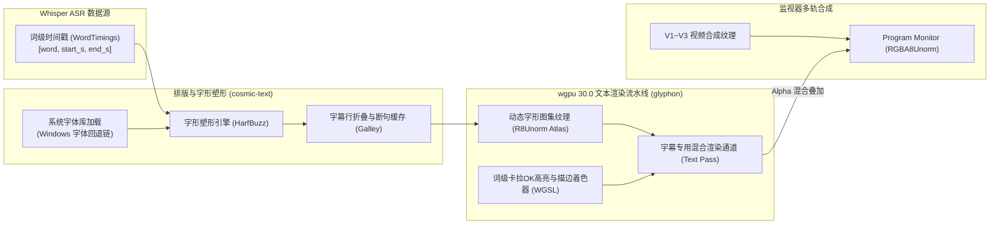

# 字幕样式排版与 GPU 监视器文本渲染规范 (Subtitle Typography & GPU Overlay Specification)

> **版本**：v1.0.0  
> **更新时间**：2026-09-26  
> **适用技术栈**：Rust 1.98 (MSVC), wgpu 30.0, cosmic-text 0.12 / glyphon 0.5, faster-whisper 1.2.1  
> **核心地位**：规范口播字幕（C1 轨）在节目监视器上的 GPU 硬件着色管线、多级字体回退、词级卡拉OK高亮与双向剪辑交互语义。

---

## 1. 字幕图层架构与 GPU 渲染管线

为保证在 4K 60fps 监视器缩放、全屏回放及高码率导出时不产生文字模糊与锯齿，字幕图层脱离传统的 CPU 软件栅格化，采用基于 **`wgpu 30.0` + `cosmic-text` / `glyphon` 的 GPU 离屏文本着色流水线**：



---

## 2. 字体加载与 CJK 多级回退策略 (Font Fallback)

在中英文混排、特殊符号与口播标点场景下，文本引擎配置严格的 Windows 原生字体回退链，杜绝“豆腐块”缺字现象：

```rust
pub fn init_subtitle_font_system() -> cosmic_text::FontSystem {
    let mut font_system = cosmic_text::FontSystem::new();
    
    // 默认首选 Windows 原生无衬线无版权风险字体
    let fallback_families = [
        "Microsoft YaHei UI",      // 微软雅黑 (Windows 10/11 原生)
        "Source Han Sans CN",      // 思源黑体
        "PingFang SC",             // 苹方 (Mac 迁移兼容)
        "Segoe UI",                // 英文字母与等宽数字
        "Segoe UI Emoji",          // Emoji 表情符号
    ];
    // 注册回退链并锁定系统字体扫描
    font_system
}
```

---

## 3. 字幕样式数据模型与 WGSL 着色特效

字幕片段挂载在时间轴 `C1` 轨道上，单条字幕拥有独立的排版属性与视觉特效：

```rust
use serde::{Deserialize, Serialize};

#[derive(Debug, Clone, PartialEq, Serialize, Deserialize)]
pub struct SubtitleStyle {
    /// 字体族名称 (默认 "Microsoft YaHei UI")
    pub font_family: String,
    /// 基础字号 (基准 1080p 画布下像素高度，如 48px)
    pub font_size: f32,
    /// 字体粗细 (100 ~ 900, 默认 700 Bold)
    pub font_weight: u16,
    /// 主文本填充色 (HEX RGBA，默认白色 #FFFFFF)
    pub fill_color: [f32; 4],
    /// 文字描边 (Stroke) 宽度 (px)，0.0 表示无描边 (默认 3.0px)
    pub stroke_width: f32,
    /// 文字描边颜色 (默认纯黑 #000000)
    pub stroke_color: [f32; 4],
    /// 投影 (Drop Shadow) 偏移 [dx, dy] 与模糊半径
    pub shadow_offset: [f32; 2],
    pub shadow_blur: f32,
    pub shadow_color: [f32; 4],
    /// 监视器纵向对齐位置 (Bottom / Center / Top) 与距离底边百分比 (默认 12%)
    pub position_y_percent: f32,
    /// 词级高亮样式 (卡拉OK点亮效果)
    pub karaoke_highlight_color: Option<[f32; 4]>,
}
```

### 3.1 词级卡拉OK点亮机制 (Karaoke Word Highlighting)
- 当播放指针游走在 `[clip.start, clip.end)` 期间，文本着色器接收当前 `Playhead_PTS`；
- 遍历当前字幕块内的词级时间戳 `words: Vec<WordTiming>`；
- 当前命中词渲染为高饱和度强调色（如 NVIDIA 电能绿 `#76B900` 或明黄色 `#FFE600`），未发音或已发音词保持默认白色，赋予口播视频极强的视觉抓手。

---

## 4. 文本驱动剪辑与时间轴双向联动交互规范 (Text-Based Editing)

口播文本视图与多轨时间轴严格遵循 **“PR/Descript 经典双模联动”**：

```
+-----------------------------------------------------------------------------------------+
|                              文本与时间轴双模交互状态机                                    |
+-----------------------------------------------------------------------------------------+
|                                                                                         |
| [模式一：剪辑波纹切除 (Ripple Cut)]                                                      |
| 操作：用户在文本面板中通过鼠标滑选一段文字（如选定“其实这个观点是完全错误的”），按 Backspace/Delete。 |
| 行为：                                                                                  |
| 1. 根据文字关联的词级时间戳 [start_time, end_time]，通过 AgentTimelineAcl 量化为帧区间；   |
| 2. 在公用时间轴上对选中的时间区间执行【波纹切除】(Ripple Delete)；                         |
| 3. 音视频多轨同步向左收拢闭合，相邻接缝自动施加过零点对齐与 5ms 微淡入淡出；                |
| 4. 文本视图中该段台词同步剔除，且历史压入 Undo/Redo 命令栈。                             |
|                                                                                         |
| [模式二：原位纠错编辑 (In-Place Typo Correction)]                                        |
| 操作：用户在文本面板中【双击】某一个错别字单词（如“流觞”误识别为“流产”）。                   |
| 行为：                                                                                  |
| 1. 文本块进入即时编辑输入框（Inline Input），用户键盘输入正确文字；                        |
| 2. 确认修改（Enter / 失焦）后，仅更新对应 SubtitleClip.text 与 C1 轨渲染字形；             |
| 3. 严格冻结音视频起止时间、片段切点与时间轴拓扑（时长绝不变动 1 毫秒）；                    |
| 4. 监视器画面即时重新栅格化字形，实现毫秒级无感纠错。                                     |
|                                                                                         |
+-----------------------------------------------------------------------------------------+
```
