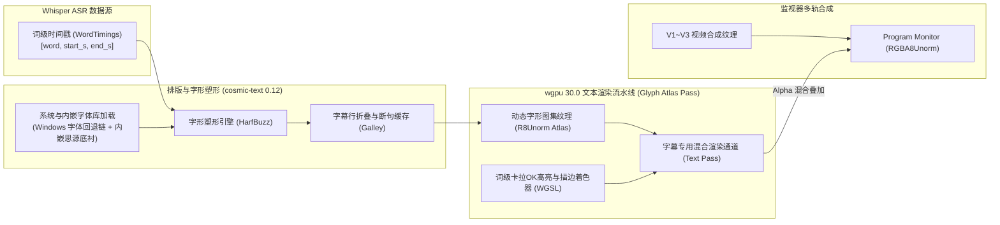

# 字幕样式排版与 GPU 监视器文本渲染规范 (Subtitle Typography & GPU Overlay Specification)

> **版本**：v0.3.0  
> **更新时间**：2026-10-07  
> **适用技术栈**：Rust 1.99 (MSVC), wgpu 30.0, cosmic-text 0.12, wgpu 30 兼容文本着色管线 (glyphon 兼容版本 / 自研 Glyph Atlas Pass), faster-whisper 1.2.1  
> **核心地位**：规范口播字幕（C1 轨）在节目监视器上的 GPU 硬件着色管线、多级字体回退、词级卡拉OK高亮与双向剪辑交互语义。

---

## 1. 字幕图层架构与 GPU 渲染管线

为保证在 4K 60fps 监视器缩放、全屏回放及高码率导出时不产生文字模糊与锯齿，字幕图层脱离传统的 CPU 软件栅格化，采用基于 **`wgpu 30.0` + `cosmic-text` + 硬件字形图集（Glyph Atlas Pass）的 GPU 离屏文本着色流水线**：


```mermaid
flowchart LR
    subgraph ASR_Domain ["Whisper ASR 数据源"]
        WordTimings["词级时间戳 (WordTimings)\n[word, start_s, end_s]"]
    end

    subgraph Text_Layout ["排版与字形塑形 (cosmic-text 0.12)"]
        FontSystem["系统与内嵌字体库加载\n(Windows 字体回退链 + 内嵌思源底衬)"]
        Shaper["字形塑形引擎 (HarfBuzz)"]
        LayoutCache["字幕行折叠与断句缓存 (Galley)"]
        WordTimings --> Shaper
        FontSystem --> Shaper --> LayoutCache
    end

    subgraph GPU_Pipeline ["wgpu 30.0 文本渲染流水线 (Glyph Atlas Pass)"]
        GlyphAtlas["动态字形图集纹理 (R8Unorm Atlas)"]
        TextPipeline["字幕专用混合渲染通道 (Text Pass)"]
        KaraokeShader["词级卡拉OK高亮与描边着色器 (WGSL)"]
        
        LayoutCache --> GlyphAtlas
        GlyphAtlas --> TextPipeline
        KaraokeShader --> TextPipeline
    end

    subgraph Monitor_Compositing ["监视器多轨合成"]
        VideoTexture["V1~V3 视频合成纹理"]
        FinalMonitor["Program Monitor (RGBA8Unorm)"]
        
        VideoTexture --> FinalMonitor
        TextPipeline -->|Alpha 混合叠加| FinalMonitor
    end
```

---

## 2. 字体加载与 CJK 多级回退策略 (Font Fallback)

在中英文混排、特殊符号与口播标点场景下，文本引擎配置严格的 Windows 原生字体回退链，并强制挂载内置开源无衬线字体作为终极保底，杜绝精简版 Windows 系统下的“豆腐块”缺字现象：

```rust
pub fn init_subtitle_font_system() -> cosmic_text::FontSystem {
    let mut font_system = cosmic_text::FontSystem::new();
    
    // 1. 系统原生字体扫描 (按优先级回退)
    let fallback_families = [
        "Microsoft YaHei UI",      // 微软雅黑 (Windows 10/11 原生)
        "Source Han Sans CN",      // 思源黑体
        "PingFang SC",             // 苹方 (Mac 迁移兼容)
        "Segoe UI",                // 英文字母与等宽数字
        "Segoe UI Emoji",          // Emoji 表情符号
    ];
    
    // 2. 内嵌字体终极保底 (消除 Windows N / Server 精简版缺字风险)
    // 静态内置 resources/fonts/NotoSansSC-Medium.subset.otf 作为兜底数据库
    let bundled_font_bytes = include_bytes!("../../../resources/fonts/NotoSansSC-Medium.subset.otf");
    font_system.db_mut().load_font_data(bundled_font_bytes.to_vec());

    font_system
}
```

---

## 3. 字幕样式数据模型与 WGSL 着色特效

字幕片段挂载在时间轴 `C1` 轨道上，单条字幕拥有独立的排版属性与视觉特效，原生支持双语分层与圆角胶囊底板：

```rust
use serde::{Deserialize, Serialize};

#[derive(Debug, Clone, Copy, PartialEq, Eq, Serialize, Deserialize)]
pub enum SubtitleLayout {
    /// 仅显示原文
    OnlyOriginal,
    /// 仅显示译文
    OnlyTranslate,
    /// 原文在上，译文在下
    OriginalOnTop,
    /// 译文在上，原文在下
    TranslateOnTop,
}

#[derive(Debug, Clone, PartialEq, Serialize, Deserialize)]
pub struct BackgroundBoxStyle {
    /// 背景填充色 (HEX RGBA，如半透明纯黑 [0.0, 0.0, 0.0, 0.65])
    pub fill_color: [f32; 4],
    /// 圆角半径 (px，基准 1080p 下默认 8.0px)
    pub corner_radius: f32,
    /// 水平内边距 (px，默认 16.0px)
    pub padding_h: f32,
    /// 垂直内边距 (px，默认 8.0px)
    pub padding_v: f32,
    /// 边框描边宽度 (0.0 表示无边框，默认 0.0px)
    pub border_width: f32,
    /// 边框颜色 (默认完全透明)
    pub border_color: [f32; 4],
}

#[derive(Debug, Clone, PartialEq, Serialize, Deserialize)]
pub struct SubtitleStyle {
    /// 字体族名称 (默认 "Microsoft YaHei UI")
    pub font_family: String,
    /// 主文本基础字号 (基准 1080p 画布下像素高度，如 48px)
    pub font_size: f32,
    /// 字体粗细 (100 ~ 900, 默认 700 Bold)
    pub font_weight: u16,
    /// 主文本填充色 (HEX RGBA，默认白色 #FFFFFF)
    pub fill_color: [f32; 4],
    /// 文字描边 (Stroke) 宽度 (px)，0.0 表示无描边 (默认 3.0px)
    pub stroke_width: f32,
    /// 文字描边颜色 (默认纯黑 #000000)
    pub stroke_color: [f32; 4],
    /// 投影 (Drop Shadow) 偏移 [dx, dy] 与模糊半径
    pub shadow_offset: [f32; 2],
    pub shadow_blur: f32,
    pub shadow_color: [f32; 4],
    /// 监视器纵向对齐位置 (Bottom / Center / Top) 与距离底边百分比 (默认 12%)
    pub position_y_percent: f32,
    /// 词级高亮样式 (卡拉OK点亮效果)
    pub karaoke_highlight_color: Option<[f32; 4]>,
    /// 双语字幕排版布局 (默认 OnlyOriginal)
    pub layout: SubtitleLayout,
    /// 副文本字号 (基准 1080p 画布下像素高度，默认 32px)
    pub secondary_font_size: f32,
    /// 副文本填充色 (默认次级浅灰 [0.85, 0.85, 0.85, 1.0])
    pub secondary_fill_color: [f32; 4],
    /// 主副文本垂直间距 (px，默认 8.0px)
    pub vertical_gap: f32,
    /// 圆角胶囊背景板配置 (可选)
    pub background_box: Option<BackgroundBoxStyle>,
}
```

### 3.1 词级卡拉OK点亮机制 (Karaoke Word Highlighting)
- 当播放指针游走在 `[clip.start, clip.end)` 期间，文本着色器接收当前 `Playhead_PTS`；
- 遍历当前字幕块内的词级时间戳 `words: Vec<WordTiming>`；
- 当前命中词渲染为高饱和度强调色（如 Neutral Modern 钴蓝信号 `#2F6FEB`、金黄标色 `#EAB308` 或高光亮白），未发音或已发音词保持次级灰白，赋予口播视频极强的视觉抓手。

### 3.2 WGSL 圆角胶囊底板着色管线 (SDF Rounded Box Pass)
为彻底杜绝传统方案使用 CPU/Pillow 逐帧生成 PNG 临时图片再压制的低效与高磁盘 I/O（1000 句字幕需压制数千张图片），ClipFlow 采用纯 GPU 硬件管线：
- **执行顺序**：在 glyphon 文本渲染 Pass 执行前，插入专属的 `SubtitleBoxPass`；
- **抗锯齿渲染**：片元着色器使用有向距离场（Signed Distance Field, SDF）解析计算圆角矩形，在边界处通过 `smoothstep` 采样平滑插值实现亚像素级抗锯齿，完全免除锯齿感；
- **性能指标**：单次 Draw Call 绘制当前监视器帧内全部可见胶囊底板，显存占用 $\le 64\text{KB}$，耗时 $\le 0.05\text{ms}$，且支持 100% 实时预览与无损缩放。

### 3.3 规范化排版折叠与标点清洗准则
- **字符阈值与换行保护**：
  - CJK 语言（中文、日文、韩文）：单行硬限制 $\le 25$ 个字符；
  - 西文拉丁语言（英文）：单行硬限制 $\le 18$ 个词；
  - 遇到长句优先在自然语法从句边界或空格处折叠为双行，双行垂直居中排布。
- **行尾标点自动净化**：
  - ASR 或 LLM 生成的口播字幕常带有句末逗号或句号（如 `“今天天气真好，”`），排版管线在字形塑形前统一剥离行尾停顿标点（`，。！？`），保持影视字幕清爽工业质感。
- **动态基准缩放因子 (Resolution Scaling)**：
  - 界面排版以 1080p（高度 1080px）为基准高度。在 720p 代理或 4K/8K 监视器缩放时，字号、圆角、内边距与间距统一乘以尺度缩放因子 $S = H_{\text{canvas}} / 1080.0$，保障多端视觉一致性。

---

## 4. 文本驱动剪辑与时间轴双向联动交互规范 (Text-Based Editing)

口播文本视图与多轨时间轴严格遵循 **“PR/Descript 经典双模联动”**：

```
+-----------------------------------------------------------------------------------------+
|                              文本与时间轴双模交互状态机                                    |
+-----------------------------------------------------------------------------------------+
|                                                                                         |
| [模式一：剪辑波纹切除 (Ripple Cut)]                                                      |
| 操作：用户在文本面板中通过鼠标滑选一段文字（如选定“其实这个观点是完全错误的”），按 Backspace/Delete。 |
| 行为：                                                                                  |
| 1. 根据文字关联的词级时间戳 [start_time, end_time]，通过 AgentTimelineAcl 量化为帧区间；   |
| 2. 在公用时间轴上对选中的时间区间执行【波纹切除】(Ripple Delete)；                         |
| 3. 音视频多轨同步向左收拢闭合，相邻接缝自动施加过零点对齐与 5ms 微淡入淡出；                |
| 4. 文本视图中该段台词同步剔除，且历史压入 Undo/Redo 命令栈。                             |
|                                                                                         |
| [模式二：原位纠错编辑 (In-Place Typo Correction)]                                        |
| 操作：用户在文本面板中【双击】某一个错别字单词（如“流觞”误识别为“流产”）。                   |
| 行为：                                                                                  |
| 1. 文本块进入即时编辑输入框（Inline Input），用户键盘输入正确文字；                        |
| 2. 确认修改（Enter / 失焦）后，仅更新对应 SubtitleClip.text 与 C1 轨渲染字形；             |
| 3. 严格冻结音视频起止时间、片段切点与时间轴拓扑（时长绝不变动 1 毫秒）；                    |
| 4. 监视器画面即时重新栅格化字形，实现毫秒级无感纠错。                                     |
|                                                                                         |
+-----------------------------------------------------------------------------------------+
```
