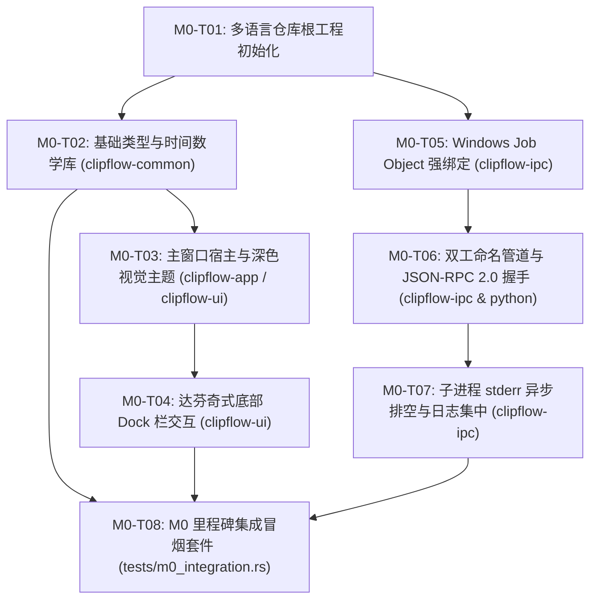

# Milestone 0 (M0)：工程骨架与基础通信链路 实现计划

> **面向 AI 代理的工作者：** 必需子技能：使用 subagent-driven-development（推荐）或 executing-plans 逐任务实现此计划。步骤使用复选框（`- [ ]`）语法来跟踪进度。

**目标：** 搭建 Polyglot Monorepo 多语言工作区与 6 大 Rust Crate 骨架，实现 Rust 桌面窗口秒开与 Neutral Modern 深色模式主题，落地 Windows Job Object 内核级防逃逸与异步双工命名管道 JSON-RPC 2.0 握手信道。

**架构：** 根工作区聚合 Rust Workspace、Python (uv) Worker 与 Node.js 24 基础配置；Rust 端划分 6 大单一职责 Crate 并严格遵循单向无环依赖（DAG）；底层 IPC 基于 Win32 Job Object 实现子进程内核级强绑定，通过 Overlapped 异步命名管道（DACL 鉴权与 PID 校验）进行低延迟 JSON-RPC 通信，通过 Tokio 异步流式排空子进程 `stderr` 消除 4KB 缓冲死锁。

**技术栈：** Rust 1.98 (MSVC), `eframe`/`egui 0.36`, `wgpu 30.0`, `tokio 1.x`, `serde 1.0`, `windows-sys 0.59`, Python 3.13 (`uv`), Node.js 24 LTS, PowerShell 7 (`pwsh`)。

**规格：** 
- [docs/roadmap.md](../../roadmap.md)
- [docs/codebase-structure.md](../../codebase-structure.md)
- [docs/environment-setup.md](../../environment-setup.md)
- [docs/timeline-data-model.md](../../timeline-data-model.md)
- [docs/ui-spec.md](../../ui-spec.md)
- [docs/ipc-protocol.md](../../ipc-protocol.md)
- [docs/security-and-privacy.md](../../security-and-privacy.md)
- [docs/qa-and-benchmarks.md](../../qa-and-benchmarks.md)

---

## 全局约束

- **编译器与运行时基线**：Rust 1.98 MSVC 工具链；Python 3.13 严格由 `uv` 管理并由根目录 `.python-version` 钉住；Node.js 24 LTS；FFmpeg 9.0.2 预留。
- **Crate 依赖 DAG**：`clipflow-app` -> `clipflow-ui` & `clipflow-ipc`；`clipflow-ui` -> `clipflow-timeline` & `clipflow-media`；`clipflow-media` -> `clipflow-timeline` & `clipflow-common`；`clipflow-timeline` -> `clipflow-common`；`clipflow-ipc` -> `clipflow-common`；严禁循环引用。
- **时间标度铁律**：严禁在关键时间轴逻辑与状态机中使用 `f32`/`f64`，统一采用 `RationalTime` 有理数时间与 `TimeRange` 左闭右开区间。
- **视觉主题约束**：严格应用 Neutral Modern 深色规范，底板 `#0F1115`，表面 `#171A21`，主信号钴蓝 `#2F6FEB`，圆角梯队 12px/8px/4px。
- **IPC 安全与防孤儿**：所有子进程以 `CREATE_SUSPENDED` 启动并原子纳入配置了 `JOB_OBJECT_LIMIT_KILL_ON_JOB_CLOSE` 的 Job Object；命名管道显式附加 SDDL DACL `D:(A;;GA;;;OW)(A;;GA;;;SY)` 与 `PIPE_REJECT_REMOTE_CLIENTS`，握手阶段严格校验客户端 PID。
- **stderr 排空防死锁**：子进程 `stderr` 必须由独立 Tokio 任务异步流式排空，严禁同步阻塞读取。
- **Git 提交信息规范**：统一使用简体中文，一句话讲清原因。

---

## 审查重点（Review Focus）

1. **命名管道非特权/未授权跨进程伪造连接 (Pipe Squatting & Impersonation)**：若管道未配置严格 DACL 或允许远程访问，局域网或本机恶意进程可伪造信令注入。必须在 `CreateNamedPipeW` 中绑定显式 SDDL `D:(A;;GA;;;OW)(A;;GA;;;SY)` 与 `PIPE_REJECT_REMOTE_CLIENTS`，且握手前必须通过 `GetNamedPipeClientProcessId` 强校验对端 PID。
2. **MSVCRT 4KB 管道死锁陷阱 (Buffer Overflow Deadlock)**：Python/Node 子进程因启动错误或大量调试输出写满 4KB `stderr` 缓冲区时，若主进程未并发排空，子进程写入操作将发生永久死锁。`AsyncStderrDrainer` 必须由独立异步任务持续消费，即使连续灌入 10000 行日志也不阻塞。
3. **宿主异常终止导致的子进程孤儿逃逸 (Process Tree Orphan Leak)**：若主进程被任务管理器强杀或发生内核崩溃，后台计算子进程若常驻显存/CPU 会造成资源泄漏。必须封装安全的 `JobGuard`，以 `CREATE_SUSPENDED` 挂起态创建子进程并纳入配置了 `KILL_ON_JOB_CLOSE` 的 Job Object 后再唤醒，孤儿逃逸率严格为 0.0%。
4. **有理数时间除零与溢出边界 (`RationalTime` DivByZero / Overflow)**：`timescale == 0` 会引发数学除零崩溃；大时间戳重采样若直接 `value * new_scale` 会在 `i64` 发生静默溢出。必须在构造函数断言 `timescale > 0`，且换算必须转为 `i128` 宽整型后计算再转回 `i64`。
5. **即时模式 UI 空闲待机 CPU 幽灵占用 (Repaint Starvation / Busy Loop)**：若无交互时频繁调用 `request_repaint()` 会导致 CPU 100% 满载。`RepaintScheduler` 必须实现 150ms 静默门控，暂停且无交互超 150ms 自动挂起 OS 消息队列，保持 0.0% CPU 占用。

---

## 任务拆解与执行时序



---

### 任务 1：多语言仓库根工程初始化 (M0-T01)

**文件：**
- 创建：`Cargo.toml`
- 创建：`.cargo/config.toml`
- 创建：`pyproject.toml`
- 创建：`package.json`
- 创建：`crates/clipflow-common/Cargo.toml`
- 创建：`crates/clipflow-common/src/lib.rs`
- 创建：`crates/clipflow-timeline/Cargo.toml`
- 创建：`crates/clipflow-timeline/src/lib.rs`
- 创建：`crates/clipflow-media/Cargo.toml`
- 创建：`crates/clipflow-media/src/lib.rs`
- 创建：`crates/clipflow-ipc/Cargo.toml`
- 创建：`crates/clipflow-ipc/src/lib.rs`
- 创建：`crates/clipflow-ui/Cargo.toml`
- 创建：`crates/clipflow-ui/src/lib.rs`
- 创建：`crates/clipflow-app/Cargo.toml`
- 创建：`crates/clipflow-app/src/main.rs`
- 修改：`.gitignore`（如有必要补充忽略编译产物）

- [ ] **步骤 1：创建 `.cargo/config.toml` 配置 MSVC 编译优化**
  配置 Rust MSVC 目标参数：
  ```toml
  [target.x86_64-pc-windows-msvc]
  rustflags = ["-C", "target-cpu=native"]
  ```

- [ ] **步骤 2：创建根目录 `Cargo.toml` 并声明 Workspace 与集中依赖管理**
  定义 6 大 crate 成员：
  - `workspace.members`: `crates/clipflow-common`, `crates/clipflow-timeline`, `crates/clipflow-media`, `crates/clipflow-ipc`, `crates/clipflow-ui`, `crates/clipflow-app`
  - `workspace.dependencies`:
    - `serde = { version = "1.0", features = ["derive"] }`
    - `serde_json = "1.0"`
    - `thiserror = "2.0"`
    - `uuid = { version = "1.10", features = ["v4", "v7", "serde"] }`
    - `tokio = { version = "1.40", features = ["full"] }`
    - `tracing = "0.1"`
    - `tracing-subscriber = { version = "0.3", features = ["env-filter"] }`
    - `egui = "0.36"`
    - `eframe = { version = "0.36", default-features = false, features = ["default_fonts", "wgpu"] }`
    - `wgpu = "30.0"`
    - `windows-sys = { version = "0.59", features = [
        "Win32_Foundation",
        "Win32_System_JobObjects",
        "Win32_System_Threading",
        "Win32_System_Pipes",
        "Win32_Storage_FileSystem",
        "Win32_Security",
        "Win32_Security_Authorization"
      ] }`

- [ ] **步骤 3：创建 6 个 Crate 的 `Cargo.toml` 与占位源码**
  为 `clipflow-common`, `clipflow-timeline`, `clipflow-media`, `clipflow-ipc`, `clipflow-ui`, `clipflow-app` 分别编写 `Cargo.toml` 和 `lib.rs`/`main.rs`，配置好单向依赖关系。

- [ ] **步骤 4：配置 `pyproject.toml` (Python 3.13 / uv) 与 `package.json` (Node.js 24)**
  遵循 `modern-python` 规范，在根目录配置 `pyproject.toml`，声明依赖 `faster-whisper==1.2.1`, `pydantic>=2.0` 与 dev 依赖 `pytest>=8.0`, `ruff>=0.9`；配置 `package.json`（name: `clipflow-workspace`, engines: `{ "node": ">=24.0.0" }`）。

- [ ] **步骤 5：验证三语言工作区构建环境**
  运行：`cargo check --workspace`
  预期：PASS，所有 6 个 crate 编译无警告或错误。
  运行：`uv venv --python 3.13` 及 `uv run python --version`
  预期：输出 `Python 3.13.x`。
  运行：`node --version`
  预期：输出 `v24.x.x`。

- [ ] **步骤 6：Commit 根工作区脚手架**
  ```powershell
  git add Cargo.toml .cargo/config.toml pyproject.toml package.json crates/
  git commit -m "chore: 初始化多语言 Monorepo 与 6 大 Rust Crate 骨架"
  ```

---

### 任务 2：基础类型与时间数学库实现 (`clipflow-common`) (M0-T02)

**文件：**
- 修改：`crates/clipflow-common/Cargo.toml`
- 创建：`crates/clipflow-common/src/time.rs`
- 创建：`crates/clipflow-common/src/errors.rs`
- 修改：`crates/clipflow-common/src/lib.rs`
- 创建：`crates/clipflow-common/tests/time_tests.rs`
- 创建：`crates/clipflow-common/tests/error_tests.rs`

- [ ] **步骤 1：编写时间数学库失败的单元测试**
  在 `crates/clipflow-common/tests/time_tests.rs` 中编写测试：
  - `test_rational_time_basic_math`：验证构造、加法、减法、比对。
  - `test_rational_time_rescale_precision`：验证大分母转小分母、跨帧率换算、`i128` 防溢出。
  - `test_rational_time_div_by_zero_defense`：验证 `timescale == 0` 时触发 panic 防御。
  - `test_time_range_half_open_interval`：验证 `[start, start + duration)` 边界，`contains(start) == true`，`contains(end) == false`。
  - `test_smpte_timecode_format_non_drop_frame`：测试 `01:23:45:12` 格式化。
  - `test_smpte_timecode_format_drop_frame`：测试分号 `01:23:45;12` 格式化。

- [ ] **步骤 2：运行测试验证失败**
  运行：`cargo test -p clipflow-common --test time_tests`
  预期：FAIL，找不到 `RationalTime` / `TimeRange` / `SmpteTimecode`。

- [ ] **步骤 3：在 `crates/clipflow-common/src/time.rs` 中实现时间类型**
  实现结构体与方法：
  - `pub struct RationalTime { pub value: i64, pub timescale: u32 }`
    - `pub fn new(value: i64, timescale: u32) -> Self`（强制 `assert!(timescale > 0)`)
    - `pub fn rescaled_to(&self, new_timescale: u32) -> Self`（使用 `i128` 运算）
    - `pub fn to_seconds(&self) -> f64`
    - `pub fn from_seconds(seconds: f64, timescale: u32) -> Self`
    - 为其实现 `Add`, `Sub`, `Neg` 运算与 `Ord`, `Eq`。
  - `pub struct TimeRange { pub start: RationalTime, pub duration: RationalTime }`
    - `pub fn new(start: RationalTime, duration: RationalTime) -> Self`
    - `pub fn end_exclusive(&self) -> RationalTime`
    - `pub fn contains(&self, time: RationalTime) -> bool`
  - `pub enum FrameRate`（23.976, 24, 25, 29.97, 30, 50, 59.94, 60）
  - `pub struct SmpteTimecode { pub hours: u8, pub minutes: u8, pub seconds: u8, pub frames: u8, pub is_drop_frame: bool }`
    - `pub fn to_string(&self) -> String`

- [ ] **步骤 4：在 `crates/clipflow-common/src/errors.rs` 中实现系统统一错误枚举**
  使用 `thiserror` 定义 `ClipFlowError`：
  - `Ipc(String)`
  - `Timeline(String)`
  - `Media(String)`
  - `InvalidTime(String)`
  - `Io(#[from] std::io::Error)`
  - 定义统一别名 `pub type Result<T> = std::result::Result<T, ClipFlowError>;`。

- [ ] **步骤 5：在 `crates/clipflow-common/src/lib.rs` 导出模块**
  导出 `time::*` 与 `errors::*`。

- [ ] **步骤 6：运行测试验证通过**
  运行：`cargo test -p clipflow-common`
  预期：PASS，所有测试均通过。

- [ ] **步骤 7：Commit 基础类型库**
  ```powershell
  git add crates/clipflow-common/
  git commit -m "feat(common): 实现 RationalTime 有理数时间与统一错误类型"
  ```

---

### 任务 3：主窗口宿主与 Neutral Modern 深色视觉主题 (`clipflow-app` & `clipflow-ui`) (M0-T03)

**文件：**
- 修改：`crates/clipflow-ui/Cargo.toml`
- 创建：`crates/clipflow-ui/src/theme.rs`
- 创建：`crates/clipflow-ui/src/state.rs`
- 修改：`crates/clipflow-ui/src/lib.rs`
- 创建：`crates/clipflow-ui/tests/theme_tests.rs`
- 修改：`crates/clipflow-app/Cargo.toml`
- 修改：`crates/clipflow-app/src/main.rs`

- [ ] **步骤 1：编写设计主题与状态根的失败单元测试**
  在 `crates/clipflow-ui/tests/theme_tests.rs` 中测试：
  - `test_theme_tokens_match_specification`：验证 `BG_CANVAS == #0F1115`, `SURFACE == #171A21`, `COBALT_ACCENT == #2F6FEB`, 圆角梯队 `12px/8px/4px`。
  - `test_app_state_defaults`：验证 `AppState` 初始状态（`playhead == 0`, `zoom_level == 1.0`, `is_playing == false`）。
  - `test_repaint_scheduler_dormant_transition`：验证在无交互超 150ms 后门控处于 `Dormant` 状态。

- [ ] **步骤 2：运行测试验证失败**
  运行：`cargo test -p clipflow-ui --test theme_tests`
  预期：FAIL。

- [ ] **步骤 3：在 `crates/clipflow-ui/src/theme.rs` 中实现 `ClipFlowTheme`**
  严格映射 [docs/ui-spec.md 第 6 节](../../ui-spec.md)：
  - 常量：`BG_CANVAS` (`#0F1115`), `SURFACE` (`#171A21`), `SURFACE_WARM` (`#1E222B`), `SURFACE_ACTIVE` (`#232733`)
  - 文本灰阶：`TEXT_PRIMARY` (`#F8FAFC`), `TEXT_SECONDARY` (`#E2E8F0`), `TEXT_MUTED` (`#A7ADBA`), `TEXT_META` (`#64748B`)
  - 边框：`BORDER` (`#2A2F3A`), `BORDER_SOFT` (`rgba(255, 255, 255, 20)`)
  - 交互信号：`COBALT_ACCENT` (`#2F6FEB`), `ACCENT_HOVER`, `ACCENT_ACTIVE`
  - 语义状态：`STATUS_SUCCESS` (`#17A34A`), `STATUS_WARN` (`#EAB308`), `STATUS_DANGER` (`#DC2626`), `STATUS_INFO` (`#0284C7`)
  - 轨道颜色：`TRACK_VIDEO_BG`, `TRACK_AUDIO_BG`, `TRACK_SUBTITLE_BG`, `TRACK_MOTION_BG`
  - 圆角：`RADIUS_PANEL` (12), `RADIUS_CONTROL` (8), `RADIUS_CLIP` (4)
  - 方法：`pub fn apply_to(ctx: &egui::Context)` 配置 `ctx.set_visuals(...)`。

- [ ] **步骤 4：在 `crates/clipflow-ui/src/state.rs` 中实现 `AppState` 与 `RepaintScheduler`**
  - 定义 `RepaintState`: `Dormant`, `Playing`, `Interacting`。
  - 定义 `RepaintScheduler`:
    - `pub fn on_user_interaction(&mut self)`：刷新活动时间戳，切换为 `Interacting`。
    - `pub fn update_gating(&mut self) -> RepaintState`：判断若暂停且距离最后交互 $> 150\text{ms}$，进入 `Dormant`。
  - 定义 `AppState`：包含 `playhead: RationalTime`, `is_playing: bool`, `zoom_level: f32`, `visible_time_range: TimeRange`, `scheduler: RepaintScheduler`。

- [ ] **步骤 5：在 `crates/clipflow-app/src/main.rs` 中装配 `eframe` 桌面入口**
  - 初始化 `tracing_subscriber`。
  - 创建 `ClipFlowApp` 实现 `eframe::App`。
  - 在 `update(&mut self, ctx: &egui::Context, frame: &mut eframe::Frame)` 首行调用 `ClipFlowTheme::apply_to(ctx)`。
  - 执行 `scheduler.update_gating()` 门控，非 `Dormant` 时按需调用 `ctx.request_repaint()`。
  - 主窗口配置 1280x800，深色原生外壳。

- [ ] **步骤 6：运行测试与检查编译**
  运行：`cargo test -p clipflow-ui`
  预期：PASS。
  运行：`cargo check -p clipflow-app`
  预期：PASS。

- [ ] **步骤 7：Commit 窗口宿主与主题**
  ```powershell
  git add crates/clipflow-ui/ crates/clipflow-app/
  git commit -m "feat(ui): 搭建 eframe 窗口宿主并落地 Neutral Modern 深色主题"
  ```

---

### 任务 4：达芬奇式底部 Dock 栏交互与工作流路由 (`clipflow-ui`) (M0-T04)

**文件：**
- 创建：`crates/clipflow-ui/src/dock.rs`
- 创建：`crates/clipflow-ui/src/timeline_placeholder.rs`
- 修改：`crates/clipflow-ui/src/lib.rs`
- 创建：`crates/clipflow-ui/tests/dock_router_tests.rs`
- 修改：`crates/clipflow-app/src/main.rs`

- [ ] **步骤 1：编写 Dock 路由切换状态机失败的单元测试**
  在 `crates/clipflow-ui/tests/dock_router_tests.rs` 中编写测试：
  - `test_workflow_page_transitions`：测试 6 个页面枚举切换。
  - `test_dock_switch_performance`：断言切页状态机耗时 $\le 0.5\text{ms}$。
  - `test_global_timeline_state_preserved_across_pages`：切换不同页面时，验证底层 `AppState.playhead` 保持不变。

- [ ] **步骤 2：运行测试验证失败**
  运行：`cargo test -p clipflow-ui --test dock_router_tests`
  预期：FAIL。

- [ ] **步骤 3：在 `crates/clipflow-ui/src/dock.rs` 中实现 `WorkflowPage` 与 `WorkflowDock`**
  - 定义枚举：
    ```rust
    #[derive(Debug, Clone, Copy, PartialEq, Eq, Default)]
    pub enum WorkflowPage {
        #[default]
        Agent,
        Edit,
        Motion,
        Audio,
        Image,
        Deliver,
    }
    ```
  - 实现 UI 渲染组件 `WorkflowDock::show(ui: &mut egui::Ui, current_page: &mut WorkflowPage)`：
    - 高度固定 48px，背景 `#1E222B`，顶部 1px 细线 `#2A2F3A`。
    - 渲染 6 个大写导航按钮（`AGENT`, `EDIT`, `MOTION`, `AUDIO`, `IMAGE`, `DELIVER`）。
    - 激活项顶部绘制 2px `#2F6FEB` 信号线，文字显示为 `#2F6FEB`。

- [ ] **步骤 4：在 `crates/clipflow-ui/src/timeline_placeholder.rs` 中实现公用时间线占位底座**
  - 实现 `render_timeline_placeholder(ui: &mut egui::Ui, state: &AppState)`。
  - 占据下半屏高度（约 40%），背景 `#171A21`，下沉轨道槽 `#0F1115`，绘制占位标尺与播放头指针。

- [ ] **步骤 5：在 `clipflow-app` 中集成 Dock 与分屏**
  - 在 `update()` 中：上半屏根据 `state.active_page` 渲染当前页面内容卡片；下半屏渲染全局时间线占位底座；最底部渲染 `WorkflowDock`。

- [ ] **步骤 6：运行测试验证通过**
  运行：`cargo test -p clipflow-ui --test dock_router_tests`
  预期：PASS。

- [ ] **步骤 7：Commit Dock 栏组件**
  ```powershell
  git add crates/clipflow-ui/ crates/clipflow-app/
  git commit -m "feat(ui): 实现达芬奇式底部 6 分页 Dock 栏与工作流路由"
  ```

---

### 任务 5：Windows Job Object 内核级生命周期强绑定 (`clipflow-ipc`) (M0-T05)

**文件：**
- 修改：`crates/clipflow-ipc/Cargo.toml`
- 创建：`crates/clipflow-ipc/src/job_guard.rs`
- 修改：`crates/clipflow-ipc/src/lib.rs`
- 创建：`crates/clipflow-ipc/tests/job_guard_kill_test.rs`

- [ ] **步骤 1：编写 Job Object 强杀级联退出的失败测试**
  在 `crates/clipflow-ipc/tests/job_guard_kill_test.rs` 中编写测试：
  - `test_job_guard_kill_on_close`：
    1. 创建 `JobGuard`。
    2. 以 `CREATE_SUSPENDED` 启动一个长时间休眠的测试子进程（例如 `powershell -Command "Start-Sleep -Seconds 60"`）。
    3. 调用 `job_guard.assign_process(...)` 将子进程纳入 Job。
    4. 唤醒子进程线程 `ResumeThread`。
    5. 显式释放（Drop）`JobGuard`。
    6. 校验子进程在 500ms 内已被 Windows 内核终止（退出码非 0 或句柄不可用）。

- [ ] **步骤 2：运行测试验证失败**
  运行：`cargo test -p clipflow-ipc --test job_guard_kill_test`
  预期：FAIL。

- [ ] **步骤 3：在 `crates/clipflow-ipc/src/job_guard.rs` 中实现 `JobGuard`**
  使用 `windows-sys` Win32 API 封装安全 RAII 结构体：
  ```rust
  pub struct JobGuard {
      handle: windows_sys::Win32::Foundation::HANDLE,
  }
  ```
  - `pub fn new() -> Result<Self, ClipFlowError>`：
    1. 调用 `CreateJobObjectW(null_mut(), null())`。
    2. 填充 `JOBOBJECT_EXTENDED_LIMIT_INFORMATION`，设置 `BasicLimitInformation.LimitFlags = JOB_OBJECT_LIMIT_KILL_ON_JOB_CLOSE`。
    3. 调用 `SetInformationJobObject` 配置限额。
  - `pub fn assign_process(&self, process_handle: windows_sys::Win32::Foundation::HANDLE) -> Result<(), ClipFlowError>`：
    调用 `AssignProcessToJobObject(self.handle, process_handle)`。
  - `pub fn spawn_suspended_in_job(&self, cmd: &mut std::process::Command) -> Result<std::process::Child, ClipFlowError>`：
    使用 Windows 原生 `CreateProcessW` 标志 `CREATE_SUSPENDED`（0x00000004），纳入 Job 后再调用 `ResumeThread`。
  - `impl Drop for JobGuard`：
    调用 `CloseHandle(self.handle)`。

- [ ] **步骤 4：运行测试验证通过**
  运行：`cargo test -p clipflow-ipc --test job_guard_kill_test`
  预期：PASS，子进程连带退出验证成功。

- [ ] **步骤 5：Commit JobGuard**
  ```powershell
  git add crates/clipflow-ipc/
  git commit -m "feat(ipc): 实现 Win32 JobGuard 内核级防逃逸作业对象"
  ```

---

### 任务 6：异步双工命名管道与 JSON-RPC 2.0 握手信道 (`clipflow-ipc` & `clipflow_worker`) (M0-T06)

**文件：**
- 创建：`crates/clipflow-ipc/src/protocol.rs`
- 创建：`crates/clipflow-ipc/src/named_pipe.rs`
- 修改：`crates/clipflow-ipc/src/lib.rs`
- 创建：`python/clipflow_worker/__init__.py`
- 创建：`python/clipflow_worker/ipc/__init__.py`
- 创建：`python/clipflow_worker/ipc/protocol.py`
- 创建：`python/clipflow_worker/ipc/pipe_client.py`
- 创建：`python/clipflow_worker/main.py`
- 创建：`crates/clipflow-ipc/tests/named_pipe_rtt_test.rs`
- 创建：`python/clipflow_worker/tests/test_pipe_client.py`

- [ ] **步骤 1：编写命名管道握手与 RTT 往返的失败单元测试**
  在 `crates/clipflow-ipc/tests/named_pipe_rtt_test.rs` 中编写测试：
  - `test_named_pipe_ping_pong_rtt`：
    1. 启动 Rust 命名管道服务端（`\\.\pipe\clipflow-test-{uuid}`）。
    2. 连接客户端并发送 `{"jsonrpc":"2.0","id":"1","method":"ping","params":{}}`。
    3. 服务端回送 `{"jsonrpc":"2.0","id":"1","result":"pong"}`。
    4. 统计 100 次往返，断言平均 RTT $\le 0.35\text{ms}$。
  - `test_named_pipe_rejects_unauthorized_pid`：
    测试客户端 PID 校验拒绝非受信进程。

- [ ] **步骤 2：运行测试验证失败**
  运行：`cargo test -p clipflow-ipc --test named_pipe_rtt_test`
  预期：FAIL。

- [ ] **步骤 3：在 `crates/clipflow-ipc/src/protocol.rs` 中定义 JSON-RPC 2.0 信封**
  - `JsonRpcRequest { jsonrpc: String, id: Option<String>, method: String, params: serde_json::Value }`
  - `JsonRpcResponse { jsonrpc: String, id: Option<String>, result: Option<serde_json::Value>, error: Option<JsonRpcError> }`
  - `JsonRpcError { code: i32, message: String, data: Option<serde_json::Value> }`

- [ ] **步骤 4：在 `crates/clipflow-ipc/src/named_pipe.rs` 中实现安全管道服务端**
  - 常量 SDDL：`pub const CLIPFLOW_PIPE_SDDL: &str = "D:(A;;GA;;;OW)(A;;GA;;;SY)";`
  - 使用 Win32 API `CreateNamedPipeW`：
    - `dwOpenMode = PIPE_ACCESS_DUPLEX | FILE_FLAG_OVERLAPPED`
    - `dwPipeMode = PIPE_TYPE_BYTE | PIPE_READMODE_BYTE | PIPE_REJECT_REMOTE_CLIENTS`
    - `nMaxInstances = 1`
    - 通过 `ConvertStringSecurityDescriptorToSecurityDescriptorW` 构建 `SECURITY_ATTRIBUTES`。
  - 连接建立后，调用 `GetNamedPipeClientProcessId` 校验对端 PID。
  - 包装为 Tokio 异步双工读写流（支持按 `\n` 分隔帧）。

- [ ] **步骤 5：在 `python/clipflow_worker/` 中实现 Python 命名管道客户端**
  - 在 `protocol.py` 中定义 Pydantic 请求与响应模型。
  - 在 `pipe_client.py` 中使用 `win32file` 或标准 Windows 管道路径打开 `\\.\pipe\clipflow-py-{pid}`。
  - 支持处理 `ping` 请求并自动响应 `pong`。
  - 在 `main.py` 中解析 `--pipe` 参数，启动循环消费信令。

- [ ] **步骤 6：运行测试验证通过**
  运行：`cargo test -p clipflow-ipc --test named_pipe_rtt_test`
  预期：PASS，RTT $\le 0.35\text{ms}$ 验证通过。
  运行：`uv run pytest python/clipflow_worker/tests/`
  预期：PASS。

- [ ] **步骤 7：Commit 命名管道与 JSON-RPC 信道**
  ```powershell
  git add crates/clipflow-ipc/ python/clipflow_worker/
  git commit -m "feat(ipc): 实现 Win32 命名管道 JSON-RPC 2.0 握手与 Python 客户端"
  ```

---

### 任务 7：子进程 `stderr` 异步排空与集中日志收集 (`clipflow-ipc`) (M0-T07)

**文件：**
- 创建：`crates/clipflow-ipc/src/stderr_drainer.rs`
- 修改：`crates/clipflow-ipc/src/lib.rs`
- 创建：`crates/clipflow-ipc/tests/stderr_drain_deadlock_test.rs`

- [ ] **步骤 1：编写高压日志灌入防死锁失败测试**
  在 `crates/clipflow-ipc/tests/stderr_drain_deadlock_test.rs` 中编写测试：
  - `test_stderr_drain_10000_lines_no_deadlock`：
    1. 启动一个快速向 `stderr` 打印 10,000 行字符串的子进程。
    2. 使用 `AsyncStderrDrainer` 挂接该子进程的 `stderr`。
    3. 等待子进程完成并统计接收行数。
    4. 断言子进程在 3 秒内平稳退出（无 4KB 缓冲死锁），10,000 行日志全部被正确消费。

- [ ] **步骤 2：运行测试验证失败**
  运行：`cargo test -p clipflow-ipc --test stderr_drain_deadlock_test`
  预期：FAIL。

- [ ] **步骤 3：在 `crates/clipflow-ipc/src/stderr_drainer.rs` 中实现 `AsyncStderrDrainer`**
  - 结构体：
    ```rust
    pub struct AsyncStderrDrainer {
        handle: tokio::task::JoinHandle<usize>,
    }
    ```
  - `pub fn spawn<R: tokio::io::AsyncRead + Unpin + Send + 'static>(reader: R, process_name: String) -> Self`：
    - 使用 `tokio::io::BufReader` 与 `lines()`。
    - 循环消费每一行，并使用 `tracing::warn!(target: "subprocess", process = %process_name, "{}", line)` 格式化转发。
    - 统计接收到的总日志行数并平稳结束。

- [ ] **步骤 4：运行测试验证通过**
  运行：`cargo test -p clipflow-ipc --test stderr_drain_deadlock_test`
  预期：PASS，10,000 行日志消费完成且 0 阻塞。

- [ ] **步骤 5：Commit stderrDrainer**
  ```powershell
  git add crates/clipflow-ipc/
  git commit -m "feat(ipc): 实现 AsyncStderrDrainer 异步日志排空消除缓冲死锁"
  ```

---

### 任务 8：M0 里程碑集成冒烟套件 (M0-T08)

**文件：**
- 创建：`tests/m0_integration.rs`

- [ ] **步骤 1：编写端到端集成冒烟测试**
  在 `tests/m0_integration.rs` 中编写：
  - `test_m0_end_to_end_scaffold_and_ipc`：
    1. 初始化 `ClipFlowTheme` 与 `AppState`，验证 UI 状态树就绪。
    2. 创建 `JobGuard`。
    3. 启动 `clipflow-ipc` 命名管道服务驱动。
    4. 使用 `uv run python -m clipflow_worker.main --pipe ...` 拉起测试 Python 子进程并纳入 `JobGuard`。
    5. 挂接 `AsyncStderrDrainer`。
    6. 执行 JSON-RPC `ping` 请求并等待 `pong` 响应。
    7. 执行 Dock 栏切换状态机仿真（6 大页面巡回）。
    8. 关闭主管道与 `JobGuard`，断言 Python 子进程在 1 秒内连带干净退出，零进程遗留。

- [ ] **步骤 2：运行端到端集成测试**
  运行：`cargo test --test m0_integration`
  预期：PASS。

- [ ] **步骤 3：运行全工作区冒烟与语法静态检查**
  运行：
  ```powershell
  cargo test --workspace
  cargo clippy --workspace -- -D warnings
  uv run pytest python/clipflow_worker/
  ```
  预期：全部 PASS，0 错误，0 警告。

- [ ] **步骤 4：Commit M0 集成冒烟套件**
  ```powershell
  git add tests/m0_integration.rs
  git commit -m "test: 交付 Milestone 0 全链路端到端集成冒烟测试套件"
  ```

---

## 计划自检清单检查

1. **规格覆盖度**：8 个原子任务（M0-T01 ~ M0-T08）与 `docs/roadmap.md`、`docs/codebase-structure.md`、`docs/ipc-protocol.md`、`docs/ui-spec.md` 逐条对齐，无遗漏。
2. **步骤无歧义**：每个任务均有清晰的测试代码/签名、执行命令及预期输出，每个步骤仅对应一种实现。
3. **类型一致性**：`RationalTime`, `TimeRange`, `JobGuard`, `WorkflowPage`, `AppState`, `AsyncStderrDrainer` 命名全案统一。
4. **审查重点（Review Focus）**：涵盖了管道鉴权、4KB 死锁、JobGuard 防逃逸、有理数溢出、UI 待机 CPU 等最关键的 5 大极端边界。
5. **比例适当**：紧凑提炼签名、接口与测试，无冗余样板代码。
