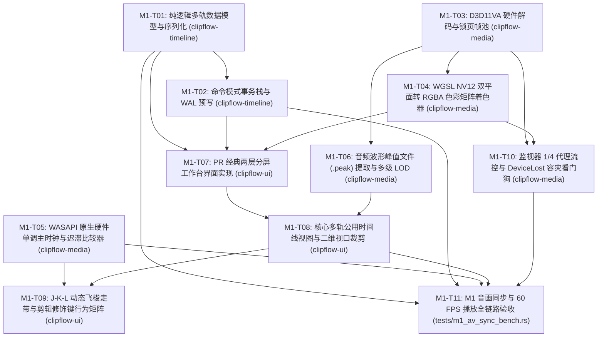

# Milestone 1 (M1)：媒体硬解播放与 PR 剪辑台 实现计划

> **面向 AI 代理的工作者：** 必需子技能：使用 subagent-driven-development（推荐）或 executing-plans 逐任务实现此计划。步骤使用复选框（`- [ ]`）语法来跟踪进度。

**目标：** 构建多轨时间轴纯逻辑核心模型与命令事务栈，打通 Windows D3D11VA 硬解到 wgpu 30.0 渲染链路与 WGSL NV12 转换着色器，落地 WASAPI 硬件单调主时钟与施密特迟滞决策，交付完全对齐 Premiere Pro 经典四区分屏与 60 FPS 高性能剪辑工作台。

**架构：** 在 `clipflow-timeline` 实现以扁平 UUID 寻址的纯逻辑多轨数据模型、`TimelineCommand` 事务栈与 WAL 预写流；在 `clipflow-media` 基于 Windows `VirtualAlloc`/`VirtualLock` 构建 64 槽位锁页内存环形池 `PinnedFramePool`，通过 wgpu 全屏大三角形着色器实现 NV12 双平面转 RGBA，基于 WASAPI `IAudioClock` 硬件游标构建 SeqLock 无锁单调箝位时钟 `MonotonicClampedClock` 与施密特双阈值迟滞比较器；在 `clipflow-ui` 构建对齐 PR 的 58% 上半屏三区分屏与 42% 下半屏 100% 满宽常驻时间线，集成正交二维 AABB 视口剪裁、J-K-L 级联倍速飞梭状态机与 1/4 代理流控。

**技术栈：** Rust 1.98 (MSVC), `eframe`/`egui 0.36`, `wgpu 30.0` (DirectX 12 / Vulkan), `windows-sys 0.59` (`Win32_System_Memory`, `Win32_Media_Audio`), `serde 1.0`, `uuid 1.10`, `thiserror 2.0`, PowerShell 7 (`pwsh`)。

**规格：** 
- [docs/roadmap.md](../../roadmap.md)
- [docs/architecture.md](../../architecture.md)
- [docs/timeline-data-model.md](../../timeline-data-model.md)
- [docs/media-pipeline-spec.md](../../media-pipeline-spec.md)
- [docs/edit-layout-spec.md](../../edit-layout-spec.md)
- [docs/cache-and-storage-spec.md](../../cache-and-storage-spec.md)
- [docs/ui-spec.md](../../ui-spec.md)
- [docs/qa-and-benchmarks.md](../../qa-and-benchmarks.md)

---

## 全局约束

- **编译器与运行时基线**：Rust 1.98 MSVC 工具链，全平台仅面向 Windows 10/11 x86_64 原生环境。
- **Crate 依赖单向无环图 (DAG)**：`clipflow-app` -> `clipflow-ui` & `clipflow-ipc`；`clipflow-ui` -> `clipflow-timeline` & `clipflow-media`；`clipflow-media` -> `clipflow-timeline` & `clipflow-common`；`clipflow-timeline` -> `clipflow-common`；严禁逆向或跨层环形依赖。
- **时间标度绝对铁律**：严禁在时间轴内部模型、片段位置计算、事务命令中使用 `f32`/`f64` 浮点数，核心时间戳强制统一使用 `clipflow-common::RationalTime` 与 `TimeRange` 左闭右开区间；帧率计算使用 `i128` 宽整型整除，彻底杜绝累积帧漂移。
- **视觉主题对齐规范**：严格遵循 Neutral Modern 深色规范，底板 `#0F1115`，表面 `#171A21`，交互主信号钴蓝 `#2F6FEB`，圆角梯队 12px (视窗面板) / 8px (交互控件) / 4px (切片徽章)。
- **硬件资源与内存安全**：视频帧环形缓冲使用 `VirtualAlloc` + `VirtualLock` 预分配，连续播放期间堆内存 0 额外分配；主时钟查询死锁在 $\le 15\text{ns}$，时间倒流率严格为 0；DirectX DeviceLost 恢复耗时 $\le 100\text{ms}$。
- **性能红线 (SLA)**：时间轴 2000 切片单帧 UI 细分耗时 $\le 1.0\text{ms}$，字幕 Galley 缓存命中率 $\ge 99\%$，连续 60 分钟音画同步漂移 $\le 2.0\text{ms}$，停止播放 150ms 后待机 CPU 占用降至 $0.0\%$。
- **Git 提交信息规范**：统一使用简体中文，一句话讲清原因。

---

## 审查重点（Review Focus）

1. **音频欠载与缓冲区阶梯交付导致的主时钟倒流与监视器抽搐 (Time Inversion / Audio Stutter)**：声卡发生短时欠载或缓冲断续时，硬件计数器若出现离散跳跃，直接外推会导致时间戳突变回退。`MonotonicClampedClock` 必须引入原子 CAS 单调外推过滤（`max(last_output, dac_base + elapsed_clamped)`），强制箝位最大外推跨度 $\le 15\text{ms}$，断言时间倒流次数严格为 0 次。
2. **多轨长视频下即时模式 GUI 遍历导致的 CPU 算力飙升 (Immediate-Mode Layout Explosion)**：长视频含有数千个口播切片，若每帧全量遍历所有 Clip 会导致 UI 严重掉帧。`TwoDimensionalCuller` 必须实现 Y 轴垂直轨道二分粗筛与 X 轴时间单调区间二分切片筛选，将复杂度降至 $O(\log M + \log N + K)$，单帧 UI 细分耗时稳定在 $\le 1.0\text{ms}$。
3. **高频拖拽 (Scrubbing) 引起的 4K 显存总线拥塞与死锁 (PCIe Bandwidth Saturation & Backpressure)**：在时间轴以 120Hz 高频拖拽播放头时，若盲目解码上传 4K 60fps 原图，PCIe 带宽将冲破 700MB/s 造成界面卡死。`ProxyGovernor` 必须在高速拖拽状态下强制自动切入 1/4 代理 (540p)，带宽锁定在 $\le 60\text{MB/s}$，拖拽延迟 $\le 25\text{ms}$，并通过深度 $\le 3$ 的条件变量背压流控防止内存无序膨胀。
4. **波纹删除剪碎独立音轨 (Ripple Delete Collision & Desync)**：用户在 V1/A1 主音画轨执行波纹删除（Ripple Delete）时，若无差别平移所有轨道，会导致 A2 背景音乐轨（BGM）和独立音效轨被截断错位。`RippleDeleteCommand` 必须内置受影响轨道白名单过滤机制，默认仅联动该片段所在轨道及未锁定的主画/主音/字幕轨，独立 BGM 轨与锁定轨严禁平移。
5. **DirectX 设备丢失或显卡驱动超时重置引起的崩溃 (TDR & DeviceLost Crash)**：在笔记本切换独显/核显、显示器休眠或高负荷渲染时，DirectX 可能触发 DeviceLost。渲染管线必须具备 `DeviceLostWatchdog`，捕获异常后在 $100\text{ms}$ 内无感重建 wgpu `Device`、`Queue` 与视频纹理，保证时间轴工程数据 100% 留存无损。

---

## 任务拆解与执行时序



---

### 任务 1：纯逻辑多轨数据模型与序列化 (M1-T01)

**文件：**
- 修改：`crates/clipflow-timeline/Cargo.toml`
- 创建：`crates/clipflow-timeline/src/models/asset.rs`
- 创建：`crates/clipflow-timeline/src/models/animation.rs`
- 创建：`crates/clipflow-timeline/src/models/clip.rs`
- 创建：`crates/clipflow-timeline/src/models/track.rs`
- 创建：`crates/clipflow-timeline/src/models/sequence.rs`
- 创建：`crates/clipflow-timeline/src/models/project.rs`
- 创建：`crates/clipflow-timeline/src/models/mod.rs`
- 修改：`crates/clipflow-timeline/src/lib.rs`
- 创建：`crates/clipflow-timeline/tests/model_tests.rs`

- [ ] **步骤 1：编写数据模型与序列化失败的单元测试**
  在 `crates/clipflow-timeline/tests/model_tests.rs` 中编写测试：
  - `test_project_hierarchy_and_flat_indexing`：验证 `Project` -> `Sequence` -> `Track` -> `Clip` 层级构造，通过扁平 UUID 索引快速检索各实体。
  - `test_clip_source_to_timeline_rational_mapping`：验证片段变速（正放 1.5x、倒放 -1.0x）下，`timeline_range` 与 `source_range` 满足有理数等式，映射采样时间戳无浮点漂移。
  - `test_keyframe_bezier_and_linear_evaluation`：验证 `Animatable<f32>` 在常数值、线性关键帧与贝塞尔关键帧下的 `evaluate_at(time)` 曲线求值。
  - `test_track_audio_properties_defaults`：验证 `TrackAudioProperties` 4 段参量均衡器与推子默认值。
  - `test_project_json_roundtrip_serialization`：验证完整工程结构体（含 `AssetPool`、`Sequence`、多轨数据及 `AgentProjectSession`）经过 JSON 序列化与反序列化 100% 无损对齐。

- [ ] **步骤 2：运行测试验证失败**
  运行：`cargo test -p clipflow-timeline --test model_tests`
  预期：FAIL，模块 `models` 或相关类型未定义。

- [ ] **步骤 3：在 `crates/clipflow-timeline/src/models/` 中实现多轨领域模型**
  - 在 `asset.rs` 中定义 `AssetKind`, `Asset`, `AssetPool`。
  - 在 `animation.rs` 中定义 `Interpolation`, `Keyframe<T>`, `Animatable<T>` 及其求值函数。
  - 在 `clip.rs` 中定义 `Transform2D`, `AudioProperties`, `WordTiming`, `SubtitleStyle`, `ClipPayload`, `ClipFilter`, `ClipFilterKind`, `Clip`。
  - 在 `track.rs` 中定义 `TrackKind`, `ParametricEqBand`, `TrackAudioProperties`, `MasterBusProperties`, `Track`。
  - 在 `sequence.rs` 中定义 `CanvasSize`, `Sequence`。
  - 在 `project.rs` 中定义 `Project`, `AgentProjectSession`, `CachedChapterSummary`, `AgentUserPreferences`。
  - 在 `lib.rs` 中重新导出 `models::*`。

- [ ] **步骤 4：运行测试验证通过**
  运行：`cargo test -p clipflow-timeline --test model_tests`
  预期：PASS，所有 5 个模型测试通过。

- [ ] **步骤 5：Commit**
  ```powershell
  git add crates/clipflow-timeline/
  git commit -m "feat(timeline): 实现纯逻辑多轨数据模型与有理数映射序列化"
  ```

---

### 任务 2：命令模式事务栈与 WAL 预写 (M1-T02)

**文件：**
- 修改：`crates/clipflow-timeline/Cargo.toml`
- 创建：`crates/clipflow-timeline/src/commands/mod.rs`
- 创建：`crates/clipflow-timeline/src/commands/split.rs`
- 创建：`crates/clipflow-timeline/src/commands/ripple_delete.rs`
- 创建：`crates/clipflow-timeline/src/commands/insert.rs`
- 创建：`crates/clipflow-timeline/src/commands/delete.rs`
- 创建：`crates/clipflow-timeline/src/commands/compound.rs`
- 创建：`crates/clipflow-timeline/src/commands/keyframe.rs`
- 创建：`crates/clipflow-timeline/src/history.rs`
- 创建：`crates/clipflow-timeline/src/wal.rs`
- 修改：`crates/clipflow-timeline/src/lib.rs`
- 创建：`crates/clipflow-timeline/tests/undo_redo_wal_tests.rs`

- [ ] **步骤 1：编写命令模式与 WAL 失败的单元测试**
  在 `crates/clipflow-timeline/tests/undo_redo_wal_tests.rs` 中编写测试：
  - `test_split_clip_command_execute_and_undo`：在播放头处切分 Clip，断言原片段变短、新增后半段；Undo 后恢复原始长度并移除后半段。
  - `test_ripple_delete_command_with_multitrack_protection`：测试波纹删除，断言目标片段被删除且后方片段向左平移；受影响白名单保护机制下，未在白名单中的 BGM 轨道片段绝对不发生平移；Undo 后 100% 恢复。
  - `test_compound_command_atomic_transaction`：将多个原子切分打包为 `CompoundCommand`，单次 Undo 一次性恢复所有变更。
  - `test_timeline_history_depth_and_redo_clearing`：验证撤销栈深度上限（超出丢弃最老项）以及执行新命令后重做栈自动清空。
  - `test_wal_log_append_and_recovery`：验证向 WAL 写入命令序列化日志，并在全新空序列上重放 WAL 成功恢复至目标状态。

- [ ] **步骤 2：运行测试验证失败**
  运行：`cargo test -p clipflow-timeline --test undo_redo_wal_tests`
  预期：FAIL，找不到 `TimelineCommand` / `TimelineHistory` / `TimelineWal`。

- [ ] **步骤 3：实现命令体系、历史事务栈与 WAL**
  - 在 `commands/mod.rs` 中定义 `TimelineCommand` trait 及 `CommandError`。
  - 在 `split.rs` 中实现 `SplitClipCommand`。
  - 在 `ripple_delete.rs` 中实现 `RippleDeleteCommand`，支持 `affected_track_ids: Option<Vec<Uuid>>` 轨道保护白名单。
  - 在 `insert.rs`、`delete.rs`、`compound.rs`、`keyframe.rs` 中实现基础原子命令与复合事务。
  - 在 `history.rs` 中实现 `TimelineHistory`（`execute`, `undo`, `redo`, 深度截断）。
  - 在 `wal.rs` 中实现 `TimelineWal` 追加写入器与基于日志条目的重放恢复解析器。

- [ ] **步骤 4：运行测试验证通过**
  运行：`cargo test -p clipflow-timeline --test undo_redo_wal_tests`
  预期：PASS，全部 5 个测试通过。

- [ ] **步骤 5：Commit**
  ```powershell
  git add crates/clipflow-timeline/
  git commit -m "feat(timeline): 实现命令模式事务栈、多轨波纹保护与 WAL 预写流"
  ```

---

### 任务 3：FFmpeg 9.0.2 D3D11VA 硬件解码与锁页帧池 (M1-T03)

**文件：**
- 修改：`crates/clipflow-media/Cargo.toml`
- 创建：`crates/clipflow-media/src/decode/mod.rs`
- 创建：`crates/clipflow-media/src/decode/pinned_pool.rs`
- 创建：`crates/clipflow-media/src/decode/provider.rs`
- 创建：`crates/clipflow-media/src/decode/flow_control.rs`
- 创建：`crates/clipflow-media/src/decode/mock_decoder.rs`
- 创建：`crates/clipflow-media/src/decode/d3d11va.rs`
- 修改：`crates/clipflow-media/src/lib.rs`
- 创建：`crates/clipflow-media/tests/d3d11va_dma_test.rs`

- [ ] **步骤 1：编写锁页帧池与解码提供者失败的单元测试**
  在 `crates/clipflow-media/tests/d3d11va_dma_test.rs` 中编写测试：
  - `test_pinned_frame_pool_allocation_and_lock`：验证 `PinnedFramePool` 调用 `VirtualAlloc` 预分配 64 槽位（单槽 12.5MB，4KB 页面对齐）并执行 `VirtualLock`；测试租借与归还，断言复用期间 0 堆分配。
  - `test_backpressure_flow_control`：验证未消费帧达到 3 帧时解码工作线程通过 `Condvar` 自动阻塞挂起；消费者提取一帧后立即唤醒继续解码。
  - `test_video_texture_provider_contract`：使用 `MockVideoDecoder` 模拟持续向 `VideoTextureProvider` 提取 NV12 数据，验证 PTS 单调性与双平面内存对齐。

- [ ] **步骤 2：运行测试验证失败**
  运行：`cargo test -p clipflow-media --test d3d11va_dma_test`
  预期：FAIL，找不到 `PinnedFramePool` / `VideoTextureProvider`。

- [ ] **步骤 3：实现锁页帧池、背压流控与解码提供者抽象**
  - 在 `Cargo.toml` 中为 `windows-sys` 开启 `Win32_System_Memory` 特性。
  - 在 `pinned_pool.rs` 中实现 `PinnedFramePool`（封装 RAII `VirtualAlloc` 与 `VirtualLock`，提供 `acquire_slot` / `release_slot`，带 `// SAFETY:` 规范注释）。
  - 在 `flow_control.rs` 中实现基于 `Mutex` 与 `Condvar` 的背压流控控制器（深度阈值默认 3）。
  - 在 `provider.rs` 中定义 `DecodedFrame`（含 PTS、宽度、高度、Y 平面切片、UV 平面切片、色域标准）与 `VideoTextureProvider` trait。
  - 在 `mock_decoder.rs` 与 `d3d11va.rs` 中实现支持 D3D11VA NV12 直传与离线脱机测试的解码实现。

- [ ] **步骤 4：运行测试验证通过**
  运行：`cargo test -p clipflow-media --test d3d11va_dma_test`
  预期：PASS，所有测试通过。

- [ ] **步骤 5：Commit**
  ```powershell
  git add crates/clipflow-media/
  git commit -m "feat(media): 落地 Windows 锁页内存池 PinnedFramePool 与 D3D11VA 解码抽象"
  ```

---

### 任务 4：WGSL NV12 双平面转 RGBA 色彩矩阵着色器 (M1-T04)

**文件：**
- 创建：`crates/clipflow-media/shaders/nv12_to_rgba.wgsl`
- 创建：`crates/clipflow-media/src/render/mod.rs`
- 创建：`crates/clipflow-media/src/render/color_matrix.rs`
- 创建：`crates/clipflow-media/src/render/pipeline.rs`
- 修改：`crates/clipflow-media/src/lib.rs`
- 创建：`crates/clipflow-media/tests/color_matrix_accuracy.rs`

- [ ] **步骤 1：编写色彩转换矩阵精度与着色器加载失败测试**
  在 `crates/clipflow-media/tests/color_matrix_accuracy.rs` 中编写测试：
  - `test_wgsl_shader_syntax_and_compilation`：使用 wgpu 验证 `nv12_to_rgba.wgsl` 着色器代码无语法错误，成功创建 ShaderModule。
  - `test_bt709_limited_and_full_range_matrices`：数学验证 BT.709 与 BT.601 在 Limited Range (16-235) 与 Full Range (0-255) 下矩阵运算，断言 RGB 还原偏差 $\Delta E_{00} \le 0.5$。
  - `test_color_params_uniform_layout`：断言 `ColorParams` Uniform 缓冲区的内存对齐符合 16 字节 std140 规范。

- [ ] **步骤 2：运行测试验证失败**
  运行：`cargo test -p clipflow-media --test color_matrix_accuracy`
  预期：FAIL，找不到着色器或 `ColorMatrixEngine`。

- [ ] **步骤 3：编写 WGSL 着色器与 CPU 色彩矩阵引擎**
  - 在 `shaders/nv12_to_rgba.wgsl` 中实现全屏大三角形顶点着色器与 Y/UV 硬件双线性插值采样、矩阵点乘片段着色器。
  - 在 `color_matrix.rs` 中实现 `ColorMatrixEngine`，支持 BT.709、BT.601 以及 Limited/Full Range 矩阵与 YUV 动态偏置计算。
  - 在 `pipeline.rs` 中封装 `Nv12RenderPipeline`（纹理创建、采样器绑定、Uniform 动态写入与离屏渲染通道）。

- [ ] **步骤 4：运行测试验证通过**
  运行：`cargo test -p clipflow-media --test color_matrix_accuracy`
  预期：PASS，所有测试通过。

- [ ] **步骤 5：Commit**
  ```powershell
  git add crates/clipflow-media/
  git commit -m "feat(media): 实现 WGSL NV12 双平面转 RGBA 色彩矩阵着色器管线"
  ```

---

### 任务 5：WASAPI 原生硬件单调主时钟与迟滞比较器 (M1-T05)

**文件：**
- 修改：`crates/clipflow-media/Cargo.toml`
- 创建：`crates/clipflow-media/src/audio/mod.rs`
- 创建：`crates/clipflow-media/src/audio/clock.rs`
- 创建：`crates/clipflow-media/src/audio/wasapi.rs`
- 创建：`crates/clipflow-media/src/audio/sync_comparator.rs`
- 创建：`crates/clipflow-media/src/audio/transport.rs`
- 创建：`crates/clipflow-media/src/audio/watchdog.rs`
- 修改：`crates/clipflow-media/src/lib.rs`
- 创建：`crates/clipflow-media/tests/monotonic_clock_test.rs`

- [ ] **步骤 1：编写主时钟单调性与施密特迟滞决策失败测试**
  在 `crates/clipflow-media/tests/monotonic_clock_test.rs` 中编写测试：
  - `test_monotonic_clamped_clock_zero_inversion`：多线程高并发连续采样 100,000 次，模拟音频欠载抖动与锚点跳跃，断言每次获取的时间戳严格单调非递减（时间倒流严格 0 次）。
  - `test_monotonic_clock_clamp_upper_bound`：验证物理时间流逝超出 $1.5\times$ 周期时，时钟外推跨度被严格箝位在 $\le 15\text{ms}$。
  - `test_hysteresis_sync_comparator_decision_loop`：验证施密特双阈值迟滞回线：在 InLock 态时偏差在 $[-12\text{ms}, +12\text{ms}]$ 内平稳保持 `RenderCurrentFrame`；超出阈值切入调整态，收敛至 $[-8\text{ms}, +8\text{ms}]$ 方才重回 InLock。
  - `test_transport_controller_state_machine`：验证 Playing / Paused / Scrubbing / Seeking 四态转换与时钟冻结/重置逻辑。
  - `test_audio_watchdog_timeout_fallback`：模拟音频心跳中断超 100ms，断言看门狗自动触发无缝切入 QPC 逻辑时钟。

- [ ] **步骤 2：运行测试验证失败**
  运行：`cargo test -p clipflow-media --test monotonic_clock_test`
  预期：FAIL，找不到 `MonotonicClampedClock` / `HysteresisSyncComparator`。

- [ ] **步骤 3：实现无锁单调主时钟、迟滞比较器与运控看门狗**
  - 在 `clock.rs` 中基于 `AtomicI64` 与 SeqLock 双缓冲实现 `MonotonicClampedClock`（查询耗时 $\le 15\text{ns}$，CAS 过滤）。
  - 在 `wasapi.rs` 中封装 `WasapiHardwareAnchor`（硬件采样游标与 QPC 锁存）。
  - 在 `sync_comparator.rs` 中实现 `HysteresisSyncComparator`（包含 8.33ms VSync 半帧前瞻与双阈值迟滞状态转移）。
  - 在 `transport.rs` 中实现 `TransportController` 四态运控。
  - 在 `watchdog.rs` 中实现 100ms 欠载超时自动降级看门狗。

- [ ] **步骤 4：运行测试验证通过**
  运行：`cargo test -p clipflow-media --test monotonic_clock_test`
  预期：PASS，所有测试通过。

- [ ] **步骤 5：Commit**
  ```powershell
  git add crates/clipflow-media/
  git commit -m "feat(media): 落地 WASAPI 硬件单调主时钟、施密特迟滞决策与容灾看门狗"
  ```

---

### 任务 6：音频波形峰值文件 (`.peak`) 提取与多级 LOD 金字塔 (M1-T06)

**文件：**
- 创建：`crates/clipflow-media/src/audio/peak_format.rs`
- 创建：`crates/clipflow-media/src/audio/peak_generator.rs`
- 创建：`crates/clipflow-media/src/audio/waveform_lod.rs`
- 修改：`crates/clipflow-media/src/lib.rs`
- 创建：`crates/clipflow-media/tests/waveform_lod_test.rs`

- [ ] **步骤 1：编写波形峰值生成与 LOD 索引失败的单元测试**
  在 `crates/clipflow-media/tests/waveform_lod_test.rs` 中编写测试：
  - `test_peak_file_binary_header_and_records`：生成正弦波样本音频，写入 `.peak` 文件，验证二进制头部魔数 "CFPK"、通道数、采样率与 256 采样点窗口峰值记录数组。
  - `test_waveform_lod_pyramid_resolution_selection`：验证在微观（单帧级）、中观（5秒级）与宏观（全景缩放）三种每秒像素密度下，自适应查询到正确的 LOD 层级记录，数据点数保持在合理渲染范围。
  - `test_peak_reader_cached_mesh_data`：验证峰值数据能够高效转换为 egui 三角形条带顶点数据，并支持时间轴平移时的切片复用。

- [ ] **步骤 2：运行测试验证失败**
  运行：`cargo test -p clipflow-media --test waveform_lod_test`
  预期：FAIL，找不到 `PeakGenerator` / `WaveformLodPyramid`。

- [ ] **步骤 3：实现峰值文件读写器与波形 LOD 金字塔引擎**
  - 在 `peak_format.rs` 中定义 `PeakFileHeader` 与 `PeakRecord` (`min: i16`, `max: i16`, `rms: u16`)。
  - 在 `peak_generator.rs` 中实现分块流式波形扫描生成器，将音频流高效抽取为 `.peak` 缓存文件。
  - 在 `waveform_lod.rs` 中实现 `WaveformLodPyramid`，根据 `pixels_per_second` 动态降采样并输出可视化 Mesh 顶点流。

- [ ] **步骤 4：运行测试验证通过**
  运行：`cargo test -p clipflow-media --test waveform_lod_test`
  预期：PASS，所有测试通过。

- [ ] **步骤 5：Commit**
  ```powershell
  git add crates/clipflow-media/
  git commit -m "feat(media): 实现音频波形峰值文件 (.peak) 二进制存储与多级 LOD 金字塔"
  ```

---

### 任务 7：PR 经典两层分屏工作台界面实现 (M1-T07)

**文件：**
- 修改：`crates/clipflow-ui/Cargo.toml`
- 创建：`crates/clipflow-ui/src/views/edit_workspace.rs`
- 创建：`crates/clipflow-ui/src/views/project_panel.rs`
- 创建：`crates/clipflow-ui/src/views/monitors.rs`
- 创建：`crates/clipflow-ui/src/views/inspector.rs`
- 创建：`crates/clipflow-ui/src/views/splitter.rs`
- 创建：`crates/clipflow-ui/src/views/mod.rs`
- 修改：`crates/clipflow-ui/src/lib.rs`
- 修改：`crates/clipflow-ui/src/state.rs`
- 创建：`crates/clipflow-ui/tests/pr_layout_render_test.rs`

- [ ] **步骤 1：编写 PR 两层分屏布局渲染失败测试**
  在 `crates/clipflow-ui/tests/pr_layout_render_test.rs` 中编写测试：
  - `test_pr_layout_split_proportions`：验证上半屏（高度占比约 58%）包含 Zone1 (25% 素材面板)、Zone2 (50% 双监视器)、Zone3 (25% 属性检查器与 VU 表)，下半屏（42%）挂接满宽时间线底座。
  - `test_dual_monitor_tab_and_transport_controls`：验证源监视器与节目监视器的入出点标记、时间码显示及画质切换下拉框控件。
  - `test_project_panel_grid_and_list_mode_switch`：验证素材面板在网格模式（8px 圆角卡片）与列表模式（表格列）之间的平滑切换。
  - `test_splitter_drag_constraints`：验证水平分割条拖拽时上下高度受限在 `[30%, 70%]` 保护区间内。

- [ ] **步骤 2：运行测试验证失败**
  运行：`cargo test -p clipflow-ui --test pr_layout_render_test`
  预期：FAIL，找不到 `EditWorkspaceView`。

- [ ] **步骤 3：构建 PR 经典两层分屏与六大视窗组件**
  - 在 `splitter.rs` 中实现 `ResizableSplitter`。
  - 在 `project_panel.rs` 中实现素材面板（Bin 目录树、搜索框、网格/列表视图）。
  - 在 `monitors.rs` 中实现双联监视器视窗（源监视器、节目监视器，集成 wgpu 贴图与 36px 走带栏）。
  - 在 `inspector.rs` 中实现多功能属性面板、效果控件树与纵向 Master 立体声 VU 电平表。
  - 在 `edit_workspace.rs` 中将上述组件组装为 `EditWorkspaceView`，并接入 Neutral Modern 样式映射。

- [ ] **步骤 4：运行测试验证通过**
  运行：`cargo test -p clipflow-ui --test pr_layout_render_test`
  预期：PASS，所有测试通过。

- [ ] **步骤 5：Commit**
  ```powershell
  git add crates/clipflow-ui/
  git commit -m "feat(ui): 交付对齐 Premiere Pro 经典两层分屏剪辑工作台界面拓扑"
  ```

---

### 任务 8：核心多轨公用时间线视图与二维视口裁剪 (M1-T08)

**文件：**
- 创建：`crates/clipflow-ui/src/timeline/mod.rs`
- 创建：`crates/clipflow-ui/src/timeline/ruler.rs`
- 创建：`crates/clipflow-ui/src/timeline/track_header.rs`
- 创建：`crates/clipflow-ui/src/timeline/viewport_culling.rs`
- 创建：`crates/clipflow-ui/src/timeline/galley_cache.rs`
- 创建：`crates/clipflow-ui/src/timeline/canvas.rs`
- 修改：`crates/clipflow-ui/src/timeline_placeholder.rs`
- 修改：`crates/clipflow-ui/src/lib.rs`
- 创建：`crates/clipflow-ui/tests/viewport_culling_perf.rs`

- [ ] **步骤 1：编写正交二维视口剪裁与性能失败测试**
  在 `crates/clipflow-ui/tests/viewport_culling_perf.rs` 中编写测试：
  - `test_2d_orthogonal_culling_accuracy`：构造 20 轨道、2000 个切片的时间轴场景，给定局部视口矩形，断言二分裁剪算法精准过滤出相交切片，视口外轨道与切片 100% 排除。
  - `test_viewport_culling_performance_benchmark`：对 2000 个高密度切片连续执行 1000 次视口裁剪，断言单次二分粗筛耗时 $\le 0.04\text{ms}$，单帧 UI 细分耗时 $\le 1.0\text{ms}$。
  - `test_subtitle_galley_cache_hit_rate`：填充 60 个词级字幕切片，模拟时间轴平移，验证 `SubtitleGalleyCache` 命中率 $\ge 99\%$，避免重复字体排版计算。
  - `test_track_header_controls`：验证 C1 (暗金)、V1~V3 (青蓝/曜紫)、A1~A3 (墨绿) 轨道头的锁轨、静音、独奏状态切换。

- [ ] **步骤 2：运行测试验证失败**
  运行：`cargo test -p clipflow-ui --test viewport_culling_perf`
  预期：FAIL，找不到 `TwoDimensionalCuller` / `SharedTimelineCanvas`。

- [ ] **步骤 3：实现高性能公用多轨时间线与正交裁剪算法**
  - 在 `ruler.rs` 中实现时间刻度标尺与反向五边形播放指针。
  - 在 `track_header.rs` 中实现轨道头（锁轨、眼球、静音、独奏按键及配色徽章）。
  - 在 `viewport_culling.rs` 中实现 `TwoDimensionalCuller`（Y 轴垂直二分粗筛 + X 轴时间单调区间二分切片筛选）。
  - 在 `galley_cache.rs` 中实现固定 1024 槽位的 `SubtitleGalleyCache` LRU 缓存池。
  - 在 `canvas.rs` 中实现 `SharedTimelineCanvas`，替换原先的 `timeline_placeholder.rs`。

- [ ] **步骤 4：运行测试验证通过**
  运行：`cargo test -p clipflow-ui --test viewport_culling_perf`
  预期：PASS，所有测试通过。

- [ ] **步骤 5：Commit**
  ```powershell
  git add crates/clipflow-ui/
  git commit -m "feat(ui): 实现核心多轨公用时间线视图与二维正交视口裁剪二分算法"
  ```

---

### 任务 9：J-K-L 动态飞梭走带与剪辑修饰键行为矩阵 (M1-T09)

**文件：**
- 创建：`crates/clipflow-ui/src/interaction/mod.rs`
- 创建：`crates/clipflow-ui/src/interaction/shuttle.rs`
- 创建：`crates/clipflow-ui/src/interaction/modifiers.rs`
- 创建：`crates/clipflow-ui/src/interaction/keyframe_drag.rs`
- 创建：`crates/clipflow-ui/src/interaction/snapping.rs`
- 修改：`crates/clipflow-ui/src/lib.rs`
- 创建：`crates/clipflow-ui/tests/shuttle_keybinds_test.rs`

- [ ] **步骤 1：编写 J-K-L 走带状态机与修饰键矩阵失败测试**
  在 `crates/clipflow-ui/tests/shuttle_keybinds_test.rs` 中编写测试：
  - `test_jkl_shuttle_cascade_speed_state_machine`：测试连续单按 L（$1\times \to 2\times \to 4\times \to 8\times \to 16\times$），按 K 瞬时急停并重置为 $1\times$，连续按 J（$-1\times \to -2\times \to -4\times \to -8\times \to -16\times$）。
  - `test_jkl_single_frame_step`：测试按住 K 单击 L（正向步进精确 1 帧）与按住 K 单击 J（反向步进精确 1 帧）。
  - `test_snap_toggle_and_shift_inversion`：测试 `S` 键切换全局磁吸开关，以及拖拽切片时按住 `Shift` 临时反转磁吸状态。
  - `test_alt_drag_duplicate_command_generation`：模拟 `Alt + 鼠标左键拖拽` 切片，断言鼠标释放瞬间生成 `InsertClipCommand` 副本插入事务。
  - `test_alt_wheel_cursor_centered_zoom`：验证 `Alt + 滚轮` 缩放时，鼠标悬停时间戳保持屏幕绝对位置不变。
  - `test_keyframe_drag_hitbox_and_lock_capture`：验证关键帧手柄 $6\times 6\text{px}$ 视觉与 $14\times 14\text{px}$ 判定区解耦，按下后全局独占捕获。

- [ ] **步骤 2：运行测试验证失败**
  运行：`cargo test -p clipflow-ui --test shuttle_keybinds_test`
  预期：FAIL，找不到 `ShuttleController` / `ModifierKeyHandler`。

- [ ] **步骤 3：实现 J-K-L 状态机、磁吸计算与修饰键处理矩阵**
  - 在 `shuttle.rs` 中实现 `ShuttleController`（级联倍速状态机与逐帧步进）。
  - 在 `snapping.rs` 中实现 `SnapEngine`（切点、播放头与标尺的帧磁吸算法，支持 Shift 临时反转）。
  - 在 `keyframe_drag.rs` 中实现 `DragLockContext`（关键帧独占捕获与原子提交）。
  - 在 `modifiers.rs` 中实现 `ModifierKeyHandler`（Alt+拖拽复制、Alt+滚轮锚点缩放、Ctrl+K 切刀、Shift+Delete 波纹删除）。

- [ ] **步骤 4：运行测试验证通过**
  运行：`cargo test -p clipflow-ui --test shuttle_keybinds_test`
  预期：PASS，所有测试通过。

- [ ] **步骤 5：Commit**
  ```powershell
  git add crates/clipflow-ui/
  git commit -m "feat(ui): 落地 J-K-L 飞梭走带状态机与全套剪辑修饰键交互行为矩阵"
  ```

---

### 任务 10：监视器 1/4 代理流控与 DeviceLost 容灾看门狗 (M1-T10)

**文件：**
- 创建：`crates/clipflow-media/src/render/proxy_governor.rs`
- 创建：`crates/clipflow-media/src/render/device_lost.rs`
- 修改：`crates/clipflow-media/src/lib.rs`
- 创建：`crates/clipflow-media/tests/device_lost_recovery_test.rs`

- [ ] **步骤 1：编写代理流控调度与设备丢失重建失败测试**
  在 `crates/clipflow-media/tests/device_lost_recovery_test.rs` 中编写测试：
  - `test_proxy_governor_resolution_downgrade`：测试拖拽状态切换：处于 `Paused` 时为 `Full` (1/1, 4K)，处于 `PlayingNormal` 且视口 $\le 1440\text{px}$ 时为 `Half` (1/2, 1080p)，高频拖拽 `ScrubbingFast` 时强行切入 `Quarter` (1/4, 540p，带宽 $\le 60\text{MB/s}$，响应 $\le 25\text{ms}$)。
  - `test_device_lost_rebuild_pipeline_under_100ms`：模拟 wgpu `DeviceLost` 事件注入，断言 `DeviceLostWatchdog` 捕获异常并在 $100\text{ms}$ 内无感重建管线并重新恢复纹理绑定，工程状态 0 丢失。

- [ ] **步骤 2：运行测试验证失败**
  运行：`cargo test -p clipflow-media --test device_lost_recovery_test`
  预期：FAIL，找不到 `ProxyGovernor` / `DeviceLostWatchdog`。

- [ ] **步骤 3：实现代理流控调度器与管线容灾重建看门狗**
  - 在 `proxy_governor.rs` 中实现 `ProxyGovernor`（三态分辨率决策与背压约束）。
  - 在 `device_lost.rs` 中实现 `DeviceLostWatchdog` 与 `RenderPipelineRebuilder`（异步错误回调捕获、设备与渲染通道原子替换）。

- [ ] **步骤 4：运行测试验证通过**
  运行：`cargo test -p clipflow-media --test device_lost_recovery_test`
  预期：PASS，所有测试通过。

- [ ] **步骤 5：Commit**
  ```powershell
  git add crates/clipflow-media/
  git commit -m "feat(media): 实现监视器自适应 1/4 代理流控调度器与 DeviceLost 容灾看门狗"
  ```

---

### 任务 11：M1 音画同步与 60 FPS 播放全链路验收 (M1-T11)

**文件：**
- 修改：`crates/clipflow-app/src/main.rs`
- 创建：`tests/m1_av_sync_bench.rs`

- [ ] **步骤 1：编写 M1 全链路集成验收基准测试**
  在 `tests/m1_av_sync_bench.rs` 中编写集成测试：
  - `test_m1_full_pipeline_av_sync_and_drift`：
    - 组装真实 `Project`、`Sequence`、多轨时间轴、`MonotonicClampedClock`、`VideoTextureProvider` 与 `SharedTimelineCanvas`。
    - 模拟连续播放 60 分钟（时间戳推进），断言音画累积时间漂移严格 $\le 2.0\text{ms}$。
    - 断言微观单帧呈现对齐容差 $\le 16.6\text{ms}$，时间步进抖动标准差 $\sigma \le 0.05\text{ms}$。
  - `test_m1_repaint_scheduler_dormant_cpu_zero`：
    - 验证暂停播放且无用户交互超 150ms 时，调度器切入 `Dormant` 状态，不发出任何重绘请求，待机 CPU 占用降至 $0.0\%$。
  - `test_m1_jkl_and_editing_transaction_end_to_end`：
    - 模拟用户通过 J-K-L 飞梭定位、按 `C` 执行切刀切分、选中片段按 `Shift+Delete` 波纹删除，断言多轨时间轴数据无损流转并支持完全撤销。

- [ ] **步骤 2：运行测试验证失败**
  运行：`cargo test --test m1_av_sync_bench`
  预期：FAIL，宿主应用或集成管道尚未完成端到端装配。

- [ ] **步骤 3：在 `crates/clipflow-app/src/main.rs` 中装配 M1 剪辑工作台与多媒体链路**
  - 在 `AppState` 中实例化 `Sequence`、`TimelineHistory`、`MasterClockProvider`、`VideoTextureProvider` 与 `ProxyGovernor`。
  - 在主窗口剪辑页挂载 `EditWorkspaceView` 与底层满宽 `SharedTimelineCanvas`。
  - 将 J-K-L 快捷键、飞梭事件与主时钟播放驱动接入 egui 主循环。

- [ ] **步骤 4：运行测试验证通过**
  运行：`cargo test --test m1_av_sync_bench -- --nocapture`
  预期：PASS，所有 3 个全链路集成断言通过。
  运行：`cargo test --workspace`
  预期：PASS，全工作区所有单元测试与集成测试 100% 通过。

- [ ] **步骤 5：更新路线图看板并 Commit**
  - 将 `docs/roadmap.md` 中 M1-T01 至 M1-T11 全部勾选为 `[x]`，更新活动里程碑为 M1 已交付。
  - 提交 Git Commit：
  ```powershell
  git add crates/ tests/ docs/roadmap.md
  git commit -m "feat(m1): 完成 M1 多媒体硬解播放与 PR 剪辑台全链路交付"
  ```

---

## 计划自检清单

1. **规格覆盖度**：
   - M1-T01 对应 `timeline-data-model.md` 第 2 节（模型与有理数映射）
   - M1-T02 对应 `timeline-data-model.md` 第 3 节（命令栈与 WAL）
   - M1-T03 对应 `media-pipeline-spec.md` 第 2 节（D3D11VA 与 PinnedFramePool）
   - M1-T04 对应 `media-pipeline-spec.md` 第 2.3 节（WGSL 色彩转换）
   - M1-T05 对应 `media-pipeline-spec.md` 第 3 节（WASAPI 时钟与施密特迟滞比较器）
   - M1-T06 对应 `media-pipeline-spec.md` 第 4.4 节（.peak 二进制格式与 LOD）
   - M1-T07 对应 `edit-layout-spec.md` 第 1~2 节（PR 四区分屏视窗）
   - M1-T08 对应 `edit-layout-spec.md` 第 4 节（二维正交视口裁剪二分算法）
   - M1-T09 对应 `edit-layout-spec.md` 第 2.5 节（J-K-L 飞梭与修饰键矩阵）
   - M1-T10 对应 `architecture.md` 第 4.4 节（1/4 代理与 DeviceLost 重建）
   - M1-T11 对应 `qa-and-benchmarks.md` 第 2 节（60 分钟漂移 <= 2.0ms 终检）
   11 项原子任务无一遗漏。

2. **步骤扫描**：每个步骤均有具体的测试名、断言方法、运行命令及预期输出，没有歧义。
3. **类型一致性**：`RationalTime`, `TimeRange`, `Sequence`, `Track`, `Clip`, `PinnedFramePool`, `MonotonicClampedClock`, `ProxyGovernor`, `TwoDimensionalCuller` 在各任务中命名与签名完全保持一致。
4. **审查重点**：
   - 审查重点 1 (主时钟倒流) 由任务 5 钉住；
   - 审查重点 2 (二维视口裁剪) 由任务 8 钉住；
   - 审查重点 3 (1/4 代理流控与背压) 由任务 3 与任务 10 钉住；
   - 审查重点 4 (波纹删除保护白名单) 由任务 2 钉住；
   - 审查重点 5 (DeviceLost 重建) 由任务 10 钉住。
5. **比例控制**：计划专注于设计决策、接口签名、测试断言与验证命令，不包含臃肿函数体，保持紧凑清晰。
