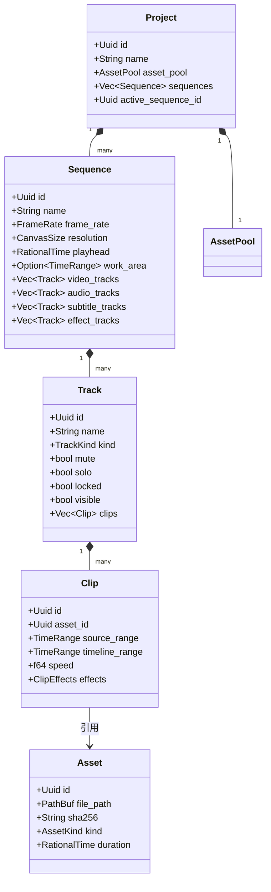

# 时间轴数据模型与工程持久化规范 (Timeline Data Model & Project Format)

> **版本**：v1.0.0  
> **更新时间**：2026-09-23  
> **适用技术栈**：Rust 1.98 (MSVC), serde 1.0, zstd 0.13  
> **核心地位**：ClipFlow 全局时间轴单一事实来源（SSOT）的 Rust 内部数据结构、命令模式事务、亚毫秒时间计算与 `.clipflow` 工程存储标准。

---

## 1. 时间基准与时间码数学 (Time Base & Timecode)

为了彻底消除浮点数累加在非编剪辑中造成的“时间漂移”与“帧错位”，全系统禁止使用 `f32`/`f64` 作为时间轴关键位置与时长的基准单位。系统统一采用**有理数时间标度 (Rational Time)**。

### 1.1 有理数时间核心结构：`RationalTime`

```rust
use serde::{Deserialize, Serialize};

/// 有理数时间戳，表示为: ticks / timebase
#[derive(Debug, Clone, Copy, PartialEq, Eq, PartialOrd, Ord, Hash, Serialize, Deserialize)]
pub struct RationalTime {
    /// 刻度数（可为负值，用于相对位移）
    pub value: i64,
    /// 每秒的刻度分母（Timebase），如 60000、24000 等，严禁为 0
    pub timescale: u32,
}

impl RationalTime {
    pub const ZERO: Self = Self { value: 0, timescale: 1000 };

    pub fn new(value: i64, timescale: u32) -> Self {
        assert!(timescale > 0, "Timescale must be positive");
        Self { value, timescale }
    }

    /// 转换为目标分母的等价有理数时间（保持精度）
    pub fn rescaled_to(&self, new_timescale: u32) -> Self {
        if self.timescale == new_timescale {
            return *self;
        }
        let scaled_val = (self.value as i128 * new_timescale as i128) / self.timescale as i128;
        Self {
            value: scaled_val as i64,
            timescale: new_timescale,
        }
    }

    /// 转换为浮点秒（仅在送入音频驱动或日志输出等非状态机逻辑中使用）
    pub fn to_seconds(&self) -> f64 {
        self.value as f64 / self.timescale as f64
    }

    /// 从秒与目标分母构建
    pub fn from_seconds(seconds: f64, timescale: u32) -> Self {
        Self {
            value: (seconds * timescale as f64).round() as i64,
            timescale,
        }
    }
}
```

### 1.2 时间区间：`TimeRange`

采用**左闭右开 `[start, start + duration)`** 区间，防止相邻片段接缝重叠或漏帧。

```rust
#[derive(Debug, Clone, Copy, PartialEq, Eq, Serialize, Deserialize)]
pub struct TimeRange {
    pub start: RationalTime,
    pub duration: RationalTime,
}

impl TimeRange {
    pub fn new(start: RationalTime, duration: RationalTime) -> Self {
        Self { start, duration }
    }

    pub fn end_exclusive(&self) -> RationalTime {
        let dur = self.duration.rescaled_to(self.start.timescale);
        RationalTime::new(self.start.value + dur.value, self.start.timescale)
    }

    pub fn contains(&self, time: RationalTime) -> bool {
        let t = time.rescaled_to(self.start.timescale);
        let end = self.end_exclusive();
        t.value >= self.start.value && t.value < end.value
    }
}
```

### 1.3 SMPTE 时间码表示与丢帧规则

```rust
#[derive(Debug, Clone, Copy, PartialEq, Eq, Serialize, Deserialize)]
pub enum FrameRate {
    Fps23_976, // 24000/1001
    Fps24,     // 24/1
    Fps25,     // 25/1 (PAL)
    Fps29_97,  // 30000/1001 (NTSC Drop-Frame 或 Non-Drop-Frame)
    Fps30,     // 30/1
    Fps50,     // 50/1
    Fps59_94,  // 60000/1001
    Fps60,     // 60/1
}

#[derive(Debug, Clone, PartialEq, Eq, Serialize, Deserialize)]
pub struct SmpteTimecode {
    pub hours: u8,
    pub minutes: u8,
    pub seconds: u8,
    pub frames: u8,
    pub is_drop_frame: bool,
}

impl SmpteTimecode {
    /// 格式化为标准专业监视器时间码字符串
    /// 非丢帧: 01:23:45:12
    /// 丢帧格式: 01:23:45;12 (分号分隔分秒与帧)
    pub fn to_string(&self) -> String {
        let delimiter = if self.is_drop_frame { ';' } else { ':' };
        format!(
            "{:02}:{:02}:{:02}{}{:02}",
            self.hours, self.minutes, self.seconds, delimiter, self.frames
        )
    }
}
```

---

## 2. 核心数据模型 (Core Domain Models)

多轨数据模型统一归属于 `clipflow-timeline` 逻辑 crate。模型遵循**单向引用与扁平 ID 寻址**，禁止自引用指针。



### 2.1 资产池与媒体源 (`Asset` & `AssetPool`)

```rust
use std::path::PathBuf;
use uuid::Uuid;

#[derive(Debug, Clone, Serialize, Deserialize)]
pub enum AssetKind {
    Video { width: u32, height: u32, has_audio: bool },
    Audio { sample_rate: u32, channels: u16 },
    Image { width: u32, height: u32 },
    HyperFramesTemplate { template_id: String, schema_version: String },
}

#[derive(Debug, Clone, Serialize, Deserialize)]
pub struct Asset {
    pub id: Uuid,
    pub name: String,
    pub absolute_path: PathBuf,
    /// 相对工程根目录路径（用于便携式工程移动）
    pub relative_path: Option<PathBuf>,
    pub file_size: u64,
    pub sha256_hash: String,
    pub kind: AssetKind,
    pub native_duration: RationalTime,
    pub native_timebase: u32,
    /// 代理媒体（低清快速剪辑，可选）
    pub proxy_path: Option<PathBuf>,
}
```

### 2.2 剪辑片段 (`Clip`) 与变换属性

```rust
#[derive(Debug, Clone, Serialize, Deserialize)]
pub struct Transform2D {
    pub position_x: Animatable<f32>, // 偏移像素 (0.0 为中心)
    pub position_y: Animatable<f32>,
    pub scale_x: Animatable<f32>,    // 默认 1.0
    pub scale_y: Animatable<f32>,
    pub rotation: Animatable<f32>,   // 角度 (0.0 - 360.0)
    pub opacity: Animatable<f32>,    // 0.0 - 1.0
}

#[derive(Debug, Clone, Serialize, Deserialize)]
pub struct AudioProperties {
    pub volume_db: Animatable<f32>,  // 分贝，0.0 为原生响度，-60.0 为静音
    pub pan: Animatable<f32>,        // 声相平衡 (-1.0 左声道, 1.0 右声道)
}

#[derive(Debug, Clone, Serialize, Deserialize)]
pub struct Clip {
    pub id: Uuid,
    pub name: String,
    /// 关联的素材库资产 ID
    pub asset_id: Uuid,
    /// 在原始媒体素材中的入出点范围
    pub source_range: TimeRange,
    /// 在时间轴全局轨道上的摆放范围
    pub timeline_range: TimeRange,
    /// 播放速度比例 (默认 1.0，-1.0 为倒放)
    pub speed: f64,
    /// 视频变换与合成属性
    pub transform: Transform2D,
    /// 音频增益与声相
    pub audio_props: AudioProperties,
    /// 片段专属滤镜链
    pub filters: Vec<ClipFilter>,
    /// 是否被禁用（按 D 键静音/隐藏单片段）
    pub disabled: bool,
}
```

### 2.3 关键帧动画系统 (`Animatable<T>`)

支持常数值与贝塞尔关键帧列表自由切换：

```rust
#[derive(Debug, Clone, Serialize, Deserialize)]
pub enum Interpolation {
    Linear,
    Hold,
    Bezier {
        handle_in_x: f32,
        handle_in_y: f32,
        handle_out_x: f32,
        handle_out_y: f32,
    },
}

#[derive(Debug, Clone, Serialize, Deserialize)]
pub struct Keyframe<T> {
    pub time: RationalTime,
    pub value: T,
    pub interpolation: Interpolation,
}

#[derive(Debug, Clone, Serialize, Deserialize)]
pub enum Animatable<T> {
    Static(T),
    Animated(Vec<Keyframe<T>>),
}

impl<T: Copy + Interpolate> Animatable<T> {
    /// 根据当前时间点求值
    pub fn evaluate_at(&self, time: RationalTime) -> T {
        match self {
            Self::Static(val) => *val,
            Self::Animated(keyframes) => {
                // 执行二分查找并进行贝塞尔或线性插值计算
                interpolate_keyframes(keyframes, time)
            }
        }
    }
}
```

### 2.4 轨道 (`Track`) 与多轨容器

```rust
#[derive(Debug, Clone, Copy, PartialEq, Eq, Serialize, Deserialize)]
pub enum TrackKind {
    Video,
    Audio,
    Subtitle,
    HyperFrames,
}

#[derive(Debug, Clone, Serialize, Deserialize)]
pub struct Track {
    pub id: Uuid,
    pub name: String, // 如 "V1", "A1", "C1 (字幕)", "FX1"
    pub kind: TrackKind,
    pub mute: bool,
    pub solo: bool,
    pub locked: bool,
    pub visible: bool,
    /// 按在时间轴上的 timeline_range.start 升序排列的片段列表
    pub clips: Vec<Clip>,
}
```

---

## 3. 命令模式与撤销/重做 (Command & Undo/Redo)

所有改变时间轴状态的写操作，必须封装为不可分割的 `TimelineCommand`，统一通过 `TimelineHistory` 执行与回退。

### 3.1 命令特质定义

```rust
pub trait TimelineCommand: Send + Sync {
    /// 执行命令并改变序列状态
    fn execute(&mut self, sequence: &mut Sequence) -> Result<(), CommandError>;
    /// 回退命令，恢复先前状态
    fn undo(&mut self, sequence: &mut Sequence) -> Result<(), CommandError>;
    /// 诊断与界面展示用文案（如：“分割片段”、“波纹删除”）
    fn description(&self) -> &'static str;
}
```

### 3.2 典型核心原子命令实现范例

#### ① 片段分割命令：`SplitClipCommand`
- **执行**：在给定播放头切片，原片段截短至 `cut_point`，新增后半段片段并插入当前轨道。
- **回退**：移除新插入的后半段，将原片段的 `timeline_range.duration` 与 `source_range.duration` 恢复原始长度。

#### ② 波纹删除命令：`RippleDeleteCommand`
- **执行**：删除指定片段，并在该轨道及所有未锁定轨道上，将所有处于该片段之后的 Clip 向左平移 `deleted_duration`。
- **回退**：将删除的片段恢复至原位，并将后续所有片段向右回移等长区间。

#### ③ 复合事务命令：`CompoundCommand`
- 用于将 Agent 的一次多步决策（如：“剔除 10 处口播停顿并自动对齐”）打包为单一事务，用户按一次 `Ctrl + Z` 即可一次性整体回退。

```rust
pub struct CompoundCommand {
    commands: Vec<Box<dyn TimelineCommand>>,
    desc: &'static str,
}
```

### 3.3 撤销栈架构设计

```rust
pub struct TimelineHistory {
    undo_stack: Vec<Box<dyn TimelineCommand>>,
    redo_stack: Vec<Box<dyn TimelineCommand>>,
    max_depth: usize, // 默认 100 步
}

impl TimelineHistory {
    pub fn new(max_depth: usize) -> Self {
        Self {
            undo_stack: Vec::new(),
            redo_stack: Vec::new(),
            max_depth,
        }
    }

    pub fn execute(&mut self, mut cmd: Box<dyn TimelineCommand>, seq: &mut Sequence) -> Result<(), CommandError> {
        cmd.execute(seq)?;
        self.undo_stack.push(cmd);
        if self.undo_stack.len() > self.max_depth {
            self.undo_stack.remove(0);
        }
        self.redo_stack.clear(); // 执行新操作后清空重做栈
        Ok(())
    }

    pub fn undo(&mut self, seq: &mut Sequence) -> Result<bool, CommandError> {
        if let Some(mut cmd) = self.undo_stack.pop() {
            cmd.undo(seq)?;
            self.redo_stack.push(cmd);
            Ok(true)
        } else {
            Ok(false)
        }
    }

    pub fn redo(&mut self, seq: &mut Sequence) -> Result<bool, CommandError> {
        if let Some(mut cmd) = self.redo_stack.pop() {
            cmd.execute(seq)?;
            self.undo_stack.push(cmd);
            Ok(true)
        } else {
            Ok(false)
        }
    }
}
```

---

## 4. 工程持久化文件规范 (`.clipflow`)

### 4.1 二进制容器布局 (Container Layout)

`.clipflow` 文件结构兼顾**防止篡改、极速加载与轻量压缩**：

```
+-------------------------------------------------------------------------+
| Magic Bytes: [0x43, 0x46, 0x50, 0x46]  ("CFPF" = ClipFlow Project File) | 4 字节
+-------------------------------------------------------------------------+
| Format Version: 0x0001                                                  | 2 字节
+-------------------------------------------------------------------------+
| Flags: (0x01 = ZSTD Compressed, 0x02 = Has Checksum)                    | 2 字节
+-------------------------------------------------------------------------+
| Uncompressed Payload Size: u64                                          | 8 字节
+-------------------------------------------------------------------------+
| Payload SHA-256 Checksum: [u8; 32]                                      | 32 字节
+-------------------------------------------------------------------------+
| Compressed Data Stream (Zstandard 压缩的 CBOR 或 JSON 序列化体)           | 可变长
+-------------------------------------------------------------------------+
```

### 4.2 媒体重连策略 (Media Relinking)

工程在异机迁移或目录重命名时，采用三级渐进匹配恢复媒体关联：

1. **绝对路径直连**：检查 `absolute_path` 是否存在且文件大小匹配。
2. **相对路径回退**：将 `relative_path` 与当前 `.clipflow` 所在物理目录拼合检查。
3. **哈希与签名快速扫描**：若前两级失效，触发“素材脱机 (Media Offline)”状态；在用户指定搜索目录内，通过匹配 `file_size` + 头部 1MB SHA-256 哈希实现毫秒级自动重连。

### 4.3 自动保存与预写日志 (Auto-Save & WAL)

- **防崩溃日志 (WAL)**：每执行一次 `TimelineCommand`，主进程以追加写入（Append-only）形式向临时工作目录记录 `session.wal`。
- **定时全量快照**：每隔 3 分钟后台静默序列化一份全量工程至 `.clipflow_autosave/project_timestamp.clipflow`，最大保留 10 份历史快照。
- **异常恢复检测**：启动时如检测到异常退出遗留的 WAL 日志，弹出对话框提示用户“检测到未保存的工程修改，是否一键恢复”。
